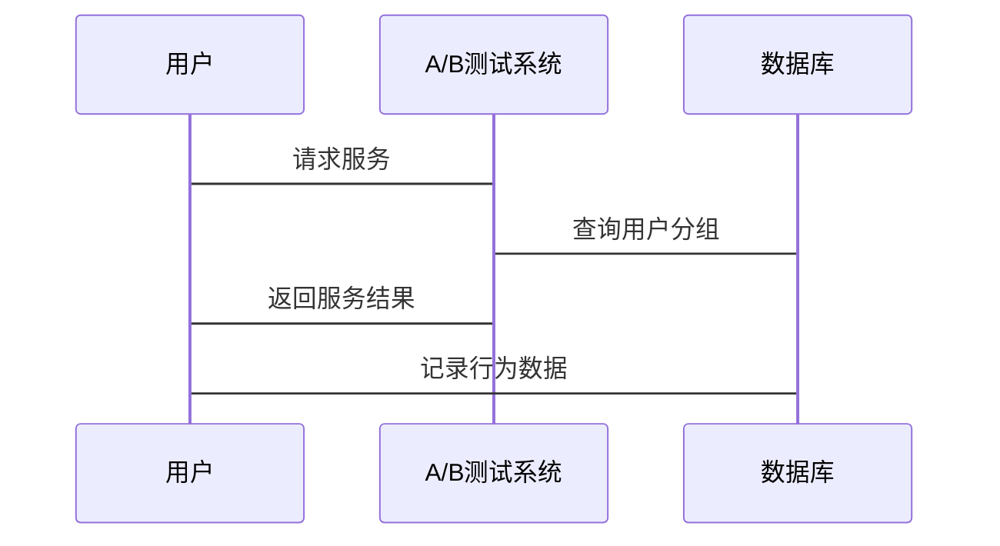

                 


# A/B测试：优化AI Agent的用户体验

> 关键词：A/B测试, AI Agent, 用户体验优化, 实验设计, 统计显著性

> 摘要：A/B测试是一种通过比较两个或多个版本来优化用户体验的方法，在AI Agent开发中尤为重要。本文从A/B测试的基本概念出发，详细探讨其在AI Agent中的应用，结合实际案例，介绍A/B测试的实验设计、算法原理、系统架构以及项目实战，最后总结最佳实践和注意事项。

---

## 第一部分: A/B测试与AI Agent概述

### 第1章: A/B测试的基本概念与应用背景

#### 1.1 A/B测试的定义与核心概念
- **什么是A/B测试？**
  A/B测试是一种实验方法，通过将用户分成两组（A组和B组），分别展示不同的产品版本或功能，收集数据后分析两组的用户行为差异，以判断哪个版本更优。

- **A/B测试的核心要素**
  - 实验目标：明确优化的目标，如提高用户留存率、点击率等。
  - 实验组与对照组：A组为对照组，B组为实验组。
  - 实验变量：仅改变需要优化的变量，保持其他条件一致。

- **A/B测试的适用场景**
  - 用户界面优化。
  - 功能模块的迭代。
  - 算法策略的调整。

#### 1.2 AI Agent与用户体验优化
- **AI Agent的定义与特点**
  AI Agent是一种智能代理系统，能够感知环境、理解用户需求并执行任务，如推荐系统、聊天机器人等。

- **用户体验优化的重要性**
  - 提高用户满意度。
  - 增加用户活跃度和留存率。
  - 优化产品功能，提升市场竞争力。

- **A/B测试在AI Agent中的作用**
  - 通过A/B测试优化AI Agent的行为策略。
  - 比较不同算法或交互方式对用户体验的影响。

#### 1.3 A/B测试与传统测试方法的区别
- **传统测试方法的局限性**
  - 依赖主观判断，缺乏数据支持。
  - 无法量化优化效果。

- **A/B测试的优势**
  - 基于数据驱动的决策。
  - 可以量化不同版本的效果差异。

- **A/B测试的适用范围与边界**
  - 适用于用户行为可量化的场景。
  - 需要足够样本量以确保统计显著性。

### 第2章: A/B测试的核心概念与原理

#### 2.1 A/B测试的实验设计
- **实验目标的设定**
  明确优化目标，如提升点击率、转化率等。

- **实验组与对照组的设计**
  - 对照组（A组）：保持现有功能。
  - 实验组（B组）：引入新功能或算法。

- **实验变量的控制**
  - 确保实验变量唯一，避免其他变量干扰。

#### 2.2 A/B测试的统计原理
- **基于假设检验的判断**
  - 原假设（H0）：两组效果无差异。
  - 备择假设（H1）：实验组效果优于对照组。

- **常见的统计检验方法**
  - T检验：用于比较两组均值差异。
  - 卡方检验：用于分类变量的比较。

- **置信区间与p值的计算**
  - 置信区间：估计参数真实值的范围。
  - p值：衡量实验结果的统计显著性。

#### 2.3 A/B测试的实施流程
- **确定实验目标**
  明确优化目标，如提升用户留存率。

- **设计实验方案**
  包括实验组和对照组的设计、变量控制等。

- **执行实验与数据分析**
  收集数据，计算统计指标，判断实验效果。

- **结果解读与决策**
  根据数据分析结果，决定是否推广实验组方案。

### 第3章: A/B测试的数学模型与公式

#### 3.1 基于假设检验的A/B测试
- **T检验公式**
  $$ t = \frac{\bar{x}_1 - \bar{x}_2}{\sqrt{\frac{s_1^2}{n_1} + \frac{s_2^2}{n_2}}} $$
  其中，$\bar{x}_1$和$\bar{x}_2$分别为两组的均值，$s_1$和$s_2$为标准差，$n_1$和$n_2$为样本量。

- **置信区间计算**
  $$ CI = \left( \bar{x}_1 - \bar{x}_2 \pm z \cdot \sqrt{\frac{s_1^2}{n_1} + \frac{s_2^2}{n_2}} \right) $$
  其中，$z$为标准正态分布的分位数，用于确定置信水平。

#### 3.2 实验效果的衡量指标
- **转化率**
  转化率 = （完成某动作的用户数）/ 总用户数。

---

## 第二部分: A/B测试的系统分析与架构设计

### 第4章: 系统功能设计

#### 4.1 问题场景介绍
- 系统目标：支持AI Agent的A/B测试，优化用户体验。
- 项目介绍：设计一个支持多版本对比的A/B测试平台。

#### 4.2 功能设计
- 用户分组：根据用户特征分配到不同的实验组。
- 实验管理：设计实验方案、分配流量、监控进度。
- 数据采集：收集用户行为数据，如点击率、转化率等。
- 结果分析：生成报告，判断实验效果。

#### 4.3 领域模型（Mermaid类图）
```mermaid
classDiagram
    class A/B测试系统 {
        用户分组模块
        实验管理模块
        数据采集模块
        结果分析模块
    }
    class 用户分组模块 {
        根据用户特征分配到A组或B组
    }
    class 实验管理模块 {
        设计实验方案
        分配流量
        监控实验进度
    }
    class 数据采集模块 {
        收集用户行为数据
    }
    class 结果分析模块 {
        计算统计指标
        判断实验效果
    }
    A/B测试系统 --> 用户分组模块
    A/B测试系统 --> 实验管理模块
    A/B测试系统 --> 数据采集模块
    A/B测试系统 --> 结果分析模块
```

#### 4.4 系统架构设计（Mermaid架构图）


#### 4.5 接口设计与交互流程（Mermaid序列图）


---

## 第三部分: 项目实战

### 第5章: 项目实战与案例分析

#### 5.1 环境安装与依赖
- 安装Python、Pandas、Scipy等工具。

#### 5.2 核心代码实现
```python
import numpy as np
from scipy.stats import ttest_ind

# 生成模拟数据
np.random.seed(42)
group_a = np.random.normal(0.5, 0.1, 100)
group_b = np.random.normal(0.6, 0.1, 100)

# 进行T检验
t_stat, p_value = ttest_ind(group_a, group_b)
print(f"t统计量: {t_stat}, p值: {p_value}")
```

#### 5.3 实验结果与分析
- 统计指标计算：均值、标准差、p值。
- 结果判断：p值小于0.05时，实验组效果显著。

#### 5.4 案例分析
- 实际案例：优化AI客服的响应时间。
- 实验设计：对比旧算法和新算法的效果。
- 数据分析：计算转化率、响应时间等指标。

---

## 第四部分: 最佳实践与注意事项

### 第6章: 最佳实践与总结

#### 6.1 最佳实践
- 明确实验目标。
- 控制实验变量。
- 确保样本量足够大。
- 统计分析要严谨。

#### 6.2 注意事项
- 避免多重比较问题。
- 实验设计要合理。
- 数据隐私与合规性。

#### 6.3 小结
A/B测试是优化AI Agent用户体验的重要工具，通过科学的设计和分析，可以有效提升产品性能。

---

## 第五部分: 拓展阅读与深入思考

### 第7章: 拓展阅读与深入思考

#### 7.1 拓展阅读
- 推荐书籍：《实验设计与数据分析》。
- 推荐文章：《A/B测试的数学原理》。

#### 7.2 深入思考
- 如何处理小样本情况？
- 如何设计多臂-bandit实验？
- A/B测试与机器学习的结合。

---

## 结语

通过本文的详细讲解，读者可以全面了解A/B测试在优化AI Agent用户体验中的应用。从实验设计到系统实现，再到实际案例分析，每一步都有详细的指导和解释。希望本文能为读者提供有价值的参考和启发，帮助他们在实际项目中更好地应用A/B测试优化用户体验。

---

**作者简介：**  
作为一位在人工智能和计算机编程领域有着深厚积累的专家，我致力于通过深入的分析和实践，帮助读者理解技术的本质和应用。

