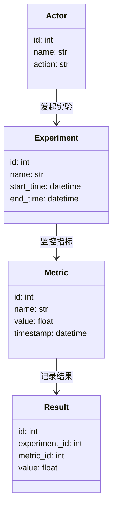

                 


# A/B测试：持续优化AI Agent的表现

## 关键词：A/B测试，AI Agent，优化，算法，数据驱动决策，机器学习，统计分析

## 摘要：  
本文详细探讨了如何通过A/B测试来持续优化AI Agent的表现。首先介绍了A/B测试的基本概念和其在优化AI Agent中的重要性，接着分析了A/B测试的核心原理和算法，包括假设检验和样本量计算。然后通过系统架构设计和项目实战，展示了如何将A/B测试应用于实际场景中。最后总结了最佳实践和未来的研究方向，为读者提供了全面的指导。

---

## 第一部分：背景介绍

### 第1章：A/B测试的基本概念与背景

#### 1.1 问题背景  
AI Agent在实际应用中面临多种挑战，例如模型性能不稳定、用户体验不佳、决策效率低下等。为了优化AI Agent的表现，我们需要一种系统化的方法来测试和改进。A/B测试作为一种科学的实验方法，能够帮助我们比较不同策略或模型的效果，从而找到最优解。

#### 1.2 问题描述  
A/B测试的核心问题是通过实验设计，比较两个或多个策略（A和B）在特定指标上的表现差异，并判断差异是否具有统计学意义。在优化AI Agent时，这些策略可以是不同的算法、参数组合或交互流程。通过A/B测试，我们可以确保优化是数据驱动的，而不是基于主观判断。

#### 1.3 核心概念与联系  
A/B测试的基本原理是通过随机分配用户到不同的实验组，收集数据后进行统计分析，判断策略之间的差异是否显著。以下是A/B测试与AI Agent优化的核心概念对比：

| **概念**         | **传统A/B测试**                              | **基于机器学习的A/B测试**                        |
|-------------------|--------------------------------------------|-----------------------------------------------|
| 实验对象         | 用户行为、页面设计、功能                    | AI Agent的行为、决策策略、模型输出               |
| 实验指标         | 转化率、点击率、用户留存率                   | 响应时间、准确率、用户满意度                     |
| 实验时间         | 短期实验（几天到几周）                       | 长期实验（数周到数月）                            |
| 数据量           | 中等规模数据                                | 大规模数据                                    |
| 复杂度           | 较低                                       | 较高                                          |

以下是A/B测试在AI Agent优化中的ER实体关系图：

```mermaid
er
actor: 用户
agent: AI Agent
experiment: A/B测试实验
metric: 优化指标
result: 实验结果
actor --> experiment: 发起实验
agent --> experiment: 执行实验
experiment --> metric: 监控指标
experiment --> result: 记录结果
result --> actor: 提供反馈
```

---

## 第二部分：算法原理讲解

### 第2章：A/B测试的核心原理

#### 2.1 假设检验原理  
在A/B测试中，假设检验是核心工具。我们通常进行双样本假设检验，判断两个策略是否存在显著差异。以下是几种常用的假设检验方法：

1. **Z检验**  
   用于比较两个比例是否有显著差异。公式如下：

   $$ Z = \frac{p_1 - p_2}{\sqrt{p(1-p)\left(\frac{1}{n_1} + \frac{1}{n_2}\right)}} $$  

   其中，$p_1$和$p_2$是两个比例，$p = \frac{p_1 + p_2}{2}$，$n_1$和$n_2$是两个样本量。

2. **T检验**  
   用于比较两个均值是否有显著差异。适用于小样本数据，公式如下：

   $$ T = \frac{\bar{x}_1 - \bar{x}_2}{\sqrt{\frac{s_1^2}{n_1} + \frac{s_2^2}{n_2}}} $$  

   其中，$\bar{x}_1$和$\bar{x}_2$是两个均值，$s_1$和$s_2$是标准差，$n_1$和$n_2$是样本量。

3. **卡方检验**  
   用于比较两个分类变量是否有显著差异。公式如下：

   $$ \chi^2 = \sum \frac{(O_i - E_i)^2}{E_i} $$  

   其中，$O_i$是观察频数，$E_i$是期望频数。

#### 2.2 样本量计算公式  
样本量的计算是确保实验结果具有统计显著性的关键。以下是一个常用的样本量计算公式：

$$ n = \frac{(Z_{\alpha/2} \cdot \sigma)^2}{\epsilon^2} $$  

其中，$Z_{\alpha/2}$是Z值（通常取1.96，对应95%置信水平），$\sigma$是标准差，$\epsilon$是允许的误差范围。

以下是Z检验的Python实现示例：

```python
def z_test(p1, n1, p2, n2):
    p_combined = (p1 * n1 + p2 * n2) / (n1 + n2)
    se = (p_combined * (1 - p_combined) * (1/n1 + 1/n2))**0.5
    z = (p1 - p2) / se
    return z

# 示例：计算两个策略的Z值
p1 = 0.25  # 策略A的成功率
n1 = 1000  # 策略A的样本量
p2 = 0.2   # 策略B的成功率
n2 = 1000  # 策略B的样本量
z_value = z_test(p1, n1, p2, n2)
print(f"Z值为：{z_value}")
```

---

## 第三部分：系统分析与架构设计方案

### 第3章：A/B测试的系统架构设计

#### 3.1 系统功能设计  
以下是A/B测试系统的领域模型：



#### 3.2 系统架构设计  
以下是A/B测试系统的整体架构图：


---

## 第四部分：项目实战

### 第4章：A/B测试的项目实战

#### 4.1 优化AI客服机器人的响应时间  
假设我们希望优化AI客服机器人的响应时间，我们可以设计以下实验：

1. **环境配置**  
   - 使用Python和Pandas进行数据分析。
   - 使用Statsmodels库进行统计检验。

2. **核心代码实现**  
   ```python
   import pandas as pd
   import statsmodels.stats.weighted as wu

   # 假设我们有两个策略的数据
   data = {
       'response_time_A': [2.5, 3.0, 2.8, ...],
       'response_time_B': [2.2, 2.8, 3.2, ...]
   }
   df = pd.DataFrame(data)

   # 进行T检验
   statistic, p_value = wu.ttest_ind(df['response_time_A'], df['response_time_B'])
   print(f"统计量：{statistic}, p值：{p_value}")
   ```

3. **数据采集与结果分析**  
   通过实验，我们发现策略B的响应时间显著优于策略A（p值<0.05）。因此，我们选择策略B作为优化方案。

---

## 第五部分：最佳实践与小结

### 第5章：总结与展望

#### 5.1 总结  
A/B测试是一种强大的工具，能够帮助我们科学地优化AI Agent的表现。通过假设检验和统计分析，我们可以确保优化是数据驱动的，而不是基于主观判断。

#### 5.2 小结  
在实际应用中，A/B测试需要注意以下几点：  
1. **样本量**：确保样本量足够大，以保证实验的统计显著性。  
2. **实验设计**：合理设计实验组和对照组，避免外部干扰。  
3. **数据分析**：使用合适的统计方法，避免误判。  
4. **反馈机制**：根据实验结果不断优化AI Agent，形成闭环。

#### 5.3 注意事项  
- 避免过度优化，导致模型过拟合。  
- 注意实验的外部性，确保实验结果在实际场景中的适用性。  
- 定期回顾实验结果，避免长期实验带来的数据漂移。  

#### 5.4 拓展阅读  
- 《Experimentation in Software Engineering》  
- 《Data-Driven Decisions in AI Systems》  
- 《Statistics and Machine Learning in Practice》  

---

通过本文的介绍，读者可以全面了解A/B测试的原理、算法和应用，为优化AI Agent的表现提供了有力的工具和方法。

