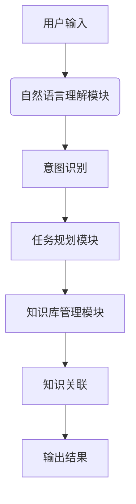
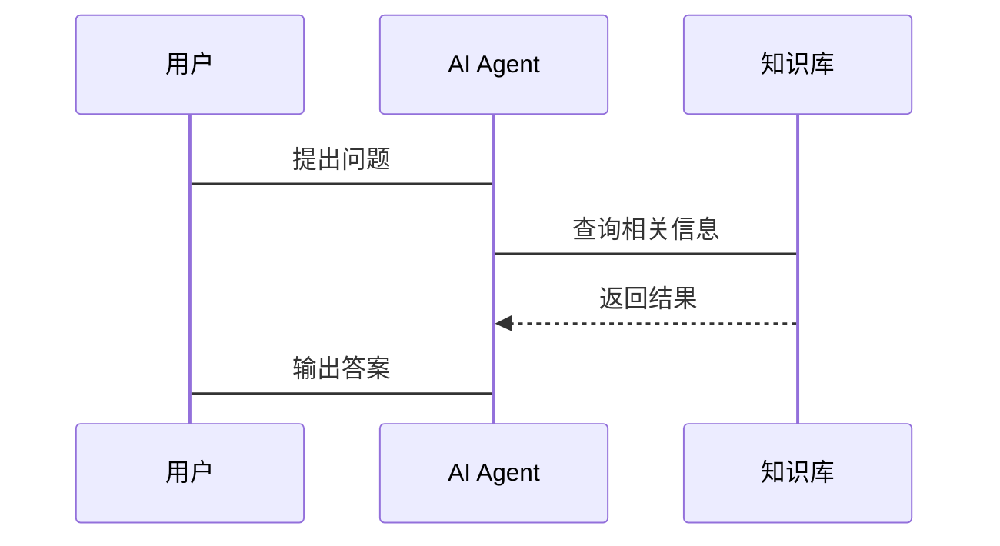

                 


# BERT模型在AI Agent中的应用与微调

> 关键词：BERT模型、AI Agent、自然语言处理、微调、AI系统架构

> 摘要：本文深入探讨了BERT模型在AI Agent中的应用及其微调方法。首先，我们介绍了BERT模型的基本概念及其在自然语言处理中的重要性。接着，我们分析了AI Agent的核心功能与应用场景。随后，我们详细讲解了BERT模型在AI Agent中的具体应用，包括语义理解、任务推理和知识关联。最后，我们讨论了BERT模型的微调方法及其在AI Agent系统中的实现，提出了优化策略和系统架构设计，为读者提供了全面的技术指南。

---

# 第一部分: BERT模型在AI Agent中的应用与微调基础

---

## 第1章: BERT模型与AI Agent概述

### 1.1 BERT模型的基本概念

#### 1.1.1 什么是BERT模型
BERT（Bidirectional Encoder Representations from Transformers）是一种基于Transformer的深度学习模型，用于处理自然语言文本。它通过预训练的方式，学习到语言的双向上下文信息，能够捕捉到文本中丰富的语义信息。

#### 1.1.2 BERT模型的核心特点
- **双向编码**：BERT模型能够同时考虑上下文的信息，使得模型对语境的理解更加全面。
- **预训练与微调**：BERT模型采用预训练的方式，可以在下游任务中通过微调快速适应特定任务。
- **通用性**：BERT模型适用于多种自然语言处理任务，如文本分类、问答系统、实体识别等。

#### 1.1.3 BERT模型的架构与训练方式
- **架构**：BERT基于Transformer编码器，采用多层的自注意力机制，对输入的文本进行编码。
- **预训练目标**：BERT的预训练目标包括Masked Language Model（遮蔽语言模型）和Next Sentence Prediction（下一句预测）。

### 1.2 AI Agent的基本概念

#### 1.2.1 什么是AI Agent
AI Agent（人工智能代理）是一种能够感知环境并采取行动以实现目标的智能系统。它可以理解用户的需求，执行任务，并与用户进行交互。

#### 1.2.2 AI Agent的核心功能与应用场景
- **核心功能**：自然语言理解、任务规划、知识管理、决策支持等。
- **应用场景**：智能客服、个性化推荐、自动化决策支持、智能助手等。

#### 1.2.3 AI Agent与传统AI的区别
AI Agent具有自主性、反应性、目标导向性和社交能力，能够与环境和用户进行实时交互，而传统的AI系统通常不具备这些特性。

### 1.3 BERT模型在AI Agent中的作用

#### 1.3.1 BERT模型在自然语言处理中的优势
- **强大的语义理解能力**：BERT模型能够准确理解上下文信息，提升AI Agent的自然语言处理能力。
- **快速适应新任务**：通过微调，BERT模型可以快速适应不同的下游任务。

#### 1.3.2 BERT模型如何赋能AI Agent
- **语义理解**：BERT模型帮助AI Agent理解用户的输入，提供更准确的响应。
- **任务推理**：通过分析上下文信息，AI Agent可以更好地推理用户的意图。
- **知识关联**：BERT模型能够关联知识库中的信息，提供更全面的解答。

#### 1.3.3 BERT模型在AI Agent中的应用潜力
- **个性化交互**：通过BERT模型，AI Agent可以提供个性化的对话体验。
- **多语言支持**：BERT的多语言版本可以支持多种语言的交互。
- **复杂任务处理**：结合任务规划模块，AI Agent可以处理更复杂的任务。

### 1.4 本章小结
本章介绍了BERT模型的基本概念及其在自然语言处理中的重要性，分析了AI Agent的核心功能与应用场景，并探讨了BERT模型在AI Agent中的作用及其应用潜力。

---

## 第2章: BERT模型的核心原理与结构

### 2.1 BERT模型的架构解析

#### 2.1.1 Transformer模型的基本结构
Transformer模型由编码器和解码器组成，编码器用于将输入序列编码为高维向量，解码器用于生成目标序列。

#### 2.1.2 BERT模型的编码器结构
BERT模型采用了多层的Transformer编码器，每层包括自注意力机制和前馈神经网络。

#### 2.1.3 BERT模型的预训练目标
- **Masked Language Model**：随机遮蔽部分输入词，预测被遮蔽词的值。
- **Next Sentence Prediction**：预测下一句是否是原文的下一句。

### 2.2 BERT模型的训练过程

#### 2.2.1 什么是预训练
预训练是指在大规模的通用数据集上训练模型，使其学习到语言的基本特征。

#### 2.2.2 BERT模型的Masked LM任务
在Masked LM任务中，模型需要根据上下文信息，预测被遮蔽词的值。

#### 2.2.3 BERT模型的Next Sentence Prediction任务
在Next Sentence Prediction任务中，模型需要判断两个句子是否是连续的。

### 2.3 BERT模型的变体与优化

#### 2.3.1 BERT的变体介绍
- **BERT-Base**：基础版本，参数较少，适用于小任务。
- **BERT-Large**：参数较多，适用于复杂任务。
- **Multi-language BERT**：支持多语言的BERT模型。

#### 2.3.2 BERT模型的优化策略
- **层叠结构**：通过增加层数，提升模型的表达能力。
- **参数调整**：通过调整模型参数，优化模型性能。

#### 2.3.3 BERT模型的开源实现
- **TensorFlow版本**：由Google开源，提供详细的代码实现。
- **PyTorch版本**：由PyTorch社区维护，提供灵活的接口。

### 2.4 本章小结
本章详细讲解了BERT模型的核心原理与结构，分析了其预训练目标和训练过程，并介绍了BERT模型的变体与优化策略。

---

## 第3章: AI Agent的核心功能与应用场景

### 3.1 AI Agent的功能模块

#### 3.1.1 自然语言理解模块
负责理解和解析用户的输入，提取关键信息。

#### 3.1.2 任务规划与执行模块
根据用户需求，规划任务并执行相应的操作。

#### 3.1.3 知识库管理模块
管理和维护知识库，提供实时的知识支持。

### 3.2 AI Agent的主要应用场景

#### 3.2.1 智能客服
通过自然语言理解，提供个性化的客户服务。

#### 3.2.2 个性化推荐
根据用户需求，推荐相关内容或产品。

#### 3.2.3 自动化决策支持
基于数据和模型，提供决策支持。

### 3.3 BERT模型在AI Agent中的具体应用

#### 3.3.1 语义理解
BERT模型帮助AI Agent理解用户的意图和情感。

#### 3.3.2 任务推理
通过分析上下文信息，AI Agent可以推理出用户的深层需求。

#### 3.3.3 知识关联
BERT模型能够关联知识库中的信息，提供更全面的解答。

### 3.4 本章小结
本章分析了AI Agent的核心功能与应用场景，并探讨了BERT模型在其中的具体应用。

---

## 第4章: BERT模型在AI Agent中的微调方法

### 4.1 微调的基本概念

#### 4.1.1 什么是微调
微调是指在预训练的基础上，对模型进行针对性的训练，使其适应特定任务。

#### 4.1.2 微调与从头训练的区别
微调利用了预训练模型的特征提取能力，而从头训练需要从零开始训练模型。

#### 4.1.3 微调的优势与应用场景
- **优势**：快速适应任务，节省训练时间。
- **应用场景**：小数据集任务、特定领域任务。

### 4.2 BERT模型的微调策略

#### 4.2.1 全参数微调
对模型的所有参数进行微调，适用于需要高度定制的任务。

#### 4.2.2 参数冻结的微调
冻结部分参数，仅微调部分参数，适用于资源有限的情况。

#### 4.2.3 参数初始化策略
通过初始化策略，优化模型的初始参数，提升微调效果。

### 4.3 微调的具体实现步骤

#### 4.3.1 数据准备
- **数据清洗**：去除噪声数据。
- **数据标注**：对数据进行标注，便于模型训练。

#### 4.3.2 模型加载与初始化
加载预训练好的BERT模型，并初始化微调任务所需的参数。

#### 4.3.3 定义损失函数与优化器
根据任务需求，定义损失函数和优化器。

#### 4.3.4 模型训练与评估
通过训练数据优化模型，并在验证集上评估模型性能。

### 4.4 微调的优化技巧

#### 4.4.1 数据增强
通过数据增强技术，增加数据的多样性，提升模型的泛化能力。

#### 4.4.2 学习率调整
通过调整学习率，优化模型的收敛速度和性能。

#### 4.4.3 模型剪枝与压缩
通过剪枝和压缩技术，减少模型的参数量，提升推理速度。

### 4.5 本章小结
本章详细讲解了BERT模型的微调方法，分析了微调策略和实现步骤，并提出了优化技巧。

---

## 第5章: 基于BERT的AI Agent系统架构设计

### 5.1 系统架构概述

#### 5.1.1 系统整体架构图



### 5.2 系统功能设计

#### 5.2.1 自然语言理解模块的设计
负责将用户的输入转化为结构化的信息。

#### 5.2.2 任务规划模块的设计
根据意图，规划任务并执行相应的操作。

### 5.3 系统架构设计

#### 5.3.1 系统架构图


### 5.4 系统接口设计

#### 5.4.1 接口定义
- **输入接口**：接收用户的自然语言输入。
- **输出接口**：输出处理结果。

#### 5.4.2 接口交互流程
- 用户输入 --> 自然语言理解模块 --> 意图识别 --> 任务规划 --> 知识关联 --> 输出结果。

### 5.5 系统交互设计

#### 5.5.1 交互流程图



### 5.6 本章小结
本章设计了基于BERT的AI Agent系统架构，分析了系统功能和架构设计，并提出了接口设计和交互流程。

---

## 第6章: 项目实战与优化

### 6.1 项目环境安装

```bash
pip install transformers torch
```

### 6.2 核心实现代码

#### 6.2.1 自然语言理解模块

```python
from transformers import BertTokenizer, BertModel
tokenizer = BertTokenizer.from_pretrained('bert-base-uncased')
model = BertModel.from_pretrained('bert-base-uncased')
```

#### 6.2.2 微调代码示例

```python
from transformers import BertForSequenceClassification, AdamW
model = BertForSequenceClassification.from_pretrained('bert-base-uncased', num_labels=2)
optimizer = AdamW(model.parameters(), lr=1e-5)
```

### 6.3 代码应用解读与分析
通过代码实现BERT模型的微调，训练模型在特定任务上的性能。

### 6.4 实际案例分析
通过具体案例，展示BERT模型在AI Agent中的实际应用效果。

### 6.5 项目小结
本章通过实战项目，详细讲解了BERT模型在AI Agent中的实现过程，并分析了优化策略。

---

## 第7章: 总结与展望

### 7.1 总结
本文详细探讨了BERT模型在AI Agent中的应用与微调方法，分析了BERT模型的核心原理和AI Agent的功能模块，并提出了系统的架构设计和优化策略。

### 7.2 未来展望
未来的研究方向包括更高效的微调方法、多模态AI Agent、以及BERT模型在更复杂任务中的应用。

---

## 附录: 参考文献与推荐阅读

- 附录A: BERT模型论文
- 附录B: AI Agent相关论文
- 附录C: BERT模型代码库

---

通过以上结构，我们可以看到，BERT模型在AI Agent中的应用具有广泛的应用潜力，而微调方法则是提升模型性能的关键。希望本文能够为读者提供全面的技术指南，帮助他们更好地理解和应用BERT模型。

