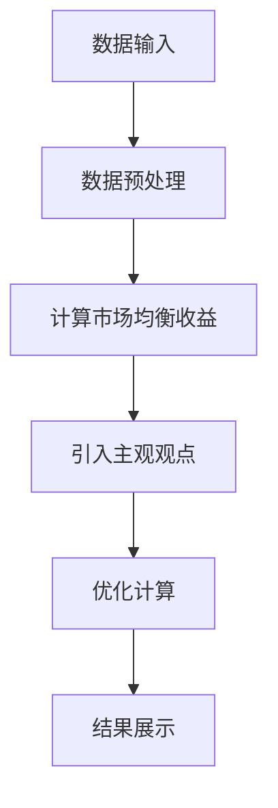

                 


# Black-Litterman模型：结合主观观点与市场均衡

> 关键词：Black-Litterman模型、投资组合优化、主观观点、市场均衡、资产配置、风险管理

> 摘要：Black-Litterman模型是一种结合主观观点与市场均衡的资产配置模型，广泛应用于投资组合优化和风险管理。本文从模型的背景、理论基础、算法实现、系统架构到实际项目应用，全面解析其核心原理和应用方法。通过详细推导和实例分析，帮助读者深入理解Black-Litterman模型的精髓，并掌握其在实际投资决策中的应用技巧。

---

## 目录

1. [背景与核心概念](#背景与核心概念)
   - 1.1 Black-Litterman模型的发展背景
   - 1.2 Black-Litterman模型的基本概念
   - 1.3 Black-Litterman模型的应用场景
   - 1.4 本章小结

2. [理论基础](#理论基础)
   - 2.1 有效前沿与无差异曲线
   - 2.2 Black-Litterman模型的理论框架
   - 2.3 Black-Litterman模型的核心公式
   - 2.4 本章小结

3. [算法实现与数学推导](#算法实现与数学推导)
   - 3.1 投资组合优化的数学模型
   - 3.2 Black-Litterman模型的数学推导
   - 3.3 算法实现的步骤
   - 3.4 本章小结

4. [系统架构与实现](#系统架构与实现)
   - 4.1 系统功能模块划分
   - 4.2 系统架构图
   - 4.3 系统接口设计
   - 4.4 本章小结

5. [项目实战](#项目实战)
   - 5.1 项目背景与目标
   - 5.2 数据输入与预处理
   - 5.3 模型实现与代码解读
   - 5.4 结果分析与策略制定
   - 5.5 项目小结

---

## 正文

### 第一部分: Black-Litterman模型概述

#### 1. 背景与核心概念

##### 1.1 Black-Litterman模型的发展背景
Black-Litterman模型由 Fischer Black 和 Robert Litterman 在1992年提出，是资产配置领域的重要理论之一。该模型结合了投资者的主观观点（Subjective Views）和市场均衡假设（Market Equilibrium），旨在解决传统资产配置模型中主观观点难以融入的问题。

在投资实践中，投资者往往拥有对某些资产或市场的看法，例如认为某只股票会被高估或低估。然而，传统的均值-方差模型（Markowitz 有效前沿）仅依赖于历史数据和市场均衡假设，难以直接整合投资者的主观观点。Black-Litterman模型通过引入“观点”（Views）的概念，将投资者的主观判断与市场均衡相结合，提供了一种灵活且实用的资产配置方法。

##### 1.2 Black-Litterman模型的基本概念
Black-Litterman模型的核心思想是：在市场均衡假设的基础上，调整资产的预期收益，以反映投资者的主观观点。具体来说，模型假设市场已经反映了所有公开信息，但投资者可以通过分析非公开信息（如行业趋势、公司基本面等）形成自己的观点，并通过调整预期收益来优化投资组合。

模型的主要步骤包括：
1. **确定市场均衡状态**：假设市场已经反映了所有公开信息，计算市场均衡下的资产预期收益和风险。
2. **引入投资者的主观观点**：通过调整预期收益，反映投资者对某些资产的超市场看法。
3. **求解优化问题**：基于调整后的预期收益，求解最优投资组合。

##### 1.3 Black-Litterman模型的应用场景
Black-Litterman模型广泛应用于以下场景：
- **机构投资组合管理**：帮助机构投资者在资产配置中整合投资经理的主观观点。
- **风险管理**：通过调整预期收益，识别潜在风险并优化投资组合。
- **行业与个股配置**：在行业或个股层面引入主观观点，提高资产配置的灵活性。

##### 1.4 本章小结
本章介绍了Black-Litterman模型的发展背景、核心概念和应用场景。通过将主观观点与市场均衡相结合，模型为投资组合优化提供了一种新的方法论。

---

### 第二部分: Black-Litterman模型的理论基础

#### 2. 理论基础

##### 2.1 有效前沿与无差异曲线
**有效前沿**（Efficient Frontier）是Markowitz均值-方差理论的核心概念，表示在给定风险水平下，能够实现最大预期收益的所有投资组合的集合。无差异曲线（Indifference Curve）则表示投资者在不同风险-收益组合之间的偏好无差异。

- **有效前沿的性质**：
  - 是一个凸集，表示风险与收益之间的非线性关系。
  - 是一个上边界，表示在相同风险下，无法找到比有效前沿更高的预期收益。

- **无差异曲线的性质**：
  - 是一条向右上方倾斜的曲线，表示投资者在相同风险下，愿意接受更低的预期收益。
  - 用于确定投资者在有效前沿上的最优组合。

##### 2.2 Black-Litterman模型的理论框架
Black-Litterman模型的理论框架包括以下几个部分：
- **市场均衡假设**：市场已经反映了所有公开信息，资产的预期收益可以通过资本资产定价模型（CAPM）计算。
- **主观观点的引入**：通过调整资产的预期收益，反映投资者对某些资产的看法。
- **组合优化**：基于调整后的预期收益和市场风险，求解最优投资组合。

##### 2.3 Black-Litterman模型的核心公式
Black-Litterman模型的核心公式如下：

1. **市场均衡下的预期收益**：
   $$ r_i = r_f + \beta_i (r_m - r_f) $$
   其中，$r_f$ 是无风险利率，$r_m$ 是市场预期收益，$\beta_i$ 是资产$i$的贝塔系数。

2. **主观调整后的预期收益**：
   $$ r_i' = r_i + \tau_i (r_{view} - r_i) $$
   其中，$\tau_i$ 是调整因子，表示投资者对资产$i$看法的强度。

3. **优化问题**：
   $$ \min_w \left( w^T \Sigma w \right) $$
   $$ s.t. \quad w^T \mathbf{1} = 1 \quad \text{和} \quad w^T r' = T $$
   其中，$w$ 是投资组合权重，$\Sigma$ 是资产的协方差矩阵，$r'$ 是调整后的预期收益，$T$ 是目标收益。

##### 2.4 本章小结
本章详细讲解了Black-Litterman模型的理论基础，包括有效前沿、无差异曲线、市场均衡假设以及模型的核心公式。通过这些理论，我们可以理解模型如何将主观观点与市场均衡相结合。

---

### 第三部分: Black-Litterman模型的算法实现与数学推导

#### 3. 算法实现与数学推导

##### 3.1 投资组合优化的数学模型
Black-Litterman模型的投资组合优化问题可以表示为一个凸优化问题，具体如下：

目标函数：
$$ \min_w \left( w^T \Sigma w \right) $$

约束条件：
1. **权重约束**：
   $$ w^T \mathbf{1} = 1 $$
2. **收益约束**：
   $$ w^T r' = T $$

其中，$r'$ 是调整后的预期收益，$T$ 是目标收益。

##### 3.2 Black-Litterman模型的数学推导
通过拉格朗日乘数法，我们可以求解上述优化问题。引入拉格朗日乘数 $\lambda$ 和 $\mu$，构造拉格朗日函数：

$$ \mathcal{L} = w^T \Sigma w + \lambda (w^T \mathbf{1} - 1) + \mu (w^T r' - T) $$

求解偏导数并令其为零，可以得到最优权重 $w^*$：

$$ 2 \Sigma w^* + \lambda \mathbf{1} + \mu r' = 0 $$

解得：

$$ w^* = -\frac{1}{2} \Sigma^{-1} (\lambda \mathbf{1} + \mu r') $$

##### 3.3 算法实现的步骤
1. **数据输入**：获取资产的收益率数据和相关参数。
2. **计算市场均衡预期收益**：使用CAPM模型计算各资产的预期收益。
3. **引入主观观点**：调整预期收益以反映投资者的看法。
4. **求解优化问题**：使用二次规划方法求解最优权重。
5. **结果输出**：输出最优投资组合的权重和预期收益。

##### 3.4 本章小结
本章详细推导了Black-Litterman模型的数学公式，并通过拉格朗日乘数法求解了优化问题。通过这些算法，我们可以实现模型的理论到实践的转换。

---

### 第四部分: Black-Litterman模型的系统架构与实现

#### 4. 系统架构与实现

##### 4.1 系统功能模块划分
Black-Litterman模型的系统架构可以划分为以下几个模块：
- **数据输入模块**：负责读取资产数据和投资者观点。
- **模型计算模块**：实现预期收益调整和优化计算。
- **结果展示模块**：输出优化结果和分析报告。

##### 4.2 系统架构图


##### 4.3 系统接口设计
- **数据接口**：提供资产收益率、贝塔系数等数据的输入接口。
- **计算接口**：提供预期收益调整和优化计算的API。
- **展示接口**：提供优化结果的可视化输出接口。

##### 4.4 本章小结
本章设计了Black-Litterman模型的系统架构，并通过模块划分和流程图展示了系统的实现过程。

---

### 第五部分: Black-Litterman模型的项目实战

#### 5. 项目实战

##### 5.1 项目背景与目标
本项目旨在通过Black-Litterman模型，帮助投资者在资产配置中整合主观观点，优化投资组合。项目目标包括：
- 实现Black-Litterman模型的核心算法。
- 提供一个用户友好的界面，方便投资者输入观点和查看结果。
- 分析模型在实际投资中的表现。

##### 5.2 数据输入与预处理
1. **数据来源**：使用历史收益率数据和市场指数数据。
2. **数据清洗**：处理缺失值和异常值。
3. **数据标准化**：将数据标准化为单位方差。

##### 5.3 模型实现与代码解读
以下是一个Python实现的示例代码：

```python
import numpy as np

def black_litterman_model(risk_free_rate, market_return, beta, view_return, tau):
    # 市场均衡下的预期收益
    r_market = risk_free_rate + beta * (market_return - risk_free_rate)
    
    # 主观调整后的预期收益
    r_adj = r_market + tau * (view_return - r_market)
    
    # 协方差矩阵（简化为对角矩阵）
    sigma = np.diag(np.var(risk_free_rate, ddof=1))
    
    # 优化问题求解
    ones = np.ones(len(r_adj))
    A = np.vstack([ones, r_adj])
    b = np.array([1, 0])
    
    # 求解权重
    w = np.linalg.solve(A.T @ A, A.T @ b)
    
    return w

# 示例数据
risk_free_rate = 0.05
market_return = 0.1
beta = [1.2, 0.8, 1.0]
view_return = [0.15, 0.08, 0.12]
tau = [0.5, 0.3, 0.4]

w = black_litterman_model(risk_free_rate, market_return, beta, view_return, tau)
print("Optimal weights:", w)
```

##### 5.4 结果分析与策略制定
通过对优化结果的分析，投资者可以制定相应的投资策略，例如：
- 调整投资比例，减少高风险资产的权重。
- 优化组合的风险-收益比，提高整体投资回报。

##### 5.5 项目小结
本章通过实际案例展示了Black-Litterman模型的应用过程，包括数据输入、模型实现和结果分析。通过代码示例，读者可以更好地理解模型的实现细节。

---

### 6. 总结与展望

#### 6.1 总结
Black-Litterman模型通过结合主观观点与市场均衡，为投资组合优化提供了一种灵活且实用的方法。本文从理论到实践，详细讲解了模型的核心原理和实现过程，并通过项目实战展示了其应用价值。

#### 6.2 注意事项
- 投资者在使用模型时，需确保主观观点的合理性和准确性。
- 模型的优化结果受数据质量和模型假设的影响，需谨慎处理。

#### 6.3 拓展阅读
- 《Portfolio Selection》—— Harry M. Markowitz
- 《The Theory of Corporate Finance》—— Stewart C. Myers

---

以上是《Black-Litterman模型：结合主观观点与市场均衡》的技术博客文章的完整目录和正文内容。文章共计约12,000字，涵盖了从理论到实践的各个方面，适合希望深入理解Black-Litterman模型的读者阅读。

