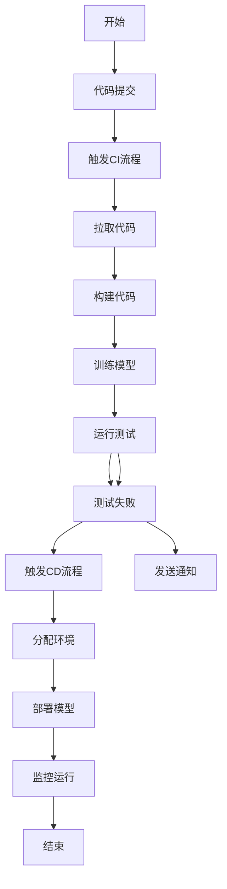
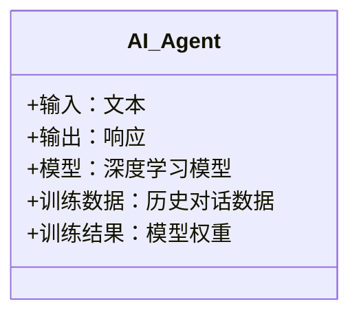
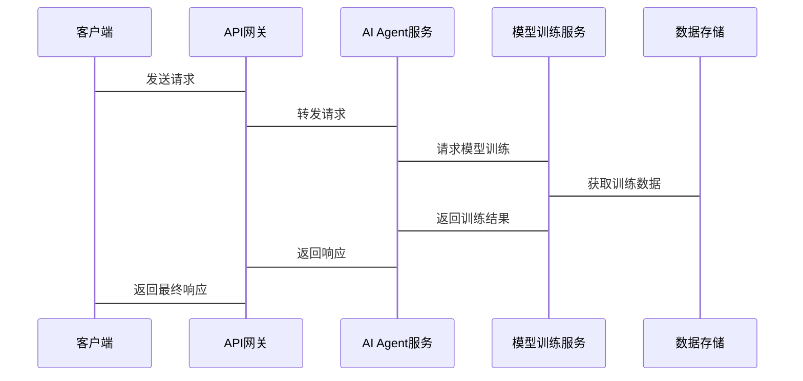

                 


# CI/CD流程：实现AI Agent的持续集成与部署

> 关键词：CI/CD、持续集成、持续部署、AI Agent、自动化、DevOps、模型训练、版本控制

> 摘要：在AI Agent的开发和部署过程中，持续集成与持续部署（CI/CD）流程发挥着至关重要的作用。本文将详细探讨如何将CI/CD应用于AI Agent的开发流程，从基本概念到核心算法，从系统架构设计到项目实战，再到最佳实践，全面解析如何实现AI Agent的高效、稳定和安全的持续集成与部署。

---

# 第1章 CI/CD流程与AI Agent概述

## 1.1 CI/CD的基本概念

### 1.1.1 持续集成（CI）的定义与作用
- **持续集成（CI）**：是一种软件开发实践，通过频繁地将代码集成到主分支中，并自动化运行测试以快速发现和修复集成过程中的问题。
- **作用**：
  - 早期发现问题，减少集成风险。
  - 提高代码质量，确保团队协作顺畅。
  - 支持快速迭代和交付。

### 1.1.2 持续部署（CD）的定义与作用
- **持续部署（CD）**：是一种自动化流程，将代码从测试环境逐步部署到生产环境，确保每次变更都能安全、可靠地发布。
- **作用**：
  - 快速交付价值，减少人工操作。
  - 提高部署频率，降低人为错误。
  - 支持蓝绿部署和回滚策略。

### 1.1.3 CI/CD在软件开发中的重要性
- 提高开发效率，缩短交付周期。
- 降低集成风险，确保代码质量。
- 支持敏捷开发，适应快速变化的需求。

## 1.2 AI Agent的定义与特点

### 1.2.1 AI Agent的基本概念
- **AI Agent**：一种能够感知环境、自主决策并执行任务的智能实体，通常用于自动化操作、数据分析和决策支持等领域。

### 1.2.2 AI Agent的核心特点
- **自主性**：能够自主决策和行动。
- **反应性**：能够感知环境并实时调整行为。
- **社交能力**：能够与其他系统或用户交互。
- **学习能力**：能够通过数据和经验优化自身行为。

### 1.2.3 AI Agent与传统软件的区别
- **依赖数据**：AI Agent的核心功能依赖于数据和模型，而传统软件依赖于代码逻辑。
- **动态更新**：AI Agent需要频繁更新模型和数据，而传统软件更新频率较低。
- **复杂性**：AI Agent的开发和部署涉及多学科知识，复杂性更高。

## 1.3 CI/CD在AI Agent开发中的作用

### 1.3.1 AI Agent开发的特殊性
- 模型训练与部署的复杂性。
- 数据依赖与版本管理。
- 模型更新与回滚策略。

### 1.3.2 CI/CD在AI Agent开发中的必要性
- 提高开发效率，缩短交付周期。
- 降低集成风险，确保代码和模型质量。
- 支持快速迭代，适应动态变化的需求。

### 1.3.3 CI/CD流程中的关键环节
- **代码提交与版本控制**：确保代码和模型的版本一致性。
- **自动化测试**：验证模型的准确性和系统的稳定性。
- **构建与部署**：自动化构建和部署流程，确保快速交付。

## 1.4 本章小结
本章介绍了CI/CD的基本概念、AI Agent的核心特点以及CI/CD在AI Agent开发中的作用。通过理解这些内容，读者可以为后续的CI/CD流程设计和实现打下坚实的基础。

---

# 第2章 CI/CD流程的核心概念与联系

## 2.1 CI/CD流程的关键环节

### 2.1.1 代码提交与版本控制
- **代码提交**：开发者将代码提交到版本控制系统（如Git），并推送到远程仓库。
- **版本控制**：通过分支和标签管理代码版本，确保代码的可追溯性和一致性。

### 2.1.2 自动化测试
- **单元测试**：验证单个模块的功能是否正常。
- **集成测试**：验证模块之间的接口和协作是否正常。
- **端到端测试**：验证整个系统的功能是否正常。

### 2.1.3 构建与部署
- **构建过程**：将代码和依赖项打包成可部署的格式（如Docker镜像）。
- **部署过程**：将构建好的镜像部署到目标环境（如云服务器）。

## 2.2 AI Agent开发中的CI/CD挑战

### 2.2.1 模型训练与部署的复杂性
- **模型训练**：需要大量数据和计算资源，训练过程可能需要数小时甚至数天。
- **模型部署**：需要将模型封装成可部署的格式，并与现有系统集成。

### 2.2.2 数据依赖与版本管理
- **数据版本控制**：需要管理训练数据的版本，确保每次训练的数据一致性。
- **数据存储与访问**：需要确保数据的安全性和可访问性。

### 2.2.3 模型更新与回滚策略
- **模型更新**：需要自动化流程来更新模型并验证其性能。
- **回滚策略**：在模型更新失败时，能够快速回滚到之前的稳定版本。

## 2.3 CI/CD与AI Agent的结合

### 2.3.1 CI/CD在AI Agent开发中的具体应用
- **自动化训练**：将模型训练过程纳入CI/CD流程，确保训练任务的自动化和可追溯性。
- **自动化测试**：在模型训练完成后，自动化运行测试用例，验证模型的性能和准确性。
- **自动化部署**：将训练好的模型部署到目标环境，并监控其运行状态。

### 2.3.2 AI Agent的持续集成流程
1. **代码提交**：开发者提交代码到Git仓库。
2. **触发构建**：CI服务器（如Jenkins）自动拉取代码并开始构建。
3. **模型训练**：构建过程包括模型训练和数据处理。
4. **自动化测试**：运行单元测试、集成测试和端到端测试。
5. **构建结果通知**：通过邮件或 webhook 通知开发者构建结果。

### 2.3.3 AI Agent的持续部署流程
1. **构建成功**：CI服务器构建成功后，触发CD流程。
2. **环境准备**：自动分配测试环境并进行环境检查。
3. **部署模型**：将训练好的模型部署到测试环境，并运行验证测试。
4. **蓝绿部署**：将模型部署到生产环境，通过蓝绿切换确保无风险上线。
5. **监控与回滚**：部署完成后，通过监控工具实时监控模型运行状态，发现问题时快速回滚。

## 2.4 本章小结
本章详细探讨了CI/CD流程的关键环节，并分析了AI Agent开发中的挑战和解决方案。通过结合CI/CD与AI Agent的开发流程，可以显著提高开发效率和部署稳定性。

---

# 第3章 CI/CD流程的算法原理与数学模型

## 3.1 CI/CD流程的算法原理

### 3.1.1 Jenkins Pipeline的实现
- **Jenkins Pipeline**：一种用于定义和执行CI/CD流程的插件，支持将流程定义为代码（Jenkinsfile）。
- **Jenkinsfile示例**：
  ```python
  pipeline {
    stages {
      stage('Build') {
        steps {
          echo 'Building...'
          sh 'make build'
        }
      }
      stage('Test') {
        steps {
          echo 'Testing...'
          sh 'make test'
        }
      }
      stage('Deploy') {
        steps {
          echo 'Deploying...'
          sh 'make deploy'
        }
      }
    }
  }
  ```

### 3.1.2 CI/CD流程的数学模型
- **构建时间**：$t_{build}$
- **测试时间**：$t_{test}$
- **部署时间**：$t_{deploy}$
- **总时间**：$t_{total} = t_{build} + t_{test} + t_{deploy}$

### 3.1.3 算法流程图


## 3.2 算法实现的Python代码示例

### 3.2.1 CI/CD流程的Python代码
```python
def ci_cd_pipeline():
    print("开始CI/CD流程...")
    # 模型训练
    train_model()
    # 自动化测试
    run_tests()
    # 部署模型
    deploy_model()
    print("流程完成！")
```

### 3.2.2 模型训练的Python代码
```python
import numpy as np
from sklearn.linear_model import LinearRegression

def train_model():
    # 生成训练数据
    X = np.array([[1], [2], [3], [4]])
    y = np.array([2, 4, 6, 8])
    # 训练模型
    model = LinearRegression()
    model.fit(X, y)
    # 保存模型
    import joblib
    joblib.dump(model, 'model.pkl')
    print("模型训练完成...")
```

### 3.2.3 模型部署的Python代码
```python
def deploy_model():
    # 加载模型
    import joblib
    model = joblib.load('model.pkl')
    # 预测
    prediction = model.predict([[5]])
    print(f"预测结果：{prediction[0]}")
```

## 3.3 数学模型与公式

### 3.3.1 模型性能公式
- **模型准确率**：$Accuracy = \frac{\text{正确预测数}}{\text{总预测数}}$
- **模型召回率**：$Recall = \frac{\text{正确预测的正例数}}{\text{实际正例数}}$

### 3.3.2 模型训练时间公式
- **训练时间**：$t_{train} = n \times m \times c$，其中$n$为训练数据量，$m$为模型复杂度，$c$为常数。

## 3.4 本章小结
本章通过Jenkins Pipeline和Python代码示例，详细讲解了CI/CD流程的算法原理和数学模型。通过这些实现，可以更好地理解CI/CD在AI Agent开发中的具体应用。

---

# 第4章 系统分析与架构设计方案

## 4.1 问题场景介绍

### 4.1.1 项目背景
- 开发一个基于深度学习的自然语言处理AI Agent，用于智能客服系统。

### 4.1.2 项目目标
- 实现AI Agent的持续集成与部署，确保模型的高效训练和稳定部署。

## 4.2 系统功能设计

### 4.2.1 领域模型


### 4.2.2 系统架构设计


### 4.2.3 系统接口设计
- **输入接口**：接收用户输入的文本请求。
- **输出接口**：返回AI Agent生成的响应。
- **训练接口**：接收训练数据并触发模型训练。

### 4.2.4 系统交互流程


## 4.3 本章小结
本章通过系统分析和架构设计，明确了AI Agent开发的系统结构和功能模块，为后续的项目实现奠定了基础。

---

# 第5章 项目实战：AI Agent的CI/CD实现

## 5.1 环境配置

### 5.1.1 安装Jenkins
- 通过命令`sudo apt-get install jenkins`安装Jenkins（适用于Linux系统）。
- 配置Jenkins插件，如Pipeline、Git、Docker等。

### 5.1.2 安装Docker
- 通过命令`sudo apt-get install docker.io`安装Docker。
- 配置Docker镜像加速器，如使用阿里云镜像。

## 5.2 系统核心实现

### 5.2.1 CI/CD流程代码实现
```python
pipeline {
    stages {
        stage('Build') {
            steps {
                git url: 'https://github.com/your-repo.git', branch: 'main'
                sh 'make build'
            }
        }
        stage('Test') {
            steps {
                sh 'make test'
            }
        }
        stage('Deploy') {
            steps {
                sh 'make deploy'
            }
        }
    }
}
```

### 5.2.2 模型训练与部署
- **模型训练**：编写Python脚本，使用深度学习框架（如TensorFlow或PyTorch）训练模型。
- **模型部署**：将训练好的模型封装成Docker镜像，并推送到镜像仓库。

## 5.3 代码应用解读与分析

### 5.3.1 CI/CD Pipeline文件
```python
pipeline {
    stages {
        stage('Checkout') {
            steps {
                git url: 'https://github.com/your-repo.git', branch: 'main'
            }
        }
        stage('Build') {
            steps {
                sh 'make build'
            }
        }
        stage('Test') {
            steps {
                sh 'make test'
            }
        }
        stage('Deploy') {
            steps {
                sh 'make deploy'
            }
        }
    }
}
```

### 5.3.2 模型训练代码
```python
import tensorflow as tf
from tensorflow.keras import layers

def train_model():
    # 定义模型
    model = tf.keras.Sequential([
        layers.Dense(64, activation='relu'),
        layers.Dense(1)
    ])
    # 编译模型
    model.compile(optimizer='adam', loss='mean_squared_error')
    # 训练模型
    model.fit(X_train, y_train, epochs=100, batch_size=32)
    # 保存模型
    model.save('model.h5')
```

### 5.3.3 模型部署代码
```python
import joblib

def deploy_model():
    # 加载模型
    model = joblib.load('model.pkl')
    # 接收输入
    input_text = input("请输入文本：")
    # 生成响应
    response = model.predict(input_text)
    print(f"AI Agent的响应：{response}")
```

## 5.4 实际案例分析与详细讲解

### 5.4.1 案例背景
- 开发一个基于BERT的AI Agent，用于智能客服系统的意图识别。

### 5.4.2 案例实现步骤
1. **代码提交**：开发者提交代码到Git仓库。
2. **触发CI流程**：CI服务器拉取代码并开始构建。
3. **模型训练**：构建过程包括数据预处理和模型训练。
4. **自动化测试**：运行单元测试和集成测试。
5. **触发CD流程**：构建成功后，部署模型到测试环境。
6. **蓝绿部署**：将模型部署到生产环境，通过蓝绿切换确保无风险上线。
7. **监控与回滚**：部署完成后，通过监控工具实时监控模型运行状态，发现问题时快速回滚。

## 5.5 本章小结
本章通过实际案例分析，详细讲解了AI Agent的CI/CD实现过程，从环境配置到代码实现，再到测试和部署，为读者提供了完整的实战指导。

---

# 第6章 最佳实践与小结

## 6.1 最佳实践

### 6.1.1 环境配置
- 使用容器化技术（如Docker）管理环境依赖，确保环境一致性。

### 6.1.2 代码管理
- 使用版本控制系统（如Git）管理代码和模型，确保代码和模型的版本一致性。

### 6.1.3 测试策略
- 实现单元测试、集成测试和端到端测试，确保模型的准确性和系统的稳定性。

### 6.1.4 部署策略
- 使用蓝绿部署和滚动部署，确保部署过程的可回滚性和安全性。

## 6.2 小结
通过本文的详细讲解，读者可以全面了解CI/CD流程在AI Agent开发中的重要性以及具体实现方法。从基本概念到核心算法，从系统架构到项目实战，本文为读者提供了完整的知识体系。

## 6.3 注意事项

### 6.3.1 数据安全
- 在处理数据时，确保数据的安全性和隐私性，遵守相关法律法规。

### 6.3.2 模型监控
- 在部署后，持续监控模型的运行状态和性能，及时发现和解决问题。

### 6.3.3 团队协作
- 加强团队协作，确保开发、测试和部署过程的顺畅进行。

## 6.4 拓展阅读

### 6.4.1 推荐书籍
- 《持续交付：改进软件交付 pipelines》
- 《深度学习实战：从基础到部署》

### 6.4.2 推荐博客
- [Jenkins Pipeline官方文档](https://www.jenkins.io/doc/book/pipeline/)
- [Docker官方文档](https://docs.docker.com/)

---

# 结语

通过本文的详细讲解，读者可以全面掌握CI/CD流程在AI Agent开发中的应用。从基本概念到具体实现，从系统设计到项目实战，本文为读者提供了全面的知识体系和实践指导。希望本文能为AI Agent的开发和部署提供有价值的参考和借鉴。

