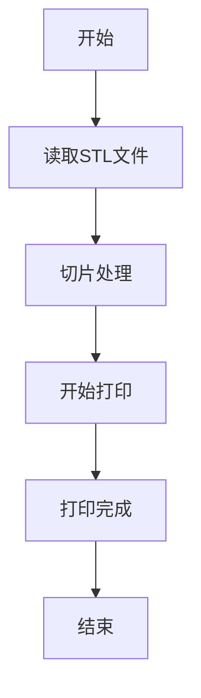

                 

# 3D打印技术对制造业的革新与投资机会

---

## 关键词

- 3D打印技术
- 制造业革新
- 投资机会
- 增材制造
- 数字化转型

---

## 摘要

3D打印技术，又称增材制造，正在全球范围内掀起一场制造业的革命。它不仅改变了传统的生产方式，还为投资者带来了巨大的机遇。本文将深入探讨3D打印技术的核心原理、其对制造业的深远影响，以及如何抓住这一技术带来的投资机会。通过分析市场趋势、技术细节和实际案例，我们将揭示3D打印如何重塑制造业的未来。

---

# 第一部分: 3D打印技术的背景与基础

## 第1章: 3D打印技术概述

### 1.1 3D打印的基本概念

#### 1.1.1 3D打印的定义

3D打印技术是一种基于数字模型，通过逐层叠加材料来构建三维物体的制造技术。与传统减材制造不同，它采用增材方式，能够直接从数字模型生成实物。

$$
\text{3D打印} = \text{数字模型} \rightarrow \text{逐层叠加} \rightarrow \text{三维物体}
$$

#### 1.1.2 3D打印的核心技术原理

3D打印的基本原理可以分为三个步骤：
1. **数据准备**：将设计模型转换为可打印的文件格式（如STL）。
2. **打印过程**：通过喷嘴或激光头逐层沉积材料，构建物体。
3. **后处理**：对打印完成的物体进行打磨、涂装等处理。

#### 1.1.3 3D打印与传统制造技术的对比

| 技术特点 | 3D打印 | 传统制造 |
|----------|--------|----------|
| 生产效率 | 高（复杂形状） | 低（简单形状） |
| 成本 | 高（小批量） | 低（大批量） |
| 灵活性 | 高 | 低 |

### 1.2 3D打印技术的演进历程

#### 1.2.1 3D打印技术的历史发展

1980年代：概念提出  
1990年代：技术成熟  
2000年代：广泛应用  

#### 1.2.2 不同类型的3D打印技术

- FDM（熔融沉积建模）
- SLA（光固化）
- SLS（选择性激光烧结）

#### 1.2.3 当前3D打印技术的主要流派

- 工业级3D打印
- 消费级3D打印

### 1.3 制造业的现状与挑战

#### 1.3.1 现代制造业的主要问题

1. 高昂的生产成本  
2. 环境污染  
3. 生产周期长  

#### 1.3.2 制造业的数字化转型趋势

- 数字化设计  
- 智能化生产  

#### 1.3.3 3D打印技术在制造业中的定位

3D打印是数字化转型的重要工具，能够实现快速原型制作和小批量高效生产。

### 1.4 3D打印技术对传统制造业的冲击

#### 1.4.1 生产方式的变革

- 简化了生产流程  
- 减少了库存需求  

#### 1.4.2 供应链的重构

- 本地化生产  
- 简化物流  

#### 1.4.3 制造业生态的颠覆性影响

- 从大规模生产转向按需生产  
- 创造新的商业模式  

---

## 第2章: 3D打印技术的核心技术

### 2.1 3D打印技术的核心原理

#### 2.1.1 3D打印的材料选择

材料是3D打印的关键因素，常见的材料包括：

1. 塑料（如ABS、PLA）  
2. 金属（如钛、不锈钢）  
3. 复合材料  

#### 2.1.2 3D打印的设备架构

- 控制系统：负责整体协调  
- 打印头：负责材料沉积  
- 成型平台：用于支撑打印物体  

### 2.2 3D打印技术的数学模型

#### 2.2.1 3D打印的数学建模

3D打印依赖于数字模型，通常使用三维建模软件（如AutoCAD、SolidWorks）生成STL文件。

$$
\text{STL文件} = \text{三角形网格} \rightarrow \text{3D模型}
$$

#### 2.2.2 打印路径规划

路径规划算法确保材料的最优沉积，减少材料浪费和提高效率。

$$
\text{路径规划} = \text{优化算法} \rightarrow \text{打印路径}
$$

### 2.3 3D打印技术的系统架构

#### 2.3.1 3D打印系统的组成

- 输入设备：设计模型  
- 打印设备：3D打印机  
- 输出设备：打印完成的物体  

#### 2.3.2 3D打印系统的流程图

---

## 第3章: 3D打印技术的应用与创新

### 3.1 3D打印在汽车制造中的应用

#### 3.1.1 轻量化设计

3D打印能够制造复杂的内部结构，减少材料用量，降低车身重量。

#### 3.1.2 快速原型制作

汽车设计的迭代速度加快，缩短研发周期。

### 3.2 3D打印在航空航天领域的创新

#### 3.2.1 高强度零件生产

3D打印可以制造耐高温、高强度的金属零件，适合航空航天需求。

#### 3.2.2 减少生产成本

通过按需生产，降低库存成本。

---

## 第4章: 投资机会分析与未来展望

### 4.1 3D打印技术的市场前景

#### 4.1.1 市场规模预测

预计到2030年，全球3D打印市场规模将达到数百亿美元。

#### 4.1.2 主要驱动因素

- 技术进步  
- 行业需求增长  

### 4.2 投资策略建议

#### 4.2.1 关注技术创新

投资于研发先进的3D打印技术的企业。

#### 4.2.2 布局新兴市场

开拓医疗、航空航天等高增长领域。

### 4.3 投资风险与应对措施

#### 4.3.1 技术风险

技术更新换代快，需持续投入研发。

#### 4.3.2 市场风险

市场竞争激烈，需注重差异化发展。

---

## 结语

3D打印技术正在改变制造业的面貌，为投资者带来丰厚的回报。通过深入了解技术原理、应用领域和市场趋势，投资者可以抓住这一技术带来的机遇。未来，3D打印将继续推动制造业的创新，成为数字化转型的核心驱动力。

--- 

# 感谢阅读！

