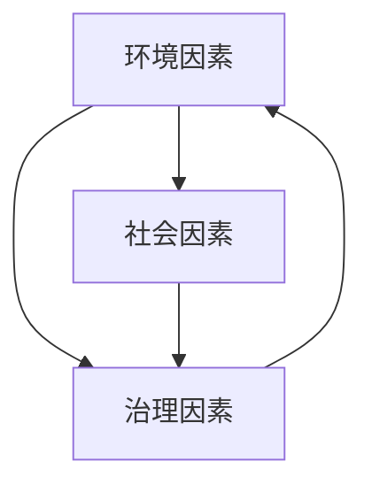
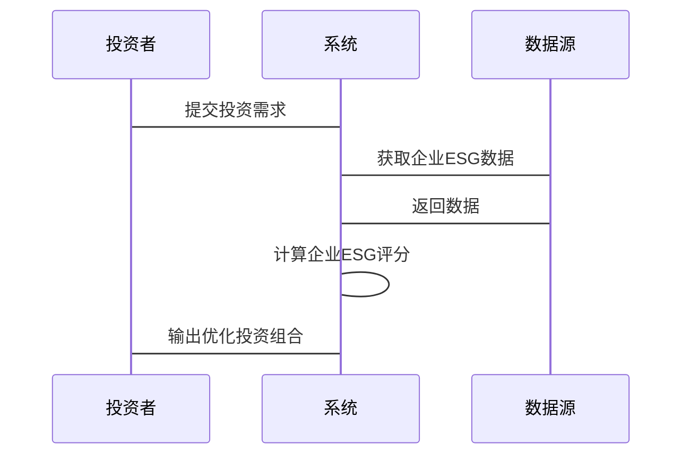

                 

# ESG整合策略：将可持续发展因素纳入投资流程

---

## 关键词：ESG、可持续发展、投资策略、风险管理、数据分析

---

## 摘要：  
随着全球可持续发展理念的兴起，ESG（环境、社会、治理）整合策略成为投资领域的重要趋势。本文从ESG整合的背景与意义出发，详细探讨其核心概念、理论框架、数学模型以及系统设计。通过分析ESG评分模型、风险评估模型和投资组合优化模型，结合实际案例，本文为投资者提供了一套系统化的方法论，以在投资决策中有效整合ESG因素，实现长期价值创造与社会责任的统一。

---

# 第1章: ESG整合的背景与意义

## 1.1 ESG的基本概念与内涵

### 1.1.1 环境（Environmental）因素  
环境因素关注企业在资源利用、碳排放、污染治理等方面的表现。  
- **核心指标**：碳排放强度、水资源使用效率、废弃物处理率等。  
- **逻辑关系**：企业对环境的负面影响越小，长期来看，其运营成本越低，竞争优势越强。  

### 1.1.2 社会（Social）因素  
社会因素关注企业在员工权益、社区贡献、产品安全等方面的表现。  
- **核心指标**：员工满意度、社会责任投入、劳动权益保障等。  
- **逻辑关系**：良好的社会形象和员工关系有助于提升企业凝聚力和市场声誉。  

### 1.1.3 治理（Governance）因素  
治理因素关注企业在董事会结构、股权结构、内部监督等方面的表现。  
- **核心指标**：董事会独立性、高管薪酬透明度、股东权益保护等。  
- **逻辑关系**：高效的治理结构能够提升企业决策效率和风险管理能力。  

### 1.1.4 ESG的整合逻辑与整体性  
ESG并非简单的指标叠加，而是通过综合评估企业对环境、社会和治理的综合影响，从而判断其长期发展潜力和风险。  

## 1.2 ESG投资的背景与发展趋势

### 1.2.1 全球可持续发展背景下的ESG投资兴起  
全球气候变化、资源枯竭和社会不平等等问题的加剧，促使投资者将ESG因素纳入决策框架。  

### 1.2.2 ESG投资对传统投资理念的补充与创新  
传统投资注重财务回报，而ESG整合将企业外部性（如环境损害、社会成本）纳入考量，实现短期收益与长期价值的统一。  

### 1.2.3 全球主要市场的ESG投资实践  
- **美国**：ESG投资起步较早，机构投资者普遍重视环境和治理因素。  
- **欧洲**：以英国和法国为代表，ESG投资已纳入政策法规，成为企业上市的硬性要求。  
- **中国**：随着碳中和目标的提出，ESG投资逐渐成为资本市场的重要方向。  

## 1.3 ESG整合的必要性与重要性

### 1.3.1 企业风险管理的视角  
ESG整合能够识别企业潜在的环境和社会风险，提前规避危机。  

### 1.3.2 投资者利益保护的视角  
通过ESG评估，投资者可以筛选出更具可持续性和抗风险能力的企业，降低投资组合的整体风险。  

### 1.3.3 社会责任与长期价值创造的视角  
ESG整合不仅是企业社会责任的体现，更是实现经济、社会和环境协调发展的关键路径。  

## 1.4 本章小结  
本章从背景、概念和发展趋势三个方面，阐述了ESG整合的重要性和必要性，为后续的理论和方法探讨奠定了基础。

---

# 第2章: ESG整合的核心概念与框架

## 2.1 ESG整合的核心概念

### 2.1.1 ESG整合的定义与范围  
ESG整合是指在投资决策中，将环境、社会和治理因素作为评估企业价值的重要维度，通过量化和分析这些因素，优化投资组合并降低风险。  

### 2.1.2 ESG整合的关键要素与相互关系  
通过下图可以清晰看到环境、社会和治理三者之间的相互作用关系：  

---

## 2.2 ESG整合的理论框架

### 2.2.1 综合评估模型  
ESG整合的核心在于构建一个多维度的评估模型，综合考虑环境、社会和治理因素的影响。  

### 2.2.2 权重分配与指标体系  
权重分配是ESG整合的关键步骤，通常根据行业特点和投资目标进行动态调整。  

### 2.2.3 数据来源与处理方法  
- **数据来源**：企业年报、社会责任报告、第三方评级机构数据。  
- **处理方法**：标准化、去噪处理、归一化等。  

---

## 2.3 ESG整合的实施步骤与方法

### 2.3.1 数据收集与处理  
通过爬虫技术或API接口获取企业的ESG相关数据，并进行清洗和预处理。  

### 2.3.2 指标评估与打分  
基于预先设定的指标体系，对每个企业进行打分，并计算综合得分。  

### 2.3.3 综合评分与排序  
根据综合得分对企业进行排序，筛选出符合投资标准的企业。  

---

## 2.4 本章小结  
本章从理论框架和实施步骤两个方面，详细介绍了ESG整合的核心概念与操作方法，为后续的模型构建提供了理论支持。

---

# 第3章: ESG整合的数学模型与公式

## 3.1 ESG综合评分模型

### 3.1.1 指标权重的确定  
指标权重通常采用因子分析法或专家打分法确定。  

### 3.1.2 综合评分的计算公式  
$$ ESG\_score = \sum_{i=1}^{n} w_i \times score_i $$  
其中，$w_i$为第i个指标的权重，$score_i$为该指标的评分。  

---

## 3.2 ESG风险评估模型

### 3.2.1 风险因素的识别与量化  
风险因素包括环境风险、社会风险和治理风险三类。  

### 3.2.2 风险影响程度的评估公式  
$$ Risk\_impact = \sum_{j=1}^{m} w_j \times risk\_factor_j $$  
其中，$w_j$为风险因素的权重，$risk\_factor_j$为该风险因素的影响程度。  

---

## 3.3 ESG投资组合优化模型

### 3.3.1 投资组合优化的目标函数  
$$ Maximize \quad \sum_{k=1}^{p} return_k \times weight_k $$  

### 3.3.2 约束条件  
$$ \sum_{k=1}^{p} weight_k = 1 $$  
$$ weight_k \geq 0 \quad \forall k $$  

---

## 3.4 本章小结  
本章通过数学公式和模型，详细阐述了ESG评分、风险评估和投资组合优化的实现方法，为实际应用提供了理论依据。

---

# 第4章: ESG整合的系统分析与架构设计

## 4.1 系统功能设计

### 4.1.1 数据采集模块  
负责收集企业ESG相关数据，包括环境数据、社会数据和治理数据。  

### 4.1.2 评估模块  
对数据进行清洗、标准化和打分，计算企业综合ESG评分。  

### 4.1.3 优化模块  
基于评分结果，优化投资组合，生成最优投资建议。  

---

## 4.2 系统架构设计

---

## 4.3 系统交互设计

---

## 4.4 本章小结  
本章通过系统分析与架构设计，详细描述了ESG整合的实现流程和系统模块设计，为后续的系统开发提供了参考。

---

# 第5章: ESG整合的实践与案例分析

## 5.1 ESG整合的实践步骤

### 5.1.1 数据收集与处理  
通过爬虫技术或API接口获取企业的ESG相关数据。  

### 5.1.2 指标评估与打分  
基于预设的指标体系，对企业进行评分。  

### 5.1.3 投资组合优化  
根据评分结果，优化投资组合，生成最优投资建议。  

---

## 5.2 ESG整合的案例分析

### 5.2.1 案例背景  
以某新能源企业为例，分析其在环境、社会和治理方面的表现。  

### 5.2.2 数据分析  
通过数据分析工具（如Python），计算该企业的ESG评分。  

### 5.2.3 投资建议  
基于评分结果，给出投资建议，并对比传统投资策略的收益差异。  

---

## 5.3 本章小结  
本章通过实际案例分析，验证了ESG整合策略的有效性和可行性，为投资者提供了实践参考。

---

# 第6章: ESG整合的风险管理与挑战

## 6.1 ESG整合的主要风险

### 6.1.1 数据质量风险  
数据来源多样，可能导致数据偏差。  

### 6.1.2 模型局限性  
数学模型可能存在简化假设，影响评估结果的准确性。  

### 6.1.3 政策风险  
政策变化可能影响企业的ESG表现和投资收益。  

---

## 6.2 ESG整合的挑战

### 6.2.1 数据获取难度  
部分企业未公开ESG相关数据，导致数据缺失。  

### 6.2.2 模型优化困难  
如何动态调整指标权重和优化算法是当前研究的难点。  

### 6.2.3 市场认知差异  
不同投资者对ESG的认知存在差异，导致实施难度较大。  

---

## 6.3 应对策略与建议

### 6.3.1 完善数据采集体系  
建立多源数据融合机制，确保数据的准确性和全面性。  

### 6.3.2 提升模型鲁棒性  
采用机器学习算法，增强模型的自适应能力和预测精度。  

### 6.3.3 加强政策引导  
通过政策支持和宣传推广，提升市场对ESG的认知和接受度。  

---

## 6.4 本章小结  
本章分析了ESG整合面临的主要风险和挑战，并提出了应对策略，为投资者提供了风险管理的实践指导。

---

# 第7章: ESG整合的未来发展与展望

## 7.1 未来发展趋势

### 7.1.1 技术驱动的深化  
人工智能和大数据技术将推动ESG评估的智能化和精准化。  

### 7.1.2 全球化与本地化的结合  
ESG整合将更加注重区域特点和文化差异。  

### 7.1.3 产品创新  
ESG相关金融产品（如ESG基金、绿色债券）将不断丰富，满足多样化的投资需求。  

---

## 7.2 研究热点与创新方向

### 7.2.1 ESG与人工智能的结合  
利用机器学习算法优化ESG评估模型。  

### 7.2.2 ESG与区块链技术的融合  
通过区块链技术确保ESG数据的透明性和不可篡改性。  

### 7.2.3 ESG的量化投资策略  
探索ESG因子在量化投资中的应用，提升投资收益。  

---

## 7.3 本章小结  
本章从技术和产品两个方面，展望了ESG整合的未来发展方向，为研究者和投资者提供了新的思路。

---

# 第8章: 总结与展望

## 8.1 本研究的主要成果  
本文系统地探讨了ESG整合的背景、理论、方法和实践，构建了完整的ESG整合框架，并提出了具体的实现方案。  

## 8.2 研究的局限性  
目前的ESG评估模型仍存在数据获取难、模型鲁棒性不足等问题，需要进一步研究和优化。  

## 8.3 未来研究方向  
建议未来研究者关注ESG与人工智能的结合、ESG的动态评估方法以及ESG的全球协同效应。  

---

# 参考文献  
（此处列出具体的参考文献）

---

# 附录  

## 附录A: ESG术语表  
（列出文章中涉及的专业术语及其定义）  

## 附录B: ESG相关工具与平台  
（列举常用的ESG数据平台和分析工具）  

---

# 作者简介  
（此处介绍作者的背景和专业领域）  

---

通过以上结构，我们可以系统地探讨ESG整合策略的各个方面，为投资者和研究者提供理论和实践上的指导。

