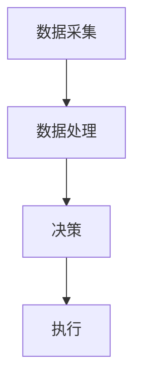
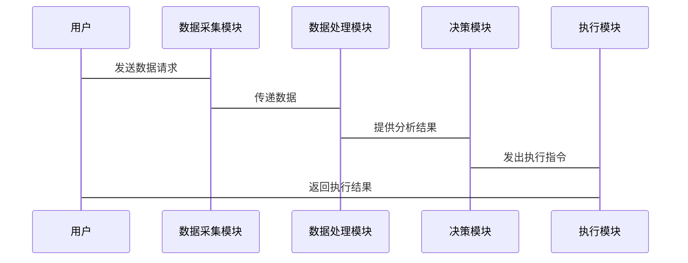

                 


# 5G+AI：探索高速网络下的AI Agent新应用

> 关键词：5G网络，AI Agent，高速率，低延迟，边缘计算，智能应用

> 摘要：本文探讨了5G网络与AI Agent的结合，分析了5G技术特性对AI Agent的支持，详细讲解了AI Agent的核心技术及其在5G环境中的应用场景。通过系统架构设计、算法原理分析和项目实战，展示了5G+AI Agent的潜力和实现方法。

---

# 第1章：5G与AI Agent概述

## 1.1 5G网络的基本概念

### 1.1.1 5G网络的定义与特点
5G（第五代移动通信技术）是继4G之后的新一代移动通信技术，主要特点是高速率、低延迟和大规模连接能力。5G网络采用毫米波和大规模MIMO等技术，显著提升了网络性能。

$$\text{5G网络的三个主要特性：}$$
- 高速率：理论下行速度可达10 Gbps。
- 低延迟：端到端延迟低至1 ms。
- 大规模连接：支持海量设备接入，每平方公里可连接100万个设备。

### 1.1.2 5G网络的架构与优势
5G网络采用网络功能虚拟化（NFV）和软件定义网络（SDN）技术，实现了网络的灵活部署和高效管理。其优势包括：
- 网络切片：根据不同场景定制化网络资源。
- 边缘计算：将计算能力推移到靠近用户的边缘节点，降低延迟。

### 1.1.3 5G网络的未来发展
5G技术将继续推动智能化、自动化和数字化转型，成为万物互联（IoT）和工业互联网的重要基础设施。

---

## 1.2 AI Agent的基本概念

### 1.2.1 AI Agent的定义与特点
AI Agent（人工智能代理）是指能够感知环境并采取行动以实现目标的智能实体。AI Agent的特点包括：
- 自主性：能够独立决策。
- 反应性：能实时感知并响应环境变化。
- 学习能力：通过数据和经验不断优化行为。

### 1.2.2 AI Agent的核心技术
AI Agent的核心技术包括：
- 自然语言处理（NLP）：实现人机交互。
- 计算机视觉（CV）：处理图像和视频数据。
- 强化学习（RL）：通过试错优化决策。

### 1.2.3 AI Agent的应用场景
AI Agent广泛应用于智能助手、自动驾驶、智能安防等领域。

---

## 1.3 5G与AI Agent的结合

### 1.3.1 5G网络对AI Agent的支持
5G的高速率和低延迟为AI Agent提供了强大的网络支持，尤其是在边缘计算环境下，AI Agent可以实时处理大量数据。

### 1.3.2 AI Agent在5G网络中的应用潜力
5G网络为AI Agent提供了更广阔的舞台，特别是在智能交通、智能制造和智慧城市等领域。

### 1.3.3 5G与AI Agent结合的未来趋势
随着5G网络的普及和AI技术的进步，AI Agent将在更多领域发挥重要作用。

---

## 1.4 本章小结
本章介绍了5G网络的基本概念和AI Agent的核心技术，探讨了两者结合的可能性和潜力。

---

# 第2章：5G网络的技术特性

## 2.1 高速率与低延迟

### 2.1.1 5G网络的高带宽特性
5G网络的高带宽使其能够支持4K/8K视频传输和虚拟现实（VR）应用。

### 2.1.2 5G网络的低延迟优势
低延迟使得5G网络在实时交互场景中表现优异，如游戏和远程医疗。

### 2.1.3 高速率与低延迟对AI Agent的影响
高速率和低延迟提升了AI Agent的数据处理能力和实时性。

---

## 2.2 大规模连接与边缘计算

### 2.2.1 5G网络的海量连接能力
5G网络支持海量设备接入，适合大规模物联网场景。

### 2.2.2 边缘计算在5G网络中的作用
边缘计算将数据处理推移到靠近用户的边缘节点，降低了数据传输延迟。

### 2.2.3 大规模连接对AI Agent的应用价值
大规模连接使得AI Agent能够应用于智能交通和智慧城市等场景。

---

## 2.3 网络切片与动态资源分配

### 2.3.1 网络切片的概念与优势
网络切片是将5G网络划分为多个虚拟网络，每个切片专用于特定场景。

### 2.3.2 动态资源分配的原理
动态资源分配根据实时需求调整网络资源，提高了网络利用率。

### 2.3.3 网络切片与动态资源分配对AI Agent的支持
通过网络切片和动态资源分配，AI Agent可以根据需求灵活调整网络资源。

---

## 2.4 本章小结
本章详细探讨了5G网络的技术特性及其对AI Agent的支持。

---

# 第3章：AI Agent的核心技术

## 3.1 自然语言处理

### 3.1.1 自然语言处理的定义与特点
自然语言处理（NLP）是研究人机交互的关键技术，使AI Agent能够理解和生成人类语言。

### 3.1.2 常见的自然语言处理模型
- 词袋模型（Bag of Words）。
- 词嵌入模型（Word2Vec）。
- 循环神经网络（RNN）。
- 变换器（Transformer）。

### 3.1.3 自然语言处理在AI Agent中的应用
NLP用于智能客服、语音助手等场景。

---

## 3.2 计算机视觉

### 3.2.1 计算机视觉的定义与特点
计算机视觉（CV）通过算法处理图像和视频数据，实现视觉理解。

### 3.2.2 常见的计算机视觉算法
- 目标检测（YOLO、Faster R-CNN）。
- 语义分割（U-Net）。
- 人脸识别（FaceNet）。

### 3.2.3 计算机视觉在AI Agent中的应用
CV用于智能安防、自动驾驶等领域。

---

## 3.3 强化学习

### 3.3.1 强化学习的定义与特点
强化学习（Reinforcement Learning）通过试错优化决策，使AI Agent能够在复杂环境中自主决策。

### 3.3.2 强化学习的核心算法
- Q-学习（Q-Learning）。
- 深度强化学习（Deep RL）。
- 政策梯度方法（Policy Gradient）。

### 3.3.3 强化学习在AI Agent中的应用
强化学习用于游戏AI、机器人控制等领域。

---

## 3.4 本章小结
本章介绍了AI Agent的核心技术，包括自然语言处理、计算机视觉和强化学习。

---

# 第4章：5G网络下的AI Agent应用场景

## 4.1 智能交通

### 4.1.1 智能交通的定义与特点
智能交通利用AI和5G技术提升交通效率和安全性。

### 4.1.2 AI Agent在智能交通中的应用
- 自动驾驶：通过AI Agent实现车辆的智能决策。
- 交通管理：优化交通流量和减少拥堵。

## 4.2 智能制造

### 4.2.1 智能制造的定义与特点
智能制造利用AI和5G技术实现工厂的智能化生产。

### 4.2.2 AI Agent在智能制造中的应用
- 设备监控：实时监控生产线设备状态。
- 质量控制：通过AI Agent进行产品质量检测。

## 4.3 智慧城市

### 4.3.1 智慧城市的定义与特点
智慧城市通过AI和5G技术实现城市资源的优化配置。

### 4.3.2 AI Agent在智慧城市中的应用
- 智能安防：通过AI Agent实现人脸识别和行为分析。
- 智慧能源：优化能源分配和管理。

---

## 4.4 本章小结
本章探讨了AI Agent在智能交通、智能制造和智慧城市等场景中的应用。

---

# 第5章：系统设计与架构

## 5.1 系统功能设计

### 5.1.1 系统功能模块
- 数据采集模块：负责采集环境数据。
- 数据处理模块：对数据进行分析和处理。
- 决策模块：基于处理后的数据做出决策。
- 执行模块：执行决策并反馈结果。

### 5.1.2 系统功能流程
$$\text{系统功能流程：数据采集 → 数据处理 → 决策 → 执行}$$

## 5.2 系统架构设计

### 5.2.1 系统架构类型
- 分布式架构：各模块独立运行。
- 集中式架构：所有模块集中管理。

### 5.2.2 系统架构设计图


## 5.3 系统接口设计

### 5.3.1 系统接口类型
- 数据接口：数据输入和输出接口。
- 控制接口：系统控制和管理接口。

## 5.4 系统交互设计

### 5.4.1 系统交互流程


---

## 5.5 本章小结
本章详细讲解了AI Agent系统的功能设计和架构设计。

---

# 第6章：算法原理

## 6.1 强化学习算法

### 6.1.1 强化学习的基本原理
强化学习通过智能体与环境的交互，学习最优策略。

### 6.1.2 强化学习的数学模型
$$\text{损失函数：} L = \sum_{t} (r_t + \gamma Q(s_t, a_t) - Q(s_t, a_t))$$
$$\text{其中，} \gamma \text{ 是折扣因子。}$$

### 6.1.3 强化学习的算法实现
```python
class Agent:
    def __init__(self, state_space, action_space):
        self.state_space = state_space
        self.action_space = action_space
        self.gamma = 0.99
        self.epsilon = 0.1

    def take_action(self, state):
        if np.random.random() < self.epsilon:
            return np.random.randint(self.action_space)
        else:
            return np.argmax(self.Q(state))

    def update_Q(self, state, action, reward, next_state):
        self.Q[state][action] = reward + self.gamma * max(self.Q[next_state])
```

---

## 6.2 图神经网络算法

### 6.2.1 图神经网络的基本原理
图神经网络（Graph Neural Network）通过处理图结构数据，实现节点间关系的学习。

### 6.2.2 图神经网络的数学模型
$$\text{节点表示：} x_i = \sigma(A x_i^{(0)} + b)$$
$$\text{其中，} A \text{ 是邻接矩阵，} \sigma \text{ 是激活函数。}$$

### 6.2.3 图神经网络的算法实现
```python
class GraphNN:
    def __init__(self, input_dim, hidden_dim):
        self.W1 = tf.Variable(tf.random.truncated_normal([input_dim, hidden_dim]))
        self.b1 = tf.Variable(tf.zeros([hidden_dim]))
        self.W2 = tf.Variable(tf.random.truncated_normal([hidden_dim, 1]))
        self.b2 = tf.Variable(tf.zeros([1]))

    def call(self, x):
        x = tf.matmul(x, self.W1) + self.b1
        x = tf.nn.relu(x)
        x = tf.matmul(x, self.W2) + self.b2
        return x
```

---

## 6.3 本章小结
本章详细讲解了强化学习和图神经网络的算法原理及其在AI Agent中的应用。

---

# 第7章：项目实战

## 7.1 环境搭建

### 7.1.1 环境需求
- 操作系统：Linux或Windows。
- 开发工具：Python、TensorFlow、Keras。
- 5G网络环境：模拟器或真实5G网络。

## 7.2 系统核心实现

### 7.2.1 数据采集模块
```python
import numpy as np
import tensorflow as tf

class DataCollector:
    def __init__(self, buffer_size=100):
        self.buffer = []
        self.buffer_size = buffer_size

    def collect(self, data):
        if len(self.buffer) < self.buffer_size:
            self.buffer.append(data)
        else:
            self.buffer.pop(0)
            self.buffer.append(data)
```

### 7.2.2 数据处理模块
```python
class DataProcessor:
    def __init__(self, model_path):
        self.model = tf.keras.models.load_model(model_path)

    def process(self, data):
        return self.model.predict(data)
```

### 7.2.3 决策模块
```python
class DecisionMaker:
    def __init__(self, state_space, action_space):
        self.state_space = state_space
        self.action_space = action_space
        self.model = self.build_model()

    def build_model(self):
        model = tf.keras.Sequential([
            tf.keras.layers.Dense(64, activation='relu', input_dim=self.state_space),
            tf.keras.layers.Dense(self.action_space, activation='softmax')
        ])
        model.compile(optimizer='adam', loss='sparse_categorical_crossentropy')
        return model

    def decide(self, state):
        return np.argmax(self.model.predict(np.array([state])))
```

### 7.2.4 执行模块
```python
class Executor:
    def __init__(self, action_space):
        self.action_space = action_space

    def execute(self, action):
        print(f"执行动作：{action}")
```

---

## 7.3 系统功能实现
### 7.3.1 系统整体实现
```python
class AIAssistant:
    def __init__(self, state_space, action_space):
        self.data_collector = DataCollector()
        self.data_processor = DataProcessor('model.h5')
        self.decision_maker = DecisionMaker(state_space, action_space)
        self.executor = Executor(action_space)

    def run(self):
        while True:
            state = self.data_collector.collect()
            processed_data = self.data_processor.process(state)
            action = self.decision_maker.decide(processed_data)
            self.executor.execute(action)
```

---

## 7.4 项目小结
本章通过一个具体的项目案例，展示了AI Agent系统的实现过程。

---

# 第8章：总结与展望

## 8.1 总结
本文详细探讨了5G网络与AI Agent的结合，分析了5G技术特性对AI Agent的支持，详细讲解了AI Agent的核心技术及其在5G环境中的应用场景。通过系统设计与架构、算法原理分析和项目实战，展示了5G+AI Agent的潜力和实现方法。

---

## 8.2 未来展望
随着5G网络的普及和AI技术的进步，AI Agent将在更多领域发挥重要作用。未来的研究方向包括：
- 更高效的AI算法设计。
- 更智能的系统架构优化。
- 更广泛的应用场景探索。

---

## 8.3 最佳实践Tips

1. 在设计AI Agent系统时，建议优先选择高效的算法和优化的架构。
2. 5G网络的低延迟和高带宽为AI Agent提供了强大的支持，但在实际应用中需要注意网络资源的合理分配。
3. 在实现AI Agent系统时，建议从简单的场景入手，逐步扩展到复杂的应用。

---

## 8.4 小结
本文通过理论分析和实践案例，全面探讨了5G+AI Agent的结合与应用，为读者提供了深入的见解和实用的指导。

---

# 结语

5G+AI Agent的结合为人工智能和通信技术的发展带来了新的机遇和挑战。通过本文的探讨，我们相信AI Agent将在未来发挥更大的作用，推动社会的进步和发展。

