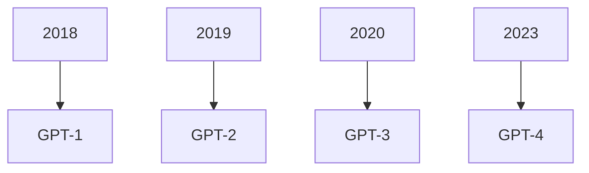
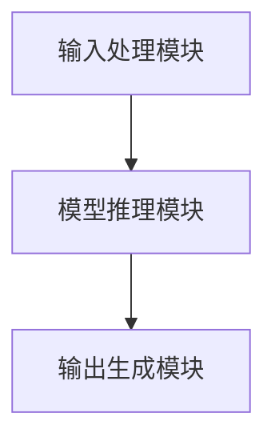
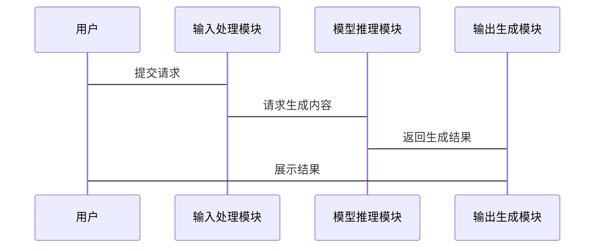

                 


# GPT系列模型：打造强大的生成式AI Agent

---

## 关键词：
生成式AI, GPT模型, 自然语言处理, 深度学习, AI Agent, 人工智能, 模型训练

---

## 摘要：
本文深入探讨了生成式AI的核心概念与GPT系列模型的技术细节，从算法原理到系统架构设计，再到实际项目实战，全面解析如何打造强大的生成式AI Agent。通过详细分析GPT系列模型的演进、数学基础、系统架构及应用场景，结合实际案例，为读者提供从理论到实践的全栈指南。

---

## 第一部分: GPT系列模型与生成式AI基础

### 第1章: 生成式AI与GPT模型概述

#### 1.1 生成式AI的定义与特点
##### 1.1.1 生成式AI的定义
生成式AI（Generative AI）是一种基于数据生成新内容的人工智能技术，通过学习现有数据的模式和规律，生成与训练数据相似的新数据。其核心目标是模拟人类的创造性思维。

##### 1.1.2 生成式AI的核心特点
| 特性 | 描述 |
|------|------|
| 自主性 | 能够独立生成内容，无需明确指令 |
| 多样性 | 可生成多种不同风格的内容 |
| 可扩展性 | 能够处理不同领域和任务的需求 |

##### 1.1.3 生成式AI与传统AI的区别
| 特性 | 生成式AI | 传统AI |
|------|---------|---------|
| 数据处理 | 基于概率生成新数据 | 基于规则处理现有数据 |
| 应用场景 | 创意生成、内容创作 | 分类、识别 |

#### 1.2 GPT系列模型的背景与发展
##### 1.2.1 GPT模型的起源
GPT（Generative Pre-trained Transformer）由OpenAI团队于2018年首次提出，基于Transformer架构，通过大规模预训练，成为生成式AI领域的里程碑。

##### 1.2.2 GPT系列模型的演进


##### 1.2.3 GPT系列模型的最新进展
GPT-4引入了多模态输入能力，支持图像、文本等多种输入形式，并显著提升了生成结果的质量和相关性。

#### 1.3 生成式AI的潜在应用领域
##### 1.3.1 自然语言处理
- 文本生成
- 机器翻译
- 情感分析

##### 1.3.2 人机交互
- 智能对话系统
- 语音助手
- 自动回复

##### 1.3.3 创意生成
- 文学创作
- 艺术生成
- 广告创意

##### 1.3.4 代码生成与自动化
- 自动编写代码
- 生成测试用例
- 系统优化建议

#### 1.4 GPT系列模型的核心优势
##### 1.4.1 大规模预训练的优势
GPT系列模型通过海量数据的预训练，掌握了语言的通用规律，具备强大的生成能力。

##### 1.4.2 多任务学习的能力
GPT系列模型能够同时处理多种任务，如文本生成、翻译、问答等，具备良好的通用性。

##### 1.4.3 模型的可扩展性
GPT系列模型通过模块化设计，能够轻松扩展到新的领域和任务。

#### 1.5 本章小结
本章介绍了生成式AI的基本概念和GPT系列模型的发展历程，强调了其在多个领域的广泛应用和核心优势。

---

## 第2章: GPT系列模型的算法原理

### 2.1 GPT模型的基本原理
#### 2.1.1 自回归语言模型
自回归模型通过逐步预测下一个词，生成完整的句子。其预测过程如下：

1. 输入初始序列。
2. 预测序列中的下一个词。
3. 将预测的词添加到序列中，重复上述步骤。

#### 2.1.2 概率预测机制
模型通过计算每个词的概率，选择概率最大的词作为生成结果。

公式：
$$ P(x_i | x_{i-1}, x_{i-2}, ..., x_1) $$

#### 2.1.3 解码器结构
解码器负责将输入序列转换为输出序列，主要由注意力机制和全连接层组成。

### 2.2 变体模型的改进
#### 2.2.1 GPT-2的改进
GPT-2通过引入更深的网络结构和更大的训练数据，提升了生成结果的质量。

#### 2.2.2 GPT-3的创新
GPT-3采用了更大的模型参数和多任务训练策略，具备更强的生成能力和理解能力。

#### 2.2.3 GPT-4的突破
GPT-4引入了多模态输入和更复杂的解码器结构，生成结果更加多样化和精准。

### 2.3 GPT系列模型的训练过程
#### 2.3.1 预训练目标
预训练目标是通过大量数据学习语言的规律和结构。

#### 2.3.2 优化策略
采用Adam优化器和学习率衰减策略，提升训练效率和模型性能。

#### 2.3.3 模型调优
通过微调和参数优化，进一步提升模型在特定任务上的性能。

### 2.4 本章小结
本章详细介绍了GPT系列模型的算法原理，包括自回归机制、概率预测和解码器结构，以及各版本的改进和训练策略。

---

## 第3章: GPT系列模型的数学基础

### 3.1 生成式AI的数学模型
#### 3.1.1 语言模型的数学表达
语言模型的目标是最大化条件概率：
$$ P(y|x) $$

#### 3.1.2 概率论基础
- 条件概率公式：
$$ P(A|B) = \frac{P(A \cap B)}{P(B)} $$

- 贝叶斯定理：
$$ P(A|B) = \frac{P(B|A)P(A)}{P(B)} $$

#### 3.1.3 深度学习的基本原理
深度学习通过多层非线性变换，提取数据的高层次特征。

### 3.2 GPT系列模型的数学公式
#### 3.2.1 概率预测公式
$$ P(y|x) = \prod_{i=1}^{n} P(y_i|y_{i-1}, y_{i-2}, ..., y_1) $$

#### 3.2.2 损失函数
交叉熵损失：
$$ \mathcal{L} = -\sum_{i=1}^{n} \log P(y_i|y_{i-1}, ..., y_1) $$

#### 3.2.3 梯度下降算法
采用Adam优化器进行参数更新：
$$ \theta_{t+1} = \theta_t - \eta \frac{\nabla \mathcal{L}}{\beta_1(1-\beta_1^t) + (1-\beta_2)(1-\beta_2^t)} $$

### 3.3 模型训练的数学细节
#### 3.3.1 参数优化
使用随机梯度下降（SGD）或Adam优化器更新模型参数。

#### 3.3.2 模型压缩
通过剪枝和量化技术减少模型参数，降低计算成本。

#### 3.3.3 模型并行与分布式训练
利用GPU并行计算和分布式训练框架加速模型训练。

### 3.4 本章小结
本章从数学角度详细解析了GPT系列模型的核心原理，包括概率模型、损失函数和优化算法。

---

## 第4章: GPT系列模型的系统架构设计

### 4.1 系统架构概述
#### 4.1.1 系统组成
系统主要包括输入处理模块、模型推理模块和输出生成模块。

#### 4.1.2 模块划分
- 输入处理模块：接收用户输入并进行预处理。
- 模型推理模块：加载预训练模型并进行生成。
- 输出生成模块：输出生成结果并进行格式化处理。

#### 4.1.3 架构选择
采用微服务架构，便于模块化开发和扩展。

### 4.2 系统功能设计
#### 4.2.1 输入处理与生成
- 支持多种输入格式，如文本、图像。
- 提供输入合法性检查功能。

#### 4.2.2 系统架构图


#### 4.2.3 系统交互图


### 4.3 系统架构的优化
#### 4.3.1 并行计算优化
利用多GPU并行加速模型推理过程。

#### 4.3.2 资源分配优化
根据负载动态调整资源分配，提高系统效率。

#### 4.3.3 系统性能监控
实时监控系统性能，及时发现和解决问题。

### 4.4 本章小结
本章详细介绍了GPT系列模型的系统架构设计，包括模块划分、系统交互和优化策略。

---

## 第5章: GPT系列模型的项目实战

### 5.1 环境安装与配置
#### 5.1.1 开发环境搭建
- 安装Python 3.8及以上版本。
- 安装必要的依赖库，如TensorFlow、Keras等。

#### 5.1.2 依赖库安装
```bash
pip install tensorflow keras numpy
```

#### 5.1.3 模型下载与加载
- 下载预训练的GPT模型权重。
- 加载模型并初始化参数。

### 5.2 系统核心实现
#### 5.2.1 模型加载与初始化
```python
import tensorflow as tf
from keras.models import load_model

model = load_model('gpt_model.h5')
```

#### 5.2.2 输入处理与生成
```python
def generate_output(prompt):
    input_ids = tokenizer.encode(prompt, add_special_tokens=True)
    input_ids = input_ids[:max_length]  # 截断处理
    outputs = model.generate(input_ids, max_length=max_length, temperature=0.7)
    return tokenizer.decode(outputs[0], skip_special_tokens=True)
```

#### 5.2.3 输出结果优化
- 添加后处理逻辑，提升生成结果的可读性和准确性。

### 5.3 代码应用解读
#### 5.3.1 核心代码分析
- `generate_output`函数：负责接收输入并生成输出。
- `tokenizer`：用于文本的编码和解码。

#### 5.3.2 代码实现细节
- 输入处理：对输入进行预处理和合法性检查。
- 模型推理：加载预训练模型并进行生成。
- 输出处理：对生成结果进行格式化和优化。

### 5.4 实际案例分析
#### 5.4.1 案例背景介绍
通过一个简单的对话系统案例，展示GPT模型的实际应用。

#### 5.4.2 案例实现过程
1. 用户输入查询。
2. 系统调用生成函数。
3. 输出生成结果。

#### 5.4.3 案例结果分析
分析生成结果的质量和效率，总结优化方向。

### 5.5 本章小结
本章通过实际项目实战，详细讲解了GPT系列模型的应用开发过程，从环境配置到代码实现，再到案例分析，帮助读者掌握生成式AI Agent的开发技巧。

---

## 第六部分: 总结与展望

### 第6章: 生成式AI Agent的未来发展方向

#### 6.1 生成式AI Agent的现状与挑战
- 模型性能的提升。
- 计算成本的优化。
- 应用场景的拓展。

#### 6.2 生成式AI Agent的未来趋势
- 多模态生成能力。
- 智能化水平提升。
- 预训练模型的规模扩大。

#### 6.3 生成式AI Agent的核心价值
通过强大的生成能力，为各个领域提供创新解决方案，推动人工智能技术的广泛应用。

#### 6.4 本章小结
本章总结了生成式AI Agent的现状和未来发展方向，强调了其在人工智能领域的巨大潜力。

---

## 第七部分: 最佳实践与注意事项

### 第7章: 生成式AI Agent开发中的注意事项

#### 7.1 开发过程中的常见问题
- 模型训练中的过拟合问题。
- 生成结果的质量控制。
- 计算资源的合理分配。

#### 7.2 开发中的最佳实践
- 合理选择模型参数。
- 定期监控系统性能。
- 建立完善的测试用例。

#### 7.3 生成式AI的伦理与安全
- 避免生成有害信息。
- 遵守数据使用规范。
- 保护用户隐私。

#### 7.4 本章小结
本章为生成式AI Agent的开发提供了实用的建议和注意事项，帮助开发者避免常见错误，提升开发效率。

---

## 第八部分: 总结与展望

### 第8章: GPT系列模型与生成式AI的未来发展

#### 8.1 GPT系列模型的核心价值
- 提升生成式AI的生成能力。
- 推动多领域应用的创新。

#### 8.2 生成式AI的未来趋势
- 多模态生成能力的增强。
- 智能化水平的提升。
- 预训练模型的规模扩大。

#### 8.3 GPT系列模型的技术创新
- 模型架构的优化。
- 训练方法的创新。
- 应用场景的拓展。

#### 8.4 本章小结
本章总结了GPT系列模型与生成式AI的未来发展方向，强调了技术创新和广泛应用的重要性。

---

## 第九部分: 拓展阅读与参考文献

### 第9章: 相关文献与推荐阅读

#### 9.1 经典文献
- [1] "Attention Is All You Need"（Transformer论文）
- [2] "GPT-3: Language Models at Your Fingertips"（GPT-3论文）

#### 9.2 推荐书籍
- 《Deep Learning》（Ian Goodfellow）
- 《Generative AI: A Transformative Technology for Business and Beyond》（世界经济论坛）

#### 9.3 在线资源
- OpenAI官方文档
- Hugging Face的Transformers库

#### 9.4 本章小结
本章为读者提供了丰富的拓展阅读资源，帮助进一步深入了解生成式AI和GPT系列模型的技术细节。

---

## 第十部分: 结语

### 第10章: 生成式AI Agent的未来发展与挑战

#### 10.1 生成式AI Agent的总结
生成式AI Agent通过强大的生成能力，为人类社会带来了前所未有的创新和效率提升。

#### 10.2 生成式AI Agent的未来挑战
- 技术瓶颈的突破。
- 应用场景的拓展。
- 伦理与安全问题的解决。

#### 10.3 生成式AI Agent的核心价值
通过智能化生成能力，推动社会进步和科技发展。

#### 10.4 本章小结
本章总结了生成式AI Agent的发展历程和未来挑战，强调了其在人工智能领域的重要地位。

---

# 结语

通过本文的详细讲解，读者可以全面了解GPT系列模型的技术细节和生成式AI Agent的开发过程。从算法原理到系统设计，再到实际应用，本文为读者提供了从理论到实践的全栈指南。希望本文能为生成式AI的研究和应用提供有价值的参考。

