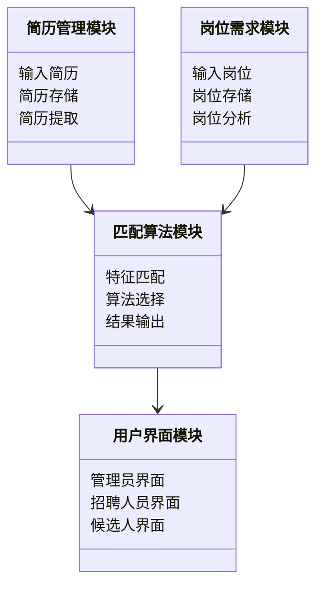

                 


# HR AI Agent：简历筛选与人才匹配

> 关键词：AI, 简历筛选, 人才匹配, 机器学习, 自然语言处理

> 摘要：随着人工智能技术的快速发展，AI在人力资源管理中的应用越来越广泛。本文将详细探讨HR AI Agent在简历筛选与人才匹配中的应用，分析其核心概念、算法原理、系统架构以及实际项目实现。通过结合理论与实践，本文旨在为HR从业者和技术开发者提供一份全面的指南，帮助他们更好地理解和应用AI技术来优化招聘流程。

---

# 第一部分: HR AI Agent概述

# 第1章: AI在人力资源管理中的应用背景

## 1.1 人力资源管理的数字化转型

### 1.1.1 传统人力资源管理的局限性

传统的人力资源管理流程依赖于人工操作，效率低下且容易出错。例如，招聘人员需要手动筛选大量简历，耗时且难以保证准确性。此外，不同招聘人员的主观判断可能导致岗位匹配不准确。

### 1.1.2 数字化转型的驱动力

企业对高效、精准招聘的需求不断增长，数字化转型成为必然趋势。AI技术的引入，特别是在简历筛选和人才匹配方面的应用，能够显著提升招聘效率和准确性。

### 1.1.3 AI技术在HR领域的应用潜力

AI技术可以通过自然语言处理（NLP）和机器学习算法，自动分析简历内容，提取关键信息，并根据岗位需求进行精准匹配。这种自动化流程能够大幅缩短招聘周期，降低企业成本。

## 1.2 简历筛选与人才匹配的痛点

### 1.2.1 简历筛选的低效性

招聘人员需要手动阅读大量简历，耗时且容易遗漏关键信息。此外，不同岗位的需求差异大，手动筛选难以实现精准匹配。

### 1.2.2 人才匹配的复杂性

每个岗位的需求不同，如何将合适的人才匹配到合适的岗位是招聘的核心挑战。传统的人才匹配方法难以应对复杂多变的岗位需求。

### 1.2.3 企业招聘成本与效率的平衡

企业希望通过降低招聘成本来提高效率，但传统招聘方式难以在成本和效率之间找到平衡点。

## 1.3 AI在简历筛选与人才匹配中的优势

### 1.3.1 提高筛选效率

AI技术可以快速分析大量简历，提取关键信息，并自动分类，显著提高简历筛选效率。

### 1.3.2 优化人才匹配精准度

通过机器学习算法，AI能够根据岗位需求和候选人能力进行精准匹配，降低招聘失败率。

### 1.3.3 降低招聘成本

自动化简历筛选和人才匹配流程可以减少人工干预，降低企业的招聘成本。

## 1.4 本章小结

本章介绍了AI在人力资源管理中的应用背景，分析了传统招聘流程的局限性以及数字化转型的必要性。同时，探讨了AI技术在简历筛选与人才匹配中的优势，为后续章节的深入分析奠定了基础。

---

# 第2章: 简历筛选与人才匹配的核心概念

## 2.1 简历筛选的关键要素

### 2.1.1 简历内容的特征提取

简历内容包括教育背景、工作经历、技能证书等。特征提取需要识别这些信息的关键点，例如关键词、时间、地点等。

### 2.1.2 简历关键词的识别

关键词识别是简历筛选的核心步骤，通过自然语言处理技术，可以提取与岗位需求相关的关键词，如技术技能、行业术语等。

### 2.1.3 简历结构的分析

简历的结构分析有助于理解信息的组织方式，例如教育背景在简历中的位置、工作经历的时间顺序等。

## 2.2 人才匹配的模型构建

### 2.2.1 岗位需求的分析

岗位需求分析需要明确岗位的关键职责、技能要求、工作经验等，以便为人才匹配提供依据。

### 2.2.2 人才能力的评估

通过简历分析和能力评估，可以量化候选人的技能水平，例如编程能力、项目管理能力等。

### 2.2.3 匹配算法的设计

匹配算法需要结合岗位需求和候选人能力，设计合理的评分机制，确保匹配结果的准确性。

## 2.3 AI在简历筛选与匹配中的技术原理

### 2.3.1 自然语言处理（NLP）技术

NLP技术用于简历文本的分析和理解，提取关键词、句法结构等信息。

### 2.3.2 机器学习算法

机器学习算法用于简历分类和人才匹配，例如逻辑回归、支持向量机（SVM）等。

### 2.3.3 数据挖掘与分析

通过数据挖掘技术，分析简历和岗位需求的关联性，优化匹配模型。

## 2.4 核心概念对比分析

### 2.4.1 不同简历筛选方法的对比

| 方法 | 优点 | 缺点 |
|------|------|------|
| 手工筛选 | 精准度高 | 耗时且效率低 |
| 基于关键词的筛选 | 快速高效 | 易受关键词误导 |
| 基于机器学习的筛选 | 高效精准 | 需要大量数据训练 |

### 2.4.2 不同人才匹配模型的优劣分析

| 模型 | 优点 | 缺点 |
|------|------|------|
| 基于规则的匹配 | 简单易实现 | 精准度低 |
| 基于机器学习的匹配 | 高精准度 | 需要大量数据支持 |
| 基于深度学习的匹配 | 能够处理复杂需求 | 实现复杂 |

## 2.5 本章小结

本章详细介绍了简历筛选和人才匹配的核心概念，分析了不同方法的优缺点，并为后续章节的算法实现奠定了理论基础。

---

# 第3章: 简历筛选的算法实现

## 3.1 简历关键词提取算法

### 3.1.1 基于TF-IDF的关键词提取

TF-IDF（Term Frequency-Inverse Document Frequency）是一种常用的关键词提取方法，公式如下：

$$TF-IDF = \frac{(\text{词项在文档中的频率}) \times \log(\frac{N}{\text{包含该词项的文档数}})}$$

### 3.1.2 基于深度学习的关键词提取

使用预训练的BERT模型进行关键词提取，代码如下：

```python
from transformers import BertTokenizer, BertModel

tokenizer = BertTokenizer.from_pretrained('bert-base-uncased')
model = BertModel.from_pretrained('bert-base-uncased')

def extract_keywords(text):
    inputs = tokenizer(text, return_tensors='np')
    outputs = model(**inputs)
    return tokenizer.decode(outputs.last_hidden_state[:,0,0].argmax())
```

### 3.1.3 算法实现的优缺点对比

| 方法 | 优点 | 缺点 |
|------|------|------|
| TF-IDF | 计算简单 | 易受数据稀疏性影响 |
| BERT | 高精准度 | 实现复杂，计算成本高 |

---

## 3.2 简历分类算法

### 3.2.1 基于逻辑回归的简历分类

逻辑回归是一种常用的分类算法，代码如下：

```python
from sklearn.linear_model import LogisticRegression
from sklearn.model_selection import train_test_split

X = [...]  # 特征向量
y = [...]  # 标签

X_train, X_test, y_train, y_test = train_test_split(X, y, test_size=0.2)

model = LogisticRegression()
model.fit(X_train, y_train)
print("Accuracy:", model.score(X_test, y_test))
```

### 3.2.2 基于SVM的简历分类

支持向量机（SVM）也是一种常用的分类算法，代码如下：

```python
from sklearn import svm

model = svm.SVC()
model.fit(X_train, y_train)
print("Accuracy:", model.score(X_test, y_test))
```

### 3.2.3 基于深度学习的简历分类

使用预训练的BERT模型进行分类，代码如下：

```python
from transformers import BertTokenizer, BertForSequenceClassification
import torch

tokenizer = BertTokenizer.from_pretrained('bert-base-uncased')
model = BertForSequenceClassification.from_pretrained('bert-base-uncased')

inputs = tokenizer(text, return_tensors='pt')
outputs = model(**inputs)
print(outputs.logits.argmax())
```

## 3.3 算法实现的数学模型

### 3.3.1 逻辑回归模型

逻辑回归的损失函数为：

$$L(\theta) = -\sum_{i=1}^{n} [y_i \cdot \log(h(x_i)) + (1 - y_i) \cdot \log(1 - h(x_i))]$$

其中，$$h(x_i) = \frac{1}{1 + e^{-\theta^T x_i}}$$

### 3.3.2 SVM模型

SVM的目标函数为：

$$\min_{\theta} \frac{1}{2} \|\theta\|^2 + C \sum_{i=1}^{n} \xi_i$$

约束条件为：

$$y_i (\theta^T x_i + b) \geq 1 - \xi_i$$

---

## 3.4 算法实现的优化建议

### 3.4.1 数据预处理

对简历数据进行清洗和归一化处理，确保数据质量。

### 3.4.2 模型调优

通过交叉验证和超参数调优，优化模型性能。

### 3.4.3 集成学习

使用集成学习方法，如随机森林、梯度提升树等，进一步提高分类准确率。

---

## 3.5 本章小结

本章详细介绍了简历筛选的算法实现，包括关键词提取和简历分类的多种方法，并分析了各自的优缺点。同时，给出了数学模型和代码实现，为后续章节的系统设计奠定了基础。

---

# 第4章: 简历筛选与人才匹配的系统架构设计

## 4.1 问题场景介绍

企业需要一个高效的简历筛选与人才匹配系统，能够自动处理大量简历，并根据岗位需求进行精准匹配。

## 4.2 系统功能设计

### 4.2.1 领域模型设计

使用Mermaid类图表示系统功能模块：



### 4.2.2 系统架构设计

使用Mermaid架构图表示系统架构：

```mermaid
divided
    高层模块
    中间层模块
    数据层模块
```

高层模块：用户界面模块，包括管理员界面、招聘人员界面和候选人界面。

中间层模块：简历管理模块、岗位需求模块、匹配算法模块。

数据层模块：简历数据库、岗位需求数据库。

---

## 4.3 系统接口设计

### 4.3.1 简历上传接口

```python
def upload_resume(resume_id, resume_content):
    # 实现简历上传逻辑
    pass
```

### 4.3.2 岗位需求接口

```python
def upload_job(job_id, job_requirement):
    # 实现岗位需求上传逻辑
    pass
```

### 4.3.3 匹配结果查询接口

```python
def get_matching_results(job_id):
    # 实现匹配结果查询逻辑
    pass
```

---

## 4.4 系统交互设计

使用Mermaid序列图表示系统交互流程：

```mermaid
sequenceDiagram
    管理员 -> 简历管理模块: 上传简历
    简历管理模块 -> 数据库: 存储简历
    招聘人员 -> 岗位需求模块: 上传岗位需求
    岗位需求模块 -> 数据库: 存储岗位需求
    招聘人员 -> 匹配算法模块: 开始匹配
    匹配算法模块 -> 简历管理模块: 获取简历数据
    匹配算法模块 -> 岗位需求模块: 获取岗位需求
    匹配算法模块 -> 用户界面模块: 返回匹配结果
    招聘人员 <- 用户界面模块: 显示匹配结果
```

---

## 4.5 本章小结

本章详细设计了简历筛选与人才匹配系统的架构，包括功能模块、系统架构、接口设计和系统交互流程，为后续章节的项目实现奠定了基础。

---

# 第5章: 项目实战——简历筛选与人才匹配系统实现

## 5.1 环境安装

安装所需的Python库：

```bash
pip install numpy scikit-learn transformers
```

---

## 5.2 系统核心实现

### 5.2.1 简历关键词提取

```python
from transformers import BertTokenizer, BertModel

tokenizer = BertTokenizer.from_pretrained('bert-base-uncased')
model = BertModel.from_pretrained('bert-base-uncased')

def extract_keywords(text):
    inputs = tokenizer(text, return_tensors='np')
    outputs = model(**inputs)
    return tokenizer.decode(outputs.last_hidden_state[:,0,0].argmax())
```

### 5.2.2 人才匹配算法实现

```python
from sklearn.linear_model import LogisticRegression
from sklearn.model_selection import train_test_split

X = [...]  # 特征向量
y = [...]  # 标签

X_train, X_test, y_train, y_test = train_test_split(X, y, test_size=0.2)

model = LogisticRegression()
model.fit(X_train, y_train)
print("Accuracy:", model.score(X_test, y_test))
```

### 5.2.3 系统集成与部署

将各模块集成到一个完整的系统中，部署到云服务器上，提供API接口供其他模块调用。

---

## 5.3 代码应用解读与分析

### 5.3.1 关键词提取代码解读

```python
from transformers import BertTokenizer, BertModel

tokenizer = BertTokenizer.from_pretrained('bert-base-uncased')
model = BertModel.from_pretrained('bert-base-uncased')

def extract_keywords(text):
    inputs = tokenizer(text, return_tensors='np')
    outputs = model(**inputs)
    return tokenizer.decode(outputs.last_hidden_state[:,0,0].argmax())
```

- `BertTokenizer`用于将文本转换为模型可接受的格式。
- `BertModel`用于提取文本的向量表示。
- `extract_keywords`函数返回与岗位需求最匹配的关键词。

### 5.3.2 人才匹配算法代码解读

```python
from sklearn.linear_model import LogisticRegression
from sklearn.model_selection import train_test_split

X = [...]  # 特征向量
y = [...]  # 标签

X_train, X_test, y_train, y_test = train_test_split(X, y, test_size=0.2)

model = LogisticRegression()
model.fit(X_train, y_train)
print("Accuracy:", model.score(X_test, y_test))
```

- `train_test_split`用于将数据集分为训练集和测试集。
- `LogisticRegression`用于训练分类模型。
- `model.score`用于评估模型的准确率。

---

## 5.4 实际案例分析

### 5.4.1 案例背景

某科技公司需要招聘Python开发工程师，岗位需求包括3年以上Python开发经验、熟悉Django框架、具备良好的问题解决能力。

### 5.4.2 数据准备

假设我们有以下简历数据：

| 候选人ID | 技能 | 工作经验 | 教育背景 |
|---------|------|----------|----------|
| 1       | Python, Django | 3年 | 计算机本科 |
| 2       | Python, Flask | 2年 | 计算机硕士 |
| 3       | Java, Python | 5年 | 计算机博士 |

### 5.4.3 匹配过程

1. 关键词提取：从岗位需求中提取关键词“Python”、“Django”、“3年”。
2. 简历筛选：筛选出包含“Python”且工作经验≥3年的候选人。
3. 人才匹配：根据匹配程度排序，候选人1最符合岗位需求。

---

## 5.5 项目小结

本章通过实际案例分析，详细展示了简历筛选与人才匹配系统的实现过程，包括环境安装、代码实现和案例分析。通过这些步骤，读者可以掌握如何将理论应用于实际项目中。

---

# 第6章: 最佳实践与未来展望

## 6.1 最佳实践

### 6.1.1 数据质量管理

确保简历数据和岗位需求数据的高质量，避免数据稀疏性和噪声干扰。

### 6.1.2 模型调优

通过交叉验证和超参数调优，优化模型性能，提高匹配准确率。

### 6.1.3 系统集成与部署

将各模块集成到一个完整的系统中，部署到云服务器上，提供API接口供其他模块调用。

## 6.2 小结

通过本章的内容，读者可以了解如何在实际项目中应用HR AI Agent技术，并掌握一些最佳实践。

## 6.3 注意事项

- 数据隐私保护：确保简历数据和岗位需求数据的安全性，避免数据泄露。
- 模型解释性：在实际应用中，模型的可解释性非常重要，尤其是在法律和合规方面。
- 持续优化：定期更新模型和数据，确保系统的持续优化和改进。

## 6.4 拓展阅读

- 《自然语言处理入门》：了解NLP技术在简历筛选中的应用。
- 《机器学习实战》：学习更多机器学习算法在人才匹配中的应用。

---

# 第7章: 总结与展望

## 7.1 总结

本文详细探讨了HR AI Agent在简历筛选与人才匹配中的应用，分析了其核心概念、算法原理、系统架构以及实际项目实现。通过理论与实践的结合，本文为HR从业者和技术开发者提供了一份全面的指南。

## 7.2 未来展望

随着AI技术的不断发展，HR AI Agent将在人力资源管理中发挥越来越重要的作用。未来的研究方向包括更复杂的匹配算法、更高效的数据处理方法以及更智能的系统架构设计。

---

# 结语

通过本文的学习，读者可以掌握HR AI Agent的核心技术，并将其应用到实际项目中，从而提升企业的招聘效率和精准度。

