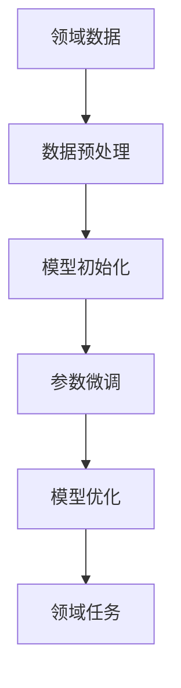
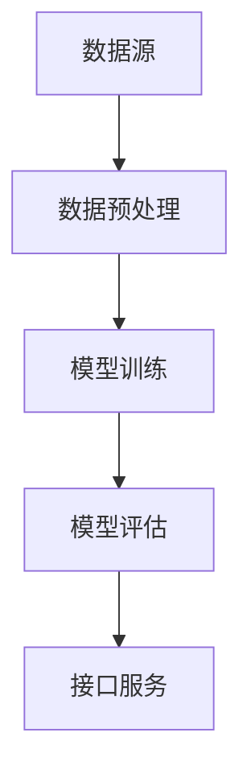

                 


# LLM Fine-Tuning 技巧：针对特定领域优化

> 关键词：LLM Fine-Tuning, Large Language Model, 人工智能, 自然语言处理, 优化技术, 特定领域, 微调技巧

> 摘要：本文深入探讨了如何对大型语言模型（LLM）进行微调，以适应特定领域的优化需求。通过系统化的分析和实践案例，结合理论与实践，详细阐述了微调技术的核心原理、算法流程、系统架构设计以及实际应用中的最佳实践，帮助读者掌握在特定领域中优化LLM的技巧。

---

## 第1章: 问题背景与概念介绍

### 1.1 问题背景
#### 1.1.1 大型语言模型的发展现状
- 近年来，大型语言模型（如GPT、BERT等）在自然语言处理领域取得了突破性进展，但这些模型通常是通用模型，难以直接满足特定领域的需求。
- 随着应用场景的多样化，对领域特定优化的需求日益增加。

#### 1.1.2 微调技术的必要性
- 通用模型在特定领域中可能表现不佳，需要通过微调技术提升领域适应性。
- 微调技术可以在不改变模型整体架构的前提下，针对性地优化模型性能。

#### 1.1.3 特定领域优化的核心价值
- 提高模型在特定领域的准确性和实用性。
- 降低开发成本，避免从头训练大型模型。

### 1.2 问题描述
#### 1.2.1 通用模型的局限性
- 数据覆盖范围广，但缺乏领域特定知识。
- 在特定任务中可能出现偏差或不准确。

#### 1.2.2 领域特定需求的多样性
- 不同领域（如医疗、法律、金融等）对语言模型的需求差异显著。
- 需要针对特定任务（如文本分类、问答系统）进行优化。

#### 1.2.3 微调技术如何解决这些问题
- 通过微调技术，可以在保持模型核心能力的同时，增强其在特定领域的表现。
- 微调技术可以通过参数调整，使模型更好地适应领域需求。

---

## 第2章: 核心概念与原理

### 2.1 微调技术的核心原理
#### 2.1.1 参数微调的基本概念
- 微调技术通过调整模型的权重参数，使模型适应特定领域。
- 参数微调通常采用小批量数据进行训练，避免破坏模型的全局性能。

#### 2.1.2 知识蒸馏的原理
- 知识蒸馏通过将教师模型的知识迁移到学生模型，实现模型压缩和优化。
- 在特定领域中，知识蒸馏可以结合领域数据，提升模型的适应性。

#### 2.1.3 分层优化的机制
- 分层优化通过逐步调整模型的不同层次，实现领域特定的优化。
- 分层优化可以在保持模型全局性能的同时，增强领域相关性。

### 2.2 核心概念对比表
| **技术**         | **描述**                                                                 |
|-------------------|--------------------------------------------------------------------------|
| 参数微调          | 通过调整模型权重参数，使模型适应特定领域。                                 |
| 知识蒸馏          | 将教师模型的知识迁移到学生模型，实现模型压缩和优化。                         |
| 分层优化          | 逐步调整模型的不同层次，增强领域相关性。                                   |

### 2.3 系统架构图


---

## 第3章: 微调技术的算法原理

### 3.1 微调算法流程
#### 3.1.1 数据预处理
- 数据清洗：去除噪声数据，确保数据质量。
- 数据增强：通过数据扩展技术（如同义词替换）增强数据多样性。

#### 3.1.2 模型初始化
- 使用预训练模型作为基础，加载其权重参数。
- 根据特定领域需求，调整模型的输出层。

#### 3.1.3 参数微调
- 使用特定领域数据训练模型，更新权重参数。
- 采用小批量梯度下降算法优化模型。

#### 3.1.4 模型评估
- 通过验证集评估模型性能。
- 根据评估结果调整训练参数。

### 3.2 微调的数学模型
- 损失函数：
$$ L = -\sum_{i=1}^{n} y_i \log p(y_i|x_i) $$
- 优化目标：
$$ \theta = \arg \min L $$
- 参数更新：
$$ \theta_{new} = \theta_{old} - \eta \cdot \nabla L $$

---

## 第4章: 系统分析与架构设计

### 4.1 系统功能模块
#### 4.1.1 数据处理模块
- 数据预处理：清洗和增强数据。
- 数据分块：将数据划分为训练集、验证集和测试集。

#### 4.1.2 模型训练模块
- 模型初始化：加载预训练模型权重。
- 参数微调：使用特定领域数据训练模型。

#### 4.1.3 模型评估模块
- 模型评估：通过验证集评估模型性能。
- 参数调优：根据评估结果调整训练参数。

#### 4.1.4 接口服务模块
- 接口定义：提供API接口供其他系统调用。
- 服务部署：将优化后的模型部署到实际应用中。

### 4.2 系统架构图


---

## 第5章: 项目实战与案例分析

### 5.1 环境搭建
#### 5.1.1 安装依赖
- 安装Python、TensorFlow或PyTorch等深度学习框架。
- 安装必要的数据处理库（如Pandas、NumPy）。

#### 5.1.2 配置环境变量
- 设置GPU支持（如NVIDIA GPU驱动和CUDA环境）。
- 配置深度学习框架的路径。

### 5.2 核心代码实现
#### 5.2.1 数据预处理代码
```python
import pandas as pd
from sklearn.model_selection import train_test_split

# 数据加载
data = pd.read_csv('data.csv')

# 数据分块
train_data, test_data = train_test_split(data, test_size=0.2)
train_data, val_data = train_test_split(train_data, test_size=0.2)
```

#### 5.2.2 模型训练代码
```python
import tensorflow as tf
from tensorflow.keras import layers

# 模型初始化
model = tf.keras.models.load_model('pretrained_model.h5')

# 参数微调
model.compile(optimizer=tf.keras.optimizers.Adam(lr=1e-5),
              loss='sparse_categorical_crossentropy',
              metrics=['accuracy'])

# 训练过程
history = model.fit(train_data, train_labels, epochs=5, validation_data=(val_data, val_labels))
```

#### 5.2.3 模型评估代码
```python
# 模型评估
loss, accuracy = model.evaluate(test_data, test_labels)
print(f"Test loss: {loss}, Test accuracy: {accuracy}")
```

### 5.3 实际案例分析
#### 5.3.1 案例背景
- 领域选择：医疗领域。
- 任务目标：优化医疗文本分类模型。

#### 5.3.2 数据准备
- 数据来源：医疗领域的文本数据集。
- 数据预处理：清洗、分词、标签标注。

#### 5.3.3 训练过程
- 使用特定领域的医疗数据对模型进行微调。
- 监控训练过程中的损失函数和准确率变化。

#### 5.3.4 结果分析
- 模型在特定任务中的准确率显著提高。
- 模型在通用任务中的性能保持稳定。

---

## 第6章: 最佳实践与注意事项

### 6.1 微调技术的优化建议
#### 6.1.1 数据选择的策略
- 数据质量：选择高质量、标注准确的数据。
- 数据多样性：确保数据涵盖领域内的各种场景。

#### 6.1.2 模型选择的建议
- 根据任务需求选择合适的模型架构。
- 在资源有限的情况下，选择轻量级模型。

#### 6.1.3 训练参数的调优
- 学习率：通常采用较小的学习率（如1e-5）。
- 训练轮数：根据模型收敛情况调整。

### 6.2 实践中的注意事项
#### 6.2.1 数据泄漏问题
- 避免验证集数据泄露到训练集。
- 使用交叉验证技术确保模型泛化能力。

#### 6.2.2 模型过拟合风险
- 通过正则化技术（如Dropout）防止过拟合。
- 使用早停技术监控训练过程。

#### 6.2.3 计算资源的分配
- 根据模型规模和数据量选择合适的硬件配置。
- 使用分布式训练技术提高训练效率。

---

## 第7章: 总结与展望

### 7.1 本章小结
#### 7.1.1 微调技术的核心要点
- 参数微调：通过调整模型参数使模型适应特定领域。
- 知识蒸馏：通过教师模型的知识迁移优化模型性能。

#### 7.1.2 实践中的关键经验
- 数据选择和预处理是微调成功的关键。
- 模型调优需要结合领域知识和实验验证。

#### 7.1.3 未来发展的趋势
- 微调技术将更加智能化，自动化的参数调整和优化。
- 领域特定模型将更加专业化，针对特定任务设计优化方案。

### 7.2 未来展望
#### 7.2.1 微调技术的改进方向
- 开发更加高效的微调算法，降低计算成本。
- 研究更加灵活的微调策略，适应多样化的领域需求。

#### 7.2.2 领域特定模型的发展潜力
- 针对特定领域设计更加高效的模型架构。
- 开发领域特定的知识库和训练数据集。

#### 7.2.3 与其他技术的结合前景
- 微调技术与强化学习的结合，提升模型的交互能力。
- 微调技术与多模态学习的结合，扩展模型的应用场景。

---

## 第8章: 拓展阅读与资源推荐

### 8.1 相关论文推荐
- "Attention Is All You Need"（论文链接）。
- "BERT: Pre-training of Deep Bidirectional Transformers for Language Understanding"（论文链接）。
- "Fine-tuning Pre-trained Text Encoders for Text Classification"（论文链接）。

### 8.2 技术博客与开源项目
- Hugging Face官方文档（链接）。
- TensorFlow官方文档（链接）。
- PyTorch官方文档（链接）。

---

**结语**：通过本文的系统化分析和实践案例，读者可以深入理解LLM微调技术的核心原理和实际应用。无论是从理论学习还是实践操作，都可以通过本文获得宝贵的经验和启示。希望本文能为读者在特定领域优化LLM的过程中提供有力的支持和指导。

