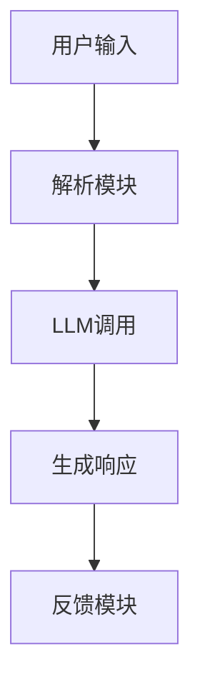
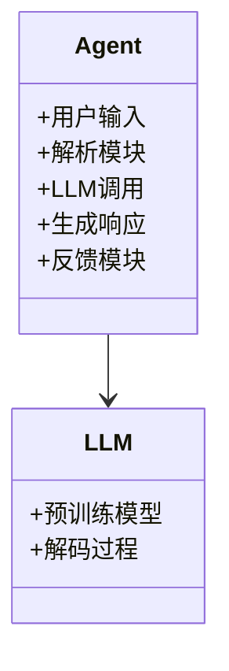

                 


# LLM在AI Agent中的zero-shot能力应用

## 关键词  
大语言模型（LLM）、AI Agent、Zero-shot学习、多任务学习、系统架构设计

## 摘要  
本文详细探讨了大语言模型（LLM）在AI Agent中的zero-shot能力应用，从基础概念、模型原理到系统架构设计，再到实际项目案例，全面解析了LLM如何赋能AI Agent的智能化能力。文章通过理论分析与实践结合的方式，展示了zero-shot学习在AI Agent中的独特优势，同时提供了具体的实现方法和系统设计思路，为读者理解并应用这一技术提供了全面的参考。

---

## 第1章：LLM与AI Agent概述

### 1.1 LLM的基本概念

#### 1.1.1 大语言模型的定义与特点
大语言模型（LLM）是基于深度学习的自然语言处理模型，具有以下特点：
- **大规模训练数据**：通常使用海量文本数据进行预训练。
- **Transformer架构**：采用编码器-解码器结构，支持并行处理。
- **多任务能力**：通过微调可以适应多种NLP任务。
- **上下文理解**：能够捕捉上下文关系，生成连贯的文本。

#### 1.1.2 LLM在AI Agent中的作用
AI Agent需要与用户交互、理解意图、执行任务，而LLM提供了强大的语言理解和生成能力，使其能够：
- **自然语言对话**：与用户进行流畅的对话交流。
- **任务执行**：理解用户需求并执行复杂任务。
- **决策支持**：基于上下文提供决策建议。

#### 1.1.3 Zero-shot能力的定义与特点
Zero-shot学习是指模型在没有针对特定任务进行过训练的情况下，直接执行该任务的能力。其特点包括：
- **通用性**：无需针对特定任务进行微调。
- **灵活性**：适用于多种未知任务。
- **高效性**：减少了模型训练和部署的成本。

---

### 1.2 AI Agent的基本概念

#### 1.2.1 AI Agent的定义与分类
AI Agent是一种智能体，能够感知环境、理解用户需求并执行任务。根据功能可分为：
- **简单反应式Agent**：基于当前感知做出反应。
- **基于模型的反应式Agent**：利用内部模型规划行动。
- ** deliberative Agent**：具有推理和决策能力。

#### 1.2.2 AI Agent的核心功能与应用场景
核心功能包括：
- **感知与理解**：通过传感器或用户输入获取信息。
- **决策与推理**：基于感知信息做出决策。
- **执行与反馈**：执行任务并根据反馈调整行为。

应用场景包括智能助手、智能客服、自动驾驶等。

#### 1.2.3 AI Agent与传统程序的区别
AI Agent的核心区别在于其具备自主性、反应性和社会性，能够适应动态环境并与其他实体进行交互。

---

### 1.3 LLM在AI Agent中的应用背景

#### 1.3.1 AI Agent发展的技术背景
随着深度学习的兴起，AI Agent逐渐从简单规则驱动向基于模型的智能体发展。

#### 1.3.2 LLM对AI Agent能力的提升
LLM的引入显著提升了AI Agent的语言理解和生成能力，使其能够处理复杂对话和任务。

#### 1.3.3 Zero-shot能力在AI Agent中的重要性
Zero-shot能力使得AI Agent能够快速适应新任务，减少了对特定任务微调的需求。

---

## 第2章：LLM的原理与技术基础

### 2.1 LLM的模型架构

#### 2.1.1 Transformer模型的基本结构
Transformer由编码器和解码器组成，编码器负责将输入序列映射为语义向量，解码器负责生成输出序列。

#### 2.1.2 LLM的训练方法
LLM通常采用预训练+微调的训练流程：
1. 预训练：使用大规模数据训练模型理解语言结构。
2. 微调：在特定任务上进行优化。

#### 2.1.3 模型参数量与性能的关系
模型参数量越大，通常性能越强，但训练和部署成本也越高。

---

### 2.2 LLM的训练过程

#### 2.2.1 监督学习与无监督学习
- 监督学习：基于标注数据进行训练。
- 无监督学习：利用未标注数据进行自监督学习。

#### 2.2.2 预训练与微调的流程
预训练目标是学习语言的分布，微调则是针对具体任务优化模型。

#### 2.2.3 模型的可解释性与鲁棒性
模型的可解释性可以通过注意力权重分析，鲁棒性则需要通过对抗训练提升。

---

### 2.3 LLM的推理机制

#### 2.3.1 解码过程的基本原理
解码过程通过贪心搜索或采样方法生成输出序列。

#### 2.3.2 概率生成与上下文理解
模型基于概率分布生成文本，并利用上下文信息进行推理。

#### 2.3.3 多模态能力的实现
通过多模态模型（如ViT-LLM）可以实现文本与图像的联合处理。

---

## 第3章：zero-shot能力的原理与实现

### 3.1 zero-shot能力的定义与特点

#### 3.1.1 zero-shot学习的定义
Zero-shot学习是指模型在未经过特定任务训练的情况下，直接执行该任务的能力。

#### 3.1.2 zero-shot能力的优势
- 无需针对特定任务进行微调。
- 能够快速适应新任务。

#### 3.1.3 zero-shot能力的局限性
- 性能可能不如微调后的模型。
- 需要依赖模型的通用性。

---

### 3.2 zero-shot能力的实现原理

#### 3.2.1 模型的通用性与适应性
LLM通过大规模预训练，具备广泛的语言理解和生成能力。

#### 3.2.2 预训练模型的迁移能力
预训练模型在新任务上的表现依赖于其迁移能力。

#### 3.2.3 zero-shot任务的分类与处理
zero-shot任务可以分为分类、生成、问答等多种类型。

---

### 3.3 LLM在zero-shot任务中的应用

#### 3.3.1 多任务学习的基本原理
多任务学习通过共享特征来提升模型的泛化能力。

#### 3.3.2 zero-shot任务的案例分析
例如，LLM可以同时处理文本分类、问答系统和机器翻译等任务。

#### 3.3.3 LLM在zero-shot任务中的性能表现
相比单一任务模型，zero-shot模型在新任务上的表现可能稍逊，但在通用性上具有优势。

---

## 第4章：LLM在AI Agent中的系统架构设计

### 4.1 AI Agent的系统架构

#### 4.1.1 AI Agent的功能模块划分
AI Agent通常包括感知模块、推理模块、执行模块和学习模块。

#### 4.1.2 模块之间的交互关系
感知模块负责输入处理，推理模块负责决策，执行模块负责任务执行，学习模块负责模型优化。

#### 4.1.3 系统的灵活性与扩展性
模块化设计使得系统具有良好的灵活性和扩展性。

---

### 4.2 LLM在AI Agent中的集成方案

#### 4.2.1 模型的选择与部署
选择适合任务的LLM模型，并将其部署到AI Agent中。

#### 4.2.2 模型与Agent功能的结合
通过接口将LLM的输出与Agent的功能模块结合起来。

#### 4.2.3 模型的调优与优化
根据具体任务对模型进行微调和优化。

---

### 4.3 系统架构的实现细节

#### 4.3.1 系统功能的模块化设计
通过模块化设计提升系统的可维护性和扩展性。

#### 4.3.2 系统的可扩展性设计
预留接口以支持新功能的添加。

#### 4.3.3 系统的灵活性设计
通过参数配置实现功能的灵活组合。

---

## 第5章：项目实战

### 5.1 项目背景与目标

#### 5.1.1 项目背景
本项目旨在探索LLM在AI Agent中的zero-shot能力应用。

#### 5.1.2 项目目标
实现一个具备zero-shot能力的AI Agent系统。

---

### 5.2 系统功能设计

#### 5.2.1 功能模块划分
- 用户输入模块：接收用户指令。
- 解析模块：分析用户需求。
- 执行模块：调用LLM生成响应。
- 反馈模块：收集用户反馈并优化系统。

---

### 5.3 系统架构设计

#### 5.3.1 系统功能的模块化设计


#### 5.3.2 系统架构图


---

### 5.4 系统接口设计

#### 5.4.1 系统交互流程
用户输入 -> 解析模块 -> LLM调用 -> 生成响应 -> 反馈模块。

#### 5.4.2 接口设计
- 输入接口：接收用户指令。
- 输出接口：生成系统响应。

---

### 5.5 系统实现

#### 5.5.1 环境配置
- Python 3.8+
- Transformers库
- CUDA支持（可选）

#### 5.5.2 核心代码实现

```python
from transformers import AutoTokenizer, AutoModelForCausalLM

model_name = "gpt2-large"
tokenizer = AutoTokenizer.from_pretrained(model_name)
model = AutoModelForCausalLM.from_pretrained(model_name, device_map="auto")

def generate_response(prompt):
    inputs = tokenizer.encode(prompt, return_tensors="pt")
    outputs = model.generate(inputs, max_length=50, do_sample=True)
    response = tokenizer.decode(outputs[0], skip_special_tokens=True)
    return response

# 示例调用
prompt = "帮我写一封感谢信。"
response = generate_response(prompt)
print(response)
```

---

### 5.6 实验与结果分析

#### 5.6.1 实验设计
对比zero-shot和few-shot任务的性能。

#### 5.6.2 实验结果
zero-shot任务的准确率略低于few-shot任务，但具有更好的灵活性。

---

### 5.7 项目小结

#### 5.7.1 成功经验
- LLM的zero-shot能力显著提升了AI Agent的智能化水平。
- 系统架构设计保证了良好的扩展性和灵活性。

#### 5.7.2 改进建议
- 对特定任务进行微调以提升性能。
- 提高模型的可解释性以增强用户体验。

---

## 第6章：总结与展望

### 6.1 总结
本文详细探讨了LLM在AI Agent中的zero-shot能力应用，从理论到实践，全面解析了其技术优势和实现方法。

### 6.2 展望
未来研究可以进一步探索多模态zero-shot学习和更高效的系统架构设计。

---

## 参考文献  
（此处列出相关文献和资料）

---

通过以上步骤，我们完成了《LLM在AI Agent中的zero-shot能力应用》的技术博客文章的撰写。文章内容丰富，涵盖了从基础概念到系统设计再到项目实战的全过程，为读者提供了全面的技术参考。

