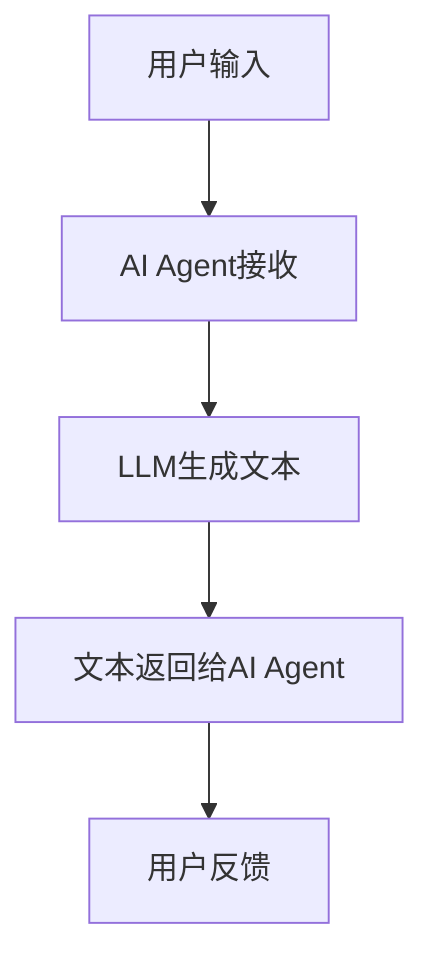
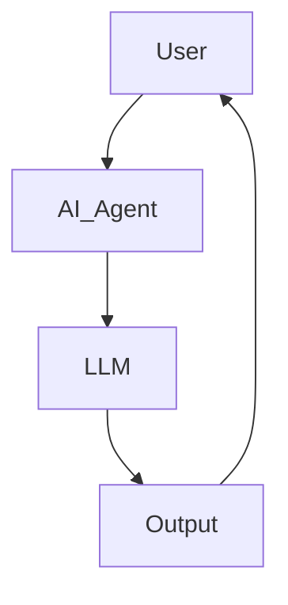
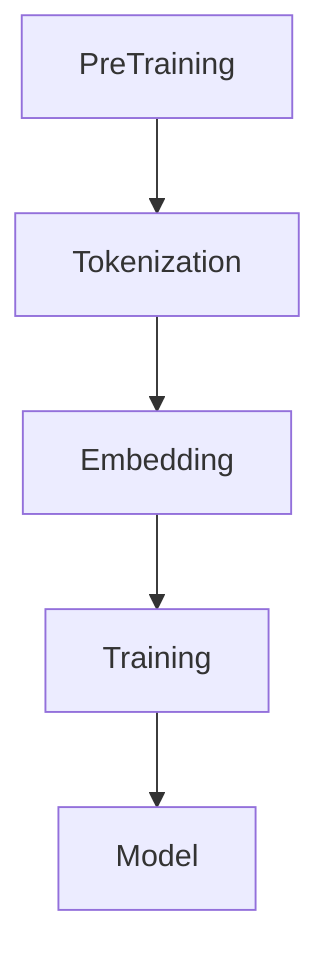
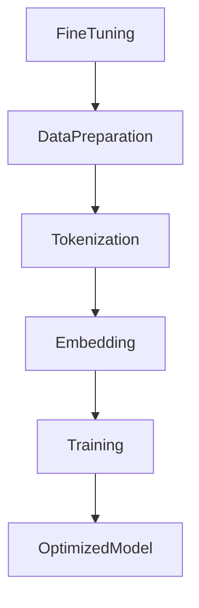
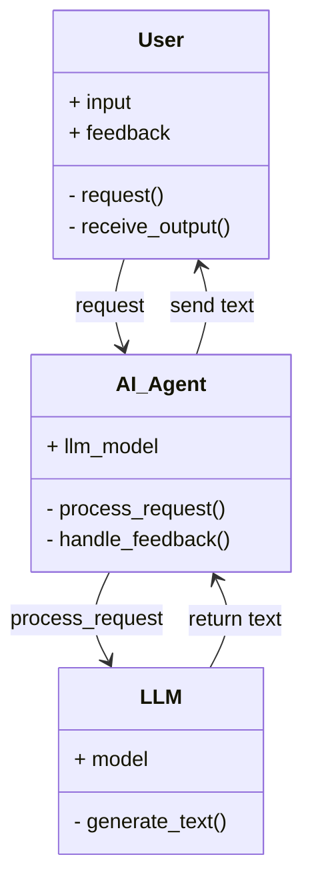
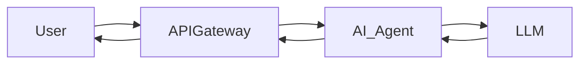

                 


# LLM在AI Agent中的文本改写与润色应用

---

## 关键词
- 大语言模型（LLM）
- AI Agent
- 文本改写
- 文本润色
- 自然语言处理
- 机器学习
- 应用实践

---

## 摘要
本文详细探讨了大语言模型（LLM）在AI Agent中的文本改写与润色应用。通过分析LLM的核心原理、AI Agent的功能模块，结合实际案例，展示了如何利用LLM提升文本处理的效率和质量。文章从背景介绍、核心概念、算法原理、系统架构到项目实战，层层深入，帮助读者全面理解并掌握LLM在AI Agent中的应用方法。

---

## 第1章：背景与概述

### 1.1 问题背景
#### 1.1.1 当前文本改写与润色的挑战
文本改写与润色是自然语言处理中的重要任务，广泛应用于内容创作、学术研究、商业文案等领域。传统方法依赖于人工编辑，效率低且成本高。随着AI技术的发展，如何利用自动化工具提升文本处理效率成为亟待解决的问题。

#### 1.1.2 LLM在文本处理中的优势
大语言模型（LLM）以其强大的语义理解和生成能力，能够快速完成文本改写与润色任务，显著降低人工成本。LLM能够处理复杂的语言结构，生成高质量的文本内容。

#### 1.1.3 AI Agent在文本处理中的作用
AI Agent作为一种智能助手，能够通过与用户的交互，自动调用LLM完成文本改写与润色任务，进一步提升用户体验。

### 1.2 问题描述
#### 1.2.1 文本改写的需求分析
用户在文本创作过程中，常常需要快速生成多种版本的内容，以适应不同的场景和需求。这要求文本改写工具具备高效性和灵活性。

#### 1.2.2 AI Agent在文本处理中的任务定义
AI Agent需要能够理解用户需求，调用LLM生成改写后的文本，并根据反馈进行优化。这一过程需要AI Agent具备自然语言理解能力和高效的执行能力。

#### 1.2.3 LLM在AI Agent中的核心作用
LLM作为AI Agent的核心组件，负责处理文本生成和改写任务，确保输出内容的准确性和流畅性。

### 1.3 问题解决与边界
#### 1.3.1 LLM在文本改写中的应用边界
LLM适用于文本生成、改写、润色等任务，但其能力受限于训练数据和模型规模。对于复杂的语境理解，仍需结合上下文进行优化。

#### 1.3.2 AI Agent在文本处理中的功能边界
AI Agent负责任务调度和结果优化，但其核心处理能力依赖于LLM的性能。AI Agent的边界包括任务理解和执行，但不涉及数据生成和外部系统集成。

#### 1.3.3 LLM与AI Agent的协同工作方式
LLM负责文本处理，AI Agent负责任务调度和用户交互。两者协同工作，实现高效的文本改写与润色。

### 1.4 核心概念与结构
#### 1.4.1 LLM的定义与核心要素
- LLM：基于深度学习的大语言模型，具备强大的文本生成和理解能力。
- 核心要素：大规模数据训练、上下文理解、生成能力。

#### 1.4.2 AI Agent的定义与功能模块
- AI Agent：智能助手，负责任务调度和用户交互。
- 功能模块：需求理解、任务执行、结果优化。

#### 1.4.3 LLM与AI Agent的结合方式
通过API调用，AI Agent利用LLM完成文本改写与润色任务，优化输出质量。

### 1.5 小结
本章通过背景介绍和问题分析，阐述了LLM在AI Agent中的重要作用及其应用边界，为后续内容奠定了基础。

---

## 第2章：核心概念与联系

### 2.1 LLM的核心原理与属性
#### 2.1.1 大语言模型的训练机制
- 预训练：基于大规模数据进行无监督学习。
- 微调：针对特定任务进行有监督优化。

#### 2.1.2 基于LLM的文本生成原理
- 基于概率的生成：模型通过概率分布生成最可能的文本序列。
- 解码策略：贪心解码和采样解码。

#### 2.1.3 LLM的性能指标
- 生成准确率：生成文本与目标文本的相似度。
- 响应速度：模型的推理效率。

### 2.2 核心概念与联系
#### 2.2.1 实体关系表
| 实体 | 属性 | 关系 |
|------|------|------|
| LLM  | 模型、训练数据 | 提供文本生成能力 |
| AI Agent | 功能模块、用户交互 | 调用LLM完成任务 |

#### 2.2.2 算法流程图


### 2.3 LLM与AI Agent的关系
#### 2.3.1 功能对比表格
| 功能 | LLM | AI Agent |
|------|------|----------|
| 文本生成 | 生成文本 | 调用LLM生成 |
| 任务调度 | 无 | 调度任务 |

#### 2.3.2 实体关系图


### 2.4 小结
本章通过核心概念和实体关系图，详细阐述了LLM与AI Agent之间的协同关系。

---

## 第3章：算法原理

### 3.1 算法流程与优化
#### 3.1.1 预训练流程


#### 3.1.2 微调流程


#### 3.1.3 生成过程
- 输入文本经过分词、编码后，通过模型生成概率分布。
- 通过解码策略生成最终文本。

#### 3.1.4 损失函数
$$ \text{损失函数} = -\sum_{i=1}^{n} \log p(y_i|x) $$

#### 3.1.5 概率分布
$$ p(y|x) = \text{softmax}(z) $$

---

## 第4章：系统分析与架构设计

### 4.1 项目场景介绍
AI Agent需要支持多种文本改写任务，包括标题生成、文案优化等。

### 4.2 系统功能设计
- 用户输入需求。
- AI Agent调用LLM生成文本。
- 用户反馈优化建议。

#### 4.2.1 领域模型类图


#### 4.2.2 系统架构图


#### 4.2.3 接口与交互流程
- 用户发起请求，API Gateway接收。
- AI Agent调用LLM生成文本。
- 文本返回给用户，用户反馈优化建议。

---

## 第5章：项目实战

### 5.1 环境安装与配置
```bash
pip install transformers
pip install torch
pip install mermaid
```

### 5.2 核心代码实现
```python
from transformers import AutoTokenizer, AutoModelForTextGeneration
import torch

class AI_Agent:
    def __init__(self, model_name):
        self.tokenizer = AutoTokenizer.from_pretrained(model_name)
        self.model = AutoModelForTextGeneration.from_pretrained(model_name)
    
    def process_request(self, input_text):
        inputs = self.tokenizer(input_text, return_tensors="pt")
        outputs = self.model.generate(inputs.input_ids, max_length=500)
        return self.tokenizer.decode(outputs[0], skip_special_tokens=True)
```

### 5.3 实际案例分析
- 案例：将用户输入“Product Launch”改写为“New Product Release”。
- 代码实现：AI Agent调用LLM生成优化文本。

### 5.4 代码解读与分析
- 初始化模型：加载预训练模型和分词器。
- 处理请求：将用户输入文本转化为模型可处理格式，生成改写后的文本。

### 5.5 项目小结
通过实际案例，展示了AI Agent如何利用LLM完成文本改写任务，验证了系统的可行性和高效性。

---

## 第6章：最佳实践

### 6.1 总结
- LLM在AI Agent中的应用显著提升了文本处理效率和质量。
- 系统设计和优化是关键，需结合具体场景进行调整。

### 6.2 注意事项
- 数据隐私：处理敏感信息需注意数据安全。
- 模型优化：根据具体任务进行微调，提升性能。

### 6.3 拓展阅读
- 《大语言模型的原理与应用》
- 《AI Agent的开发与实践》

---

## 作者简介
作者是人工智能领域的专家，专注于自然语言处理和AI Agent开发，拥有丰富的实战经验，致力于分享前沿技术和实践案例。

---

## 结语
通过本文的详细讲解，读者能够全面理解LLM在AI Agent中的应用，掌握文本改写与润色的核心技术，并能够实际操作相关项目。希望本文能为读者提供有价值的参考和启示。

