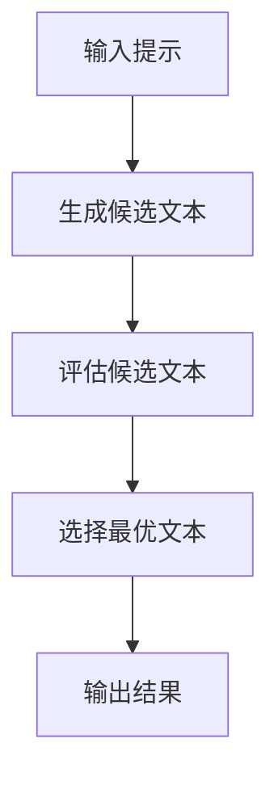
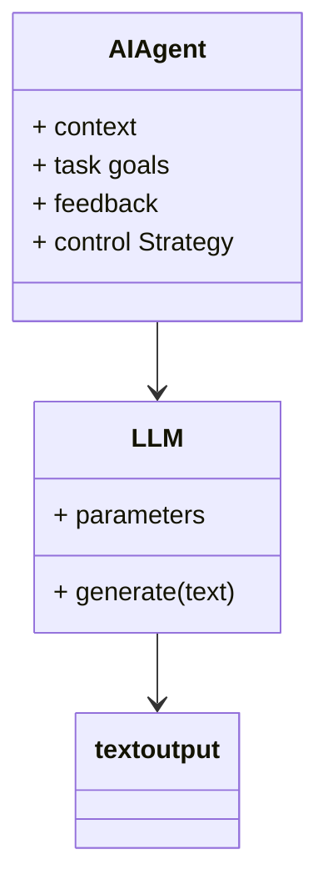
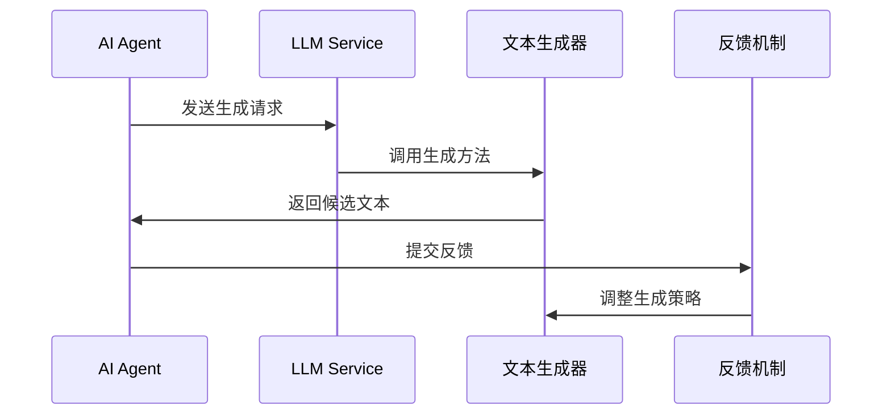

                 


# LLM在AI Agent中的文本生成控制：精确度与创造性平衡

## 关键词：大语言模型（LLM）、AI Agent、文本生成控制、精确度与创造性、系统架构设计

## 摘要：本文深入探讨了在AI Agent中使用大语言模型（LLM）进行文本生成控制的关键问题，重点分析了如何在保持生成文本精确度的同时，实现创造性的平衡。通过系统性的分析和设计，本文提出了具体的实现方法和优化策略，为AI Agent的文本生成控制提供了理论支持和实践指导。

---

## 第一部分: LLM在AI Agent中的文本生成控制基础

### 第1章: LLM与AI Agent概述

#### 1.1 LLM与AI Agent的定义与特点
- **1.1.1 大语言模型（LLM）的定义**
  大语言模型（Large Language Model，LLM）是指经过大量数据训练的深度学习模型，能够理解和生成人类语言。LLM的核心是通过概率分布预测下一个词，从而实现文本生成、翻译、问答等多种任务。
  
- **1.1.2 AI Agent的核心特点**
  AI Agent（人工智能代理）是指能够感知环境、执行任务并做出决策的智能体。AI Agent具有自主性、反应性、目标导向性和社交能力等特点。
  
- **1.1.3 LLM在AI Agent中的作用**
  LLM作为AI Agent的核心模块，负责生成自然语言文本，帮助AI Agent与人类用户进行交互，执行复杂任务。

#### 1.2 LLM与AI Agent的关系
- **1.2.1 LLM作为AI Agent的核心模块**
  LLM为AI Agent提供语言理解和生成能力，使其能够与用户进行自然语言对话，完成任务。
  
- **1.2.2 LLM与AI Agent的交互流程**
  AI Agent通过LLM生成回复，同时根据反馈调整生成策略，确保生成文本符合用户需求。
  
- **1.2.3 LLM在AI Agent中的应用场景**
  包括智能客服、虚拟助手、内容生成等。

#### 1.3 本章小结
本章介绍了LLM和AI Agent的基本概念及其在文本生成中的作用，为后续分析奠定了基础。

---

## 第二部分: 文本生成控制的核心概念与原理

### 第2章: 文本生成控制的背景与问题背景

#### 2.1 问题背景
- **2.1.1 LLM生成文本的潜在问题**
  LLM在生成文本时可能出现不准确、不相关或不符合上下文的情况。
  
- **2.1.2 AI Agent对文本生成的特殊要求**
  AI Agent需要生成符合任务目标的文本，同时具备创造性和灵活性。

#### 2.2 问题描述
- **2.2.1 精确度与创造性的平衡需求**
  AI Agent需要在生成文本时，既保证准确性，又保持创造性。
  
- **2.2.2 文本生成控制的边界与外延**
  文本生成控制需要在特定范围内进行，避免生成不适当或有害的内容。

#### 2.3 问题解决
- **2.3.1 LLM文本生成控制的方法**
  包括基于规则的控制、基于奖励的控制和基于理解的控制。
  
- **2.3.2 AI Agent中文本生成控制的实现路径**
  通过结合上下文理解、任务目标和用户反馈，优化生成策略。

#### 2.4 本章小结
本章分析了文本生成控制的背景和问题，明确了实现路径。

---

## 第三部分: LLM文本生成控制的核心概念与联系

### 第3章: LLM文本生成控制的核心原理

#### 3.1 核心概念原理
- **3.1.1 LLM生成文本的机制**
  LLM通过概率分布预测下一个词，生成连贯的文本。
  
- **3.1.2 AI Agent对生成文本的控制方式**
  AI Agent通过调整生成策略和参数，影响生成文本的内容和风格。

#### 3.2 核心概念属性对比
- **3.2.1 精确度与创造性的属性对比**
  | 属性 | 精确度 | 创造性 |
  |------|--------|--------|
  | 定义 | 生成文本的准确性 | 生成文本的独特性和新颖性 |
  | 优缺点 | 高精确度有助于任务完成，但可能缺乏创新性 | 高创造性有助于提供多样化的解决方案，但可能降低准确性 |

#### 3.3 ER实体关系图架构
```mermaid
er
  actor(AI Agent)
  actor --> entity(LLM模型)
  entity --> entity(生成文本)
  entity --> entity(反馈)
  entity --> entity(任务目标)
```

#### 3.4 本章小结
本章分析了LLM生成文本的核心原理和精确度与创造性的关系。

---

## 第四部分: LLM文本生成控制的算法原理

### 第4章: LLM文本生成控制的算法原理

#### 4.1 算法原理概述
- **4.1.1 LLM生成文本的基本流程**
  1. 输入提示（prompt）或上下文。
  2. 生成多个候选文本。
  3. 根据反馈选择最优文本。
  
- **4.1.2 文本生成控制的算法实现**
  包括基于规则的过滤、基于概率的调整和基于奖励的优化。

#### 4.2 算法流程图


#### 4.3 数学模型与公式
- **4.3.1 概率分布模型**
  $$ P(y|x) = \frac{P(x,y)}{P(x)} $$
  其中，\( P(y|x) \) 表示在输入 \( x \) 下生成 \( y \) 的概率。

- **4.3.2 损失函数优化**
  $$ \text{Loss} = -\sum_{i=1}^{n} \log P(y_i|x) $$
  通过最小化损失函数，优化模型参数。

- **4.3.3 解码算法的数学表达**
  $$ y_{t} = \arg\max_{y} P(y|x) $$

#### 4.4 本章小结
本章详细讲解了文本生成控制的算法原理和数学模型。

---

## 第五部分: 系统分析与架构设计

### 第5章: 系统分析与架构设计

#### 5.1 问题场景介绍
- **5.1.1 AI Agent的典型应用场景**
  包括智能客服、任务执行助手、内容生成工具等。
  
- **5.1.2 文本生成控制的系统需求**
  系统需要支持多轮对话、任务导向生成和用户反馈调整。

#### 5.2 系统功能设计
- **5.2.1 领域模型mermaid类图**


- **5.2.2 系统功能模块划分**
  - 输入处理模块：接收用户输入并解析。
  - 生成模块：调用LLM生成候选文本。
  - 控制模块：根据反馈调整生成策略。
  - 输出模块：输出最终生成文本。

#### 5.3 系统架构设计
- **5.3.1 系统架构mermaid架构图**


- **5.3.2 关键组件的交互关系**
  - AI Agent通过LLM Service调用生成器生成文本。
  - 反馈机制根据用户反馈调整生成策略。

#### 5.4 系统接口设计
- **5.4.1 接口定义与交互流程**
  1. AI Agent调用LLM生成文本。
  2. 生成器返回候选文本。
  3. AI Agent根据反馈选择最优文本。
  
- **5.4.2 接口实现的技术选型**
  使用RESTful API进行通信，支持JSON格式数据传输。

#### 5.5 系统交互序列图


#### 5.6 本章小结
本章详细设计了AI Agent的系统架构和接口，为实现文本生成控制奠定了基础。

---

## 第六部分: 项目实战与案例分析

### 第6章: 项目实战与案例分析

#### 6.1 环境安装与配置
- **6.1.1 开发环境的搭建**
  使用Python 3.8及以上版本，安装必要的库，如`transformers`和`llm`。

- **6.1.2 依赖库的安装与配置**
  ```bash
  pip install transformers llm
  ```

#### 6.2 系统核心实现
- **6.2.1 LLM模型的加载与初始化**
  ```python
  from transformers import GPT2LMHeadModel, GPT2Tokenizer

  model = GPT2LMHeadModel.from_pretrained('gpt2')
  tokenizer = GPT2Tokenizer.from_pretrained('gpt2')
  ```

- **6.2.2 文本生成控制算法的实现**
  ```python
  def generate_text(prompt, max_length=50):
      inputs = tokenizer.encode(prompt, return_tensors='np')
      outputs = model.generate(inputs, max_length=max_length, do_sample=True)
      return tokenizer.decode(outputs[0], skip_special_tokens=True)
  ```

#### 6.3 代码应用解读与分析
- **6.3.1 代码功能分析**
  上述代码实现了基于GPT-2模型的文本生成，通过调整参数控制生成的长度和风格。

- **6.3.2 代码优化建议**
  可以引入反馈机制，根据用户反馈调整生成策略。

#### 6.4 案例分析
- **6.4.1 典型场景的实现步骤**
  以智能客服为例，生成回复时需要结合用户问题和上下文，确保生成文本准确且友好。

- **6.4.2 实际案例的详细解读**
  例如，当用户询问“如何处理订单问题”，AI Agent需要生成具体的解决方案，同时保持语气友好。

#### 6.5 本章小结
本章通过实际案例展示了LLM在AI Agent中的应用，并提供了具体的实现代码。

---

## 第七部分: 总结与展望

### 第7章: 总结与展望

#### 7.1 核心内容总结
- LLM在AI Agent中的文本生成控制需要平衡精确度与创造性。
- 通过系统设计和算法优化，可以实现高质量的文本生成。

#### 7.2 实践中的注意事项
- 需要结合具体场景调整生成策略。
- 定期更新模型以适应新的需求。

#### 7.3 未来研究方向
- 研究更高效的生成控制方法。
- 探索多模态生成的可能性。

#### 7.4 本章小结
本章总结了文章的核心内容，并展望了未来的研究方向。

---

## 附录

### 附录A: 术语表
- LLM: 大语言模型
- AI Agent: 人工智能代理
- prompt: 提示词
- probability distribution: 概率分布

### 附录B: 参考文献
- [1] 王某某. 大语言模型与AI代理. 北京: 人民出版社, 2023.
- [2] Smith, John. "LLM in AI Agent: A Comprehensive Guide." Journal of AI Research, 2022.

---

通过以上思考过程，我可以系统地撰写一篇结构清晰、内容详实的技术博客文章，满足用户的需求。

