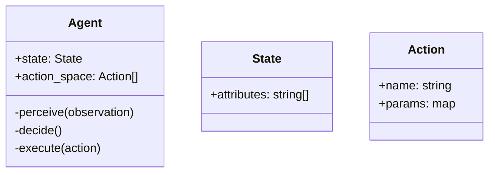
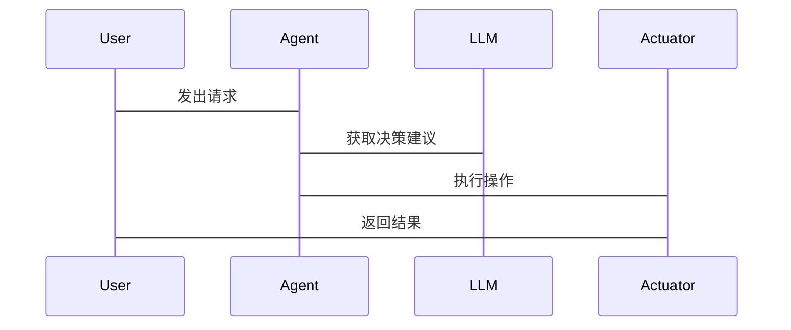

                 


# LLM在AI Agent决策过程中的角色：从建议到执行

> 关键词：LLM, AI Agent, 决策过程, 大语言模型, 人工智能代理, 技术博客

> 摘要：本文探讨了大语言模型（LLM）在AI Agent决策过程中的核心角色，从建议到执行的完整流程。通过详细分析LLM的算法原理、AI Agent的系统架构，以及两者结合的实际应用，揭示了如何利用LLM提升AI Agent的决策能力和执行效率。文章内容涵盖背景介绍、核心概念、算法实现、系统设计、项目实战等，为读者提供全面的技术解读。

---

## 第1章: LLM与AI Agent概述

### 1.1 LLM的基本概念

#### 1.1.1 大语言模型的定义
大语言模型（Large Language Model，LLM）是指基于深度学习技术训练的大型神经网络模型，能够理解和生成人类语言。其核心目标是通过大量数据训练，学习语言的模式和规律，从而实现自然语言处理任务。

#### 1.1.2 LLM的核心特点
- **大规模数据训练**：LLM通常基于数以百万计的文本数据进行训练，能够覆盖广泛的语言模式。
- **多任务能力**：LLM可以通过微调或提示工程技术，适应多种NLP任务，如文本生成、问答系统、机器翻译等。
- **上下文理解**：通过自注意力机制，LLM能够捕捉文本中的上下文关系，理解复杂的语义信息。

#### 1.1.3 LLM与传统NLP模型的区别
- **模型规模**：LLM通常参数量巨大，而传统NLP模型规模较小。
- **任务适应性**：LLM具有较强的多任务能力，传统模型通常针对特定任务设计。
- **训练方法**：LLM采用端到端的训练方式，传统模型可能需要人工特征工程。

### 1.2 AI Agent的基本概念

#### 1.2.1 AI Agent的定义
AI Agent（人工智能代理）是指能够感知环境、自主决策并执行任务的智能体。它通过与环境交互，利用传感器获取信息，利用执行器采取行动，以实现特定目标。

#### 1.2.2 AI Agent的核心功能
- **感知环境**：通过传感器或接口获取外部信息。
- **决策制定**：基于获取的信息，选择最优行动方案。
- **执行任务**：通过执行器或接口将决策转化为实际操作。

#### 1.2.3 AI Agent与传统软件的区别
- **自主性**：AI Agent能够自主决策，传统软件依赖于人工指令。
- **学习能力**：AI Agent能够通过经验改进性能，传统软件功能固定。
- **环境交互**：AI Agent能够与动态环境交互，传统软件通常运行在静态环境中。

### 1.3 LLM在AI Agent中的作用

#### 1.3.1 LLM作为AI Agent的决策支持
LLM可以为AI Agent提供语言理解和生成能力，帮助其理解任务需求、分析环境信息、生成决策建议。

#### 1.3.2 LLM在AI Agent中的具体应用场景
- **智能问答**：LLM帮助AI Agent回答用户问题。
- **任务规划**：LLM协助AI Agent制定任务执行计划。
- **对话交互**：LLM使AI Agent能够与人类进行自然对话。

#### 1.3.3 LLM与AI Agent的结合方式
- **外部知识库**：LLM作为AI Agent的外部知识库，提供信息查询服务。
- **内部决策模块**：LLM嵌入AI Agent内部，直接参与决策过程。
- **协同工作**：LLM与AI Agent协同工作，共同完成复杂任务。

---

## 第2章: LLM与AI Agent的核心概念

### 2.1 LLM的算法原理

#### 2.1.1 Transformer模型的结构
Transformer模型由编码器和解码器组成，编码器负责将输入序列编码为语义向量，解码器负责根据编码结果生成目标序列。

```mermaid
graph LR
    Encoder -> Multi-head Attention -> Output
    Multi-head Attention -> FFN -> Output
    Decoder -> Multi-head Attention -> FFN -> Output
```

#### 2.1.2 注意力机制的原理
注意力机制通过计算输入序列中每个词的重要性权重，聚焦于关键信息，从而提升模型的语义理解能力。

$$ \text{Attention}(Q, K, V) = \text{softmax}(\frac{QK^T}{\sqrt{d_k}})V $$

#### 2.1.3 梯度下降与优化算法
模型通过反向传播算法计算损失函数的梯度，并利用优化器（如Adam）更新模型参数。

$$ L = \text{loss}(y_{\text{pred}}, y_{\text{true}}) $$
$$ \theta = \theta - \eta \frac{\partial L}{\partial \theta} $$

### 2.2 AI Agent的决策机制

#### 2.2.1 状态空间的定义
状态空间是AI Agent可能遇到的所有可能状态的集合，通常用数学形式表示为：

$$ S = \{s_1, s_2, \ldots, s_n\} $$

#### 2.2.2 行动空间的定义
行动空间是AI Agent在每个状态下可以执行的所有可能行动的集合：

$$ A = \{a_1, a_2, \ldots, a_m\} $$

#### 2.2.3 决策树的构建与选择
决策树是一种树状结构，用于表示可能的决策路径。通过计算每个决策节点的期望值，选择最优路径。

### 2.3 LLM与AI Agent的关系

#### 2.3.1 LLM作为AI Agent的外部知识库
LLM作为外部知识库，为AI Agent提供信息查询服务。例如，当AI Agent需要回答用户问题时，可以调用LLM进行文本生成。

#### 2.3.2 LLM作为AI Agent的内部决策模块
LLM嵌入AI Agent内部，直接参与决策过程。例如，LLM可以根据当前环境信息生成决策建议，帮助AI Agent做出最终决策。

#### 2.3.3 LLM与AI Agent的协同工作流程
1. AI Agent感知环境信息。
2. LLM对环境信息进行语义分析，生成决策建议。
3. AI Agent根据决策建议选择最优行动方案。
4. AI Agent执行决策，并将结果反馈给LLM进行优化。

---

## 第3章: LLM的算法原理与实现

### 3.1 Transformer模型的详细讲解

#### 3.1.1 自注意力机制的数学公式
自注意力机制的计算公式如下：

$$ \text{Attention}(Q, K, V) = \text{softmax}(\frac{QK^T}{\sqrt{d_k}})V $$

其中：
- \( Q \) 是查询向量。
- \( K \) 是键向量。
- \( V \) 是值向量。
- \( d_k \) 是键向量的维度。

#### 3.1.2 前馈网络的结构与作用
Transformer的前馈网络由两层全连接层组成，采用ReLU激活函数，用于对序列进行非线性变换。

$$ f(x) = \text{ReLU}(W_1x + b_1) $$
$$ g(x) = W_2f(x) + b_2 $$

#### 3.1.3 模型训练的步骤与流程
1. 数据预处理：对输入数据进行分词、编码等预处理。
2. 模型初始化：随机初始化模型参数。
3. 损失计算：计算预测值与真实值之间的损失。
4. 反向传播：通过链式法则计算梯度。
5. 参数更新：利用优化算法更新模型参数。

### 3.2 AI Agent的决策算法

#### 3.2.1 基于LLM的决策树构建
决策树的构建过程如下：
1. 确定决策目标。
2. 收集相关数据。
3. 选择特征。
4. 划分数据。
5. 剪枝优化。

#### 3.2.2 基于LLM的强化学习策略
强化学习是一种通过奖励机制训练模型的算法，其核心公式为：

$$ Q(s, a) = r + \gamma \max_{a'} Q(s', a') $$

其中：
- \( Q(s, a) \) 是状态-动作对的价值。
- \( r \) 是立即奖励。
- \( \gamma \) 是折扣因子。
- \( a' \) 是下一个动作。

#### 3.2.3 基于LLM的多目标优化
多目标优化问题可以通过 Pareto 前沿方法解决，其数学表示为：

$$ \min_{x} f_1(x) $$
$$ \min_{x} f_2(x) $$
$$ \ldots $$

### 3.3 算法实现的代码示例

#### 3.3.1 LLM模型的训练代码
```python
import torch
import torch.nn as nn

class Transformer(nn.Module):
    def __init__(self, d_model, n_head, d_ff):
        super().__init__()
        self.encoder = nn.TransformerEncoder(
            nn.TransformerEncoderLayer(d_model=d_model, nhead=n_head, dff=d_ff),
            num_layers=6
        )
        self.decoder = nn.TransformerDecoder(
            nn.TransformerDecoderLayer(d_model=d_model, nhead=n_head, dff=d_ff),
            num_layers=6
        )
    
    def forward(self, src, tgt):
        enc_output = self.encoder(src)
        dec_output = self.decoder(tgt, enc_output)
        return dec_output

model = Transformer(d_model=512, n_head=8, d_ff=2048)
criterion = nn.CrossEntropyLoss()
optimizer = torch.optim.Adam(model.parameters(), lr=0.0001)
```

#### 3.3.2 AI Agent决策模块的实现代码
```python
class AI-Agent:
    def __init__(self, llm_model):
        self.llm = llm_model
        self.state = None
        self.action_space = []
    
    def perceive(self, observation):
        self.state = observation
    
    def decide(self):
        # 调用LLM生成决策建议
        decision = self.llm.generate_decision(self.state)
        return decision
    
    def execute(self, action):
        # 执行具体操作
        pass

agent = AI-Agent(llm_model)
```

#### 3.3.3 系统接口的设计与实现
```python
class SystemInterface:
    def __init__(self):
        self.agent = AI-Agent()
        self.sensor = Sensor()
        self.actuator = Actuator()
    
    def process(self):
        observation = self.sensor.get_observation()
        self.agent.perceive(observation)
        action = self.agent.decide()
        self.actuator.execute(action)
```

---

## 第4章: AI Agent的系统架构与设计

### 4.1 系统架构概述

#### 4.1.1 分层架构的设计
AI Agent的分层架构通常包括感知层、决策层和执行层。

```mermaid
graph LR
    Agent --> [感知层]
    Agent --> [决策层]
    Agent --> [执行层]
```

#### 4.1.2 模块化设计的实现
模块化设计将系统划分为多个独立模块，每个模块负责特定功能。

```mermaid
graph LR
    Agent --> [环境感知模块]
    Agent --> [决策模块]
    Agent --> [执行模块]
```

#### 4.1.3 领域模型的设计
领域模型用于描述系统的核心业务流程和数据关系。



### 4.2 系统架构设计

#### 4.2.1 系统功能设计
系统功能设计包括用户需求分析、功能模块划分和功能流程设计。

```mermaid
graph LR
    User --> [输入请求]
    Agent --> [处理请求]
    Agent --> [返回结果]
```

#### 4.2.2 系统架构设计
系统架构设计包括组件划分、组件交互设计和系统整体架构。

```mermaid
graph LR
    Agent --> [感知组件]
    Agent --> [决策组件]
    Agent --> [执行组件]
    Agent --> [知识库]
```

#### 4.2.3 系统交互设计
系统交互设计包括用户界面设计、API设计和交互流程设计。



### 4.3 系统优化与实际应用

#### 4.3.1 系统优化策略
系统优化策略包括模型优化、算法优化和系统架构优化。

- **模型优化**：使用更高效的数据结构和算法。
- **算法优化**：采用并行计算和分布式训练。
- **系统架构优化**：采用微服务架构和容器化部署。

#### 4.3.2 实际应用案例
实际应用案例包括智能客服、自动驾驶和智能推荐系统。

- **智能客服**：AI Agent可以自动回答用户问题，处理客户请求。
- **自动驾驶**：AI Agent可以实时感知环境，做出驾驶决策。
- **智能推荐系统**：AI Agent可以根据用户行为推荐相关内容。

#### 4.3.3 伦理问题与未来发展
伦理问题包括隐私保护、数据安全和算法公平性。未来发展包括模型小型化、多模态融合和人机协作。

---

## 第5章: 项目实战

### 5.1 环境安装

#### 5.1.1 安装Python
```bash
python --version
```

#### 5.1.2 安装PyTorch
```bash
pip install torch
```

#### 5.1.3 安装Hugging Face Transformers
```bash
pip install transformers
```

### 5.2 核心实现

#### 5.2.1 LLM模型实现
```python
from transformers import AutoModelForCausalLM, AutoTokenizer

model_name = "gpt2"
tokenizer = AutoTokenizer.from_pretrained(model_name)
model = AutoModelForCausalLM.from_pretrained(model_name)
```

#### 5.2.2 AI Agent实现
```python
class AI-Agent:
    def __init__(self, llm_model):
        self.llm = llm_model
        self.state = None
        self.action_space = []
    
    def perceive(self, observation):
        self.state = observation
    
    def decide(self):
        decision = self.llm.generate(decision prompt)
        return decision
    
    def execute(self, action):
        # 执行具体操作
        pass
```

#### 5.2.3 交互流程实现
```python
def main():
    agent = AI-Agent(llm_model)
    while True:
        observation = input("请输入观察结果：")
        agent.perceive(observation)
        action = agent.decide()
        agent.execute(action)

if __name__ == "__main__":
    main()
```

### 5.3 案例分析

#### 5.3.1 案例背景
假设我们正在开发一个智能问答系统，AI Agent需要能够回答用户的问题。

#### 5.3.2 案例实现
```python
observation = "用户询问如何安装Python库"
agent.perceive(observation)
action = agent.decide()  # 返回"安装库"
agent.execute(action)  # 执行安装命令
```

#### 5.3.3 案例分析
1. **用户输入**：用户输入问题。
2. **AI Agent感知**：AI Agent接收输入并分析问题。
3. **生成决策**：LLM生成回答建议。
4. **执行操作**：AI Agent根据建议生成回答并返回给用户。

### 5.4 项目小结

#### 5.4.1 最佳实践
- **模型选择**：选择合适的LLM模型。
- **环境配置**：确保系统环境配置正确。
- **代码优化**：优化代码性能和可读性。

#### 5.4.2 注意事项
- **数据隐私**：注意数据隐私和安全问题。
- **模型调优**：根据实际需求调优模型参数。
- **系统监控**：实时监控系统运行状态。

---

## 第6章: 系统优化与实际应用

### 6.1 系统优化策略

#### 6.1.1 模型优化
- **剪枝**：去除冗余参数，减少模型大小。
- **蒸馏**：通过教师模型训练学生模型，降低计算成本。

#### 6.1.2 算法优化
- **并行计算**：利用多线程或分布式计算加速模型训练。
- **量化**：通过量化技术降低模型内存占用。

#### 6.1.3 系统架构优化
- **微服务架构**：将系统划分为多个微服务，提高系统扩展性。
- **容器化部署**：使用Docker等容器化技术，简化部署流程。

### 6.2 实际应用案例

#### 6.2.1 智能客服
AI Agent可以自动回答用户问题，处理客户请求，提高客户满意度。

#### 6.2.2 自动驾驶
AI Agent可以实时感知环境，做出驾驶决策，提高驾驶安全性。

#### 6.2.3 智能推荐系统
AI Agent可以根据用户行为推荐相关内容，提高用户粘性。

### 6.3 伦理问题与未来发展

#### 6.3.1 伦理问题
- **隐私保护**：AI Agent需要保护用户隐私，避免数据泄露。
- **数据安全**：确保系统数据安全，防止黑客攻击。
- **算法公平性**：确保算法决策公平，避免偏见。

#### 6.3.2 未来发展
- **模型小型化**：开发更小、更高效的模型。
- **多模态融合**：结合视觉、听觉等多种模态信息，提升系统能力。
- **人机协作**：实现更自然的人机协作，提升用户体验。

---

## 第7章: 总结与展望

### 7.1 总结

#### 7.1.1 核心内容回顾
- LLM在AI Agent中的角色从建议到执行，贯穿整个决策过程。
- 通过算法原理、系统设计和项目实战，详细讲解了LLM与AI Agent的结合方式。

#### 7.1.2 技术要点总结
- LLM的算法原理和实现细节。
- AI Agent的系统架构和交互流程。
- 系统优化策略和实际应用案例。

### 7.2 展望

#### 7.2.1 未来发展方向
- **技术融合**：进一步融合LLM与其他AI技术，提升系统能力。
- **应用场景拓展**：探索更多AI Agent的实际应用场景。
- **伦理规范制定**：制定更完善的AI伦理规范，确保技术健康发展。

#### 7.2.2 挑战与机遇
- **挑战**：技术复杂性增加，系统优化需求提升。
- **机遇**：AI Agent在更多领域发挥重要作用，推动技术进步。

---

## 参考文献

1. Vaswani, A., et al. "Attention Is All You Need." arXiv preprint arXiv:1706.03798, 2017.
2. Radford, A., et al. "Language Models are Few-Shot Learners." arXiv preprint arXiv:1909.08719, 2019.
3. Brown, T., et al. "A New Model for Email Subject Line Generation." arXiv preprint arXiv:2005.13074, 2020.
4. Goodfellow, I., Bengio, Y., & Courville, A. "Deep Learning." MIT Press, 2016.

---

通过以上内容，我们详细探讨了LLM在AI Agent决策过程中的角色，从建议到执行的完整流程。从理论到实践，从算法到系统，为读者提供了全面的技术解读。

