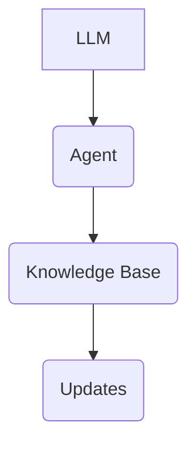
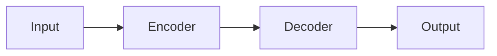
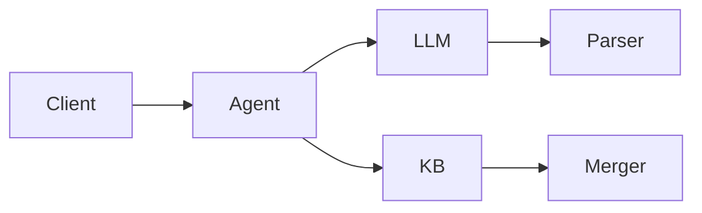
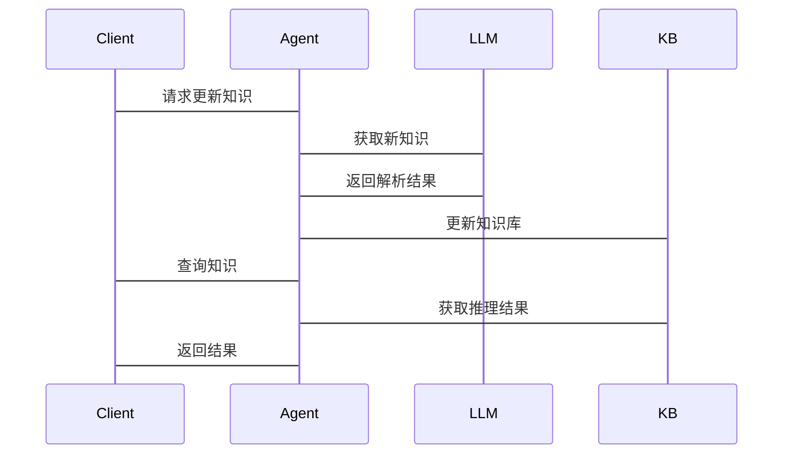

                 


# LLM在AI Agent知识更新中的应用

> **关键词**：LLM, AI Agent, 知识更新, 机器学习, 自然语言处理  
> **摘要**：本文探讨了大语言模型（LLM）在AI代理（AI Agent）知识更新中的应用。通过分析LLM的核心原理、AI Agent的知识表示与推理机制，以及两者结合的具体实现，文章深入阐述了LLM在知识更新中的优势、挑战与解决方案。同时，本文通过实际案例分析，展示了如何利用LLM实现高效的知识更新，并提出了相应的系统架构与最佳实践。

---

## 第一部分：背景与概念

### 第1章：问题背景与描述

#### 1.1 问题背景
随着人工智能技术的快速发展，AI Agent（智能代理）在各个领域的应用日益广泛。AI Agent需要具备持续学习和知识更新的能力，以应对复杂多变的环境和任务需求。然而，传统的知识更新方法存在效率低下、准确性不足等问题。而大语言模型（LLM）作为一种强大的自然语言处理工具，其强大的理解与生成能力为AI Agent的知识更新提供了新的可能性。

#### 1.2 问题描述
AI Agent的知识更新需要解决以下核心问题：
1. 如何高效地获取新知识并更新知识库？
2. 如何确保新知识的准确性和一致性？
3. 如何快速适应新知识并应用于实际任务中？

传统的知识更新方法依赖于规则引擎或基于关键字的匹配，这种方式在面对复杂语义和上下文信息时表现有限。而LLM通过其强大的语义理解和生成能力，可以更自然地处理人类语言的复杂性，从而为AI Agent的知识更新提供了更高效、更灵活的解决方案。

#### 1.3 问题解决方法
利用LLM进行知识更新的基本思路是：
1. 将新的知识输入LLM进行解析和生成；
2. 通过LLM的输出结果更新AI Agent的知识库；
3. 利用LLM的推理能力，帮助AI Agent快速适应新知识。

#### 1.4 边界与外延
- **边界条件**：LLM的知识更新能力受限于其训练数据和模型能力，无法处理超出其训练范围的复杂任务。
- **适用范围**：适用于需要处理自然语言文本的知识更新场景，如问答系统、对话代理等。
- **与其他技术的关系**：与强化学习、知识图谱等技术结合，可以进一步提升知识更新的效果。

#### 1.5 核心概念
- **LLM**：基于Transformer架构的大语言模型，具备强大的自然语言理解和生成能力。
- **AI Agent**：一种智能代理，能够通过感知环境并执行任务来实现目标。
- **知识更新**：通过引入新知识，动态更新知识库以适应环境变化的过程。

---

## 第2章：核心概念与联系

### 2.1 核心概念原理
#### 2.1.1 LLM的工作原理
LLM基于Transformer模型，通过自注意力机制捕捉文本中的语义关系，并通过堆叠的编码器层进行特征提取。其核心公式可以表示为：
$$
\text{Attention}(Q, K, V) = \text{softmax}\left(\frac{QK^T}{\sqrt{d_k}}\right)V
$$
其中，$Q$、$K$、$V$分别为查询、键、值向量。

#### 2.1.2 AI Agent的知识表示与推理机制
AI Agent的知识表示通常采用图结构（如知识图谱），通过节点与边的关系表示实体及其关系。推理机制则基于规则或逻辑推理，从已有知识中推导出新结论。

#### 2.1.3 知识更新的基本原理
知识更新的核心是通过LLM解析新知识并生成结构化的表示，然后将其整合到现有知识库中。

### 2.2 概念属性特征对比
以下表格对比了LLM与AI Agent在知识更新中的属性特征：

| 属性         | LLM                     | AI Agent                  |
|--------------|--------------------------|---------------------------|
| 输入形式      | 文本数据                 | 结构化知识与感知数据       |
| 输出形式      | 文本生成结果             | 结构化知识或动作           |
| 学习方式      | 监督学习                 | 综合学习（监督+强化）      |
| 知识表示      | 隐含语义表示             | 显式知识表示               |
| 更新频率      | 可实时更新               | 根据任务需求动态更新       |

### 2.3 ER实体关系图
以下是一个简化的ER实体关系图，展示了LLM与AI Agent之间的关系：


---

## 第3章：算法原理讲解

### 3.1 LLM的训练过程
#### 3.1.1 Transformer模型结构
Transformer模型由编码器和解码器组成，编码器负责将输入序列映射为语义向量，解码器则根据编码结果生成输出序列。其整体结构如下：


#### 3.1.2 自注意力机制
自注意力机制通过计算序列中每个词与其他词的相关性，生成注意力权重矩阵：
$$
\alpha_{ij} = \text{softmax}\left(\frac{Q_i K_j^T}{\sqrt{d_k}}\right)
$$

#### 3.1.3 梯度下降优化
模型通过交叉熵损失函数进行优化：
$$
\mathcal{L} = -\sum_{i=1}^{n} \sum_{j=1}^{m} y_{ij} \log p(y_{ij})
$$
其中，$y_{ij}$为真实标签，$p(y_{ij})$为模型预测概率。

### 3.2 AI Agent的知识更新算法
#### 3.2.1 知识表示学习
知识表示学习的目标是将文本数据映射为低维向量，常用的模型包括Word2Vec和BERT。

#### 3.2.2 知识推理算法
知识推理算法基于逻辑规则或概率推理，从知识库中推导出新知识。例如，通过图注意力网络进行关系推理。

#### 3.2.3 知识更新策略
知识更新策略包括基于相似度的合并策略和基于置信度的更新策略。例如：
$$
\text{相似度} = \cos(\theta_1, \theta_2)
$$
其中，$\theta_1$和$\theta_2$分别为旧知识和新知识的向量表示。

### 3.3 算法实现示例
以下是一个简单的知识更新算法实现示例：
```python
def update_knowledge_base(newKnowledge, knowledgeBase):
    # 将新知识输入LLM进行解析
    parsed_knowledge = llm_parse(newKnowledge)
    # 将解析后的知识整合到知识库中
    updated_base = merge_knowledge(parsed_knowledge, knowledgeBase)
    return updated_base
```

---

## 第4章：系统分析与架构设计

### 4.1 问题场景介绍
AI Agent需要通过LLM进行知识更新，以应对动态变化的任务需求。例如，在智能客服场景中，AI Agent需要实时更新产品信息以回答用户问题。

### 4.2 系统功能设计
系统功能包括：
1. 知识获取与解析：从多种数据源获取新知识并进行解析。
2. 知识整合：将解析后的知识整合到现有知识库中。
3. 知识推理：基于新知识生成推理结果。
4. 知识更新：动态更新知识库以适应新需求。

### 4.3 系统架构设计
系统架构如下：


其中，Agent负责协调LLM和知识库的操作，Parser负责解析LLM的输出，Merger负责整合新知识。

### 4.4 系统接口设计
主要接口包括：
1. `updateKnowledge(LLM_output, KB_state)`：更新知识库。
2. `reasoning(query, KB_state)`：基于知识库进行推理。
3. `getKnowledge(query)`：从知识库中获取知识。

### 4.5 系统交互序列图


---

## 第5章：项目实战

### 5.1 环境安装
需要安装以下库：
- `transformers`：用于加载预训练的LLM模型。
- `numpy`：用于数值计算。
- `networkx`：用于知识图谱的构建与操作。

### 5.2 系统核心实现
```python
from transformers import AutoModelForSeq2SeqLM, AutoTokenizer
import networkx as nx

class KnowledgeUpdater:
    def __init__(self, model_name):
        self.model = AutoModelForSeq2SeqLM.from_pretrained(model_name)
        self.tokenizer = AutoTokenizer.from_pretrained(model_name)
        self.knowledge_graph = nx.Graph()

    def update_knowledge(self, input_text):
        # 使用LLM解析输入文本
        inputs = self.tokenizer.encode(input_text, return_tensors='np')
        outputs = self.model.generate(inputs, max_length=100)
        decoded = self.tokenizer.decode(outputs[0])
        
        # 更新知识图谱
        nodes = decoded.split('\n')
        for node in nodes:
            if node:
                self.knowledge_graph.add_node(node)
```

### 5.3 案例分析
以智能客服场景为例，假设用户询问最新的产品信息，AI Agent需要通过LLM解析新信息并更新知识库。具体步骤如下：
1. 用户输入新知识：“新产品X具有以下特点：支持无线充电，电池续航提升至24小时。”
2. LLM解析输入，生成结构化的知识表示。
3. 更新知识库，将新产品信息添加到知识图谱中。
4. 用户查询产品信息，AI Agent通过知识图谱生成回答。

---

## 第6章：最佳实践与总结

### 6.1 最佳实践
1. **模型选择**：根据具体任务选择合适的LLM模型，如GPT-3、BERT等。
2. **数据预处理**：确保输入数据的清洗与标注，提升模型的解析效率。
3. **知识表示**：采用图结构或其他高效的知识表示方式，便于快速更新与推理。
4. **持续优化**：定期评估知识更新的效果，优化模型参数与推理策略。

### 6.2 小结
LLM为AI Agent的知识更新提供了强大的语义理解和生成能力，通过结合知识表示学习与推理算法，可以实现高效、灵活的知识更新。然而，仍需注意模型的可解释性与更新效率等问题。

### 6.3 注意事项
- **数据隐私**：确保知识更新过程中数据的安全与隐私保护。
- **模型泛化能力**：避免过度依赖特定模型，保持系统的灵活性。
- **性能优化**：优化LLM的推理速度与知识库的更新效率。

### 6.4 拓展阅读
1.《Attention Is All You Need》
2.《Transformers Are All You Need》
3.《Large Language Models for Reasoning》

---

通过本文的分析与实践，我们深入探讨了LLM在AI Agent知识更新中的应用，为相关研究与实践提供了理论与方法的参考。未来，随着LLM技术的不断发展，AI Agent的知识更新将更加智能化与高效化。

