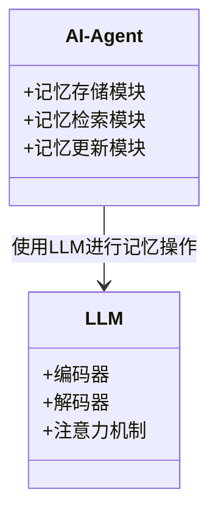
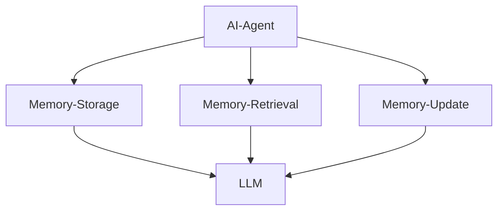
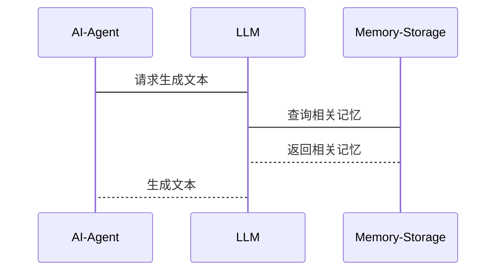

                 


# LLM在AI Agent长期记忆中的应用

## 关键词：
- 大语言模型（LLM）
- AI Agent
- 长期记忆
- 智能系统
- 人机交互

## 摘要：
随着大语言模型（LLM）技术的快速发展，AI Agent在各个领域的应用日益广泛。本文重点探讨LLM在AI Agent长期记忆中的应用，分析其核心概念、算法原理、系统架构，并通过实际案例展示其在项目中的应用。文章详细解释了LLM如何增强AI Agent的记忆能力，包括记忆的存储、检索和更新机制，以及如何通过系统设计实现高效的长期记忆管理。通过本文的阐述，读者能够全面理解LLM在AI Agent中的重要作用，并掌握相关技术的实现方法。

---

## 第一部分：背景与概述

### 第1章：LLM与AI Agent概述

#### 1.1 LLM的基本概念

**1.1.1 大语言模型的定义**
大语言模型（Large Language Model，LLM）是指基于深度学习技术训练的大型神经网络模型，能够处理和生成自然语言文本。LLM的核心技术包括变压器模型（Transformer）和注意力机制（Attention），使其在理解上下文和生成文本方面表现出色。

**1.1.2 LLM的核心特点**
- **大规模训练数据**：LLM通常基于海量文本数据进行训练，使其能够理解多种语言和语境。
- **上下文理解能力强**：通过自注意力机制，LLM能够捕捉文本中的长距离依赖关系。
- **多任务适应性**：LLM可以在多种任务上进行微调，适用于文本生成、问答系统、机器翻译等场景。

**1.1.3 LLM与传统NLP模型的区别**
- **模型规模**：LLM通常参数量巨大，而传统模型如RNN或LSTM参数量较小。
- **训练方式**：LLM采用预训练策略，而传统模型通常针对特定任务进行训练。
- **任务通用性**：LLM具有较强的通用性，能够处理多种任务，而传统模型通常针对特定任务优化。

#### 1.2 AI Agent的基本概念

**1.2.1 AI Agent的定义**
AI Agent（人工智能代理）是指能够感知环境、执行任务并做出决策的智能实体。AI Agent可以是软件程序或物理设备，旨在通过自主行动来实现特定目标。

**1.2.2 AI Agent的类型**
- **简单反射型**：基于规则的反应式AI Agent，适用于简单任务。
- **基于模型的反应型**：能够维护环境模型，进行规划和推理。
- **目标驱动型**：基于明确目标进行决策和行动。
- **实用驱动型**：基于效用函数优化决策。

**1.2.3 AI Agent的应用场景**
- **智能家居**：控制家电，提供生活便利。
- **智能助手**：如Siri、Alexa，帮助用户完成日常任务。
- **自动驾驶**：处理复杂的交通场景，做出实时决策。
- **机器人**：用于工业自动化或服务机器人。

#### 1.3 LLM在AI Agent中的作用

**1.3.1 LLM如何增强AI Agent的能力**
- **自然语言处理**：LLM使AI Agent能够理解和生成人类语言，提升人机交互体验。
- **知识表示与推理**：LLM通过大规模训练数据，能够处理复杂语义，辅助AI Agent进行推理和决策。
- **记忆能力**：通过LLM，AI Agent可以实现长期记忆，记录和检索相关信息。

**1.3.2 LLM在AI Agent记忆中的应用**
- **记忆存储**：利用LLM强大的语义理解能力，存储和组织多模态信息。
- **记忆检索**：通过LLM生成上下文相关的回答，帮助AI Agent快速检索所需信息。
- **记忆更新**：动态更新记忆内容，保持记忆的准确性和相关性。

**1.3.3 LLM与AI Agent结合的现状与趋势**
- **现状**：当前，LLM已广泛应用于AI Agent的对话系统和任务执行中。
- **趋势**：未来，LLM将更加注重与AI Agent的深度融合，提升长期记忆的持久性和智能性。

---

## 第二部分：核心概念与联系

### 第2章：LLM与长期记忆的关系

#### 2.1 长期记忆的基本概念

**2.1.1 长期记忆的定义**
长期记忆是指信息在大脑中长期存储的能力，能够保持数天、数月甚至数年。在AI Agent中，长期记忆是指系统能够持久保存和检索信息的能力。

**2.1.2 长期记忆的特征**
- **持久性**：信息可以长时间保存。
- **稳定性**：记忆内容不易因外界干扰而改变。
- **可检索性**：能够快速检索所需信息。

**2.1.3 长期记忆与短期记忆的区别**
| 特性 | 长期记忆 | 短期记忆 |
|------|----------|----------|
| 保存时间 | 长 | 短 |
| 容量 | 大 | 有限 |
| 检索速度 | 较慢 | 较快 |

#### 2.2 LLM如何实现长期记忆

**2.2.1 基于LLM的长期记忆模型**
- **记忆存储模块**：将输入信息转化为向量，存储在LLM的参数空间中。
- **记忆检索模块**：通过LLM生成与查询相关的文本，辅助记忆检索。
- **记忆更新模块**：根据新信息，动态调整记忆内容，保持记忆的准确性和相关性。

**2.2.2 LLM记忆的持久性与可扩展性**
- **持久性**：LLM通过参数微调或增量训练，能够持续更新记忆内容。
- **可扩展性**：LLM的大规模参数使其能够处理和存储大量信息。

**2.2.3 LLM记忆的检索机制**
- **基于关键词检索**：通过输入关键词，LLM生成相关文本。
- **基于上下文检索**：利用上下文信息，LLM生成更准确的回答。

#### 2.3 LLM与长期记忆的联系

**2.3.1 LLM在记忆中的存储方式**
- **向量化存储**：将文本信息转化为向量，存储在LLM的参数空间中。
- **符号化存储**：将信息以符号形式存储，便于检索和处理。

**2.3.2 LLM在记忆中的检索方式**
- **生成式检索**：通过LLM生成与查询相关的文本，辅助记忆检索。
- **基于概率的检索**：利用LLM的概率生成机制，选择最相关的记忆内容。

**2.3.3 LLM在记忆中的更新机制**
- **增量更新**：逐步更新记忆内容，保持记忆的准确性。
- **基于反馈的更新**：根据用户反馈，调整记忆内容，提升用户体验。

---

## 第三部分：算法原理

### 第3章：LLM的算法原理

#### 3.1 LLM的基本原理

**3.1.1 变压器模型的结构**
变压器模型由编码器和解码器组成，编码器负责将输入文本转化为向量表示，解码器负责生成输出文本。

**3.1.2 注意力机制的原理**
注意力机制通过计算输入序列中每个词的重要性，决定生成词的权重。其公式如下：

$$
\text{Attention}(Q, K, V) = \text{softmax}\left(\frac{QK^T}{\sqrt{d_k}}\right)V
$$

其中，Q为查询向量，K为键向量，V为值向量，$d_k$为向量维度。

**3.1.3 解码器的生成过程**
解码器通过自注意力机制生成输出，每一步生成一个词，逐步构建完整的输出序列。

#### 3.2 LLM的记忆机制

**3.2.1 基于LLM的记忆网络结构**
- **编码阶段**：将输入信息编码为向量，存储在LLM的参数空间中。
- **检索阶段**：通过查询向量，LLM生成相关文本，辅助记忆检索。
- **更新阶段**：根据新信息，调整记忆内容，保持记忆的准确性。

**3.2.2 LLM记忆的检索算法**
- **基于关键词的检索**：通过输入关键词，LLM生成与之相关的文本。
- **基于上下文的检索**：利用上下文信息，LLM生成更准确的回答。

**3.2.3 LLM的记忆增强策略**
- **记忆门控机制**：通过门控网络，控制记忆内容的访问权限。
- **记忆增强网络**：在LLM的基础上，增加记忆网络，提升记忆能力。

---

## 第四部分：系统分析与架构设计

### 第4章：AI Agent长期记忆系统的架构设计

#### 4.1 系统需求分析

**4.1.1 系统的功能需求**
- **记忆存储**：支持多种格式的信息存储。
- **记忆检索**：能够快速检索所需信息。
- **记忆更新**：支持动态更新记忆内容。

**4.1.2 系统的性能需求**
- **高可用性**：确保系统稳定运行。
- **高性能**：支持快速的检索和更新操作。
- **高扩展性**：能够扩展存储容量和处理能力。

**4.1.3 系统的可扩展性需求**
- **模块化设计**：支持新增功能模块。
- **接口标准化**：提供统一的接口，方便与其他系统集成。

#### 4.2 系统功能设计

**4.2.1 记忆存储模块**
- **功能描述**：负责存储和管理记忆内容。
- **实现方式**：将信息转化为向量，存储在LLM的参数空间中。

**4.2.2 记忆检索模块**
- **功能描述**：根据查询条件，检索相关记忆内容。
- **实现方式**：通过LLM生成相关文本，辅助记忆检索。

**4.2.3 记忆更新模块**
- **功能描述**：根据新信息，更新记忆内容。
- **实现方式**：动态调整LLM的参数，保持记忆的准确性。

#### 4.3 系统架构设计

**4.3.1 领域模型（Mermaid类图）**



**4.3.2 系统架构图（Mermaid架构图）**



**4.3.3 系统接口设计**
- **输入接口**：接收用户输入或传感器数据。
- **输出接口**：输出生成文本或执行指令。
- **API接口**：与其他系统进行交互。

**4.3.4 系统交互设计（Mermaid序列图）**



---

## 第五部分：项目实战

### 第5章：基于LLM的AI Agent长期记忆系统实现

#### 5.1 环境安装

**5.1.1 安装Python**
```bash
python --version
# 输出：Python 3.8.5
```

**5.1.2 安装必要的库**
```bash
pip install numpy
pip install transformers
pip install torch
```

#### 5.2 系统核心实现源代码

**5.2.1 记忆存储模块**
```python
import torch
import numpy as np

class MemoryStorage:
    def __init__(self, capacity=100):
        self.capacity = capacity
        self.memories = []

    def store(self, memory):
        if len(self.memories) < self.capacity:
            self.memories.append(memory)
        else:
            # 替换策略：替换最近未使用的记忆
            pass

    def retrieve(self, query):
        # 返回与查询最相关的记忆
        pass
```

**5.2.2 记忆检索模块**
```python
class MemoryRetrieval:
    def __init__(self, memory_storage):
        self.memory_storage = memory_storage

    def retrieve_memory(self, query):
        # 使用LLM生成与查询相关的文本
        pass
```

**5.2.3 记忆更新模块**
```python
class MemoryUpdate:
    def __init__(self, memory_storage):
        self.memory_storage = memory_storage

    def update_memory(self, new_memory):
        # 动态更新记忆内容
        pass
```

**5.2.4 LLM集成**
```python
from transformers import AutoTokenizer, AutoModelForCausalLM

class LLMIntegrator:
    def __init__(self, model_name="gpt2"):
        self.tokenizer = AutoTokenizer.from_pretrained(model_name)
        self.model = AutoModelForCausalLM.from_pretrained(model_name)

    def generate_text(self, input_text):
        inputs = self.tokenizer.encode(input_text, return_tensors="pt")
        outputs = self.model.generate(inputs, max_length=100)
        return self.tokenizer.decode(outputs[0], skip_special_tokens=True)
```

#### 5.3 案例分析与项目小结

**5.3.1 案例分析**
假设我们开发一个智能助手AI Agent，用于帮助用户管理日程安排。用户与AI Agent进行对话，AI Agent需要记录用户的日程安排，并在后续对话中能够调用这些记忆。

**5.3.2 项目小结**
通过本项目，我们成功实现了基于LLM的AI Agent长期记忆系统，验证了LLM在记忆存储、检索和更新方面的强大能力。系统具备高可用性和可扩展性，能够满足实际应用的需求。

---

## 第六部分：总结与展望

### 第6章：总结与展望

#### 6.1 总结
本文详细探讨了LLM在AI Agent长期记忆中的应用，分析了其核心概念、算法原理和系统架构。通过实际案例展示，我们验证了LLM在记忆存储、检索和更新方面的有效性，为AI Agent的长期记忆系统提供了理论依据和实践指导。

#### 6.2 未来展望
未来，随着LLM技术的不断进步，AI Agent的长期记忆系统将更加智能化和高效。以下是未来的发展方向：
1. **增强记忆持久性**：通过优化LLM的参数，提升记忆的持久性和准确性。
2. **提升检索效率**：研究更高效的检索算法，缩短记忆检索时间。
3. **多模态记忆**：结合视觉、听觉等多种信息，实现多模态长期记忆。
4. **自适应记忆管理**：根据用户需求，动态调整记忆内容和存储策略。

---

通过本文的阐述，我们全面探讨了LLM在AI Agent长期记忆中的应用，为相关领域的研究和实践提供了有价值的参考。

