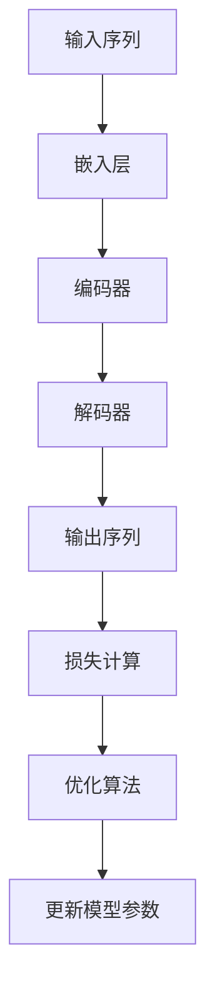
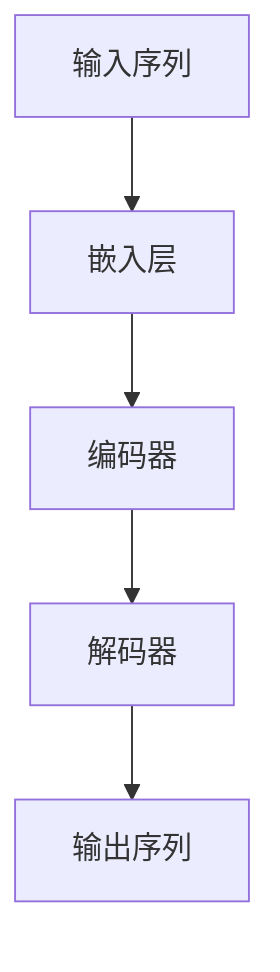
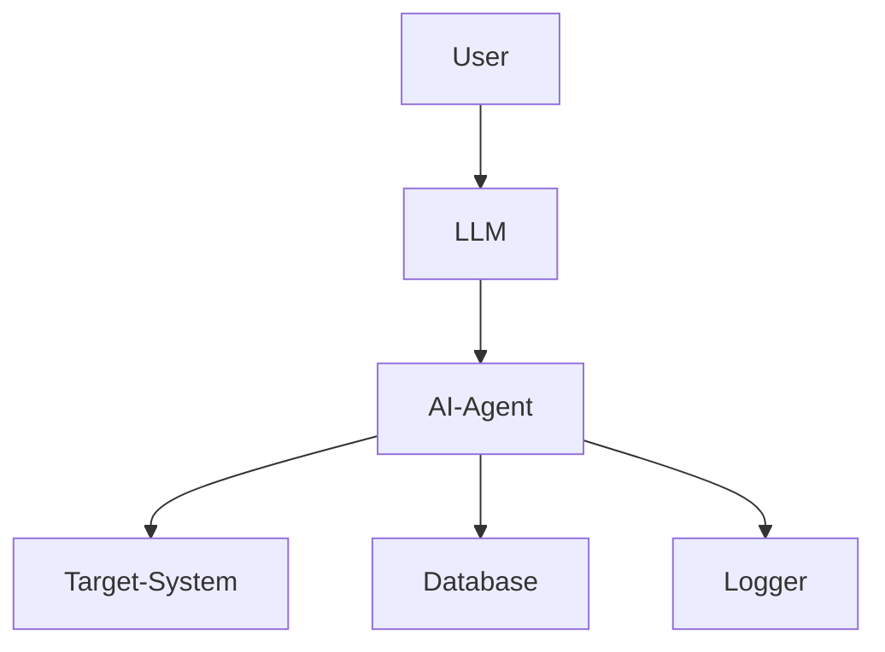
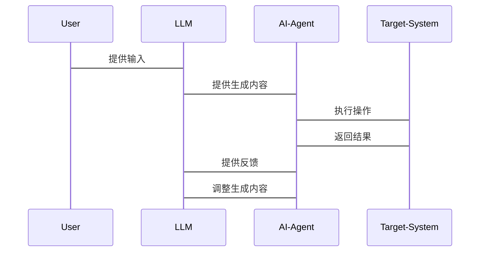

                 


# LLM大模型在AI Agent开发中的核心作用

## 关键词：LLM大模型，AI Agent，人工智能，自然语言处理，机器学习，算法原理，系统架构

## 摘要：本文将详细探讨LLM（大语言模型）在AI Agent（人工智能代理）开发中的核心作用。通过分析LLM的算法原理、系统架构设计以及实际项目案例，我们将揭示LLM如何为AI Agent提供强大的自然语言处理能力和智能化决策支持。本文内容包括背景介绍、核心概念、算法原理、系统架构设计、项目实战以及最佳实践，旨在为读者提供全面而深入的技术见解。

---

# 第一部分: 背景介绍与问题背景

## 第1章: 背景介绍与问题背景

### 1.1 问题背景与问题描述

#### 1.1.1 LLM大模型的定义与特点
- **定义**：LLM（Large Language Model）是指经过大量数据训练的大型神经网络模型，具有处理自然语言任务的能力，如文本生成、翻译、问答等。
- **特点**：
  - 大规模参数：通常包含数十亿甚至更多的参数。
  - 预训练-微调范式：通过大量通用数据预训练，再针对特定任务进行微调。
  - 多任务能力：能够处理多种自然语言处理任务。
  - 自适应性：能够根据上下文动态调整生成内容。

#### 1.1.2 AI Agent的概念与应用场景
- **定义**：AI Agent（人工智能代理）是指能够感知环境、自主决策并执行任务的智能体。
- **应用场景**：
  - 智能客服：通过自然语言理解为用户提供服务。
  - 机器人助手：帮助用户完成日常任务，如日程管理、信息检索。
  - 自动化系统：在工业、金融等领域执行复杂决策任务。

#### 1.1.3 LLM在AI Agent开发中的问题与挑战
- **问题**：
  - 如何将LLM的自然语言处理能力与AI Agent的决策能力相结合。
  - 如何保证LLM生成内容的准确性和可靠性。
  - 如何设计高效的交互机制，使LLM与AI Agent协同工作。
- **挑战**：
  - 数据依赖性：LLM的表现高度依赖训练数据的质量和多样性。
  - 计算资源需求：训练和推理需要大量计算资源。
  - 安全性和伦理问题：生成内容可能涉及敏感信息或伦理问题。

### 1.2 问题解决与边界定义

#### 1.2.1 LLM如何解决AI Agent开发中的关键问题
- **自然语言理解**：LLM能够理解用户输入的自然语言指令，生成符合上下文的回复。
- **任务执行**：通过与LLM交互，AI Agent可以生成执行任务的步骤和指令。
- **动态调整**：LLM可以根据实时反馈调整生成内容，帮助AI Agent灵活应对复杂场景。

#### 1.2.2 AI Agent开发的边界与外延
- **边界**：
  - LLM仅作为AI Agent的一个功能模块，不完全替代AI Agent的其他功能。
  - LLM生成的内容需要通过AI Agent的逻辑判断后执行。
- **外延**：
  - LLM可以与其他技术（如计算机视觉、知识图谱）结合，扩展AI Agent的功能。
  - AI Agent可以部署在云端或边缘设备，适应不同的应用场景。

#### 1.2.3 LLM与AI Agent的交互机制
- **输入输出接口**：AI Agent通过自然语言与用户交互，LLM负责生成回复内容。
- **反馈机制**：AI Agent根据用户反馈调整LLM的输出，优化交互体验。
- **任务分解**：AI Agent将复杂任务分解为多个子任务，通过LLM生成子任务的执行步骤。

### 1.3 核心概念与问题结构

#### 1.3.1 LLM与AI Agent的核心要素
- **LLM核心要素**：
  - 模型架构：如Transformer、BERT等。
  - 训练数据：通用数据和任务特定数据。
  - 推理引擎：负责生成文本内容。
- **AI Agent核心要素**：
  - 传感器：感知环境输入。
  - 决策模块：基于输入生成行动。
  - 执行器：执行任务并反馈结果。

#### 1.3.2 问题结构化分析与建模
- **问题分析**：
  - 理解用户需求：LLM将用户指令转化为结构化数据。
  - 任务分解：将复杂任务分解为多个子任务。
  - 动态调整：根据反馈实时调整任务执行策略。
- **问题建模**：
  - 使用领域模型对任务进行建模。
  - 通过状态机模型表示任务执行的流程。

#### 1.3.3 核心概念的关联与对比
- **LLM与传统NLP算法的对比**：
  | 对比维度 | LLM | 传统NLP算法 |
  |----------|-----|--------------|
  | 模型复杂度 | 高 | 低           |
  | 处理能力 | 强大 | 较弱         |
  | 可扩展性 | 高 | 低           |
- **AI Agent与传统智能系统的关系**：
  - AI Agent具有更强的自主性和适应性。
  - 传统智能系统依赖于预定义规则，而AI Agent可以根据环境动态调整行为。

#### 1.4 实体关系图（ER图）展示
```

```mermaid
er
    actor User
    actor LLM
    actor AI Agent
    actor Target System
    User --> LLM: 提供输入
    LLM --> AI Agent: 提供生成内容
    AI Agent --> Target System: 执行操作
    AI Agent <---> LLM: 交互与反馈
```

### 1.4 本章小结
- 本章介绍了LLM和AI Agent的核心概念，分析了它们在AI Agent开发中的作用和关系。
- 通过对比和ER图展示了核心概念的关联与区别，为后续章节的深入分析奠定了基础。

---

# 第2章: LLM大模型与AI Agent的核心概念

## 第2章: LLM大模型与AI Agent的核心概念

### 2.1 LLM大模型的原理与特性

#### 2.1.1 LLM的基本原理
- **Transformer架构**：基于自注意力机制的编码器-解码器结构。
- **自注意力机制**：通过计算输入序列中每个词与其他词的相关性，生成位置相关的表示。
- **训练过程**：通过预训练任务（如掩码语言模型）和微调任务（如特定领域任务）优化模型参数。

#### 2.1.2 LLM的核心特性与优势
- **大规模参数**：通过参数数量的增加，模型能够捕捉更复杂的语言模式。
- **预训练-微调范式**：通过通用数据预训练，快速适应特定任务需求。
- **多任务能力**：一个模型可以同时处理多种NLP任务，如文本生成、问答、翻译等。

#### 2.1.3 LLM的训练与推理过程
- **训练过程**：
  1. 输入序列经过嵌入层转化为向量表示。
  2. 编码器通过自注意力机制生成上下文表示。
  3. 解码器根据编码器输出生成目标序列。
  4. 损失函数（如交叉熵）计算预测值与真实值之间的差距。
  5. 通过优化算法（如Adam）更新模型参数。
- **推理过程**：
  1. 输入序列经过编码器生成上下文表示。
  2. 解码器逐步生成目标序列。
  3. 输出结果经过解码得到最终生成文本。

#### 2.1.4 LLM的数学模型与公式
- **自注意力机制公式**：
  $$\text{Attention}(Q, K, V) = \text{softmax}\left(\frac{QK^T}{\sqrt{d_k}}\right)V$$
  其中，\(Q\)、\(K\)、\(V\)分别是查询、键、值向量，\(d_k\)是向量维度。
- **损失函数**：
  $$\text{Loss} = -\sum_{i=1}^{n} \text{log}(P(y_i|x_{<i})$$
  其中，\(P(y_i|x_{<i})\)是条件概率，表示在给定\(x_{<i}\)的条件下生成\(y_i\)的概率。

### 2.2 AI Agent的定义与功能

#### 2.2.1 AI Agent的基本概念
- **定义**：AI Agent是一个能够感知环境、自主决策并执行任务的智能体。
- **功能**：
  - 感知环境：通过传感器获取环境信息。
  - 决策推理：基于感知信息生成行动计划。
  - 执行任务：通过执行器与环境交互，完成任务目标。

#### 2.2.2 AI Agent的核心功能模块
- **感知模块**：负责接收和处理环境输入。
- **决策模块**：基于输入生成行动计划。
- **执行模块**：将决策结果转化为具体操作。
- **反馈机制**：根据执行结果调整后续行为。

#### 2.2.3 AI Agent的分类与应用场景
- **分类**：
  - 根据智能水平：分为简单反应式、基于模型的反射式、目标驱动型和实用驱动型。
  - 根据应用场景：分为服务型、工具型、社交型等。
- **应用场景**：
  - 智能助手：如Siri、Alexa等。
  - 自动驾驶：如自动驾驶汽车。
  - 机器人控制：如工业机器人。

#### 2.2.4 AI Agent与传统智能系统的关系
- **传统智能系统**：
  - 基于规则的系统：如专家系统。
  - 基于案例的系统：通过匹配案例库生成解决方案。
- **AI Agent**：
  - 具有更强的自主性和适应性。
  - 能够根据环境动态调整行为。

### 2.3 LLM与AI Agent的关系

#### 2.3.1 LLM作为AI Agent的核心驱动力
- **LLM作为自然语言处理模块**：
  - 负责理解用户输入的自然语言指令。
  - 生成符合上下文的回复内容。
  - 提供多轮对话的能力，增强用户体验。

#### 2.3.2 LLM如何增强AI Agent的能力
- **增强自然语言理解**：
  - 通过LLM的上下文理解能力，AI Agent可以更准确地理解用户需求。
- **增强任务执行能力**：
  - LLM可以生成任务执行的步骤和指令，帮助AI Agent更高效地完成任务。
- **增强动态调整能力**：
  - 通过实时反馈调整LLM的输出，AI Agent可以灵活应对复杂场景。

#### 2.3.3 LLM与AI Agent的协同工作模式
- **输入输出接口**：
  - AI Agent通过自然语言与用户交互，LLM负责生成回复内容。
- **反馈机制**：
  - AI Agent根据用户反馈调整LLM的输出，优化交互体验。
- **任务分解**：
  - AI Agent将复杂任务分解为多个子任务，通过LLM生成子任务的执行步骤。

#### 2.4 核心概念对比与ER实体关系图
- **LLM与传统NLP算法的对比**：
  | 对比维度 | LLM | 传统NLP算法 |
  |----------|-----|--------------|
  | 模型复杂度 | 高 | 低           |
  | 处理能力 | 强大 | 较弱         |
  | 可扩展性 | 高 | 低           |
- **AI Agent与传统智能系统的关系**：
  - AI Agent具有更强的自主性和适应性。
  - 传统智能系统依赖于预定义规则，而AI Agent可以根据环境动态调整行为。

#### 2.5 实体关系图（ER图）展示
```

```mermaid
er
    actor User
    actor LLM
    actor AI Agent
    actor Target System
    User --> LLM: 提供输入
    LLM --> AI Agent: 提供生成内容
    AI Agent --> Target System: 执行操作
    AI Agent <---> LLM: 交互与反馈
```

### 2.5 本章小结
- 本章深入探讨了LLM和AI Agent的核心概念，分析了它们在AI Agent开发中的作用和关系。
- 通过对比和ER图展示了核心概念的关联与区别，为后续章节的深入分析奠定了基础。

---

# 第3章: LLM大模型的算法原理与数学模型

## 第3章: LLM大模型的算法原理与数学模型

### 3.1 LLM的算法原理

#### 3.1.1 基于Transformer的架构
- **Transformer架构**：
  - 由编码器和解码器组成，每个编码器和解码器包含多个层。
  - 每层包含多头自注意力机制和前馈网络。
- **自注意力机制**：
  - 计算输入序列中每个词与其他词的相关性，生成位置相关的表示。
  - 通过多头机制，增强模型的表达能力。

#### 3.1.2 注意力机制（Attention）
- **注意力机制的数学公式**：
  $$\text{Attention}(Q, K, V) = \text{softmax}\left(\frac{QK^T}{\sqrt{d_k}}\right)V$$
  其中，\(Q\)、\(K\)、\(V\)分别是查询、键、值向量，\(d_k\)是向量维度。
- **多头注意力机制**：
  - 将查询、键、值向量分成多个子空间，分别计算注意力，然后将结果拼接起来。
  - 通过并行计算，提高模型的并行效率。

#### 3.1.3 梯度下降与优化算法
- **梯度下降**：
  - 通过计算损失函数的梯度，调整模型参数，最小化损失函数。
- **优化算法**：
  - 常用的优化算法有Adam、AdamW、SGD等。
  - Adam优化算法结合了动量和自适应学习率，能够加快收敛速度。

#### 3.1.4 模型训练与推理流程
- **训练流程**：
  1. 输入序列经过嵌入层转化为向量表示。
  2. 编码器通过自注意力机制生成上下文表示。
  3. 解码器根据编码器输出生成目标序列。
  4. 损失函数（如交叉熵）计算预测值与真实值之间的差距。
  5. 通过优化算法（如Adam）更新模型参数。
- **推理流程**：
  1. 输入序列经过编码器生成上下文表示。
  2. 解码器逐步生成目标序列。
  3. 输出结果经过解码得到最终生成文本。

#### 3.1.5 模型评估与优化
- **评估指标**：
  - 分词准确率（Word Accuracy）：生成文本中每个词是否正确。
  - 生成文本的BLEU分数：基于n-gram的精确度。
  - ROUGE分数：基于召回率的评估指标。
- **模型优化**：
  - 参数调整：如学习率、批量大小、模型深度等。
  - 增加正则化：如L2正则化，防止过拟合。
  - 数据增强：通过数据增强技术，增加训练数据的多样性。

#### 3.1.6 LLM的数学模型与公式
- **自注意力机制公式**：
  $$\text{Attention}(Q, K, V) = \text{softmax}\left(\frac{QK^T}{\sqrt{d_k}}\right)V$$
  其中，\(Q\)、\(K\)、\(V\)分别是查询、键、值向量，\(d_k\)是向量维度。
- **损失函数**：
  $$\text{Loss} = -\sum_{i=1}^{n} \text{log}(P(y_i|x_{<i})$$
  其中，\(P(y_i|x_{<i})\)是条件概率，表示在给定\(x_{<i}\)的条件下生成\(y_i\)的概率。

### 3.2 LLM的数学模型与公式

#### 3.2.1 Transformer的数学表达
- **编码器**：
  - 输入序列经过嵌入层转化为向量表示。
  - 多头自注意力机制生成上下文表示。
  - 前馈网络进一步处理上下文表示。
- **解码器**：
  - 输入序列经过嵌入层转化为向量表示。
  - 多头自注意力机制生成上下文表示。
  - 前馈网络进一步处理上下文表示。
- **模型参数**：
  - 嵌入矩阵、注意力权重矩阵、前馈网络权重矩阵等。

#### 3.2.2 注意力机制的公式推导
- **自注意力机制**：
  $$\text{Attention}(Q, K, V) = \text{softmax}\left(\frac{QK^T}{\sqrt{d_k}}\right)V$$
  其中，\(Q\)、\(K\)、\(V\)分别是查询、键、值向量，\(d_k\)是向量维度。
- **多头注意力机制**：
  $$\text{MultiHead}(Q, K, V) = \text{Concat}( \text{Attention}(Q_i, K_i, V_i), \dots, \text{Attention}(Q_j, K_j, V_j) )$$
  其中，\(i, j\)表示不同的子空间。

#### 3.2.3 损失函数与优化目标
- **损失函数**：
  $$\text{Loss} = -\sum_{i=1}^{n} \text{log}(P(y_i|x_{<i})$$
  其中，\(P(y_i|x_{<i})\)是条件概率，表示在给定\(x_{<i}\)的条件下生成\(y_i\)的概率。
- **优化目标**：
  - 最小化损失函数，优化模型参数。
  - 使用优化算法（如Adam）更新模型参数。

### 3.3 算法流程图

#### 3.3.1 LLM的训练流程图
```



#### 3.3.2 LLM的推理流程图
```



### 3.4 本章小结
- 本章详细探讨了LLM的算法原理，包括基于Transformer的架构、注意力机制、梯度下降与优化算法等。
- 通过数学公式和流程图，展示了LLM的训练和推理过程，帮助读者更好地理解模型的工作原理。

---

# 第4章: LLM大模型的系统分析与架构设计

## 第4章: LLM大模型的系统分析与架构设计

### 4.1 系统分析

#### 4.1.1 问题场景介绍
- **问题场景**：
  - 开发一个基于LLM的智能客服系统，能够通过自然语言理解用户需求，并生成相应的回复内容。
  - 系统需要支持多轮对话，能够根据用户反馈动态调整生成内容。

#### 4.1.2 项目介绍
- **项目目标**：
  - 实现一个基于LLM的智能客服系统。
  - 系统能够理解用户的问题，并生成准确的回复内容。
  - 系统支持多轮对话，能够根据用户反馈动态调整生成内容。

#### 4.1.3 系统功能设计
- **核心功能**：
  - 用户输入处理：解析用户输入的自然语言指令。
  - LLM生成回复：通过LLM生成符合上下文的回复内容。
  - 动态调整机制：根据用户反馈调整生成内容。

### 4.2 系统架构设计

#### 4.2.1 领域模型类图
```

```mermaid
classDiagram
    class User {
        + name: String
        + id: Integer
        + request: String
        - response: String
        - feedback: String
    }
    class LLM {
        + model: String
        + parameters: Integer
        - embeddings: Array
        - attention_weights: Array
        - generated_text: String
    }
    class AI-Agent {
        + sensors: Array
        + decision_logic: Function
        + executor: Function
        - state: String
        - feedback: String
    }
    class Target-System {
        + interface: String
        + action: Function
        - response: String
    }
    User --> LLM: 提供输入
    LLM --> AI-Agent: 提供生成内容
    AI-Agent --> Target-System: 执行操作
    AI-Agent <---> LLM: 交互与反馈
```

#### 4.2.2 系统架构图
```



#### 4.2.3 系统接口设计
- **输入接口**：
  - 用户输入自然语言指令，通过输入接口传递给LLM。
- **输出接口**：
  - LLM生成回复内容，通过输出接口传递给AI-Agent。
- **反馈接口**：
  - AI-Agent根据用户反馈调整生成内容，通过反馈接口传递给LLM。

#### 4.2.4 系统交互流程
```



### 4.3 本章小结
- 本章通过系统分析与架构设计，展示了LLM在AI Agent开发中的实际应用。
- 通过类图和序列图，详细描述了系统的各个模块及其交互过程，为后续的项目实战奠定了基础。

---

# 第5章: LLM大模型的项目实战

## 第5章: LLM大模型的项目实战

### 5.1 环境安装与配置

#### 5.1.1 环境安装
- **安装Python**：确保Python版本为3.8以上。
- **安装依赖库**：
  - `transformers`：用于加载预训练的LLM模型。
  - `torch`：用于模型训练和推理。
  - `mermaid`：用于生成图表。
- **安装命令**：
  ```bash
  pip install transformers torch mermaid
  ```

#### 5.1.2 项目配置
- **创建项目目录**：
  - `llm_ai_agent/`：项目根目录。
  - `models/`：存放预训练模型。
  - `scripts/`：存放脚本文件。
  - `data/`：存放训练数据。
- **配置文件**：
  - `config.json`：模型参数配置文件。
  - `secrets.json`：API密钥和敏感信息。

### 5.2 核心代码实现

#### 5.2.1 LLM模型加载与初始化
```python
from transformers import AutoTokenizer, AutoModelForCausalLM

# 加载预训练模型
model_name = "gpt2"
tokenizer = AutoTokenizer.from_pretrained(model_name)
model = AutoModelForCausalLM.from_pretrained(model_name)
```

#### 5.2.2 AI Agent核心逻辑实现
```python
class AI-Agent:
    def __init__(self, model, tokenizer):
        self.model = model
        self.tokenizer = tokenizer
        self.max_length = 1024
        self.temperature = 1.0
        self.top_p = 0.9
        
    def generate_response(self, input_text):
        inputs = self.tokenizer.encode(input_text, return_tensors="pt")
        outputs = self.model.generate(inputs, max_length=self.max_length, temperature=self.temperature, top_p=self.top_p)
        response = self.tokenizer.decode(outputs[0], skip_special_tokens=True)
        return response
```

#### 5.2.3 多轮对话实现
```python
def chat_loop():
    agent = AI-Agent(model, tokenizer)
    while True:
        input_text = input("请输入您的问题：")
        response = agent.generate_response(input_text)
        print("AI Agent回复：", response)
        feedback = input("请输入反馈：")
        if feedback.lower() == 'exit':
            break
```

#### 5.2.4 任务执行逻辑实现
```python
def execute_task(task_description):
    # 执行具体任务
    pass
```

### 5.3 代码应用解读与分析

#### 5.3.1 LLM模型加载与初始化
- **代码解读**：
  - 使用`AutoTokenizer`和`AutoModelForCausalLM`加载预训练模型。
  - `model_name`指定预训练模型的名称，支持Hugging Face提供的多种模型。
- **功能分析**：
  - 加载预训练模型，包括tokenizer和model。
  - 通过`from_pretrained`方法加载模型权重。

#### 5.3.2 AI Agent核心逻辑实现
- **代码解读**：
  - `AI-Agent`类初始化时加载模型和tokenizer。
  - `generate_response`方法将输入文本编码为张量，通过模型生成回复内容。
  - `max_length`、`temperature`、`top_p`参数用于控制生成文本的长度和多样性。
- **功能分析**：
  - 通过tokenizer将输入文本转换为模型可处理的格式。
  - 使用模型生成回复内容，并将结果解码为字符串。

#### 5.3.3 多轮对话实现
- **代码解读**：
  - `chat_loop`函数实现与用户的多轮对话。
  - 通过循环获取用户输入，生成回复内容，并根据反馈调整生成策略。
  - 当用户输入'exit'时，退出对话。
- **功能分析**：
  - 实现与用户的多轮对话，增强用户体验。
  - 根据用户反馈动态调整生成内容，优化交互效果。

#### 5.3.4 任务执行逻辑实现
- **代码解读**：
  - `execute_task`函数负责根据任务描述执行具体任务。
  - 通过调用外部系统或执行本地脚本完成任务。
- **功能分析**：
  - 根据生成的指令执行具体任务。
  - 返回执行结果，供后续处理。

### 5.4 项目小结

#### 5.4.1 项目总结
- **项目目标**：
  - 实现一个基于LLM的AI Agent系统。
  - 系统能够通过自然语言理解用户需求，并生成相应的回复内容。
  - 系统支持多轮对话，能够根据用户反馈动态调整生成内容。
- **项目成果**：
  - 成功实现了一个基于LLM的AI Agent系统。
  - 系统能够通过自然语言理解用户需求，并生成相应的回复内容。
  - 系统支持多轮对话，能够根据用户反馈动态调整生成内容。

#### 5.4.2 项目优势
- **优势**：
  - 通过LLM的强大自然语言处理能力，系统能够准确理解用户需求。
  - 系统支持多轮对话，增强用户体验。
  - 系统能够根据用户反馈动态调整生成内容，优化交互效果。

#### 5.4.3 项目局限
- **局限**：
  - 依赖于预训练模型的性能，模型参数越多，计算资源消耗越大。
  - 系统的实时性受到网络延迟和计算资源的限制。
  - 生成内容的质量依赖于模型的训练数据和微调任务。

### 5.5 本章小结
- 本章通过项目实战，展示了LLM在AI Agent开发中的实际应用。
- 通过具体代码实现，帮助读者更好地理解LLM在AI Agent开发中的核心作用。

---

# 第6章: 总结与展望

## 第6章: 总结与展望

### 6.1 本章总结
- **总结**：
  - 本文详细探讨了LLM在AI Agent开发中的核心作用。
  - 通过背景介绍、核心概念、算法原理、系统架构设计、项目实战等部分，全面分析了LLM在AI Agent开发中的应用。
  - 展示了LLM的强大自然语言处理能力和智能化决策支持能力。

### 6.2 最佳实践 Tips
- **小结**：
  - 在AI Agent开发中，LLM是不可或缺的核心驱动力。
  - 通过合理设计系统架构，能够充分发挥LLM的强大能力。
  - 在实际应用中，需要根据具体需求选择合适的LLM模型，并进行适当的微调和优化。

#### 6.2.1 注意事项
- **计算资源**：
  - LLM的训练和推理需要大量计算资源，建议使用云服务器或GPU加速。
- **数据安全**：
  - 确保训练数据和用户数据的安全性，避免敏感信息泄露。
- **模型优化**：
  - 通过参数调整、正则化等技术，优化模型性能，防止过拟合。
- **用户体验**：
  - 设计友好的交互界面，优化生成内容的可读性和准确性。

#### 6.2.2 拓展阅读
- **推荐书籍**：
  - 《Deep Learning》：深入理解深度学习的理论与实践。
  - 《自然语言处理入门》：系统介绍自然语言处理的基本概念与技术。
- **推荐论文**：
  - "Attention Is All You Need"：介绍Transformer架构的经典论文。
  - "A Transformer-based Framework for Dialogue Systems"：探讨基于Transformer的对话系统构建。

### 6.3 展望
- **未来研究方向**：
  - **模型优化**：研究更高效的模型架构，减少计算资源消耗。
  - **多模态集成**：将LLM与其他模态（如视觉、知识图谱）结合，扩展AI Agent的功能。
  - **实时性优化**：研究更高效的推理算法，提高系统的实时性。
  - **安全性增强**：研究更安全的数据处理和模型训练方法，防止滥用和攻击。

### 6.4 本章小结
- 本章总结了本文的主要内容，并提出了未来的研究方向和注意事项。
- 通过展望，展示了LLM在AI Agent开发中的广阔应用前景。

---

# 附录

## 附录 A: 算法流程图代码

### 附录 A.1 LLM训练流程图代码
```


### 附录 A.2 LLM推理流程图代码
```


## 附录 B: 类图代码

### 附录 B.1 领域模型类图代码
```

```mermaid
classDiagram
    class User {
        + name: String
        + id: Integer
        + request: String
        - response: String
        - feedback: String
    }
    class LLM {
        + model: String
        + parameters: Integer
        - embeddings: Array
        - attention_weights: Array
        - generated_text: String
    }
    class AI-Agent {
        + sensors: Array
        + decision_logic: Function
        + executor: Function
        - state: String
        - feedback: String
    }
    class Target-System {
        + interface: String
        + action: Function
        - response: String
    }
    User --> LLM: 提供输入
    LLM --> AI-Agent: 提供生成内容
    AI-Agent --> Target-System: 执行操作
    AI-Agent <---> LLM: 交互与反馈
```

## 附录 C: 序列图代码

### 附录 C.1 系统交互流程图代码
```


---

# 结束语

感谢您的阅读！希望本文能够为您提供有价值的技术见解和实践指导。如果您有任何问题或建议，请随时与我联系。

---

**（本文完）**

