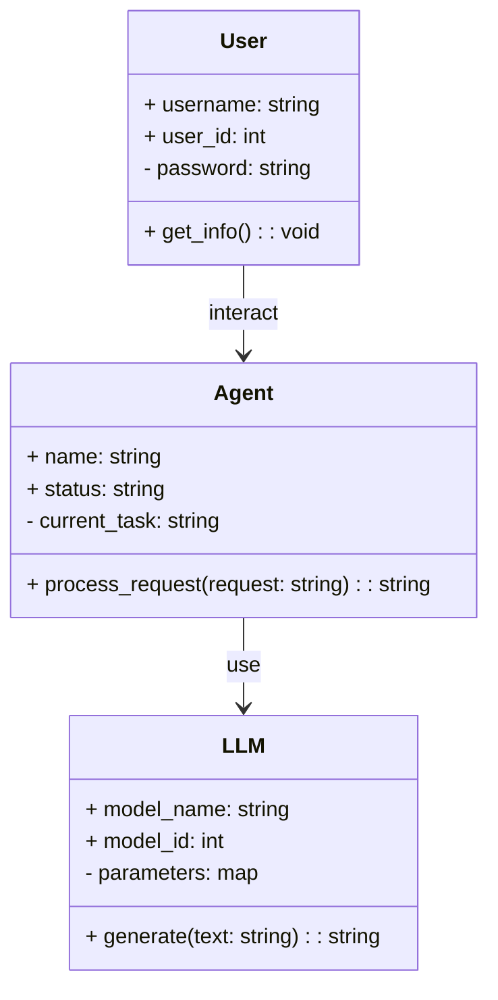
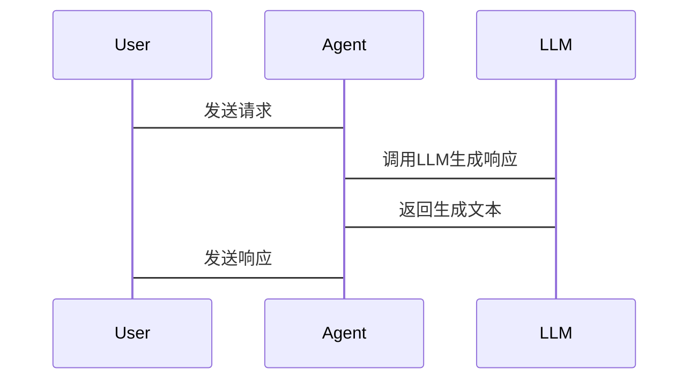

                 


# LLM大模型在AI Agent开发中的核心作用

> 关键词：LLM大模型、AI Agent、自然语言处理、智能系统、人机协作

> 摘要：本文探讨了LLM（大语言模型）在AI Agent开发中的核心作用，分析了其在自然语言理解、生成、推理等能力上的优势，结合实际应用场景，详细讲解了AI Agent的系统架构设计、算法原理以及项目实战，最后总结了开发经验与未来趋势。

---

## 引言

### 1.1 LLM大模型的发展背景

#### 1.1.1 大语言模型的起源与发展
- 自然语言处理（NLP）领域经历了从统计机器学习到深度学习的转变。
- 大语言模型（LLM）如GPT系列的出现，标志着NLP技术的重大突破。
- LLM的核心技术包括：Transformer架构、自监督学习、大规模数据训练。

#### 1.1.2 AI Agent的基本概念与定义
- AI Agent是一种智能体，能够感知环境、执行任务并做出决策。
- 基于LLM的AI Agent具备自然语言处理能力，能够与人类进行高效交互。

#### 1.1.3 LLM与AI Agent的结合
- LLM为AI Agent提供了强大的语言理解和生成能力。
- AI Agent通过LLM实现复杂任务的决策和执行。

### 1.2 问题背景与问题描述

#### 1.2.1 当前AI Agent开发的核心挑战
- **复杂性**：AI Agent需要处理多任务、多模态的数据。
- **实时性**：需要快速响应和决策。
- **可解释性**：用户需要理解AI Agent的行为逻辑。

#### 1.2.2 LLM在AI Agent中的角色与作用
- **语言理解**：LLM帮助AI Agent理解用户的意图。
- **决策支持**：LLM为AI Agent提供知识支持和决策建议。
- **人机协作**：LLM使AI Agent能够与人类无缝协作。

#### 1.2.3 问题解决的思路与方法
- **模块化设计**：将AI Agent分解为感知、决策、执行模块。
- **人机协同**：结合LLM的自然语言处理能力，提升AI Agent的交互体验。

### 1.3 问题的边界与外延

#### 1.3.1 LLM能力的局限性
- **知识更新**：LLM的知识基于训练数据，可能无法实时更新。
- **推理能力**：LLM在复杂推理任务中可能表现不足。

#### 1.3.2 AI Agent的适用场景与限制
- **适用场景**：客户服务、智能助手、教育辅助。
- **限制**：在需要实时数据处理和复杂决策的任务中可能表现不佳。

#### 1.3.3 LLM与AI Agent的结合范围
- **核心结合点**：自然语言交互、知识检索、任务分解。
- **潜在扩展**：多模态交互、情感分析。

### 1.4 核心概念结构与组成

#### 1.4.1 LLM的核心要素
- **模型结构**：基于Transformer的深度神经网络。
- **训练数据**：大规模多样化文本数据。
- **计算能力**：高性能计算资源支持。

#### 1.4.2 AI Agent的功能模块
- **感知模块**：处理输入，识别意图。
- **决策模块**：基于LLM生成决策。
- **执行模块**：执行任务，反馈结果。
- **学习模块**：持续优化模型。

#### 1.4.3 两者的协同机制
- **输入输出协同**：LLM处理输入，AI Agent执行输出。
- **知识共享**：AI Agent利用LLM的知识库。
- **反馈优化**：通过用户反馈优化LLM和AI Agent的性能。

---

## 第二部分: LLM大模型的核心概念与原理

### 第2章: LLM大模型的核心原理

#### 2.1 大语言模型的训练原理

##### 2.1.1 基于Transformer的模型结构
- **Transformer架构**：由编码器和解码器组成。
- **自注意力机制**：捕捉文本中的长距离依赖关系。
- **多头注意力**：提升模型的表达能力。

##### 2.1.2 自监督学习与预训练
- **自监督学习**：模型在无标签数据上进行预训练。
- **预训练目标**：预测下一个词或重构文本。

##### 2.1.3 模型的可扩展性与适应性
- **参数调节**：通过调整模型参数适应不同任务。
- **微调**：在特定任务上进行微调，提升性能。

#### 2.2 LLM的生成机制

##### 2.2.1 解码过程与概率生成
- **解码策略**：贪心解码和随机采样。
- **概率生成**：基于模型输出的概率分布生成文本。

##### 2.2.2 模型的上下文理解能力
- **上下文窗口**：模型能够处理长上下文。
- **语义理解**：基于上下文生成语义连贯的文本。

##### 2.2.3 多模态能力的扩展
- **文本与图像结合**：模型能够处理图像描述。
- **语音与文本结合**：支持语音输入和输出。

#### 2.3 LLM的推理能力

##### 2.3.1 基于LLM的逻辑推理
- **文本摘要**：提取关键信息。
- **问题回答**：回答用户的问题。

##### 2.3.2 知识库的整合与应用
- **外部知识库**：结合外部数据库进行推理。
- **内部知识库**：模型内部的知识表示。

##### 2.3.3 实时上下文的理解与处理
- **实时对话**：模型能够处理实时对话。
- **动态上下文**：根据上下文动态调整生成内容。

---

## 第三部分: AI Agent的核心概念与架构

### 第3章: AI Agent的基本概念与功能

#### 3.1 AI Agent的定义与分类

##### 3.1.1 AI Agent的定义
- **AI Agent**：具备感知、决策、执行能力的智能体。
- **基于LLM的AI Agent**：结合大语言模型的自然语言处理能力。

##### 3.1.2 基于LLM的AI Agent特点
- **自然语言交互**：支持口语化输入输出。
- **知识丰富**：具备广泛的知识库支持。
- **动态适应**：能够根据反馈动态调整。

##### 3.1.3 AI Agent的分类与应用场景
- **按智能级别**：简单任务型、复杂任务型。
- **按功能领域**：客户服务、教育辅助、智能家居。

#### 3.2 AI Agent的功能模块

##### 3.2.1 感知模块
- **输入处理**：接收用户输入，解析意图。
- **意图识别**：基于LLM进行意图分类。

##### 3.2.2 决策模块
- **任务分解**：将任务分解为子任务。
- **知识检索**：从知识库中检索相关信息。
- **决策生成**：基于LLM生成决策建议。

##### 3.2.3 执行模块
- **任务执行**：调用外部服务完成任务。
- **反馈收集**：收集用户反馈，优化决策。

##### 3.2.4 学习模块
- **模型优化**：基于反馈优化LLM模型。
- **经验积累**：记录历史交互，提升性能。

#### 3.3 AI Agent的协作机制

##### 3.3.1 与LLM的协作
- **协同工作**：AI Agent通过LLM处理语言任务。
- **知识共享**：AI Agent利用LLM的知识库。

##### 3.3.2 与其他系统的协作
- **系统集成**：与第三方服务集成，如API。
- **数据共享**：与其他系统共享数据。

##### 3.3.3 多Agent协作的复杂性
- **协作规划**：多Agent之间协作规划任务。
- **通信机制**：通过通信机制协调行动。

#### 3.4 本章小结

---

## 第四部分: 系统分析与架构设计

### 第4章: 系统分析与架构设计

#### 4.1 项目介绍
- **项目名称**：智能助手开发。
- **项目目标**：开发一个基于LLM的智能助手，具备自然语言交互、任务执行能力。

#### 4.2 系统功能设计

##### 4.2.1 领域模型（类图）


#### 4.2.2 系统架构设计（架构图）


#### 4.2.3 系统交互（序列图）


#### 4.2.4 系统接口设计
- **输入接口**：接收用户的自然语言输入。
- **输出接口**：生成自然语言输出或执行结果。
- **内部接口**：AI Agent与LLM之间的通信接口。

#### 4.2.5 系统实现细节
- **模型选择**：选择适合任务的LLM模型。
- **数据存储**：设计数据库存储用户信息和交互历史。
- **日志记录**：记录系统运行日志，便于调试和优化。

---

## 第五部分: 项目实战

### 第5章: 项目实战

#### 5.1 环境安装与配置
- **工具安装**：安装Python、TensorFlow、Hugging Face库。
- **环境配置**：配置虚拟环境，安装依赖包。

#### 5.2 系统核心实现源代码

##### 5.2.1 感知模块实现
```python
def parse_user_input(user_input):
    # 使用LLM进行意图识别
    response = llm.generate(user_input)
    return response
```

##### 5.2.2 决策模块实现
```python
def make_decision(task_description):
    # 基于LLM生成决策
    response = llm.generate(task_description)
    return response
```

##### 5.2.3 执行模块实现
```python
def execute_task(task):
    # 执行具体的任务
    pass
```

##### 5.2.4 学习模块实现
```python
def update_model(feedback):
    # 更新LLM模型
    pass
```

#### 5.3 代码应用解读与分析
- **代码结构**：模块化设计，便于维护和扩展。
- **依赖管理**：使用依赖注入，便于测试和调试。

#### 5.4 实际案例分析
- **案例描述**：智能助手帮助用户安排日程。
- **流程分析**：用户输入需求，AI Agent解析意图，生成任务分解，执行任务，反馈结果。

#### 5.5 项目小结
- **项目总结**：实现了基于LLM的AI Agent，具备基本功能。
- **经验分享**：模块化设计和依赖管理的重要性。

---

## 第六部分: 最佳实践与未来展望

### 第6章: 最佳实践

#### 6.1 开发经验总结
- **模块化设计**：提高系统的可维护性和扩展性。
- **依赖管理**：使用依赖注入框架，便于测试和调试。
- **日志记录**：记录详细的日志，便于排查问题。

#### 6.2 小结
- **功能实现**：系统实现了核心功能。
- **性能优化**：通过优化算法和数据结构，提升性能。
- **代码质量**：保持代码简洁，易于理解和维护。

#### 6.3 注意事项
- **数据安全**：保护用户数据，防止泄露。
- **模型更新**：定期更新LLM模型，保持性能。
- **用户体验**：优化交互流程，提升用户体验。

#### 6.4 拓展阅读
- **推荐书籍**：《Effective Python》、《深度学习入门》。
- **在线资源**：Hugging Face的教程和文档。

---

## 附录

### 附录A: 常见问题解答
- **Q1**：如何选择合适的LLM模型？
- **A1**：根据任务需求选择模型，考虑计算资源和性能。

---

通过以上结构，您可以逐步展开每个部分的具体内容，确保文章逻辑清晰、内容详实，满足专业技术博客的要求。

