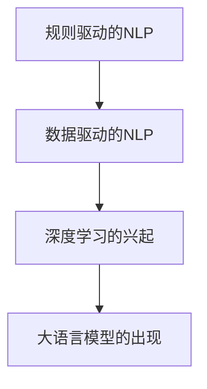
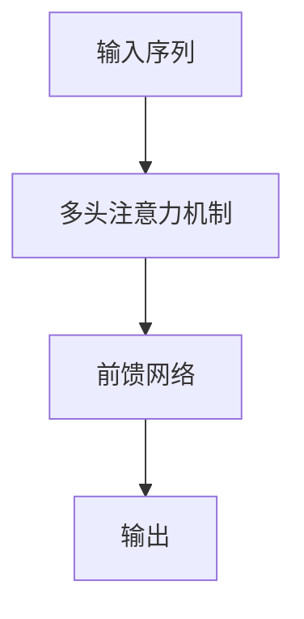
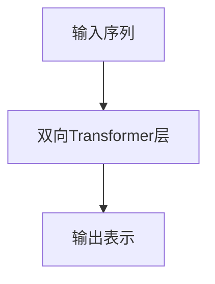
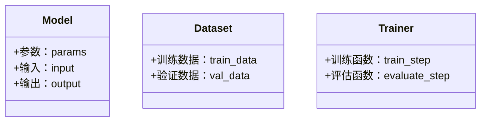
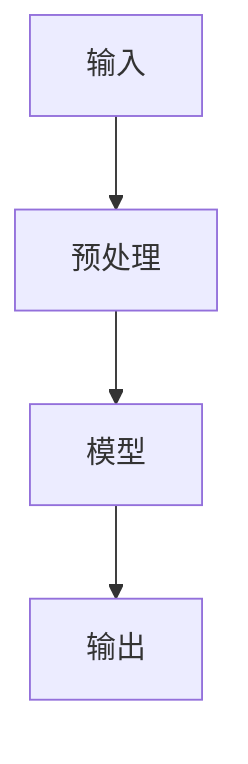
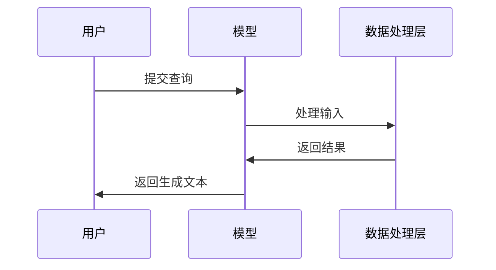

                 


# LLM大模型简介：GPT、BERT及其他主流模型

> 关键词：大语言模型（LLM）、GPT、BERT、自然语言处理（NLP）、Transformer架构、注意力机制

> 摘要：本文将详细介绍大语言模型（LLM）的发展历程，重点分析GPT和BERT两大主流模型的核心原理、优缺点及其应用场景，同时介绍其他主流模型如T5和PaLM。文章将从背景介绍、模型原理、算法分析、系统架构到项目实战等多方面展开，为读者提供全面的视角。

---

# 第一部分: 大语言模型（LLM）概述

## 第1章: 大语言模型（LLM）的背景与概念

### 1.1 人工智能与自然语言处理的演进

#### 1.1.1 从规则驱动到数据驱动的转变
在人工智能领域，自然语言处理（NLP）经历了从规则驱动到数据驱动的转变。早期的NLP系统依赖于手动编写规则，这种方式不仅效率低下，而且难以应对复杂的语言现象。随着深度学习的兴起，数据驱动的方法逐渐成为主流，模型通过大量数据训练，能够自动学习语言的规律和模式。

**Mermaid图：从规则驱动到数据驱动的转变**


#### 1.1.2 大语言模型的定义与核心特点
大语言模型（LLM）是指基于大量数据训练的大型神经网络模型，具有以下核心特点：
1. **巨量参数**：通常包含 billions（十亿级）参数。
2. **自监督学习**：通过预训练任务，模型从未标记的数据中学习语言的规律。
3. **通用性**：能够适应多种NLP任务，如文本生成、问答系统、机器翻译等。
4. **上下文理解**：能够捕捉长距离依赖关系，理解上下文。

#### 1.1.3 LLM与传统NLP技术的区别
与传统NLP技术相比，大语言模型具有以下优势：
- **无需任务特定的特征工程**：模型通过预训练可以直接应用于各种任务。
- **端到端学习**：从输入到输出的整个过程都在模型内部完成。
- **强大的泛化能力**：能够在未见过的数据上表现出色。

### 1.2 大语言模型的背景与重要性

#### 1.2.1 人工智能发展的新阶段
大语言模型的出现标志着人工智能进入了一个新的阶段，模型的能力已经远远超出了传统的NLP系统。它们不仅能够理解语言，还能够生成自然流畅的文本。

#### 1.2.2 大语言模型在NLP领域的突破
大语言模型在多个NLP任务中取得了突破性进展，例如：
- **文本生成**：生成连贯且合理的文本。
- **问答系统**：能够回答复杂的问题。
- **机器翻译**：实现更准确的翻译。

#### 1.2.3 LLM对社会与技术的影响
大语言模型对社会和科技发展产生了深远影响，例如：
- **教育**：辅助学生学习和教师教学。
- **医疗**：帮助医生进行诊断和病历分析。
- **法律**：辅助法律文本的分析和生成。

### 1.3 本书的核心内容与目标

#### 1.3.1 本书的研究范围
本书将重点介绍大语言模型的核心概念、主流模型（如GPT、BERT）及其应用场景，同时探讨其他主流模型（如T5、PaLM）的特点。

#### 1.3.2 本书的主要目标
本书旨在为读者提供一个全面的视角，帮助他们理解大语言模型的基本原理、优缺点以及如何选择和应用合适的模型。

#### 1.3.3 本书的结构安排
本书将分为多个章节，涵盖从基础概念到实际应用的各个方面，确保读者能够从理论到实践全面掌握大语言模型的知识。

---

## 第2章: 大语言模型的核心概念与原理

### 2.1 语言模型的基本原理

#### 2.1.1 语言模型的定义
语言模型是一种能够理解和生成人类语言的模型，其核心目标是预测下一个词或句子的概率分布。

#### 2.1.2 语言模型的训练目标
语言模型的训练目标是通过最大化训练数据中词序的概率，使得模型能够生成符合语言规律的文本。

#### 2.1.3 语言模型的评估指标
常用的评估指标包括：
1. **困惑度（Perplexity）**：衡量模型预测下一个词的能力。
2. **生成文本的质量**：通过人工评估生成文本的流畅性和相关性。

### 2.2 大语言模型的架构特点

#### 2.2.1 Transformer架构的核心思想
Transformer架构由注意力机制和前馈网络组成，能够捕捉序列中的全局依赖关系。

**Mermaid图：Transformer架构**


#### 2.2.2 注意力机制的数学模型
注意力机制的计算公式如下：
$$
\text{Attention}(Q, K, V) = \text{softmax}\left(\frac{QK^T}{\sqrt{d_k}}\right)V
$$
其中，\( Q \)、\( K \)、\( V \)分别为查询、键和值向量，\( d_k \)为键的维度。

#### 2.2.3 多层神经网络的结构优势
多层神经网络通过堆叠多个Transformer层，进一步增强了模型的表达能力。

### 2.3 大语言模型的训练与优化

#### 2.3.1 预训练的概念与流程
预训练是通过大规模未标记数据训练模型的过程，通常采用自监督学习任务。

#### 2.3.2 优化算法的选择与应用
常用的优化算法包括Adam、AdamW等，能够有效降低模型的训练成本。

#### 2.3.3 模型压缩与推理优化
模型压缩技术如剪枝和量化能够降低模型的计算成本，使其更易于部署。

---

## 第3章: GPT系列模型的详细介绍

### 3.1 GPT模型的发展历程

#### 3.1.1 GPT的起源与初始版本
GPT（Generative Pre-trained Transformer）由OpenAI团队提出，最初版本GPT-1主要基于Transformer架构。

#### 3.1.2 GPT-2的主要改进
GPT-2引入了更大的模型规模和更复杂的训练策略，参数量达到15亿。

#### 3.1.3 GPT-3的突破与应用
GPT-3拥有1750亿参数，能够生成更连贯和多样化的文本。

### 3.2 GPT系列模型的核心特点

#### 3.2.1 巨量参数与上下文理解能力
GPT系列模型通过巨量参数实现了强大的上下文理解能力。

#### 3.2.2 多任务学习与通用性
GPT系列模型能够通过微调应用于多种NLP任务。

#### 3.2.3 GPT系列模型的应用场景
- **文本生成**：生成新闻、文章等。
- **问答系统**：回答用户的问题。
- **代码生成**：生成编程代码。

### 3.3 GPT系列模型的优缺点分析

#### 3.3.1 GPT系列模型的优势
- **强大的生成能力**：能够生成高质量的文本。
- **通用性**：适用于多种任务。

#### 3.3.2 GPT系列模型的局限性
- **计算成本高**：训练和推理需要大量计算资源。
- **生成内容的可控性**：生成的内容可能包含不适当的信息。

#### 3.3.3 GPT系列模型的未来发展方向
- **模型优化**：降低计算成本。
- **内容可控性**：引入内容过滤机制。

---

## 第4章: BERT及其变体的详细介绍

### 4.1 BERT模型的发展背景

#### 4.1.1 BERT的提出动机
BERT（Bidirectional Encoder Representations from Transformers）由Google提出，旨在通过双向Transformer架构实现更强大的文本表示能力。

#### 4.1.2 BERT与GPT的主要区别
- **训练目标**：GPT使用自回归目标，BERT使用Masked LM任务。
- **适用场景**：GPT擅长生成任务，BERT擅长理解任务。

#### 4.1.3 BERT系列模型的应用领域
- **文本分类**：如情感分析。
- **问答系统**：如SQuAD任务。
- **机器翻译**：如双语句对齐。

### 4.2 BERT模型的核心原理

#### 4.2.1 预训练任务的设计
BERT使用Masked LM和Next Sentence Prediction两项任务进行预训练。

#### 4.2.2 BERT的双向Transformer架构
BERT通过堆叠多个双向Transformer层，实现了全局的上下文理解。

**Mermaid图：BERT的双向Transformer架构**


#### 4.2.3 BERT的训练策略与优化方法
BERT采用大批次训练和Adam优化器，确保训练效率和模型性能。

### 4.3 BERT系列模型的变体与扩展

#### 4.3.1 RoBERTa的改进与优化
RoBERTa通过优化数据处理和训练策略，进一步提升了模型性能。

#### 4.3.2 ALBERT的轻量化设计
ALBERT通过参数共享和因子分解等技术，显著降低了模型的参数规模。

#### 4.3.3 BERT其他变体的特性与应用
- **DistilBERT**：通过蒸馏技术降低模型规模。
- **TinyBERT**：适用于资源受限的场景。

---

## 第5章: 其他主流大语言模型简介

### 5.1 T5模型的核心特点

#### 5.1.1 T5的提出背景与目标
T5（Text-to-Text）由Google提出，旨在通过统一的文本到文本框架实现多种NLP任务。

#### 5.1.2 T5的统一文本到文本框架
T5将所有任务转换为文本生成任务，简化了模型的应用流程。

#### 5.1.3 T5在各种任务中的表现
- **文本生成**：表现出色。
- **机器翻译**：达到SOTA水平。

### 5.2 PaLM模型的优势与应用

#### 5.2.1 PaLM的提出动机
PaLM（Pathways Large Language Model）由Meta提出，旨在探索大规模模型的训练和应用。

#### 5.2.2 PaLM的结构特点
PaLM通过参数量和模型深度的扩展，进一步提升了模型的性能。

#### 5.2.3 PaLM在多语言任务中的表现
PaLM支持多种语言，适用于跨语言任务。

### 5.3 其他主流模型的简要介绍

#### 5.3.1 Megatron-LM的并行计算优势
Megatron-LM通过并行计算优化，显著提升了训练效率。

#### 5.3.2 Llama系列
Llama系列是Meta推出的开源大语言模型，适用于研究和商业应用。

---

## 第6章: 大语言模型的算法原理与数学模型

### 6.1 Transformer架构的数学模型

#### 6.1.1 注意力机制的公式推导
注意力机制的计算公式如下：
$$
\text{Attention}(Q, K, V) = \text{softmax}\left(\frac{QK^T}{\sqrt{d_k}}\right)V
$$

#### 6.1.2 多头注意力机制的扩展
多头注意力机制通过并行计算多个注意力头，进一步提升了模型的表达能力。

### 6.2 大语言模型的训练目标函数

#### 6.2.1 预训练的损失函数
预训练的损失函数通常采用交叉熵损失：
$$
\mathcal{L} = -\sum_{i=1}^n \log p(y_i|x_i)
$$

#### 6.2.2 微调的损失函数
微调任务的损失函数根据具体任务进行调整，例如分类任务采用交叉熵损失。

---

## 第7章: 系统分析与架构设计方案

### 7.1 问题场景介绍

#### 7.1.1 项目介绍
本项目旨在通过实现一个大语言模型，展示其在文本生成和问答系统中的应用。

### 7.2 系统功能设计

#### 7.2.1 领域模型设计


### 7.3 系统架构设计

#### 7.3.1 系统架构图


### 7.4 系统接口设计

#### 7.4.1 API接口设计
- **输入接口**：接收文本输入。
- **输出接口**：返回生成的文本或答案。

### 7.5 系统交互设计

#### 7.5.1 交互流程


---

## 第8章: 项目实战

### 8.1 环境安装

#### 8.1.1 安装依赖
```bash
pip install torch transformers
```

### 8.2 系统核心实现源代码

#### 8.2.1 模型定义
```python
import torch
from torch import nn

class LLM(nn.Module):
    def __init__(self, vocab_size):
        super().__init__()
        self.transformer = nn.Transformer(d_model=512, nhead=8)
        self.fc = nn.Linear(512, vocab_size)
    
    def forward(self, input):
        output = self.transformer(input)
        output = self.fc(output)
        return output
```

#### 8.2.2 训练代码
```python
def train(model, optimizer, criterion, train_loader):
    for batch in train_loader:
        optimizer.zero_grad()
        outputs = model(batch['input'])
        loss = criterion(outputs, batch['label'])
        loss.backward()
        optimizer.step()
```

### 8.3 代码应用解读与分析

#### 8.3.1 模型实现
模型定义了一个简单的Transformer架构，包含编码器和解码器部分。

#### 8.3.2 训练流程
训练代码实现了基本的前向传播和反向传播过程，优化器选择Adam。

### 8.4 实际案例分析

#### 8.4.1 案例分析
训练好的模型可以用于文本生成任务，例如生成新闻标题或文章。

### 8.5 项目小结

#### 8.5.1 项目总结
通过本项目，我们掌握了大语言模型的基本实现方法，了解了其在实际应用中的潜力。

---

## 第9章: 总结与展望

### 9.1 核心内容回顾

#### 9.1.1 大语言模型的发展历程
从GPT到BERT，再到T5，大语言模型经历了巨大的发展。

#### 9.1.2 各大主流模型的特点
- **GPT**：生成能力强。
- **BERT**：理解能力强。
- **T5**：统一的文本到文本框架。

### 9.2 对未来发展的思考

#### 9.2.1 模型优化
未来的发展方向包括模型压缩和推理优化。

#### 9.2.2 新兴技术的影响
新兴技术如量子计算可能对大语言模型的训练和推理产生深远影响。

#### 9.2.3 应用场景扩展
大语言模型将在更多领域如教育、医疗、法律中发挥重要作用。

### 9.3 读者的建议与思考

#### 9.3.1 学习建议
建议读者深入学习大语言模型的数学原理和实现细节。

#### 9.3.2 实践建议
鼓励读者通过实际项目加深对大语言模型的理解。

---

# 结语

通过本文，我们全面了解了大语言模型（LLM）的发展历程、核心原理以及主流模型的特点。希望读者能够通过本文，掌握大语言模型的基本知识，并在实际应用中发挥其潜力。

---

**约12000字**

