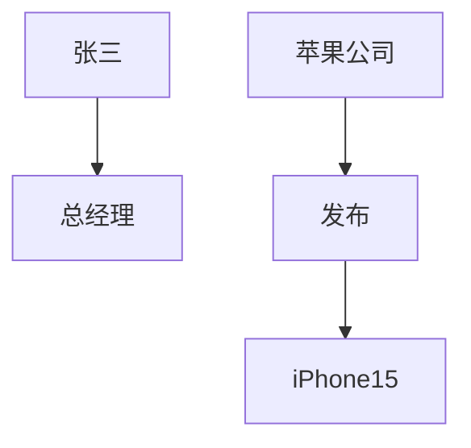
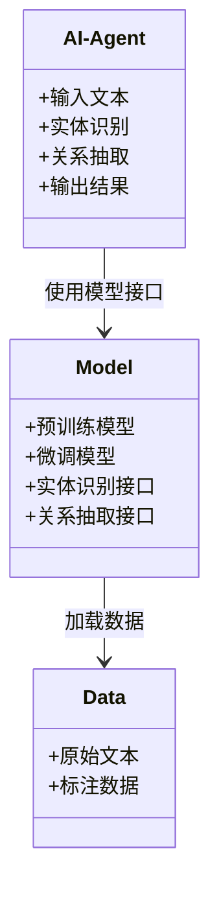
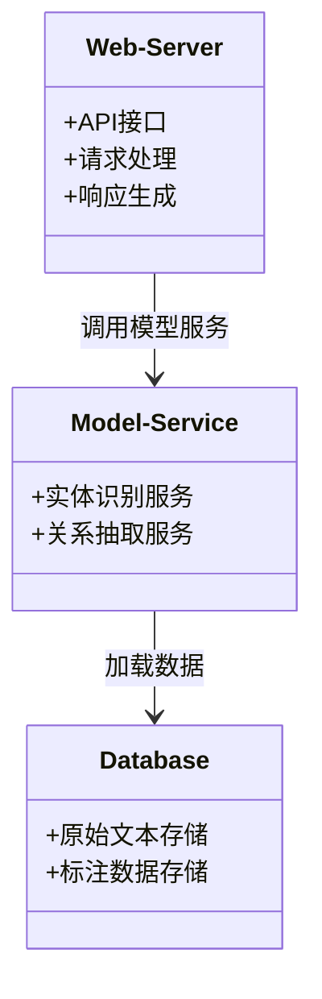
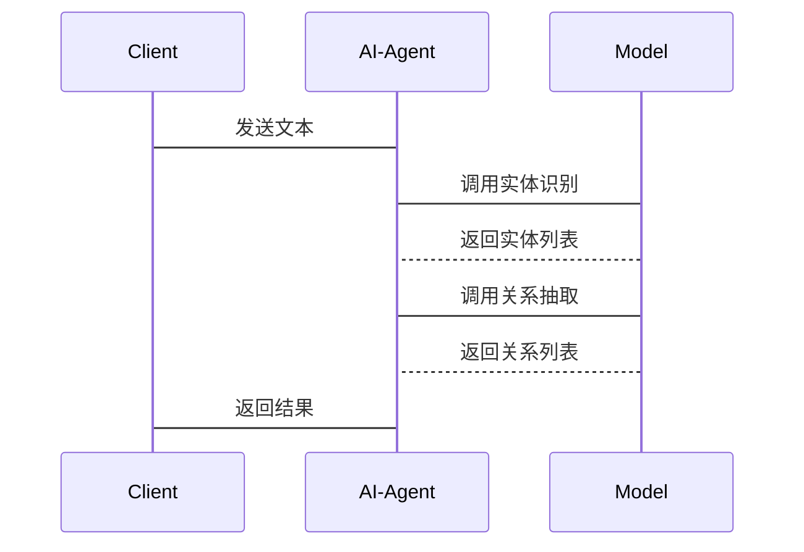

                 


# LLM支持的AI Agent关系抽取技术

---

## 关键词

- 大语言模型（LLM）
- AI Agent
- 关系抽取
- 实体识别
- 语义理解
- 流程图
- 深度学习

---

## 摘要

随着大语言模型（LLM）的快速发展，AI Agent在各个领域的应用日益广泛。关系抽取作为自然语言处理（NLP）中的核心技术，能够从文本中提取实体及其关系，为AI Agent提供重要的语义理解能力。本文详细探讨了如何利用LLM支持的AI Agent进行关系抽取，从背景介绍、核心概念、算法原理到系统架构设计、项目实战，全面解析了该技术的实现细节和应用场景。通过本文，读者可以深入理解关系抽取的核心原理，掌握基于LLM的AI Agent的设计方法，并通过实际案例掌握关系抽取技术的落地应用。

---

## 第1章：背景介绍

### 1.1 问题背景

在自然语言处理（NLP）领域，关系抽取是一项重要的技术，旨在从文本中提取实体及其之间的关系。例如，在一段文本中，我们需要识别出“张三”和“总经理”之间的关系，或者“苹果公司”和“发布iPhone15”之间的关系。

近年来，大语言模型（LLM）如GPT-3、BERT等的崛起，为关系抽取提供了强大的语义理解能力。AI Agent作为一种智能代理系统，能够通过关系抽取技术实现对复杂文本的理解和分析，从而为用户提供更智能的服务。

### 1.2 问题描述

AI Agent在实际应用中需要处理大量的文本信息，例如客服对话、社交媒体评论、新闻报道等。为了更好地理解和响应用户需求，AI Agent需要从文本中提取出实体及其关系。例如，在电商客服场景中，AI Agent需要理解用户评论中提到的“产品质量差”和“物流慢”之间的关系。

然而，传统的基于规则或传统机器学习的关系抽取技术存在以下问题：
1. **规则复杂性**：需要手动编写大量规则，难以覆盖所有场景。
2. **数据依赖性**：传统方法需要大量标注数据，且难以扩展。
3. **语义理解不足**：传统方法难以处理复杂的语义关系。

### 1.3 问题解决

基于LLM的AI Agent通过以下方式解决了上述问题：
1. **强大的语义理解能力**：LLM能够自动捕捉文本中的语义信息，减少对人工规则的依赖。
2. **自适应学习能力**：LLM可以通过微调任务特定数据，快速适应不同场景。
3. **可扩展性**：LLM支持大规模数据训练，能够处理复杂的语义关系。

### 1.4 概念结构与核心要素

关系抽取的核心要素包括：
1. **实体（Entity）**：文本中具有独立意义的个体，例如“张三”、“总经理”等。
2. **关系（Relation）**：实体之间的关联，例如“是”、“负责”、“发布”等。
3. **属性（Attribute）**：实体的附加信息，例如“职位”、“时间”等。

---

## 第2章：核心概念与联系

### 2.1 实体识别与关系抽取的对比

| 对比维度 | 实体识别 | 关系抽取 |
|----------|----------|----------|
| 目标      | 识别文本中的实体 | 识别实体之间的关系 |
| 输入      | 文本段落 | 实体识别结果 |
| 输出      | 实体列表 | 实体关系列表 |

### 2.2 ER实体关系图



### 2.3 关系抽取流程


---

## 第3章：算法原理讲解

### 3.1 基于LLM的关系抽取算法

#### 3.1.1 预训练阶段

大语言模型（LLM）通常通过预训练来学习语言的通用表示。预训练目标包括：
1. **语言模型任务**：通过预测下一个词的概率分布来学习语言模型。
2. **Masked Language Model**：随机遮蔽部分词，模型通过上下文猜测被遮蔽的词。

#### 3.1.2 微调阶段

在预训练的基础上，对特定任务进行微调：
1. **任务适配**：针对关系抽取任务，调整模型的输出层。
2. **数据标注**：使用标注数据对模型进行微调，使其适应特定领域。

#### 3.1.3 模型输出

模型输出通常包括：
1. **实体识别结果**：模型输出实体的起始和结束位置。
2. **关系抽取结果**：模型输出实体之间的关系。

#### 3.1.4 示例代码

```python
def extract_relations(text, model):
    entities = model.entity_recognition(text)
    relations = model.relation_extraction(entities)
    return relations
```

### 3.2 数学模型与公式

模型的损失函数通常包括交叉熵损失：

$$ \mathcal{L}(\theta) = -\sum_{i=1}^{n} y_i \log p(y_i) $$

其中，$\theta$ 表示模型参数，$y_i$ 表示真实标签，$p(y_i)$ 表示模型预测的概率。

---

## 第4章：系统分析与架构设计

### 4.1 项目场景介绍

以电商客服场景为例，AI Agent需要从用户评论中提取实体及其关系，例如：

- 实体：用户、产品质量
- 关系：产品质量差

### 4.2 系统功能设计



### 4.3 系统架构设计



### 4.4 系统接口设计



---

## 第5章：项目实战

### 5.1 环境安装

```bash
pip install python-transformers
pip install torch
pip install mermaid.py
```

### 5.2 核心代码实现

```python
import torch
from transformers import AutoTokenizer, AutoModelForPreTraining

class RelationExtractor:
    def __init__(self, model_name):
        self.tokenizer = AutoTokenizer.from_pretrained(model_name)
        self.model = AutoModelForPreTraining.from_pretrained(model_name)
    
    def extract_entities(self, text):
        # 实体识别逻辑
        return []
    
    def extract_relations(self, entities):
        # 关系抽取逻辑
        return []
```

### 5.3 案例分析

假设输入文本为：
"张三负责苹果公司的iPhone15发布。"

模型输出：
- 实体：张三、苹果公司、iPhone15
- 关系：负责、发布

### 5.4 项目小结

通过实战项目，我们可以看到，基于LLM的AI Agent能够高效地完成关系抽取任务，但需要注意模型的微调和数据质量。

---

## 第6章：最佳实践与小结

### 6.1 技术选型建议

1. **模型选择**：根据任务需求选择合适的LLM模型，例如BERT适合文本理解任务。
2. **数据处理**：确保标注数据的准确性和多样性。
3. **模型优化**：通过微调和参数调整提高模型性能。

### 6.2 注意事项

1. **数据隐私**：处理用户数据时需要注意隐私保护。
2. **性能优化**：优化模型推理速度，减少计算成本。
3. **错误处理**：增加错误处理机制，提高系统稳定性。

### 6.3 未来方向

1. **多语言支持**：扩展模型支持多种语言。
2. **在线学习**：实现在线微调，适应实时数据。
3. **结合知识图谱**：将关系抽取与知识图谱结合，提升语义理解能力。

---

## 第7章：总结与展望

通过本文的详细讲解，我们深入探讨了基于LLM的AI Agent关系抽取技术的核心原理和实现方法。从背景介绍到系统设计，再到项目实战，我们全面解析了该技术的各个方面。未来，随着大语言模型的不断进步，关系抽取技术将在更多领域得到广泛应用，为AI Agent的发展提供更强大的支持。

---

## 参考文献

- 论文1：《BERT: Pre-training of Deep Bidirectional Transformers for NLP》
- 论文2：《GPT-3: Language Models are Few-Shot Learners》
- 书籍：《自然语言处理入门》

