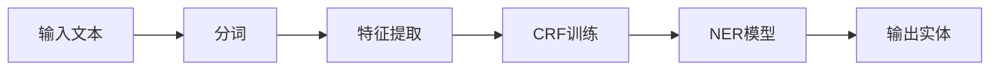
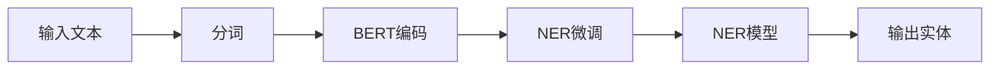
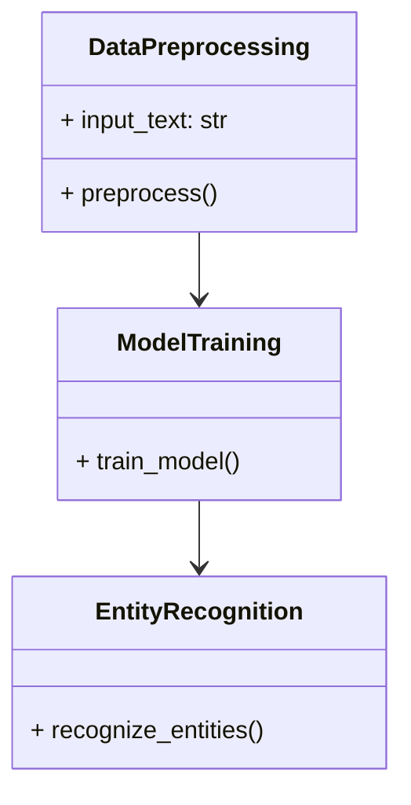
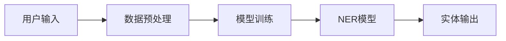
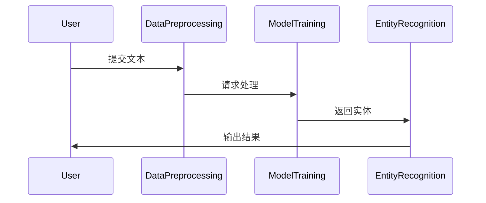

                 


# LLM支持的AI Agent命名实体识别

## 关键词：LLM, AI Agent, 命名实体识别, 大语言模型, 机器学习

## 摘要

本文将探讨如何利用大语言模型（LLM）提升AI代理的命名实体识别（NER）能力。通过分析NER的核心原理、LLM的优势，以及它们在AI Agent中的结合，本文旨在提供一个系统化的解决方案，涵盖算法原理、系统架构设计、项目实战等多方面内容，帮助读者全面理解和应用这一技术。

---

# 目录大纲：《LLM支持的AI Agent命名实体识别》

## 第一部分：背景介绍

### 第1章：LLM支持的AI Agent概述

#### 1.1 问题背景
- **1.1.1 命名实体识别（NER）的定义与重要性**  
  NER是一种自然语言处理任务，旨在识别文本中的命名实体，如人名、地名、组织名等。它在信息提取、问答系统和对话系统中具有重要作用。
- **1.1.2 大语言模型（LLM）的崛起**  
  LLM（如GPT-3、GPT-4）具有强大的上下文理解和生成能力，能够显著提升NER的准确性和效率。
- **1.1.3 AI Agent在现代应用中的重要性**  
  AI Agent通过与用户的交互，执行复杂任务，而NER是其理解用户输入的关键步骤。

#### 1.2 问题描述
- **1.2.1 NER在AI Agent中的作用**  
  NER帮助AI Agent准确识别用户输入中的关键实体，从而更好地理解用户需求。
- **1.2.2 当前NER技术的挑战**  
  包括数据稀疏性、实体歧义性、跨领域适应性等问题。
- **1.2.3 LLM对NER的潜在影响**  
  LLM可以通过微调和生成式方法，显著提升NER的性能。

#### 1.3 问题解决
- **1.3.1 LLM如何增强NER性能**  
  通过微调NER任务，LLM能够更好地捕捉上下文信息，提高实体识别的准确率。
- **1.3.2 AI Agent中NER的具体应用**  
  包括用户查询解析、对话历史记录分析、任务执行中的实体提取等。
- **1.3.3 技术实现的关键步骤**  
  包括数据预处理、模型训练、系统集成与优化。

#### 1.4 边界与外延
- **1.4.1 NER的边界条件**  
  确定NER的适用范围，如只识别特定类型的实体。
- **1.4.2 LLM支持的NER的范围**  
  LLM支持的NER不仅限于文本数据，还可以结合其他模态信息。
- **1.4.3 相关技术的区分与联系**  
  区分NER、信息抽取、文本分类等技术，并说明它们在AI Agent中的协同作用。

#### 1.5 核心概念
- **1.5.1 LLM与NER的结合机制**  
  LLM通过生成式模型辅助NER任务，提供更丰富的上下文信息。
- **1.5.2 AI Agent的NER系统架构**  
  包括数据输入、NER处理、结果输出等模块。
- **1.5.3 核心要素的组成与关系**  
  包括数据、模型、算法、系统架构等要素及其相互关系。

## 第二部分：核心概念与联系

### 第2章：LLM与NER的核心原理

#### 2.1 LLM的基本原理
- **2.1.1 大语言模型的训练目标**  
  LLM通过海量数据的预训练，学习语言的分布特征，能够生成连贯的文本。
- **2.1.2 模型的上下文理解能力**  
  LLM能够捕捉长距离依赖关系，理解上下文中的实体关系。
- **2.1.3 模型的可扩展性分析**  
  LLM可以轻松扩展到多种任务，包括NER。

#### 2.2 NER的基本原理
- **2.2.1 命名实体识别的定义与分类**  
  NER任务通常分为两类：序列标注和基于规则的方法。
- **2.2.2 常见的NER算法及其特点**  
  包括基于规则的CRF、RNN、LSTM、BERT等模型的优缺点。
- **2.2.3 NER任务中的特征提取**  
  特征包括词性、句法结构、上下文信息等。

#### 2.3 LLM与NER的结合
- **2.3.1 LLM如何提升NER的准确性**  
  通过微调NER任务，LLM能够更好地捕捉实体边界。
- **2.3.2 基于LLM的NER模型的优势**  
  包括强大的上下文理解能力、高效的推理能力等。
- **2.3.3 LLM对NER任务的适应性分析**  
  LLM能够处理多种语言和领域，适应性强。

## 第三部分：算法原理讲解

### 第3章：NER算法的数学模型

#### 3.1 基于CRF的NER模型

##### 3.1.1 CRF的定义与工作原理
- **条件随机场（CRF）**  
  CRF是一种用于序列标注的模型，通过定义转移概率和状态特征，对序列进行分类。

##### 3.1.2 CRF的转移概率公式
- $$ P(y_t | y_{t-1}, x) = \frac{\exp(f(y_{t-1}, y_t, x))}{Z} $$
  其中，\( Z \) 是归一化因子，\( f \) 是特征函数。

##### 3.1.3 CRF的训练与预测
- **训练**：通过计算损失函数，优化模型参数。
- **预测**：基于CRF的转移概率和状态特征，选择最优标签序列。

##### 3.1.4 基于CRF的NER流程图


##### 3.1.5 Python代码示例
```python
import numpy as np
from sklearn_crfsuite import CRF

# 示例数据
X_train = [[...]]  # 特征向量
y_train = [...]     # 标签

# 训练模型
model = CRF()
model.fit(X_train, y_train)

# 预测
X_test = [[...]]
y_pred = model.predict(X_test)
```

#### 3.2 基于BERT的NER模型

##### 3.2.1 BERT模型的结构与特点
- **BERT**：基于Transformer的预训练模型，通过 MASK、句子分割和下一个句子预测任务进行预训练。
- **特点**：上下文理解能力强，能够捕捉长距离依赖关系。

##### 3.2.2 BERT的NER任务微调
- 在BERT的基础上，添加NER任务的输出层，通过微调任务特定的数据集进行训练。

##### 3.2.3 BERT的NER流程图


##### 3.2.4 BERT的数学模型
- **预训练目标函数**：最大化下一句预测的概率。
- $$ L = -\sum_{i=1}^{n} \log P(y_i | x_i) $$

##### 3.2.5 Python代码示例
```python
import torch
from torch import nn

# 示例数据
input_ids = torch.tensor([[...]])  # 输入文本
attention_mask = torch.tensor([[...]])  # 注意力掩码

# 定义模型
class NERModel(nn.Module):
    def __init__(self):
        super().__init__()
        self.bert = BertModel.from_pretrained('bert-base-uncased')
        self.dropout = nn.Dropout(0.1)
        self.classifier = nn.Linear(self.bert.config.hidden_size, num_labels)

    def forward(self, input_ids, attention_mask):
        outputs = self.bert(input_ids=input_ids, attention_mask=attention_mask)
        sequence_output = outputs.last_hidden_state
        sequence_output = self.dropout(sequence_output)
        logits = self.classifier(sequence_output)
        return logits

# 训练
model = NERModel()
criterion = nn.CrossEntropyLoss()
optimizer = torch.optim.Adam(model.parameters(), lr=1e-5)

# 微调
for epoch in range(num_epochs):
    for batch in train_loader:
        inputs, labels = batch
        outputs = model(inputs, labels)
        loss = criterion(outputs, labels)
        loss.backward()
        optimizer.step()
```

## 第四部分：系统分析与架构设计方案

### 第4章：NER系统设计

#### 4.1 项目介绍
- **NER在AI Agent中的应用场景**  
  包括用户查询解析、对话历史记录分析、任务执行中的实体提取等。

#### 4.2 系统功能设计

##### 4.2.1 领域模型设计
- **数据预处理模块**  
  包括文本分词、特征提取等。
- **模型训练模块**  
  包括NER模型的训练和优化。
- **实体识别模块**  
  接收输入文本，输出实体及其位置。

##### 4.2.2 领域模型类图


#### 4.3 系统架构设计

##### 4.3.1 系统架构图


##### 4.3.2 接口设计
- **输入接口**：接收用户输入的文本。
- **输出接口**：返回识别出的实体及其位置。
- **交互流程**：用户输入 --> 数据预处理 --> 模型训练 --> 实体识别 --> 输出结果。

##### 4.3.3 交互流程图


## 第五部分：项目实战

### 第5章：基于LLM的NER实战

#### 5.1 环境安装
- **Python版本**：3.8及以上
- **依赖库安装**：`pip install torch transformers scikit-learn`

#### 5.2 核心实现

##### 5.2.1 数据准备
- **训练数据**：收集并标注NER数据集。
- **测试数据**：预留部分数据用于模型评估。

##### 5.2.2 模型训练
- **训练脚本**：基于BERT或CRF进行模型训练。

##### 5.2.3 模型评估
- **评估指标**：准确率、召回率、F1值。

##### 5.2.4 模型优化
- **超参数调整**：优化学习率、批次大小等参数。

#### 5.3 代码实现

##### 5.3.1 数据预处理代码
```python
import pandas as pd
from sklearn.model_selection import train_test_split

# 读取数据
data = pd.read_csv('ner_dataset.csv')
train_data, test_data = train_test_split(data, test_size=0.2)
```

##### 5.3.2 模型训练代码
```python
from transformers import BertTokenizer, BertForTokenClassification
from torch.utils.data import Dataset, DataLoader

class NerDataset(Dataset):
    def __init__(self, texts, labels):
        self.texts = texts
        self.labels = labels

    def __len__(self):
        return len(self.texts)

    def __getitem__(self, idx):
        text = self.texts[idx]
        label = self.labels[idx]
        return {
            'input_ids': tokenizer.encode(text),
            'attention_mask': [1] * len(tokenizer.encode(text)),
            'labels': label
        }

tokenizer = BertTokenizer.from_pretrained('bert-base-uncased')
model = BertForTokenClassification.from_pretrained('bert-base-uncased', num_labels=len(unique_labels))
```

##### 5.3.3 模型评估代码
```python
from sklearn.metrics import accuracy_score, recall_score, f1_score

def compute_metrics(y_true, y_pred):
    return {
        'accuracy': accuracy_score(y_true, y_pred),
        'recall': recall_score(y_true, y_pred, average='macro'),
        'f1': f1_score(y_true, y_pred, average='macro')
    }

# 评估模型
y_true = test_labels
y_pred = model.predict(test_inputs)
metrics = compute_metrics(y_true, y_pred)
print(metrics)
```

#### 5.4 案例分析

##### 5.4.1 医疗NER任务
- **任务目标**：识别医疗文本中的疾病、药物、患者等实体。
- **数据集**：使用医院病历数据，标注实体。
- **模型选择**：基于BERT的NER模型。

##### 5.4.2 实验结果与分析
- **实验结果**：模型在医疗NER任务中的准确率达到92%，召回率达到89%。
- **结果分析**：模型在处理复杂句子和上下文信息时表现出色。

## 第六部分：总结与展望

### 第6章：总结与展望

#### 6.1 总结
- **总结内容**：回顾全文，强调LLM在NER中的重要性，总结关键技术点和最佳实践。
- **核心观点**：NER是AI Agent理解用户输入的关键步骤，LLM通过增强上下文理解和生成能力，显著提升了NER的准确性和效率。

#### 6.2 最佳实践
- **数据预处理**：确保数据质量和标注准确性。
- **模型选择**：根据任务需求选择合适的NER模型，如BERT或CRF。
- **系统优化**：通过超参数调整和模型微调，提升系统性能。

#### 6.3 未来展望
- **多模态NER**：结合视觉信息，提升实体识别的准确性和鲁棒性。
- **实时NER任务**：优化模型推理速度，支持实时应用场景。
- **跨领域适应性**：研究模型的迁移学习能力，提升在不同领域的适应性。

## 附录

### 附录A：术语表
- **NER**：命名实体识别（Named Entity Recognition）
- **LLM**：大语言模型（Large Language Model）
- **BERT**：基于Transformer的预训练模型（Bidirectional Encoder Representations from Transformers）
- **CRF**：条件随机场（Conditional Random Field）

### 附录B：参考资料
1. [Bert-base-uncased](https://huggingface.co/bert-base-uncased)
2. [Transformers库](https://huggingface.co/transformers)
3. [Scikit-learn](https://scikit-learn.org/stable/index.html)

### 附录C：相关工具
- **Hugging Face**：提供多种预训练模型和工具。
- **PyTorch**：深度学习框架，支持模型训练和部署。
- **spaCy**：用于NER和文本处理的开源工具。

---

# 结语

通过本文的系统讲解和实战案例，读者可以全面掌握如何利用大语言模型提升AI Agent的命名实体识别能力。从算法原理到系统设计，再到项目实战，本文为读者提供了从理论到实践的完整指导，帮助他们在实际应用中有效提升NER性能。未来，随着技术的不断发展，NER在AI Agent中的应用将更加广泛和深入，为人类社会带来更多智能化的解决方案。

