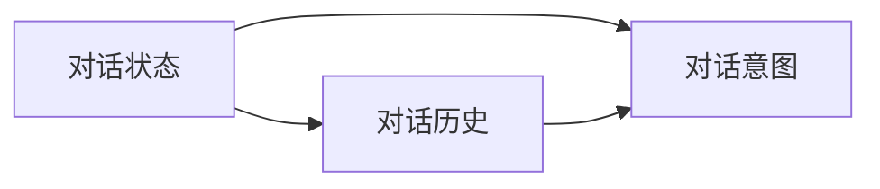

                 


# LLM支持的AI Agent对话状态跟踪

> 关键词：大语言模型、对话状态跟踪、AI智能体、自然语言处理、状态管理、LLM应用

> 摘要：本文深入探讨了在AI Agent中利用大语言模型（LLM）进行对话状态跟踪的技术与方法。通过分析对话状态跟踪的核心概念、算法原理、系统架构及项目实战，结合丰富的图表和代码示例，全面阐述了如何实现高效且准确的对话状态管理，为构建智能对话系统提供了理论与实践的双重指导。

---

## 第一部分: LLM支持的AI Agent对话状态跟踪基础

### 第1章: 对话状态跟踪的背景与问题

#### 1.1 对话状态跟踪的定义与重要性
对话状态跟踪是AI Agent实现智能对话的核心技术，负责记录和更新对话过程中的关键信息，确保系统能够准确理解用户意图并保持对话连贯性。其重要性体现在以下几个方面：

- **准确理解用户需求**：通过跟踪对话状态，AI Agent能够逐步明确用户的真实需求，避免误解。
- **提升对话流畅性**：对话状态跟踪帮助系统维护上下文信息，使对话更加自然流畅。
- **支持复杂场景**：在多轮对话或多任务场景中，对话状态跟踪能够有效管理复杂信息，确保系统稳定运行。

#### 1.2 问题背景与挑战
在实际应用中，对话状态跟踪面临诸多挑战：

- **信息不完整**：用户的表达可能存在歧义或不完整信息，增加了状态识别的难度。
- **动态变化**：对话过程中，用户意图可能随时变化，要求系统能够快速响应并调整状态。
- **数据稀疏性**：某些场景下，训练数据有限，导致模型泛化能力不足。

引入大语言模型（LLM）能够有效缓解这些问题。LLM的强大语义理解和生成能力为对话状态跟踪提供了新的解决方案，通过上下文关联和意图识别，显著提升了状态跟踪的准确性和鲁棒性。

#### 1.3 问题解决与边界
- **问题解决思路**：利用LLM的特征提取能力和深度语义理解，结合统计学习方法，构建多层次对话状态跟踪模型。
- **边界与限制**：对话状态跟踪仅关注对话过程中的信息提取与状态更新，不涉及具体业务逻辑的执行。
- **相关概念外延**：对话状态跟踪与对话管理、自然语言理解等密切相关，共同构成了智能对话系统的完整架构。

---

### 第2章: 核心概念与联系

#### 2.1 对话状态跟踪的核心原理
对话状态跟踪的基本原理是通过分析对话历史和当前输入，推断用户的意图和需求，从而更新对话状态。具体步骤包括：

1. **信息提取**：从用户输入中提取关键词、实体信息等关键元素。
2. **意图识别**：基于提取的信息，判断用户的意图类别。
3. **状态更新**：结合当前意图和对话历史，更新对话状态。

#### 2.2 核心概念对比
通过对比分析，明确对话状态跟踪中的关键概念及其关系：

| 概念 | 定义 | 关系 |
|------|------|------|
| 对话状态 | 当前对话的语义信息 | 包含对话意图和对话历史 |
| 对话意图 | 用户的直接需求 | 驱动对话状态的变化 |
| 对话历史 | 历史对话记录 | 支撑对话意图的识别 |

#### 2.3 实体关系图


---

## 第二部分: 对话状态跟踪的算法原理

### 第3章: 基于LLM的对话状态跟踪算法

#### 3.1 基于HMM的对话状态跟踪
- **基本原理**：HMM（隐马尔可夫模型）通过状态转移和观测概率建模对话过程。
- **流程图**：
  ```mermaid
  graph LR
      A[开始] --> B[输入处理]
      B --> C[状态转移]
      C --> D[概率计算]
      D --> E[状态更新]
      E --> F[结束]
  ```

- **Python实现示例**：
  ```python
  # HMM参数初始化
  states = ['start', 'intent1', 'intent2']
  transition_prob = {
      'start': {'intent1': 0.6, 'intent2': 0.4},
      'intent1': {'intent1': 0.7, 'intent2': 0.3},
      'intent2': {'intent1': 0.4, 'intent2': 0.6}
  }
  ```

#### 3.2 基于CRF的对话状态跟踪
- **基本原理**：CRF（条件随机场）通过全局优化建模对话状态。
- **流程图**：
  ```mermaid
  graph LR
      A[开始] --> B[特征提取]
      B --> C[状态转移]
      C --> D[概率计算]
      D --> E[状态更新]
      E --> F[结束]
  ```

- **Python实现示例**：
  ```python
  # CRF模型训练
  from sklearn_crfsuite import CRF
  model = CRF()
  model.fit(X_train, y_train)
  ```

#### 3.3 基于DST的对话状态跟踪
- **基本原理**：DST（对话状态跟踪）结合领域知识和上下文信息，实现精准的状态更新。
- **流程图**：
  ```mermaid
  graph LR
      A[开始] --> B[输入处理]
      B --> C[意图识别]
      C --> D[状态更新]
      D --> E[结束]
  ```

- **Python实现示例**：
  ```python
  # DST状态更新
  def update_state(current_state, user_input):
      # 判断意图
      intent = identify_intent(user_input)
      # 更新状态
      new_state = merge_states(current_state, intent)
      return new_state
  ```

---

## 第三部分: 系统分析与架构设计

### 第4章: 对话状态跟踪系统的架构设计

#### 4.1 应用场景介绍
对话状态跟踪广泛应用于智能客服、虚拟助手、教育机器人等领域，帮助系统理解用户需求，提供个性化服务。

#### 4.2 系统功能设计
- **功能模块**：
  - 对话历史记录
  - 对话意图识别
  - 对话状态更新
- **领域模型类图**：
  ```mermaid
  classDiagram
      class DialogState {
          state_id : int
          state_info : dict
      }
      class DialogHistory {
          history_id : int
          conversation : list[DialogState]
      }
      class DialogTracker {
          track(DialogHistory, DialogState)
      }
  ```

#### 4.3 系统架构设计
- **分层架构**：
  ```mermaid
  graph LR
      A[用户输入] --> B[对话历史模块]
      B --> C[对话意图识别模块]
      C --> D[对话状态跟踪模块]
      D --> E[输出结果]
  ```

#### 4.4 接口设计与交互流程
- **接口设计**：
  - 输入接口：接收用户输入和对话历史。
  - 输出接口：返回更新后的对话状态和响应信息。
- **交互流程图**：
  ```mermaid
  sequenceDiagram
      participant 用户
      participant 对话历史模块
      participant 对话意图识别模块
      participant 对话状态跟踪模块
      用户->对话历史模块: 提供对话历史
      谈话历史模块->对话意图识别模块: 提供上下文信息
      对话意图识别模块->对话状态跟踪模块: 返回意图信息
      对话状态跟踪模块->用户: 返回更新状态
  ```

---

## 第四部分: 项目实战

### 第5章: 基于LLM的对话状态跟踪实现

#### 5.1 项目环境安装
```bash
pip install transformers torch
```

#### 5.2 核心代码实现
```python
# 对话状态跟踪类
class DialogStateTracker:
    def __init__(self):
        self.current_state = {}

    def update_state(self, input_text):
        # 使用LLM进行意图识别
        intent = self.get_intent(input_text)
        # 更新状态
        self.current_state['intent'] = intent

    def get_intent(self, text):
        # 使用LLM模型进行意图识别
        pass
```

#### 5.3 代码解读与分析
- **代码解读**：上述代码定义了一个对话状态跟踪类，通过LLM模型识别意图并更新对话状态。
- **实现细节**：`get_intent`方法需要集成LLM模型，如GPT-3或BERT，进行意图分类。

#### 5.4 案例分析
以智能客服场景为例，用户输入“我需要取消订单”，系统识别意图“取消订单”，更新对话状态为`intent: cancel_order`。

---

## 第五部分: 总结与展望

### 第6章: 最佳实践与总结
- **总结**：本文详细探讨了基于LLM的对话状态跟踪技术，从算法原理到系统架构，再到项目实战，为构建高效智能对话系统提供了全面指导。
- **注意事项**：
  - 数据质量对模型性能影响显著，需确保训练数据的多样性和代表性。
  - 状态跟踪需与具体业务场景结合，避免泛化模型的局限性。

### 6.2 未来研究方向
- **多模态对话状态跟踪**：结合视觉、语音等多模态信息，提升状态跟踪的准确性和鲁棒性。
- **实时对话优化**：研究实时更新的对话状态跟踪算法，提升对话系统的响应速度和交互体验。
- **轻量化模型**：探索更高效的模型架构，降低计算资源消耗，适用于边缘计算场景。

---

通过以上章节的详细阐述，本文为开发者和研究者提供了关于LLM支持的AI Agent对话状态跟踪的全面技术指南，结合理论与实践，助力构建更智能、更高效的对话系统。

