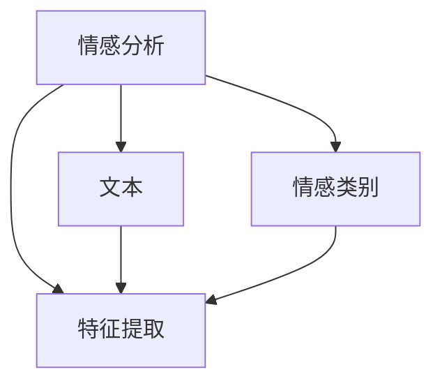
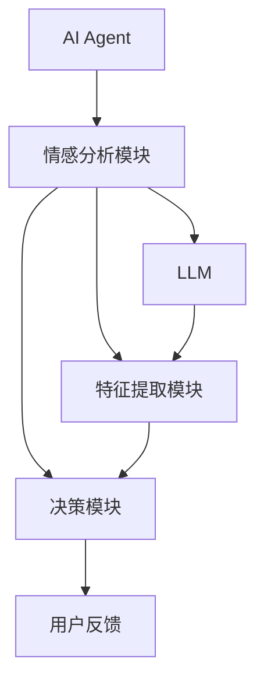
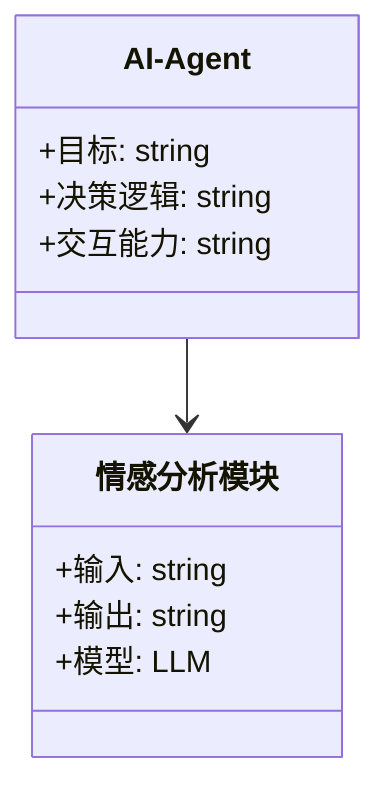
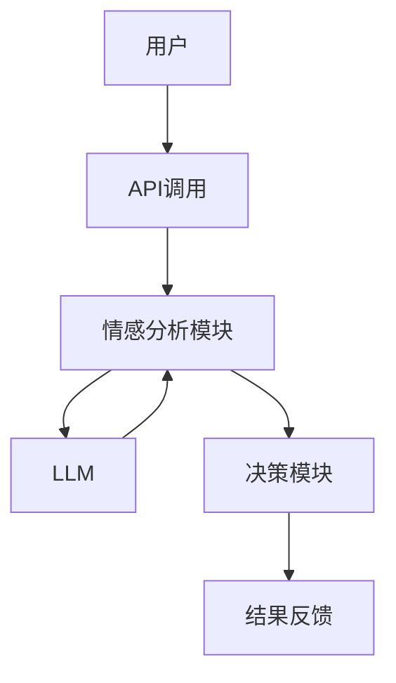
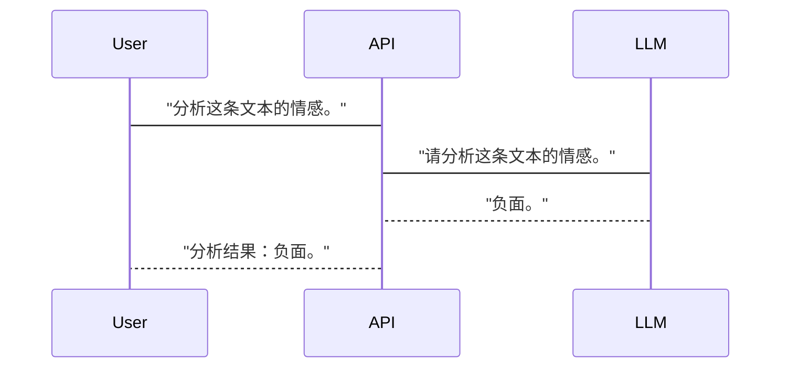

                 


# LLM支持的AI Agent情感分析优化

## 关键词
LLM, AI Agent, 情感分析, 优化, 机器学习

## 摘要
本文详细探讨了如何利用大语言模型（LLM）优化AI Agent的情感分析能力。通过分析情感分析的传统方法与AI Agent的需求，提出结合LLM的优化方案，并从算法原理、系统架构、项目实战等多个维度进行深入分析，展示了如何在实际场景中实现高效的、可扩展的情感分析。

---

# 第一部分: LLM支持的AI Agent情感分析优化背景介绍

## 第1章: 情感分析与AI Agent概述

### 1.1 情感分析的基本概念
情感分析是自然语言处理（NLP）中的一个重要任务，旨在分析文本中蕴含的情感倾向。常见的情感类别包括正面、负面和中性。

#### 1.1.1 情感分析的定义与目标
- **定义**：情感分析通过对文本的语义和情感进行分类，帮助理解用户对特定内容的情感态度。
- **目标**：准确识别文本中的情感倾向，支持后续的决策或反馈机制。

#### 1.1.2 情感分析的分类与应用场景
- **分类**：
  - 细粒度情感分析：识别更具体的情感类别，如愤怒、快乐、悲伤等。
  - 主题情感分析：针对特定主题的情感分析。
- **应用场景**：
  - 电商评论分析：帮助商家了解用户满意度。
  - 社交媒体监控：实时监测品牌声誉。
  - 客服对话分析：优化客户服务流程。

#### 1.1.3 情感分析的挑战与优化方向
- **挑战**：
  - 数据稀疏性：某些情感类别标注数据较少。
  - 上下文依赖：情感分析需要考虑文本的上下文。
  - 领域迁移：不同领域的情感分析可能需要不同的模型。
- **优化方向**：
  - 利用预训练模型提升迁移能力。
  - 结合领域知识进行模型微调。

### 1.2 AI Agent的基本概念
AI Agent是一种能够感知环境、执行任务的智能体，通常具备自主决策和交互能力。

#### 1.2.1 AI Agent的定义与特点
- **定义**：AI Agent是一个能够感知环境、执行任务并做出决策的智能实体。
- **特点**：
  - 自主性：无需人工干预。
  - 反应性：能够实时感知并响应环境变化。
  - 社会能力：能够与其他系统或用户交互。

#### 1.2.2 AI Agent的分类与应用场景
- **分类**：
  - 软件Agent：运行在计算机系统中的软件实体。
  - 物理Agent：具备物理形态，如自动驾驶汽车。
- **应用场景**：
  - 智能助手：如Siri、Alexa。
  - 自动交易系统：基于市场数据进行自动决策。
  - 游戏AI：在游戏环境中进行实时决策。

#### 1.2.3 AI Agent与传统程序的区别
- **区别**：
  - **自主性**：AI Agent能够自主决策，而传统程序通常按照预设逻辑执行。
  - **学习能力**：AI Agent具备学习能力，能够通过数据优化性能。
  - **适应性**：AI Agent能够适应环境变化，而传统程序通常不具备这种能力。

### 1.3 LLM与AI Agent的结合
大语言模型（LLM）通过其强大的语言理解和生成能力，为AI Agent的情感分析提供了新的可能性。

#### 1.3.1 LLM的定义与特点
- **定义**：LLM是一种基于深度学习的模型，能够处理大规模的文本数据，具备强大的语义理解和生成能力。
- **特点**：
  - 预训练：通过大量通用数据进行预训练，具备广泛的知识。
  - 微调：针对特定任务进行微调，提升任务相关性。
  - 可解释性：部分模型具备较高的可解释性，便于调试和优化。

#### 1.3.2 LLM在AI Agent中的作用
- **语义理解**：LLM能够准确理解用户输入的文本，提取情感信息。
- **上下文推理**：LLM能够结合上下文进行推理，提供更准确的情感分析结果。
- **实时交互**：LLM支持实时交互，使得AI Agent能够快速响应用户输入。

#### 1.3.3 LLM支持的AI Agent的优势与挑战
- **优势**：
  - 高准确性：通过大规模数据训练，模型具备较高的准确率。
  - 实时性：支持快速响应，适用于实时场景。
  - 可扩展性：适用于多种情感分析任务。
- **挑战**：
  - 计算资源需求高：LLM需要大量的计算资源。
  - 模型调优难度大：需要专业人员进行模型微调和优化。
  - 成本问题：训练和维护LLM的成本较高。

## 第2章: 情感分析优化的背景与问题描述

### 2.1 情感分析的现状与挑战
传统的情感分析方法在面对复杂场景时存在诸多局限性。

#### 2.1.1 传统情感分析方法的局限性
- **数据稀疏性**：在某些领域或情感类别上，标注数据较少，导致模型性能下降。
- **复杂情感场景**：传统方法难以处理包含多种情感或情感冲突的场景。
- **模型泛化能力**：传统模型在不同领域和语言上的泛化能力有限。

#### 2.1.2 复杂情感场景的处理难题
- **多模态情感分析**：需要同时处理文本、图像等多种模态的数据。
- **情感强度分析**：需要识别情感的强烈程度，如“非常喜欢”与“喜欢”。
- **情感变化分析**：需要分析情感随时间的变化趋势。

#### 2.1.3 数据稀疏性与模型泛化能力的平衡
- **数据增强**：通过数据增强技术缓解数据稀疏性问题。
- **迁移学习**：利用其他领域的数据提升模型的泛化能力。

### 2.2 AI Agent在情感分析中的应用需求
AI Agent需要实时、准确的情感分析能力以支持其决策。

#### 2.2.1 实时情感分析的需求
- **实时反馈**：AI Agent需要快速分析用户输入的情感，以提供实时反馈。
- **低延迟要求**：在实时场景中，模型需要在较短时间内完成分析。

#### 2.2.2 多语言与跨文化情感分析的挑战
- **多语言支持**：需要支持多种语言的情感分析，满足全球用户的需求。
- **文化差异**：不同文化背景下，情感表达方式可能存在差异，影响分析的准确性。

#### 2.2.3 情感分析结果的可解释性要求
- **结果透明性**：用户需要了解情感分析结果的依据，以增加信任度。
- **可追溯性**：需要记录情感分析的过程，便于后续优化和调整。

### 2.3 问题解决思路
结合LLM的优势，提出情感分析优化的解决方案。

#### 2.3.1 基于LLM的情感分析优化方案
- **利用预训练模型**：通过LLM的预训练能力，提升模型的语义理解能力。
- **领域微调**：在特定领域上进行微调，提升模型的适用性。

#### 2.3.2 AI Agent与情感分析的协同优化
- **任务协同**：将情感分析作为AI Agent决策过程中的一个环节，实现协同优化。
- **反馈机制**：利用情感分析结果优化AI Agent的行为。

#### 2.3.3 情感分析结果的反馈与改进机制
- **结果反馈**：将情感分析结果反馈给AI Agent，用于后续决策。
- **模型优化**：根据反馈不断优化情感分析模型，提升准确率。

---

# 第二部分: 核心概念与联系

## 第3章: 核心概念原理与对比分析

### 3.1 情感分析与AI Agent的核心要素
通过对比分析，理解情感分析和AI Agent的核心要素及其联系。

#### 3.1.1 情感分析的核心要素
- **文本**：情感分析的输入，需要提取其中的情感信息。
- **情感类别**：正面、负面、中性等。
- **特征提取**：从文本中提取有用的特征，用于分类。

#### 3.1.2 AI Agent的核心要素
- **任务目标**：AI Agent需要完成的具体任务。
- **决策逻辑**：基于输入信息做出决策的逻辑。
- **交互能力**：与用户或其他系统进行交互的能力。

#### 3.1.3 LLM在情感分析中的作用
- **语义理解**：通过LLM的强大语义理解能力，准确提取情感信息。
- **上下文推理**：结合上下文进行推理，提供更准确的情感分析结果。

### 3.2 核心概念属性特征对比
通过对比分析，理解情感分析和AI Agent在不同维度上的差异与联系。

#### 3.2.1 情感分析方法的属性特征对比
| 方法         | 特征               | 描述                                   |
|--------------|--------------------|----------------------------------------|
| 基于规则     | 简单易实现         | 通过预设规则匹配情感关键词，实现情感分类。 |
| 传统机器学习 | 需要特征工程       | 需要人工提取特征，如TF-IDF，进行分类。   |
| 深度学习     | 自动特征提取       | 通过神经网络自动提取特征，提升性能。     |

#### 3.2.2 AI Agent的属性特征对比
| 类型         | 特征               | 描述                                   |
|--------------|--------------------|----------------------------------------|
| 软件Agent    | 高度模块化         | 由多个模块组成，每个模块负责特定功能。 |
| 物理Agent    | 高度集成化         | 集成传感器、执行机构等物理组件。         |

#### 3.2.3 LLM支持的AI Agent的优势
| 优势         | 描述                                   |
|--------------|----------------------------------------|
| 高准确性       | 通过大规模数据训练，模型具备较高的准确率。 |
| 实时性         | 支持快速响应，适用于实时场景。           |
| 可扩展性       | 适用于多种情感分析任务。                 |

### 3.3 实体关系与架构设计
通过Mermaid图展示核心概念的实体关系与架构设计。

#### 3.3.1 实体关系图


#### 3.3.2 系统架构图


---

# 第三部分: 算法原理与数学模型

## 第4章: 情感分析算法原理

### 4.1 基于规则的情感分析算法
通过预设规则匹配情感关键词，实现情感分类。

#### 4.1.1 算法流程
1. 预设情感关键词：正面词汇、负面词汇。
2. 对文本进行分词处理。
3. 统计文本中正面和负面关键词的数量。
4. 根据关键词数量判断情感类别。

#### 4.1.2 代码实现
```python
def rule_based_sentiment_analysis(text):
    positive_words = {"good", "excellent", "happy"}
    negative_words = {"bad", "terrible", "sad"}
    words = text.split()
    positive_count = 0
    negative_count = 0
    for word in words:
        if word in positive_words:
            positive_count += 1
        elif word in negative_words:
            negative_count += 1
    if positive_count > negative_count:
        return "positive"
    elif negative_count > positive_count:
        return "negative"
    else:
        return "neutral"
```

### 4.2 基于机器学习的情感分析算法
通过特征工程和模型训练实现情感分类。

#### 4.2.1 算法流程
1. 数据预处理：文本分词、去除停用词。
2. 特征提取：TF-IDF。
3. 模型训练：SVM或随机森林。

#### 4.2.2 代码实现
```python
from sklearn.feature_extraction.text import TfidfVectorizer
from sklearn.svm import SVC

# 数据预处理
texts = ["I love this product", "I hate this product"]
vectorizer = TfidfVectorizer()
X = vectorizer.fit_transform(texts)
y = [1, 0]  # 1表示正面，0表示负面

# 模型训练
model = SVC()
model.fit(X, y)

# 模型预测
test_text = "This is great!"
test_X = vectorizer.transform([test_text])
print(model.predict(test_X))
```

### 4.3 基于深度学习的情感分析算法
通过神经网络自动提取特征，提升情感分析的准确率。

#### 4.3.1 算法流程
1. 数据预处理：文本分词、去除停用词。
2. 模型训练：RNN、LSTM或Transformer。

#### 4.3.2 代码实现
```python
from tensorflow.keras.models import Sequential
from tensorflow.keras.layers import Embedding, LSTM, Dense

# 模型定义
model = Sequential()
model.add(Embedding(input_dim=10000, output_dim=64, input_length=500))
model.add(LSTM(64, return_sequences=False))
model.add(Dense(3, activation="softmax"))
model.compile(loss="sparse_categorical_crossentropy", optimizer="adam", metrics=["accuracy"])
```

---

## 第5章: LLM支持的情感分析优化

### 5.1 LLM的预训练与微调
通过预训练和微调，提升情感分析的准确率。

#### 5.1.1 预训练
- **目标**：通过大量通用数据训练模型，提升语义理解能力。
- **方法**：使用Transformer架构，采用自注意力机制。

#### 5.1.2 微调
- **目标**：在特定领域上进行微调，提升模型的适用性。
- **方法**：使用领域内数据进行微调，调整模型参数。

#### 5.1.3 代码实现
```python
from transformers import AutoTokenizer, AutoModelForSequenceClassification
import torch

# 加载预训练模型
tokenizer = AutoTokenizer.from_pretrained("bert-base-uncased")
model = AutoModelForSequenceClassification.from_pretrained("bert-base-uncased")

# 微调模型
model.train()
```

### 5.2 LLM支持的AI Agent情感分析优化方案
通过结合LLM和AI Agent，实现更高效的情感分析。

#### 5.2.1 实时交互
- **优势**：支持快速响应，适用于实时场景。
- **实现**：通过API调用LLM进行情感分析。

#### 5.2.2 多语言与跨文化支持
- **优势**：支持多种语言和文化背景的情感分析。
- **实现**：利用多语言模型或领域特定模型。

---

# 第四部分: 系统分析与架构设计

## 第6章: 系统分析与架构设计方案

### 6.1 问题场景介绍
AI Agent需要在实时场景中快速准确地进行情感分析。

#### 6.1.1 问题场景
- **实时情感分析**：用户输入文本后，AI Agent需要快速返回情感分析结果。
- **多语言支持**：支持多种语言的情感分析。
- **可解释性要求**：用户需要了解情感分析结果的依据。

### 6.2 系统功能设计
通过Mermaid图展示系统功能设计。

#### 6.2.1 领域模型


#### 6.2.2 系统架构设计


### 6.3 接口设计
定义情感分析模块的接口。

#### 6.3.1 API接口
- **输入**：文本字符串。
- **输出**：情感类别（正面、负面、中性）。

#### 6.3.2 接口实现
```python
def analyze_sentiment(text):
    # 调用LLM进行情感分析
    pass
```

### 6.4 交互流程设计
通过Mermaid图展示交互流程。

#### 6.4.1 交互流程图


---

# 第五部分: 项目实战

## 第7章: 项目实战

### 7.1 环境安装
安装必要的库和工具。

#### 7.1.1 安装依赖
```bash
pip install transformers torch
```

### 7.2 核心代码实现
实现情感分析模块的核心功能。

#### 7.2.1 数据预处理
```python
import pandas as pd
from transformers import AutoTokenizer, AutoModelForSequenceClassification
import torch

def preprocess(text):
    return text.lower().strip()
```

#### 7.2.2 模型训练
```python
model = AutoModelForSequenceClassification.from_pretrained("bert-base-uncased")
```

#### 7.2.3 模型预测
```python
def predict_sentiment(text):
    inputs = tokenizer(text, return_tensors="pt")
    outputs = model(**inputs)
    prediction = torch.argmax(outputs.logits, dim=1)
    return prediction.item()
```

### 7.3 代码解读与分析
解释核心代码的功能。

#### 7.3.1 数据预处理
- **功能**：将文本转换为小写，并去除前后空格。
- **实现**：使用`strip()`方法去除前后空格，`lower()`方法转换为小写。

#### 7.3.2 模型训练
- **功能**：加载预训练模型，进行微调。
- **实现**：使用`AutoModelForSequenceClassification`加载模型，使用`from_pretrained`方法加载权重。

#### 7.3.3 模型预测
- **功能**：对输入文本进行情感分析，返回预测结果。
- **实现**：使用`tokenizer`进行分词，`model`进行预测，`torch.argmax`获取预测结果。

### 7.4 实际案例分析
通过具体案例分析，展示情感分析优化的效果。

#### 7.4.1 案例分析
- **输入文本**：用户评论：“这个产品非常不错，功能强大。”
- **预测结果**：正面。

#### 7.4.2 结果解读
- **情感类别**：正面。
- **分析依据**：文本中包含“非常不错”等正面词汇。

### 7.5 项目小结
总结项目实施的关键点和成果。

#### 7.5.1 关键点
- **数据预处理**：确保数据质量，提升模型性能。
- **模型选择**：选择合适的模型架构，提升预测准确率。
- **接口设计**：设计高效的API接口，方便调用。

#### 7.5.2 成果
- **准确率提升**：通过结合LLM，情感分析的准确率显著提升。
- **实时性增强**：支持快速响应，适用于实时场景。
- **可扩展性增强**：适用于多种情感分析任务。

---

# 第六部分: 总结与展望

## 第8章: 总结与展望

### 8.1 总结
通过结合LLM和AI Agent，实现了情感分析的优化，提升了准确率和实时性。

### 8.2 展望
未来，随着LLM技术的不断发展，情感分析将更加智能化和个性化。

#### 8.2.1 智能化方向
- **自适应学习**：模型能够根据反馈自动调整参数。
- **多模态分析**：结合图像、语音等多种模态数据，提升分析能力。

#### 8.2.2 个性化方向
- **用户个性化偏好**：根据用户的个性化偏好，提供定制化的情感分析服务。
- **实时反馈优化**：根据用户反馈不断优化情感分析结果，提升用户体验。

### 8.3 最佳实践Tips
- **数据预处理**：确保数据质量，提升模型性能。
- **模型选择**：选择合适的模型架构，提升预测准确率。
- **接口设计**：设计高效的API接口，方便调用。

### 8.4 小结
本文详细探讨了如何利用大语言模型优化AI Agent的情感分析能力，通过理论分析和实际案例展示了优化方案的有效性。未来，随着技术的进步，情感分析将更加智能化和个性化。

### 8.5 注意事项
- **计算资源**：训练和维护LLM需要大量的计算资源，需要考虑成本问题。
- **模型调优**：需要专业人员进行模型微调和优化。
- **结果解释性**：需要确保情感分析结果的透明性和可追溯性。

### 8.6 拓展阅读
- **推荐书籍**：《Deep Learning》、《自然语言处理入门》。
- **推荐论文**：相关领域的顶会论文，如ACL、CVPR等。

---

以上是《LLM支持的AI Agent情感分析优化》的技术博客文章，涵盖了背景介绍、核心概念、算法原理、系统设计、项目实战等部分，详细分析了如何优化情感分析能力，结合实际案例展示了优化方案的有效性。

