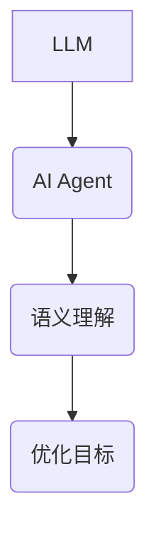
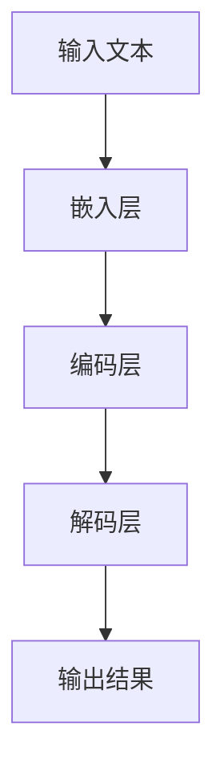
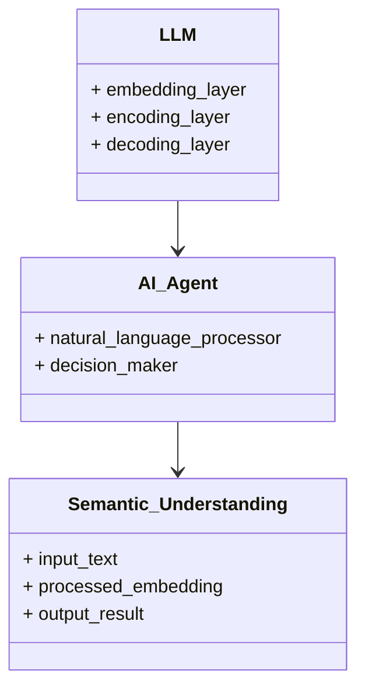
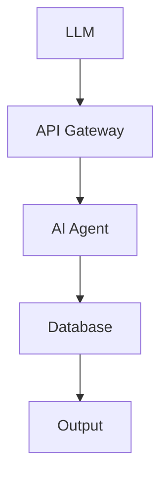
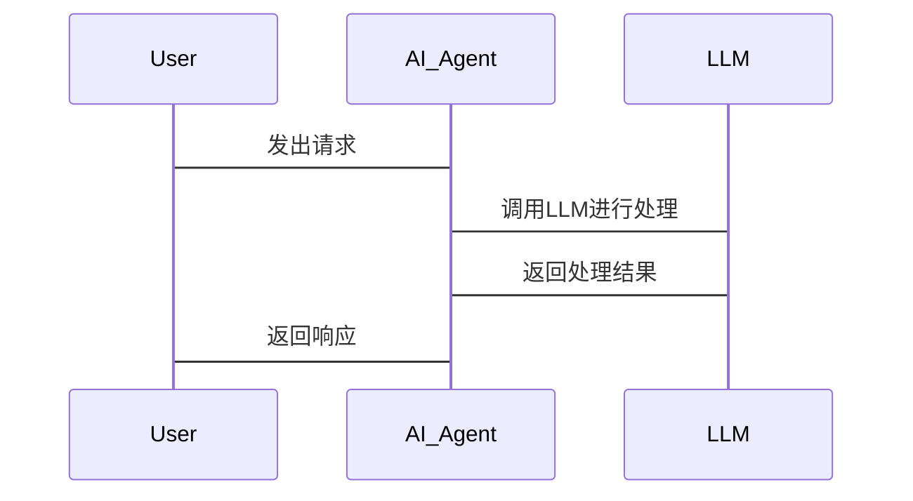

                 


# LLM支持的AI Agent语义理解优化

## 关键词：LLM，AI Agent，语义理解，优化，自然语言处理，算法原理

## 摘要：本文探讨了如何利用大语言模型（LLM）优化AI Agent的语义理解能力。通过分析LLM与AI Agent的关系，阐述了语义理解的优化方法，并结合算法原理和系统设计，详细讲解了实现过程。文章还提供了实际项目案例和代码示例，帮助读者深入理解技术细节。

---

# 目录大纲：《LLM支持的AI Agent语义理解优化》

---

## 第1章：背景介绍

### 1.1 问题背景
- 1.1.1 当前AI Agent的发展现状
- 1.1.2 语义理解在AI Agent中的重要性
- 1.1.3 LLM在语义理解中的优势

### 1.2 问题描述
- 1.2.1 AI Agent语义理解的挑战
- 1.2.2 当前语义理解技术的局限性
- 1.2.3 LLM支持的语义理解优化目标

### 1.3 问题解决
- 1.3.1 LLM如何优化语义理解
- 1.3.2 AI Agent与LLM结合的解决方案
- 1.3.3 优化后的语义理解能力提升

### 1.4 边界与外延
- 1.4.1 LLM支持的AI Agent的适用范围
- 1.4.2 语义理解优化的边界条件
- 1.4.3 相关技术的外延影响

### 1.5 核心概念结构与组成
- 1.5.1 LLM的基本组成
- 1.5.2 AI Agent的组成部分
- 1.5.3 语义理解的核心要素

---

## 第2章：核心概念与联系

### 2.1 LLM与AI Agent的关系
- 2.1.1 LLM的工作原理
- 2.1.2 AI Agent的功能原理
- 2.1.3 语义理解的实现机制

### 2.2 概念属性特征对比
- 2.2.1 LLM的属性特征
- 2.2.2 AI Agent的属性特征
- 2.2.3 对比分析与表格总结

### 2.3 ER实体关系图


---

## 第3章：算法原理讲解

### 3.1 LLM算法原理
- 3.1.1 算法流程


- 3.1.2 Python代码示例
```python
def llm_encode(input_text):
    embedding = embed_layer(input_text)
    encoded = encoding_layer(embedding)
    return encoded
```

- 3.1.3 数学模型和公式
  - 概率分布公式：
  $$ P(\text{output}|\text{input}) = \prod_{i=1}^{n} P(w_i|\text{input}, w_{i-1}, ..., w_1) $$

---

## 第4章：系统分析与架构设计方案

### 4.1 项目场景介绍
- 系统需求分析
- 项目目标
- 项目范围

### 4.2 系统功能设计
- 领域模型类图


### 4.3 系统架构设计


### 4.4 系统接口设计
- 接口1：LLM与AI Agent的交互接口
- 接口2：AI Agent与数据库的交互接口
- 接口3：用户与AI Agent的交互接口

### 4.5 系统交互流程


---

## 第5章：项目实战

### 5.1 环境安装
```bash
pip install transformers
pip install torch
pip install mermaid
```

### 5.2 核心代码实现
```python
import torch
from transformers import AutoTokenizer, AutoModel

class LLMProcessor:
    def __init__(self, model_name):
        self.tokenizer = AutoTokenizer.from_pretrained(model_name)
        self.model = AutoModel.from_pretrained(model_name)

    def process_input(self, input_text):
        inputs = self.tokenizer(input_text, return_tensors="pt")
        outputs = self.model(**inputs)
        return outputs.last_hidden_state
```

### 5.3 案例分析
- 案例1：简单语句处理
  ```python
  processor = LLMProcessor("gpt2")
  result = processor.process_input("Hello, how are you?")
  print(result)
  ```

---

## 第6章：总结与展望

### 6.1 最佳实践
- 确保LLM模型的训练数据质量
- 定期更新模型参数
- 结合具体场景优化语义理解

### 6.2 小结
- 通过LLM优化AI Agent的语义理解是可行且有效的
- 需要结合具体场景进行调整和优化

### 6.3 注意事项
- 注意模型的计算资源消耗
- 确保数据安全和隐私保护
- 定期监控模型性能

### 6.4 拓展阅读
- 推荐书籍：《Large Language Models》
- 推荐论文：《Improving Semantic Understanding with LLMs》

---

# 结语

通过本文的详细讲解，读者可以全面了解如何利用LLM优化AI Agent的语义理解能力。从理论到实践，文章为读者提供了丰富的知识和实用的代码示例，帮助他们在实际项目中应用这些技术。

