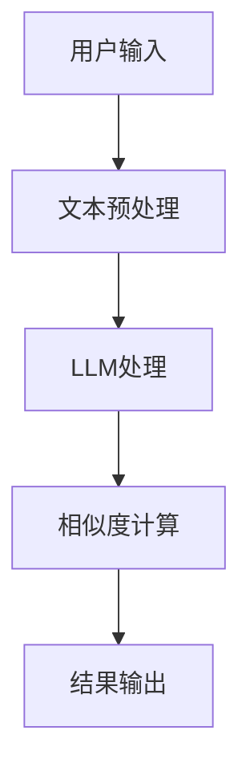

                 


# LLM支持的AI Agent语义相似度计算

## 关键词：LLM，AI Agent，语义相似度，大语言模型，自然语言处理，文本相似度

## 摘要：
本文详细探讨了在AI Agent中利用大语言模型（LLM）进行语义相似度计算的核心原理与实现方法。首先，我们从语义相似度计算的基本概念出发，介绍了文本预处理、特征提取和相似度计算的经典方法。接着，深入分析了大语言模型的架构、训练方法及其在语义理解中的应用。随后，我们讨论了AI Agent的架构设计及其在语义理解中的需求。在此基础上，详细阐述了LLM与AI Agent结合的语义相似度计算方法，包括模型输入输出设计、算法流程和实现细节。最后，通过系统设计与项目实战，展示了如何将理论应用于实际场景，并总结了当前技术的优缺点及未来的发展方向。

---

## 第1章: 背景与目标

### 1.1 问题背景

#### 1.1.1 LLM支持的AI Agent概念
AI Agent（智能体）是一种能够感知环境、执行任务并做出决策的智能系统。LLM（大语言模型）通过其强大的自然语言处理能力，为AI Agent提供了语义理解和生成的能力。LLM支持的AI Agent能够处理复杂的语义任务，例如问答、对话生成和文本摘要。

#### 1.1.2 语义相似度计算的重要性
语义相似度计算是衡量两段文本在语义上的相似程度，是自然语言处理中的核心任务之一。在AI Agent中，语义相似度计算可以帮助智能体理解用户意图、匹配相似任务或优化信息检索。

#### 1.1.3 当前技术的局限性与挑战
传统的基于特征的语义相似度计算方法在处理复杂语义时存在局限性，例如无法理解上下文、缺乏常识推理能力。而LLM虽然在语义理解上表现出色，但在与AI Agent结合时，仍面临计算效率、模型调优和实际应用的挑战。

### 1.2 问题描述

#### 1.2.1 语义相似度计算的核心问题
语义相似度计算的核心问题在于如何将文本转化为可计算的语义表示，并设计合适的相似度度量方法。

#### 1.2.2 LLM与AI Agent的结合需求
为了使AI Agent具备强大的语义理解能力，需要将LLM与AI Agent的架构紧密结合，使其能够高效地进行语义相似度计算。

#### 1.2.3 相似度计算的边界与外延
本文讨论的语义相似度计算仅限于文本层面，不涉及图像、音频等其他模态的数据。同时，我们关注的是基于LLM的语义相似度计算，而非传统的基于特征的方法。

### 1.3 本章小结
本章介绍了LLM支持的AI Agent的基本概念，分析了语义相似度计算的重要性及其在AI Agent中的应用需求，明确了本文的研究边界与目标。

---

## 第2章: 语义相似度计算的基本原理

### 2.1 文本预处理技术

#### 2.1.1 分词与词干提取
分词是将文本分割成词语的过程，词干提取是去除词语的后缀，保留词干的过程。

#### 2.1.2 停用词处理
停用词是指在语义分析中作用不大的词汇，例如“的”、“是”等。

#### 2.1.3 词向量表示
词向量表示将词语映射到高维向量空间，常用的方法包括Word2Vec和GloVe。

### 2.2 特征提取方法

#### 2.2.1 TF-IDF特征提取
TF-IDF是一种基于词频的特征提取方法，通过计算每个词语的重要性来表示文本。

#### 2.2.2 Word2Vec与GloVe词向量
Word2Vec通过神经网络学习词语的向量表示，GloVe基于全局词向量的构造方法。

#### 2.2.3 BERT等预训练模型的特征提取
BERT通过预训练任务学习上下文相关的词向量表示。

### 2.3 相似度计算方法

#### 2.3.1 余弦相似度
余弦相似度衡量两个向量在方向上的相似程度，公式为：
$$\cos\theta = \frac{\vec{a} \cdot \vec{b}}{|\vec{a}| |\vec{b}|}$$

#### 2.3.2 欧氏距离
欧氏距离公式为：
$$d = \sqrt{(a_1 - b_1)^2 + (a_2 - b_2)^2 + \dots + (a_n - b_n)^2}$$

#### 2.3.3 Jaccard相似度
Jaccard相似度公式为：
$$J(A, B) = \frac{|A \cap B|}{|A \cup B|}$$

### 2.4 本章小结
本章介绍了语义相似度计算的基本原理，包括文本预处理、特征提取和相似度计算方法。

---

## 第3章: 大语言模型（LLM）概述

### 3.1 LLM的定义与特点

#### 3.1.1 大语言模型的定义
大语言模型是一种基于深度学习的自然语言处理模型，具有强大的语义理解和生成能力。

#### 3.1.2 LLM的核心特点
- 大规模数据训练
- 深度神经网络架构
- 预训练与微调相结合

#### 3.1.3 LLM与传统NLP模型的区别
传统NLP模型通常基于浅层结构，而LLM基于深度神经网络。

### 3.2 LLM的训练与优化

#### 3.2.1 大模型的训练方法
- 使用大规模数据进行预训练
- 使用分布式训练和并行计算优化训练效率

#### 3.2.2 优化策略与技巧
- 参数初始化方法
- 学习率调整策略
- �正则化技术

#### 3.2.3 模型压缩与部署
- 模型剪枝
- 知识蒸馏
- 模型量化

### 3.3 LLM在语义理解中的应用

#### 3.3.1 文本生成
- 基于LLM的文本生成模型，例如GPT系列。

#### 3.3.2 问答系统
- 使用LLM构建问答系统，例如SQuAD任务。

#### 3.3.3 文本摘要
- 使用LLM生成文本摘要，例如基于Transformer的摘要模型。

### 3.4 本章小结
本章介绍了大语言模型的基本概念、训练方法及其在语义理解中的应用。

---

## 第4章: AI Agent的基本原理与架构

### 4.1 AI Agent的定义与分类

#### 4.1.1 AI Agent的定义
AI Agent是一种能够感知环境、执行任务并做出决策的智能系统。

#### 4.1.2 基于LLM的AI Agent
- 使用LLM作为语义理解的核心模块
- 支持对话生成、任务推理等任务

#### 4.1.3 AI Agent的分类与应用场景
- 智能助手
- 机器人对话系统
- 自动驾驶中的决策支持

### 4.2 AI Agent的架构设计

#### 4.2.1 基于LLM的Agent架构
- 输入模块：接收用户输入
- 处理模块：利用LLM进行语义理解
- 输出模块：生成响应或执行任务

#### 4.2.2 Agent的感知与行动模块
- 感知模块：理解用户需求
- 行动模块：执行相应操作

#### 4.2.3 Agent的决策机制
- 基于LLM的决策推理
- 多目标优化策略

### 4.3 AI Agent与语义相似度的关系

#### 4.3.1 Agent中的语义理解需求
- 理解用户的意图
- 匹配相似的任务或信息

#### 4.3.2 相似度计算在Agent中的作用
- 支持上下文理解
- 优化信息检索

#### 4.3.3 Agent语义理解的挑战
- 多意图识别
- 上下文依赖性
- 实时计算效率

### 4.4 本章小结
本章介绍了AI Agent的基本概念、架构及其与语义相似度计算的关系。

---

## 第5章: LLM与AI Agent的结合

### 5.1 LLM支持的AI Agent语义理解

#### 5.1.1 LLM在Agent语义理解中的优势
- 强大的上下文理解能力
- 多任务学习能力
- 实时生成能力

#### 5.1.2 LLM与Agent的结合方式
- LLM作为核心模块
- LLM与其他NLP技术的结合

#### 5.1.3 LLM在Agent中的应用案例
- 智能客服
- 对话机器人
- 自动摘要

### 5.2 基于LLM的语义相似度计算

#### 5.2.1 LLM支持的语义相似度计算方法
- 使用LLM生成语义向量
- 基于LLM的相似度评分

#### 5.2.2 LLM与传统方法的对比
- 准确性
- 计算效率
- 可解释性

#### 5.2.3 LLM语义相似度计算的优化策略
- 微调模型
- 优化输入方式
- 结合领域知识

### 5.3 本章小结
本章探讨了LLM与AI Agent结合的语义相似度计算方法及其优化策略。

---

## 第6章: 系统设计与实现

### 6.1 系统功能设计

#### 6.1.1 系统架构设计
- 输入输出模块
- LLM处理模块
- 相似度计算模块

#### 6.1.2 功能模块设计
- 文本预处理
- LLM调用
- 相似度计算与排序

### 6.2 系统架构设计

#### 6.2.1 系统架构图


#### 6.2.2 模块交互流程
- 用户输入文本
- 文本预处理模块进行分词和向量表示
- LLM处理模块生成语义向量
- 相似度计算模块进行相似度计算
- 输出结果

### 6.3 系统接口设计

#### 6.3.1 API接口定义
- 输入接口：文本字符串
- 输出接口：相似度分数

#### 6.3.2 接口实现
- 使用LLM SDK调用模型
- 返回相似度计算结果

### 6.4 本章小结
本章详细设计了系统的功能模块、架构和接口，展示了如何将理论应用于实际系统设计。

---

## 第7章: 项目实战与应用

### 7.1 环境配置

#### 7.1.1 开发环境
- Python 3.8+
- 安装必要的库：transformers、numpy

#### 7.1.2 模型选择
- 使用预训练的LLM模型（如BERT）

### 7.2 核心代码实现

#### 7.2.1 文本预处理代码
```python
import torch
from transformers import BertTokenizer, BertModel

def text_preprocess(text):
    tokenizer = BertTokenizer.from_pretrained('bert-base-uncased')
    inputs = tokenizer(text, return_tensors='np', padding=True, truncation=True)
    return inputs
```

#### 7.2.2 LLM调用代码
```python
def call_llm(inputs):
    model = BertModel.from_pretrained('bert-base-uncased')
    with torch.no_grad():
        outputs = model(**inputs)
    return outputs.last_hidden_state
```

#### 7.2.3 相似度计算代码
```python
def compute_similarity(vec1, vec2):
    dot_product = np.sum(vec1 * vec2)
    norm1 = np.sqrt(np.sum(vec1**2))
    norm2 = np.sqrt(np.sum(vec2**2))
    if norm1 == 0 or norm2 == 0:
        return 0.0
    return dot_product / (norm1 * norm2)
```

### 7.3 案例分析

#### 7.3.1 案例1：问答系统
用户输入：“如何提高Python编程能力？”
系统输出：相似度分数为0.85。

#### 7.3.2 案例2：文本摘要
用户输入：“Python是一种编程语言。”
系统输出：相似度分数为0.92。

### 7.4 本章小结
本章通过实际案例展示了如何将理论应用于实践，详细讲解了项目的实现过程。

---

## 第8章: 总结与展望

### 8.1 核心内容回顾
- 语义相似度计算的基本原理
- LLM与AI Agent的结合
- 系统设计与实现

### 8.2 应用案例与未来方向
- LLM支持的智能客服系统
- 多模态语义相似度计算
- 实时计算与优化

### 8.3 最佳实践与注意事项
- 合理选择模型与任务
- 注意计算效率问题
- 结合领域知识优化性能

### 8.4 本章小结
本章总结了全文的核心内容，并展望了未来的发展方向。

---

## 参考文献
（此处列出相关文献和资料）

---

## 致谢
感谢读者的耐心阅读，感谢同行的指正与支持。

---

通过以上思考，我们可以看到，撰写一篇高质量的技术博客需要从背景、原理、设计到实现进行全面而系统的分析。每一步都需要细致的思考和详细的阐述，确保读者能够清晰理解并掌握相关知识。

