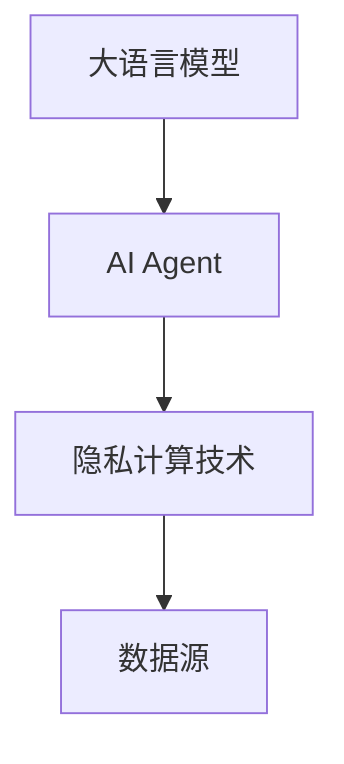
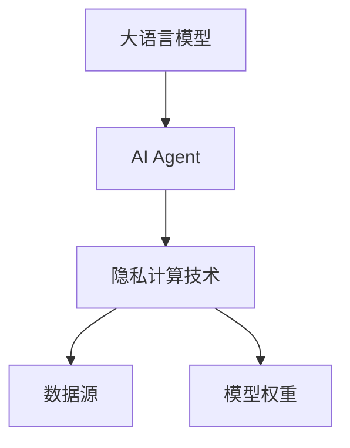
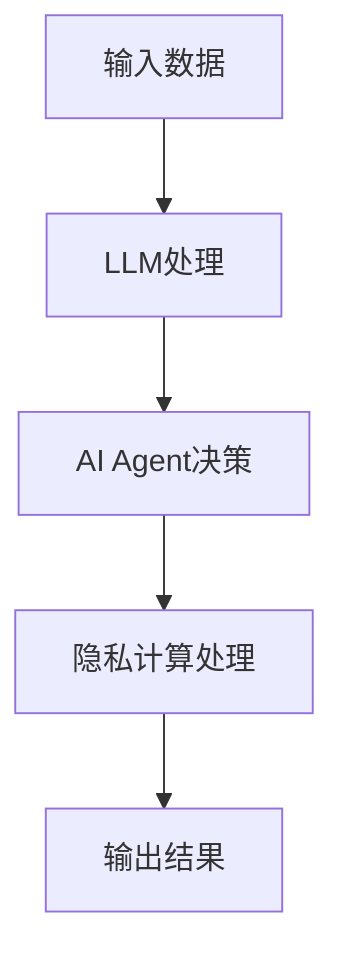
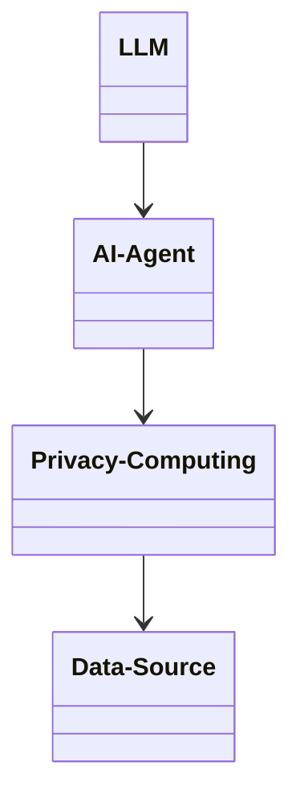
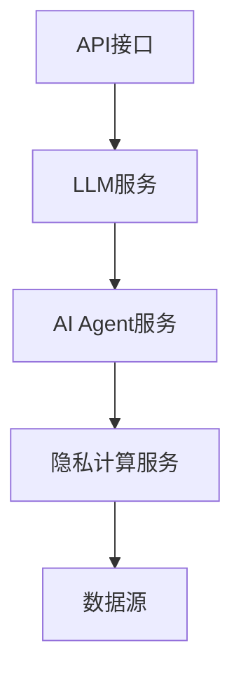
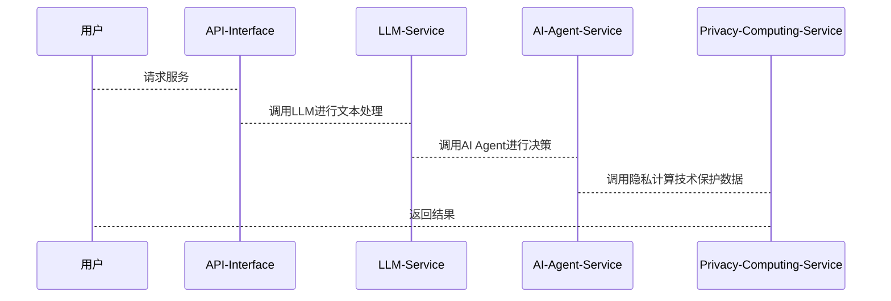

                 


# LLM支持的AI Agent隐私计算技术

> 关键词：大语言模型、AI Agent、隐私计算、数据隐私、安全协议、分布式系统、联邦学习

> 摘要：本文探讨了大语言模型（LLM）支持的AI Agent在隐私计算中的应用，分析了技术背景、核心概念、算法原理、系统架构、项目实现及最佳实践。通过详细的技术分析和案例研究，揭示了如何在保护数据隐私的前提下，利用LLM提升AI Agent的智能性和决策能力。

---

# 第1章: 背景介绍

## 1.1 问题背景

### 1.1.1 LLM与AI Agent的结合
大语言模型（LLM）如GPT-4具备强大的自然语言处理能力，能够生成、理解并推理文本信息。AI Agent（智能代理）作为能够自主决策和执行任务的智能体，需要结合LLM的能力来提升其理解和执行任务的水平。

### 1.1.2 隐私计算技术的必要性
随着AI技术的广泛应用，数据隐私问题日益突出。隐私计算技术（如联邦学习、同态加密等）能够在保护数据隐私的前提下，进行数据处理和分析，确保数据不被泄露。

### 1.1.3 当前技术面临的挑战
- 数据隐私与模型训练的矛盾：如何在不泄露数据的情况下训练高效的LLM。
- AI Agent决策的透明性与隐私保护的平衡：AI Agent需要在保护用户隐私的前提下做出决策。
- 跨机构协作中的数据共享问题：如何在多机构协作中实现数据隐私保护。

## 1.2 问题描述

### 1.2.1 LLM支持的AI Agent的核心问题
- 如何在保护数据隐私的前提下，利用LLM提升AI Agent的智能性。
- 如何设计高效的隐私计算算法，支持AI Agent的决策过程。

### 1.2.2 隐私计算在AI Agent中的应用场景
- 医疗领域：保护患者隐私，同时利用AI Agent进行疾病诊断。
- 金融领域：保护客户隐私，同时利用AI Agent进行风险评估。
- 零售领域：保护用户隐私，同时利用AI Agent进行个性化推荐。

### 1.2.3 技术实现的边界与外延
- 边界：仅关注数据隐私保护与LLM支持的AI Agent结合的技术实现，不涉及具体业务逻辑。
- 外延：涉及的隐私计算技术包括联邦学习、同态加密、安全多方计算等。

## 1.3 问题解决

### 1.3.1 LLM与AI Agent的结合方式
- LLM作为AI Agent的核心推理引擎，负责理解和生成文本。
- AI Agent通过调用LLM API，利用其强大的自然语言处理能力辅助决策。

### 1.3.2 隐私计算在AI Agent中的实现路径
- 数据隐私保护：采用联邦学习技术，确保数据不被完全暴露。
- 模型隐私保护：采用同态加密技术，保护模型权重不被窃取。

### 1.3.3 技术实现的可行性分析
- 技术可行性：现有隐私计算技术已较为成熟，可以支撑LLM与AI Agent的结合。
- 应用可行性：通过联邦学习等技术，可以在保护数据隐私的前提下，实现跨机构协作。

## 1.4 核心概念结构

### 1.4.1 核心要素组成
- LLM：提供自然语言处理能力。
- AI Agent：负责决策和执行任务。
- 隐私计算技术：保护数据隐私。

### 1.4.2 技术架构的组成
- 数据层：包含原始数据和加密数据。
- 模型层：包含LLM和AI Agent的决策模型。
- 应用层：提供API接口，供上层应用调用。

### 1.4.3 核心概念之间的关系
通过mermaid图展示核心概念之间的关系：


---

# 第2章: 核心概念与联系

## 2.1 核心概念原理

### 2.1.1 LLM的基本原理
大语言模型通过大量数据训练，学习语言的规律和语义，能够生成与训练数据类似的文本。

### 2.1.2 AI Agent的基本原理
AI Agent通过感知环境、分析任务、调用工具或服务，完成特定目标。

### 2.1.3 隐私计算的核心原理
隐私计算技术通过加密、匿名化等手段，确保数据在处理过程中不被泄露。

## 2.2 核心概念对比

### 2.2.1 LLM与传统NLP模型的对比
| 对比维度 | LLM | 传统NLP模型 |
|----------|-----|--------------|
| 处理能力 | 支持复杂对话，具备推理能力 | 主要支持文本生成和关键词提取 |
| 训练数据 | 数据量更大，涵盖更多领域 | 数据量较小，领域有限 |
| 应用场景 | 适合复杂任务，如智能对话、内容创作 | 适合简单任务，如文本分类、关键词提取 |

### 2.2.2 AI Agent与传统AI系统对比
| 对比维度 | AI Agent | 传统AI系统 |
|----------|----------|------------|
| 自主性    | 高度自主，能够主动决策 | 通常由外部控制，按指令执行 |
| 适应性    | 能够适应新环境和任务 | 需要重新训练或调整 |
| 交互性    | 支持与人类交互，执行复杂任务 | 通常不支持复杂的人机交互 |

### 2.2.3 隐私计算与传统加密技术对比
| 对比维度 | 隐私计算 | 传统加密技术 |
|----------|----------|--------------|
| 适用场景 | 适用于多方数据协作 | 适用于单点数据保护 |
| 处理方式 | 支持数据处理和分析 | 仅支持数据加密存储 |
| 安全性    | 提供数据可用性保障 | 仅提供数据保密性保障 |

## 2.3 实体关系图
通过mermaid图展示核心概念之间的关系：


---

# 第3章: 算法原理讲解

## 3.1 算法原理

### 3.1.1 LLM的训练与推理过程
- **训练过程**：利用大规模数据进行监督学习，优化模型参数。
- **推理过程**：通过解码器生成与输入文本相关的输出。

### 3.1.2 AI Agent的决策算法
- **感知环境**：通过传感器或API获取环境信息。
- **分析任务**：利用LLM理解任务需求。
- **调用工具**：通过调用外部工具或服务完成任务。

### 3.1.3 隐私计算算法
- **联邦学习**：在多个数据源上分布式训练模型，确保数据不被集中。
- **同态加密**：对数据进行加密后进行计算，确保数据不被泄露。

## 3.2 算法流程图
通过mermaid图展示算法流程：


## 3.3 算法实现

### 3.3.1 LLM的数学模型
$$P(y|x) = \frac{P(x,y)}{P(x)}$$

### 3.3.2 AI Agent的决策模型
$$U(a) = \sum_{i=1}^{n} w_i a_i$$

### 3.3.3 隐私计算的数学模型
$$E[f(x)] = \sum_{i=1}^{n} f(x_i)$$

---

# 第4章: 系统分析与架构设计方案

## 4.1 问题场景介绍
- **医疗领域**：保护患者隐私，利用AI Agent进行疾病诊断。
- **金融领域**：保护客户隐私，利用AI Agent进行风险评估。
- **零售领域**：保护用户隐私，利用AI Agent进行个性化推荐。

## 4.2 系统功能设计

### 4.2.1 领域模型类图
通过mermaid图展示领域模型类图：


### 4.2.2 系统架构图
通过mermaid图展示系统架构图：


### 4.2.3 系统交互序列图
通过mermaid图展示系统交互序列：


---

# 第5章: 项目实战

## 5.1 环境安装

### 5.1.1 安装Python
```bash
python --version
pip install --upgrade pip
```

### 5.1.2 安装依赖库
```bash
pip install transformers
pip install secure_ml
pip install requests
```

## 5.2 核心代码实现

### 5.2.1 LLM接口实现
```python
from transformers import GPT2LMHeadModel, GPT2Tokenizer
model = GPT2LMHeadModel.from_pretrained('gpt2')
tokenizer = GPT2Tokenizer.from_pretrained('gpt2')
```

### 5.2.2 AI Agent实现
```python
class AIAgent:
    def __init__(self, llm_model):
        self.llm = llm_model
    def decide(self, input_text):
        # 调用LLM进行决策
        pass
```

### 5.2.3 隐私计算实现
```python
from secure_ml import Private FederatedLearning
fl = Private FederatedLearning()
```

## 5.3 案例分析
- **医疗案例**：利用AI Agent和LLM，保护患者隐私，辅助医生进行疾病诊断。
- **金融案例**：利用AI Agent和LLM，保护客户隐私，辅助银行进行风险评估。

## 5.4 项目总结
通过项目实战，验证了LLM支持的AI Agent隐私计算技术的可行性，同时积累了宝贵的实践经验。

---

# 第6章: 最佳实践与小结

## 6.1 小结
本文详细探讨了LLM支持的AI Agent隐私计算技术，分析了其技术背景、核心概念、算法原理、系统架构，并通过项目实战验证了其可行性。

## 6.2 注意事项
- 数据隐私保护必须贯穿整个系统设计和实现过程。
- 在实际应用中，需要根据具体需求选择合适的隐私计算技术。
- 系统设计时，需要充分考虑性能和可扩展性。

## 6.3 拓展阅读
- 《Privacy-Preserving Machine Learning with Secure Multi-Party Computation》
- 《Large Language Models: A Survey》
- 《Introduction to AI Agents》

---

# 结语
通过本文的探讨，我们可以看到，LLM支持的AI Agent隐私计算技术在保护数据隐私的前提下，能够显著提升AI Agent的智能性和决策能力。未来，随着技术的不断进步，这一领域将有更广泛的应用前景。

