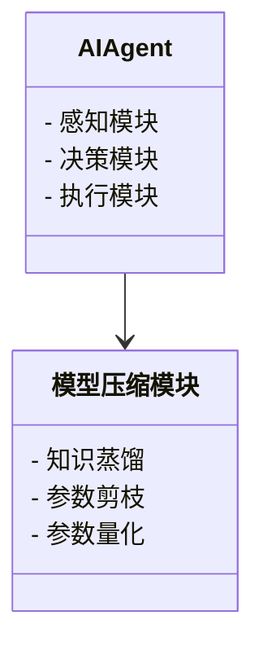
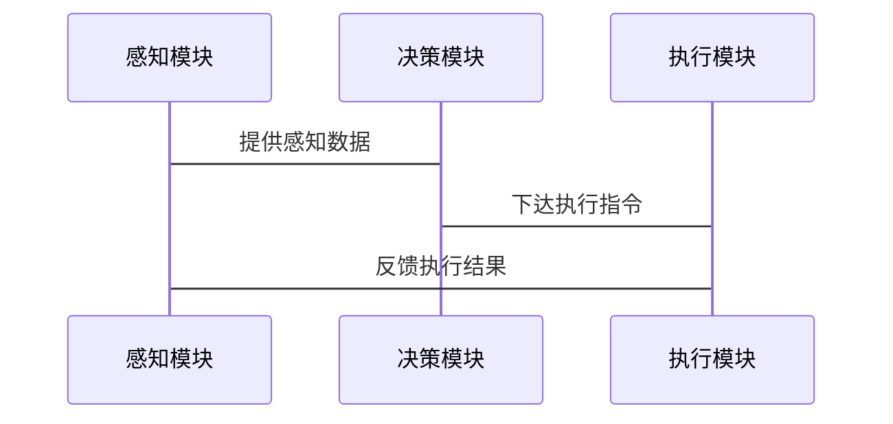

                 


---

# LLM模型压缩技术：在边缘设备部署AI Agent

## 关键词：LLM模型压缩、边缘设备、AI Agent、模型优化、深度学习部署

## 摘要：  
随着人工智能技术的快速发展，LLM（大语言模型）在各个领域的应用越来越广泛。然而，LLM模型通常参数量巨大，难以在计算资源有限的边缘设备上高效运行。为了在边缘设备上部署AI Agent，模型压缩技术成为关键。本文将详细探讨LLM模型压缩的核心技术，包括知识蒸馏、参数剪枝和量化等方法，并通过实际案例分析，展示如何在边缘设备上高效部署AI Agent。

---

# 第一部分: LLM模型压缩技术概述

## 第1章: LLM模型压缩技术概述

### 1.1 问题背景与挑战

#### 1.1.1 边缘设备部署AI Agent的需求
AI Agent是一种能够自主执行任务的智能体，通常需要在边缘设备上运行。边缘设备包括智能手机、IoT设备、嵌入式系统等，这些设备的计算能力和存储空间有限，无法直接运行大型LLM模型。

#### 1.1.2 LLM模型在边缘设备部署的挑战
- **计算资源不足**：边缘设备通常缺乏足够的计算能力和内存，难以运行参数量庞大的LLM模型。
- **延迟和带宽限制**：通过云端处理任务会导致延迟增加，且边缘设备之间的数据传输带宽有限。
- **隐私问题**：将数据上传到云端可能引发隐私问题，尤其是在处理敏感信息时。

#### 1.1.3 模型压缩技术的必要性
模型压缩技术通过减少模型的参数数量或简化模型结构，使得LLM模型能够在边缘设备上高效运行。这不仅降低了计算成本，还提高了部署的灵活性。

### 1.2 LLM模型压缩的核心概念

#### 1.2.1 模型压缩的定义与目标
模型压缩是指通过各种技术手段，减少模型的参数数量或简化模型结构，同时保持模型性能不变。目标是将大型模型压缩为更小的模型，以适应边缘设备的计算能力。

#### 1.2.2 模型压缩的关键技术
- **知识蒸馏**：通过教师模型指导学生模型，将知识迁移到更小的学生模型中。
- **参数剪枝**：通过去除冗余参数，减少模型的复杂度。
- **参数量化**：将模型参数从高精度（如32位浮点）降低到低精度（如8位整数），减少存储空间。

#### 1.2.3 模型压缩的评估指标
- **模型大小**：压缩后的模型参数数量。
- **推理速度**：压缩后模型在边缘设备上的推理时间。
- **准确率**：压缩后模型与原始模型在任务中的性能差异。

### 1.3 模型压缩技术的分类与对比

#### 1.3.1 知识蒸馏技术
知识蒸馏通过将教师模型的知识迁移到学生模型中，实现模型压缩。教师模型通常是一个大模型，学生模型是一个小模型。

#### 1.3.2 参数剪枝技术
参数剪枝通过去除模型中冗余的参数，减少模型的复杂度。剪枝通常基于参数的重要性和贡献度进行。

#### 1.3.3 参数量化技术
参数量化将模型参数从高精度表示转换为低精度表示，减少存储空间和计算成本。

#### 1.3.4 模型剪枝与蒸馏的对比分析
| 技术 | 原理 | 优点 | 缺点 |
|------|------|------|------|
| 剪枝 | 去除冗余参数 | 参数减少，推理速度快 | 明显降低模型容量，可能影响准确性 |
| 蒸馏 | 知识迁移 | 保持较高准确性 | 需要教师模型，计算成本高 |

### 1.4 本章小结
本章介绍了LLM模型压缩技术的背景、核心概念和分类。模型压缩技术在边缘设备部署AI Agent中具有重要意义，能够有效解决计算资源不足的问题。

---

# 第二部分: 模型压缩算法原理与实现

## 第2章: 模型压缩算法原理

### 2.1 知识蒸馏技术

#### 2.1.1 知识蒸馏的基本原理
知识蒸馏通过教师模型指导学生模型，将知识迁移到学生模型中。教师模型通常是一个大模型，学生模型是一个小模型。

#### 2.1.2 蒸馏过程的数学模型
$$ P(y|x) = \argmax_y \{g(x)_y + T\} $$
其中，$g(x)_y$ 是教师模型的输出，$T$ 是温度参数，用于软化概率分布。

#### 2.1.3 蒸馏算法的实现步骤
1. 训练教师模型。
2. 使用教师模型的输出作为软标签，训练学生模型。
3. 调整温度参数，优化学生模型的性能。

#### 2.1.4 蒸馏算法的优缺点分析
- 优点：保持较高准确性，适用于边缘设备。
- 缺点：需要教师模型，计算成本高。

### 2.2 参数剪枝技术

#### 2.2.1 剪枝的基本原理
参数剪枝通过去除模型中冗余的参数，减少模型的复杂度。剪枝通常基于参数的重要性和贡献度进行。

#### 2.2.2 剪枝算法的实现步骤
1. 训练原始模型。
2. 计算每个参数的重要性，通常基于梯度或特征重要性。
3. 去除冗余参数，保留重要参数。
4. 重新训练剪枝后的模型。

#### 2.2.3 剪枝算法的数学模型
$$ \text{损失函数} = \text{原始损失} + \lambda \times \text{参数惩罚项} $$
其中，$\lambda$ 是惩罚系数，用于平衡原始损失和参数惩罚项。

#### 2.2.4 剪枝算法的优缺点分析
- 优点：参数减少，推理速度快。
- 缺点：可能降低模型容量，影响准确性。

### 2.3 参数量化技术

#### 2.3.1 参数量化的基本原理
参数量化将模型参数从高精度表示转换为低精度表示，减少存储空间和计算成本。

#### 2.3.2 量化算法的实现步骤
1. 训练原始模型。
2. 将模型参数从高精度（如32位浮点）转换为低精度（如8位整数）。
3. 重新训练量化后的模型。

#### 2.3.3 量化算法的数学模型
$$ \text{量化后参数} = \text{round}(\text{原始参数} \times \text{缩放因子}) $$
其中，缩放因子用于调整量化后的参数范围。

#### 2.3.4 量化算法的优缺点分析
- 优点：存储空间小，计算速度快。
- 缺点：可能影响模型性能，需要调整量化参数。

### 2.4 模型压缩算法的对比分析
知识蒸馏和剪枝技术各有优缺点，适用于不同的场景。蒸馏技术保持较高准确性，但需要教师模型；剪枝技术参数减少，推理速度快，但可能影响准确性。

### 2.5 本章小结
本章详细讲解了模型压缩的核心算法，包括知识蒸馏、参数剪枝和量化技术。这些算法在边缘设备部署AI Agent中具有重要作用。

---

# 第三部分: 模型压缩技术的系统分析与架构设计

## 第3章: AI Agent在边缘设备的系统架构

### 3.1 系统功能设计

#### 3.1.1 AI Agent的功能模块划分
- **感知模块**：处理传感器数据，识别环境信息。
- **决策模块**：基于感知数据，做出决策。
- **执行模块**：执行决策任务。

#### 3.1.2 模型压缩技术在系统中的应用
模型压缩技术用于优化AI Agent的核心模块，减少计算资源消耗。

#### 3.1.3 系统功能的领域模型设计（Mermaid类图）


### 3.2 系统架构设计

#### 3.2.1 系统架构的总体设计
AI Agent在边缘设备上的架构通常包括感知层、决策层和执行层。

#### 3.2.2 模型压缩模块的架构设计
模型压缩模块负责优化AI Agent的核心模型，减少计算资源消耗。

#### 3.2.3 系统架构的Mermaid架构图


### 3.3 系统接口设计

#### 3.3.1 系统内部接口设计
AI Agent内部模块之间的接口设计，确保数据传递和功能调用。

#### 3.3.2 系统外部接口设计
AI Agent与外部设备或云端的接口设计，确保数据交互和功能扩展。

#### 3.3.3 接口设计的Mermaid序列图


### 3.4 本章小结
本章分析了AI Agent在边缘设备上的系统架构，强调了模型压缩技术在系统设计中的重要性。

---

# 第四部分: 项目实战与优化

## 第4章: 边缘设备AI Agent部署实战

### 4.1 环境安装与配置

#### 4.1.1 开发环境的选择与安装
推荐使用Python和深度学习框架（如TensorFlow或PyTorch）进行开发。

#### 4.1.2 模型压缩工具的安装与配置
安装模型压缩工具，如TensorFlow Lite或ONNX Runtime。

#### 4.1.3 边缘设备的准备与调试
确保边缘设备的硬件和软件环境支持AI Agent的运行。

### 4.2 模型压缩技术的实现

#### 4.2.1 知识蒸馏技术的实现代码
```python
def distillation_loss(student_logits, teacher_logits, temperature):
    student_probs = F.softmax(student_logits / temperature, dim=-1)
    teacher_probs = F.softmax(teacher_logits / temperature, dim=-1)
    loss = F.kl_div(student_probs, teacher_probs) * temperature**2
    return loss
```

#### 4.2.2 参数剪枝技术的实现代码
```python
def prune_model(model, pruning_rate):
    total_params = sum(p.numel() for p in model.parameters())
    prune_num = int(total_params * pruning_rate)
    for param in model.parameters():
        if len(param.data.shape) == 1:
            mask = torch.ones_like(param.data)
            mask[prune_num:] = 0
            param.data.mul_(mask)
```

#### 4.2.3 参数量化技术的实现
```python
def quantize_model(model, bits=8):
    for param in model.parameters():
        if bits == 8:
            param.data = param.data * (2**8 - 1) / (2**8 - 1)
            param.data = param.data.round()
```

### 4.3 案例分析与详细讲解

#### 4.3.1 案例分析
以一个简单的文本分类任务为例，展示如何在边缘设备上部署AI Agent。

#### 4.3.2 详细讲解
从模型训练、压缩到部署的整个过程，详细讲解每一步的操作和注意事项。

### 4.4 最佳实践

#### 4.4.1 模型压缩技术的选择
根据任务需求和设备能力，选择合适的模型压缩技术。

#### 4.4.2 模型压缩工具的优化
使用高效的模型压缩工具，优化模型的性能和存储。

### 4.5 本章小结
本章通过实际案例分析，展示了如何在边缘设备上部署AI Agent。通过模型压缩技术，可以在资源有限的设备上实现高效的AI功能。

---

# 第五部分: 总结与展望

## 5.1 总结
本文详细探讨了LLM模型压缩技术在边缘设备部署AI Agent中的应用。通过知识蒸馏、参数剪枝和量化等技术，能够有效减少模型参数，提高推理速度，满足边缘设备的计算需求。

## 5.2 展望
未来，随着AI技术的不断发展，模型压缩技术将更加重要。如何在保证模型性能的前提下，进一步优化模型压缩技术，是研究的重点方向。

---

# 结束语

通过本文的探讨，读者可以全面了解LLM模型压缩技术的核心原理和应用场景。希望本文能够为边缘设备部署AI Agent提供有价值的参考和指导。

--- 

**全文完**

