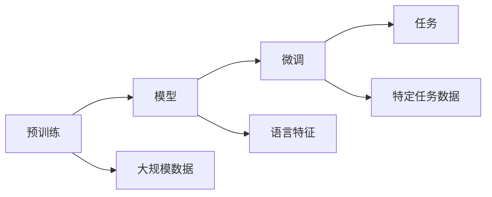

                 

# LLM模型训练实践：从预训练到微调的全流程

> **关键词**：大语言模型、预训练、微调、自然语言处理、机器学习、深度学习

> **摘要**：本文将详细探讨大语言模型（LLM）的训练流程，从预训练到微调的全过程。文章首先介绍了LLM的基本概念和核心原理，然后深入分析了预训练和微调的算法细节，接着通过系统架构和项目实战展示了如何实现一个完整的LLM训练系统。最后，文章总结了优化与部署的关键点，并展望了LLM的未来发展趋势。

---

## # 第一部分: LLM模型训练概述

### ## 第1章: LLM模型训练的背景与概述

#### ### 1.1 LLM模型的定义与核心概念
##### #### 1.1.1 大语言模型的定义
大语言模型（Large Language Model，LLM）是指基于大规模数据训练的深度学习模型，能够理解和生成人类语言。LLM的核心目标是通过大量文本数据的学习，掌握语言的语义、语法和上下文关系，从而实现自然语言处理任务，如文本生成、问答、翻译等。

##### #### 1.1.2 LLM的核心技术特点
1. **大规模数据训练**：LLM通常使用数百万或数十亿的文本数据进行训练，以捕获语言的广泛特征。
2. **自监督学习**：LLM通过预测文本中的缺失部分（如单词或句子）进行学习，不需要人工标注数据。
3. **深度神经网络**：通常采用Transformer架构，具备强大的上下文理解和生成能力。
4. **可微调性**：LLM在通用预训练后，可以通过微调适应特定任务或领域。

##### #### 1.1.3 LLM与传统NLP模型的区别
- **传统NLP模型**：通常基于小规模数据训练，依赖特定任务的标注数据，如CRF用于实体识别。
- **LLM**：基于大规模数据，具备通用性，适用于多种任务，无需大量任务特定数据。

#### ### 1.2 LLM模型训练的目标与流程
##### #### 1.2.1 预训练的目标
预训练的目的是让模型学习语言的基本特征，包括单词的语义、句子的结构以及上下文关系。预训练通常采用自监督学习，目标函数是最小化预测错误，使模型能够生成连贯的文本。

##### #### 1.2.2 微调的目的与应用场景
微调的目的是将预训练的模型适应特定任务或领域。例如，将通用的LLM微调为问答系统、对话模型或文本摘要工具。微调通常使用特定任务的数据，通过监督学习优化模型。

##### #### 1.2.3 LLM训练的全流程概述
1. **预训练**：使用大规模通用数据训练模型，学习语言的基本特征。
2. **微调**：使用特定任务数据优化模型，使其适应具体应用场景。
3. **部署与应用**：将模型部署到实际应用中，如API服务或产品中。

#### ### 1.3 LLM模型的应用场景与挑战
##### #### 1.3.1 LLM在自然语言处理中的应用
- **文本生成**：生成新闻、文章、对话等。
- **问答系统**：回答用户问题，提供信息。
- **机器翻译**：将一种语言翻译成另一种语言。
- **文本摘要**：将长文本压缩成简洁的摘要。

##### #### 1.3.2 LLM训练的主要挑战
1. **计算资源需求大**：训练LLM需要大量的计算资源，包括GPU和存储。
2. **数据质量**：需要高质量的文本数据，避免偏差和错误。
3. **模型优化**：如何在保持性能的同时减少模型大小和推理时间。

##### #### 1.3.3 LLM的边界与外延
- **边界**：LLM擅长处理语言相关任务，但不擅长处理图像、音频等多模态数据。
- **外延**：未来可能扩展到多模态模型，结合视觉、听觉等多种感知数据。

---

### ## 第2章: LLM模型训练的核心概念与联系

#### ### 2.1 LLM模型训练的核心原理
##### #### 2.1.1 预训练的原理
预训练采用自监督学习，通过掩盖部分文本，让模型预测被掩盖的部分。例如，BERT采用掩码语言模型，随机掩盖部分单词，要求模型根据上下文预测被掩盖的单词。

##### #### 2.1.2 微调的原理
微调是将预训练模型作为基础，使用特定任务的数据进行监督学习。例如，将BERT模型微调为问答系统，通过问答对的训练数据优化模型。

##### #### 2.1.3 LLM模型的训练目标函数
训练目标函数通常是最小化预测错误。例如，在预训练中，目标函数是交叉熵损失，用于衡量模型预测被掩盖部分的准确程度。

#### ### 2.2 LLM模型训练的核心概念对比
##### #### 2.2.1 预训练与微调的对比分析
| 对比维度 | 预训练 | 微调 |
|----------|--------|------|
| 数据类型 | 通用数据 | 特定任务数据 |
| 目标     | 学习语言特征 | 适应特定任务 |
| 计算资源 | 高 | 较低 |

##### #### 2.2.2 LLM模型与其他NLP模型的对比
| 对比维度 | LLM | 传统NLP模型 |
|----------|-----|--------------|
| 数据需求 | 大规模 | 小规模 |
| 任务通用性 | 高 | 低 |
| 模型复杂度 | 高 | 中等 |

##### #### 2.2.3 LLM训练中的关键参数对比
| 参数 | 预训练 | 微调 |
|------|--------|------|
| 学习率 | 较低 | 较高 |
| Batch Size | 大 | 中等 |
| 迭代次数 | 多 | 少 |

#### ### 2.3 LLM模型训练的实体关系图

---

## # 第3章: LLM预训练的算法原理

### ## 3.1 预训练的主要算法

#### ### 3.1.1 自监督学习的原理
自监督学习通过预测任务（如掩码语言模型）迫使模型学习语言特征。例如，BERT使用自监督预训练任务，通过掩盖部分单词，让模型根据上下文预测被掩盖的单词。

#### ### 3.1.2 掩码语言模型的实现
掩码语言模型是一种自监督任务，随机掩盖部分单词，让模型预测被掩盖的单词。例如，BERT的Masked Language Model任务。

#### ### 3.1.3 词嵌入与上下文建模
词嵌入（如Word2Vec）将单词映射到向量空间，上下文建模（如Transformer的自注意力机制）捕捉单词之间的关系。

### ## 3.2 预训练的数学模型与公式

#### ### 3.2.1 语言模型的损失函数
交叉熵损失函数用于衡量模型预测的准确程度：
$$
\text{Loss} = -\frac{1}{N}\sum_{i=1}^{N}\sum_{j=1}^{M}\text{log}(p(y_{ij}|x_i))
$$
其中，$N$是样本数量，$M$是每个样本的掩码位置数量，$p(y_{ij}|x_i)$是模型预测的概率。

---

（由于篇幅限制，后续章节内容将在后续思考中继续展开。）

