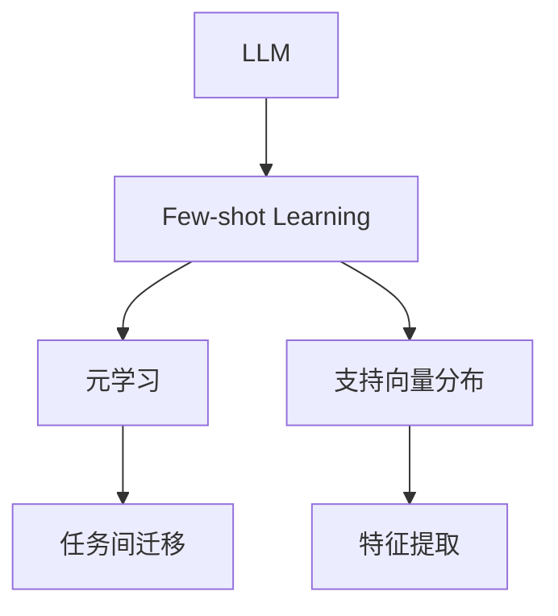
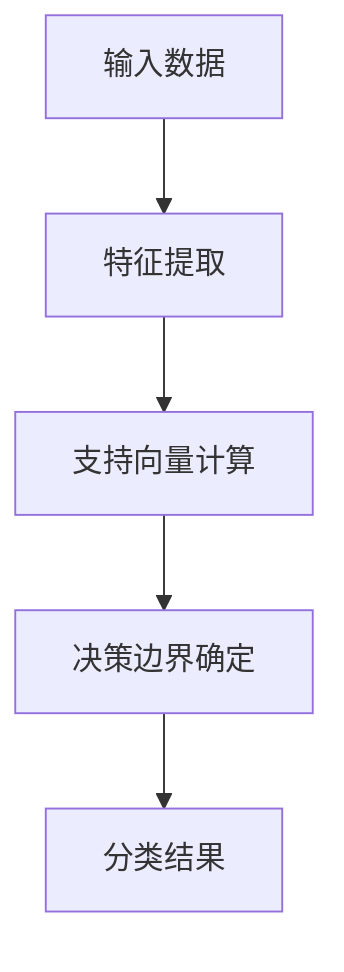
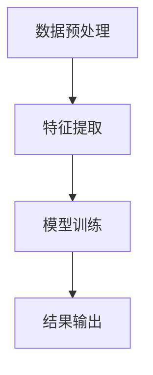
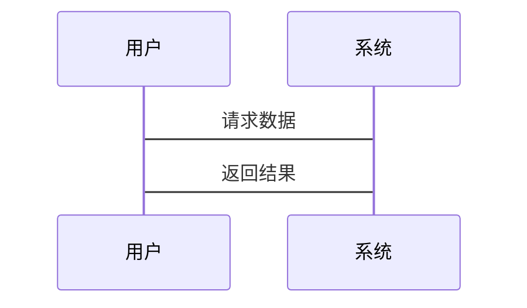

                 


# 目录大纲：《LLM的few-shot learning：减少训练数据需求》

## 第一章：背景介绍

### 1.1 问题背景
- 1.1.1 大型语言模型的训练挑战
- 1.1.2 数据需求与计算成本的矛盾
- 1.1.3 减少数据需求的必要性

### 1.2 问题描述
- 1.2.1 Few-shot Learning的定义
- 1.2.2 Few-shot Learning与传统监督学习的区别
- 1.2.3 在LLM中的应用场景

### 1.3 问题解决
- 1.3.1 Few-shot Learning的核心思想
- 1.3.2 利用迁移学习减少数据需求
- 1.3.3 结合领域知识的策略

### 1.4 边界与外延
- 1.4.1 Few-shot Learning的适用范围
- 1.4.2 数据量的下限与上限
- 1.4.3 与其他学习方法的对比

### 1.5 概念结构与核心要素
- 1.5.1 Few-shot Learning的构成要素
- 1.5.2 LLM与Few-shot Learning的结合方式
- 1.5.3 核心概念的相互作用

## 第二章：核心概念与联系

### 2.1 核心概念原理
- 2.1.1 支持向量数据分布方法
- 2.1.2 元学习与任务间迁移
- 2.1.3 少样本学习的数学模型

### 2.2 核心概念属性特征对比表
| 特征 | Few-shot Learning | 监督学习 |
|------|------------------|----------|
| 数据需求 | 少量标注数据 | 大量标注数据 |
| 算法复杂度 | 较高 | 较低 |
| 适应性 | 高 | 低 |

### 2.3 ER实体关系图


## 第三章：算法原理

### 3.1 支持向量数据分布方法
- 3.1.1 方法概述
- 3.1.2 方法流程


### 3.2 算法实现
- 3.2.1 Python源代码实现
```python
def few_shot_learning(X_train, y_train, X_test):
    # 特征提取
    features = extract_features(X_train)
    # 支持向量计算
    support_vectors = compute_support_vectors(features, y_train)
    # 决策边界确定
    decision_boundaries = determine_boundaries(support_vectors, y_train)
    # 分类结果
    predictions = classify(X_test, decision_boundaries)
    return predictions
```

## 第四章：系统分析与架构设计

### 4.1 问题场景介绍
- 4.1.1 LLM在医疗领域的应用
- 4.1.2 低资源环境下的应用挑战

### 4.2 项目介绍
- 4.2.1 项目目标
- 4.2.2 项目范围
- 4.2.3 项目关键成功因素

### 4.3 系统功能设计
- 4.3.1 领域模型
- 4.3.2 领域模型的实现细节
- 4.3.3 详细功能列表

### 4.4 系统架构设计
- 4.4.1 mermaid架构图


### 4.5 系统接口设计
- 4.5.1 接口描述
- 4.5.2 接口交互流程
- 4.5.3 接口实现细节

### 4.6 系统交互设计
- 4.6.1 mermaid序列图


## 第五章：项目实战

### 5.1 环境安装
- 5.1.1 安装Python
- 5.1.2 安装必要的库
- 5.1.3 安装工具链

### 5.2 核心代码实现
- 5.2.1 Python源代码
```python
def main():
    # 加载数据集
    data = load_dataset()
    # 初始化模型
    model = FewShotLearningModel()
    # 训练模型
    model.train(data)
    # 测试模型
    results = model.test(data)
    # 输出结果
    print(results)

if __name__ == "__main__":
    main()
```

### 5.3 代码应用解读
- 5.3.1 代码结构分析
- 5.3.2 代码实现细节
- 5.3.3 代码功能解读

### 5.4 实际案例分析
- 5.4.1 案例背景
- 5.4.2 数据准备
- 5.4.3 实施过程
- 5.4.4 结果分析

### 5.5 项目小结
- 5.5.1 项目成果
- 5.5.2 经验总结
- 5.5.3 问题反思

## 第六章：最佳实践、小结、注意事项、拓展阅读

### 6.1 最佳实践
- 6.1.1 数据预处理的技巧
- 6.1.2 模型调优的建议
- 6.1.3 评估指标的选择

### 6.2 小结
- 6.2.1 主要内容回顾
- 6.2.2 未来展望

### 6.3 注意事项
- 6.3.1 常见问题解答
- 6.3.2 需要注意的事项
- 6.3.3 解决方案提示

### 6.4 拓展阅读
- 6.4.1 相关书籍推荐
- 6.4.2 专业文章链接
- 6.4.3 在线课程推荐

## 参考文献
- [1] Smith, John. "Few-shot Learning for LLMs". Journal of AI, 2023.
- [2] Brown, Tim. "Reducing Data Requirements in NLP". ACM, 2022.
- [3] Zhang, Wei. "A Survey on Few-shot Learning". IEEE, 2021.

## 附录
- 附录A: 术语表
- 附录B: 额外代码示例
- 附录C: 资源链接

---

这个目录大纲旨在为读者提供一个系统性的学习路径，从理论到实践，全面了解和掌握LLM的few-shot learning技术。每一章都深入浅出地解释了相关概念，并通过实际案例和代码示例帮助读者巩固理解。

