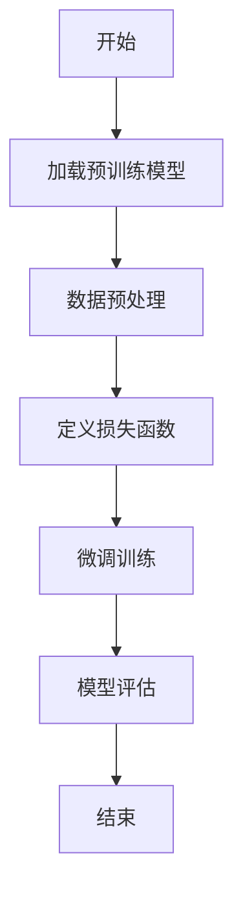
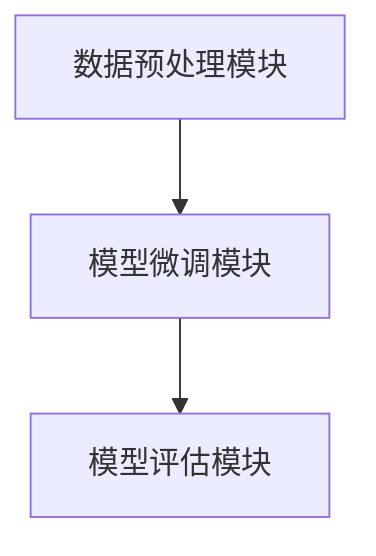

                 


# LLM的微调与适应：针对特定用户群优化

---

## 关键词：LLM、微调、适应、特定用户群、优化、模型调整

---

## 摘要：本文将深入探讨如何通过微调大语言模型（LLM）来优化其性能，使其更好地适应特定用户群的需求。文章从微调的基本概念出发，逐步分析微调的原理、算法、系统架构，并结合实际案例，详细讲解如何实现针对特定用户群的LLM优化。通过本文，读者将掌握微调的核心技术，并能够将其应用到实际项目中。

---

# 引言

在人工智能领域，大语言模型（LLM）已经成为一项革命性的技术，广泛应用于自然语言处理、机器翻译、问答系统、文本生成等领域。然而，尽管LLM在通用任务中表现出色，但在特定用户群中的应用仍面临诸多挑战。不同用户群的需求差异可能导致通用模型的表现不佳，例如，特定领域的术语理解不足、语境适应性差、输出不符合用户习惯等问题。

为了更好地满足特定用户群的需求，微调LLM成为了一个重要的技术手段。微调通过对模型参数的调整，使其在特定领域或任务中表现出色，从而实现针对特定用户群的优化。

本文将系统地探讨LLM微调的核心概念、算法原理、系统架构，并结合实际案例，详细讲解如何通过微调实现针对特定用户群的优化。

---

# 第1章: LLM的微调与适应背景

## 1.1 LLM的定义与核心概念

### 1.1.1 大语言模型的定义

大语言模型（LLM）是一种基于深度学习的自然语言处理模型，通常使用Transformer架构，通过大量的语料库进行训练，能够理解并生成人类语言。LLM的核心目标是通过学习语言的统计规律，实现接近人类的自然语言处理能力。

### 1.1.2 微调的概念与背景

微调（Fine-tuning）是指在预训练好的大模型基础上，针对特定任务或领域进行进一步的训练，以优化模型的性能。微调的目标是通过少量的标注数据，使模型更好地适应特定场景的需求。

### 1.1.3 适应特定用户群的必要性

特定用户群的需求往往具有独特性，例如医疗领域的专业术语、金融领域的行业知识、司法领域的法律法规等。通用模型在处理这些特定需求时可能表现不足，因此，通过微调使模型适应特定用户群的需求成为必要。

---

## 1.2 微调与适应的目标

### 1.2.1 提高模型的适用性

通过微调，模型能够更好地适应特定领域或任务的需求，提高其在特定场景下的适用性。

### 1.2.2 优化模型的性能

微调通过优化模型参数，使模型在特定任务上的性能得到提升，例如准确率、响应速度等。

### 1.2.3 满足特定场景的需求

微调可以使模型更好地理解特定场景下的语义、术语和语境，从而满足特定用户群的需求。

---

## 1.3 微调与适应的背景与意义

### 1.3.1 当前LLM技术的发展现状

近年来，LLM技术取得了巨大进展，从GPT-3到GPT-4，模型的规模和能力不断提升。然而，尽管通用模型表现出色，但在特定领域或特定用户群中的应用仍需进一步优化。

### 1.3.2 微调与适应的市场需求

随着LLM技术的普及，越来越多的企业和开发者希望将LLM应用于特定场景，这催生了对微调技术的需求。

### 1.3.3 适应特定用户群的技术挑战

不同用户群的需求差异较大，如何通过微调使模型适应这些需求，是当前技术面临的挑战之一。

---

## 1.4 本章小结

本章介绍了LLM的定义、微调的概念以及适应特定用户群的必要性。微调作为一种重要的技术手段，能够使模型更好地适应特定场景的需求，从而满足特定用户群的优化目标。

---

# 第2章: 微调的核心概念

## 2.1 微调的定义与核心要素

### 2.1.1 微调的定义

微调是指在预训练好的模型基础上，通过特定任务的数据进行进一步训练，调整模型参数以适应特定需求。

### 2.1.2 微调的核心要素

1. **预训练模型**：微调的基础是已经经过大规模预训练的模型。
2. **微调数据**：用于微调的特定领域或任务的数据。
3. **微调目标**：微调的目标是优化模型在特定任务上的性能。

### 2.1.3 微调与从头训练的区别

- **从头训练**：从零开始训练模型，适用于完全定制化的任务。
- **微调**：基于预训练模型，通过特定数据进一步优化。

---

## 2.2 微调的原理与机制

### 2.2.1 微调的基本原理

微调通过调整模型的参数，使模型在特定任务上表现更好。通常，微调的过程包括以下步骤：

1. **加载预训练模型**：加载已经经过大规模预训练的模型。
2. **数据预处理**：对特定任务的数据进行清洗和格式化。
3. **微调训练**：使用特定任务的数据，对模型进行进一步训练，调整参数以优化特定任务的性能。

### 2.2.2 微调的数学模型

微调的过程可以通过以下公式表示：

$$ L = \text{损失函数} $$

$$ \theta = \theta - \eta \cdot \nabla_{\theta}L $$

其中，$\theta$ 表示模型参数，$\eta$ 表示学习率，$\nabla_{\theta}L$ 表示损失函数对参数的梯度。

### 2.2.3 微调的实现步骤

1. **加载预训练模型**：加载已经经过预训练的模型权重。
2. **数据预处理**：对特定任务的数据进行清洗、分词、标注等处理。
3. **定义损失函数**：根据任务需求定义损失函数，例如交叉熵损失。
4. **微调训练**：使用特定任务的数据，对模型进行微调训练，更新参数以最小化损失函数。
5. **模型评估**：在验证集或测试集上评估模型的性能。

---

## 2.3 微调的实现方式

### 2.3.1 参数微调

参数微调是最常见的微调方式，通过调整模型的全连接层或自注意力层的参数，使模型适应特定任务。

### 2.3.2 知识蒸馏

知识蒸馏是一种通过教师模型指导学生模型学习的技术，适用于模型压缩和特定任务的优化。

### 2.3.3 任务适配

任务适配是指通过特定任务的数据对模型进行适配，使模型更好地理解任务需求。

---

## 2.4 本章小结

本章详细讲解了微调的核心概念，包括微调的定义、核心要素、实现原理和具体方式。通过理解这些概念，读者可以更好地掌握微调的基本知识。

---

# 第3章: 微调算法的数学模型

## 3.1 微调算法的基本框架

### 3.1.1 损失函数的定义

在微调过程中，损失函数用于衡量模型预测与真实值之间的差距。常用的损失函数包括交叉熵损失和均方误差损失。

### 3.1.2 优化目标的设定

微调的目标是最小化损失函数，使模型在特定任务上的性能达到最佳。

### 3.1.3 模型参数的更新

模型参数的更新基于梯度下降算法，通过不断调整参数使损失函数最小化。

---

## 3.2 微调的数学公式

### 3.2.1 损失函数的计算

交叉熵损失函数的数学表达式为：

$$ L = -\frac{1}{N}\sum_{i=1}^{N} \sum_{j=1}^{C} y_{ij} \log p_{ij} $$

其中，$N$ 表示样本数量，$C$ 表示类别数，$y_{ij}$ 表示真实标签，$p_{ij}$ 表示模型预测的概率。

### 3.2.2 梯度下降的实现

梯度下降算法通过以下步骤更新参数：

$$ \theta = \theta - \eta \cdot \frac{\partial L}{\partial \theta} $$

其中，$\eta$ 表示学习率，$\frac{\partial L}{\partial \theta}$ 表示损失函数对参数 $\theta$ 的梯度。

### 3.2.3 参数更新的公式

参数更新的公式可以表示为：

$$ \theta_{\text{new}} = \theta_{\text{old}} - \eta \cdot \nabla L $$

---

## 3.3 微调算法的流程图



---

## 3.4 本章小结

本章通过数学公式和流程图，详细讲解了微调算法的基本框架和实现步骤。理解这些数学模型对于掌握微调技术至关重要。

---

# 第4章: 微调系统的架构设计

## 4.1 系统功能设计

### 4.1.1 数据预处理模块

数据预处理模块负责对特定任务的数据进行清洗、分词和标注。

### 4.1.2 模型微调模块

模型微调模块负责加载预训练模型，并使用特定任务的数据进行微调训练。

### 4.1.3 模型评估模块

模型评估模块负责对微调后的模型进行性能评估，输出模型的准确率、召回率等指标。

---

## 4.2 系统架构设计

### 4.2.1 分层架构设计

系统的架构分为数据层、模型层和应用层。

- **数据层**：负责数据的存储和管理。
- **模型层**：负责模型的加载、微调和评估。
- **应用层**：负责与用户交互，接收输入并输出结果。

### 4.2.2 模块之间的交互关系



### 4.2.3 系统的扩展性设计

系统设计时应考虑扩展性，例如支持多种任务类型和多种数据格式。

---

## 4.3 系统接口设计

### 4.3.1 输入接口设计

输入接口包括预训练模型、特定任务的数据和微调参数。

### 4.3.2 输出接口设计

输出接口包括微调后的模型和性能评估结果。

### 4.3.3 接口的交互流程

1. 用户输入预训练模型和特定任务的数据。
2. 系统加载预训练模型。
3. 系统对数据进行预处理。
4. 系统进行微调训练。
5. 系统输出微调后的模型和性能评估结果。

---

## 4.4 本章小结

本章详细讲解了微调系统的架构设计，包括功能设计、架构设计和接口设计。通过合理的架构设计，可以实现高效的微调过程。

---

# 第5章: 项目实战

## 5.1 项目介绍

本项目旨在通过微调使LLM适应特定用户群的需求。以医疗领域的问答系统为例，我们通过微调使模型更好地理解医疗术语和语境。

---

## 5.2 环境安装

### 5.2.1 安装Python

```bash
python --version
```

### 5.2.2 安装PyTorch

```bash
pip install torch
```

### 5.2.3 安装Hugging Face库

```bash
pip install transformers
```

---

## 5.3 系统核心实现

### 5.3.1 数据预处理

```python
def preprocess_data(data):
    # 数据清洗和格式化
    pass
```

### 5.3.2 模型微调

```python
from transformers import AutoTokenizer, AutoModelWithLMHead

tokenizer = AutoTokenizer.from_pretrained('gpt2')
model = AutoModelWithLMHead.from_pretrained('gpt2')

# 微调训练
model.train()
```

### 5.3.3 模型评估

```python
def evaluate(model, tokenizer, test_data):
    # 模型评估
    pass
```

---

## 5.4 案例分析与详细讲解

以医疗领域为例，我们使用特定的医疗数据对模型进行微调，使模型更好地理解医疗术语和语境，从而提高问答系统的准确率。

---

## 5.5 本章小结

本章通过实际案例，详细讲解了微调项目的实现过程，包括环境安装、核心代码实现和案例分析。

---

# 第6章: 最佳实践

## 6.1 小结

微调是一种重要的技术手段，能够使LLM更好地适应特定用户群的需求。

---

## 6.2 注意事项

1. **数据质量**：微调数据的质量对模型性能影响较大，需确保数据的准确性和代表性。
2. **模型选择**：选择适合特定任务的模型，避免盲目使用通用模型。
3. **参数调整**：合理调整学习率和训练步数，避免过拟合或欠拟合。

---

## 6.3 拓展阅读

1. **《Deep Learning》**：LeCun, Y., Bengio, Y., & Hinton, G. (2015).
2. **《Large Language Models: A Survey**：Brown et al. (2020).

---

# 结语

通过本文的详细讲解，读者可以掌握微调的核心技术，并能够将其应用到实际项目中。微调是一种灵活且高效的技术手段，能够使LLM更好地适应特定用户群的需求，从而在实际应用中发挥更大的价值。

---

# 致谢

感谢读者的耐心阅读，希望本文能为您的学习和工作提供帮助。

