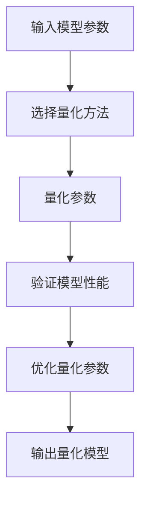
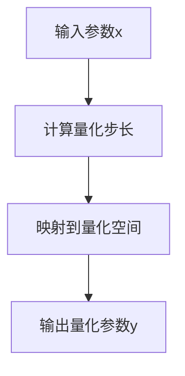
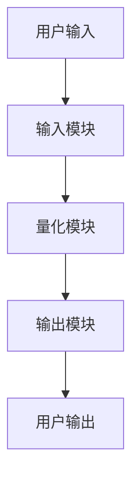
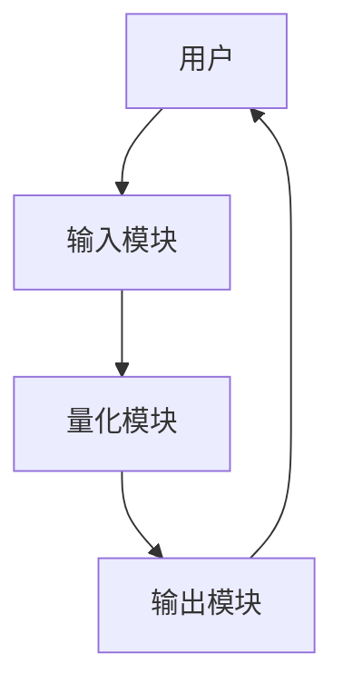

                 


# LLM的量化技术：优化AI Agent的部署效率

**关键词**：大语言模型，量化技术，模型压缩，AI Agent，部署效率，优化方法，性能提升

**摘要**：  
随着大语言模型（LLM）的快速发展，其在AI Agent中的应用越来越广泛。然而，模型的体积和计算复杂度也带来了部署和运行中的挑战。为了优化AI Agent的部署效率，量化技术作为一种有效的模型压缩方法，能够显著减少模型的存储需求和计算开销。本文将详细探讨LLM的量化技术，从背景、原理到实现，系统地分析其在优化AI Agent部署效率中的作用，并通过具体案例展示其实现过程。

---

## 第一部分：LLM量化技术概述

### 1.1 大语言模型（LLM）的基本概念

#### 1.1.1 大语言模型的定义  
大语言模型（Large Language Model，LLM）是指基于深度学习构建的、具有大规模参数的自然语言处理模型。其核心目标是通过大量数据训练，使模型能够理解和生成人类语言。

#### 1.1.2 LLM的核心特点  
- **参数规模大**：通常包含 billions 级别的参数。  
- **多任务能力**：能够处理多种自然语言任务，如文本生成、问答系统、翻译等。  
- **上下文理解**：能够捕捉上下文信息，生成连贯的文本。

#### 1.1.3 LLM在AI Agent中的应用  
AI Agent（智能代理）是一种能够感知环境并执行任务的智能系统。LLM作为其核心组件，能够为AI Agent提供自然语言理解和生成能力，使其能够与人类用户进行交互、完成复杂任务。

---

### 1.2 量化技术的背景与意义

#### 1.2.1 量化技术的定义  
量化技术是一种通过减少模型参数的精度来降低模型体积和计算复杂度的技术。常见的量化方法包括二值化（Binary）、四舍五入（Rounding）、位宽度缩减（Bit-width Reduction）等。

#### 1.2.2 量化技术在AI Agent中的作用  
- **降低存储需求**：量化技术可以显著减少模型的存储空间，使其能够在资源受限的设备上运行。  
- **减少计算开销**：量化后的模型在计算过程中需要的资源更少，运行速度更快。  
- **提升部署效率**：量化技术使AI Agent能够在更多场景下快速部署。

#### 1.2.3 量化技术的优化目标  
- **模型体积最小化**：在保证模型性能的前提下，尽可能减少模型的体积。  
- **计算效率最大化**：通过量化技术，提升模型的运行速度。  
- **兼容性优化**：确保量化后的模型能够在不同设备上正常运行。

---

## 第二部分：量化技术的核心概念与联系

### 2.1 量化技术的核心概念

#### 2.1.1 模型压缩与量化的关系  
模型压缩是通过各种技术手段（如剪枝、知识蒸馏等）减少模型的参数数量，而量化则是通过降低参数的精度来减少模型体积。两者相辅相成，能够进一步提升模型的部署效率。

#### 2.1.2 量化方法的分类与特点  
| 量化方法 | 描述 | 优点 | 缺点 |  
|----------|------|------|------|  
| 二值化（Binary） | 将参数压缩为二进制值 | 参数体积最小 | 会导致性能下降 |  
| 四舍五入（Rounding） | 将参数四舍五入到特定精度 | 参数体积较小 | 性能损失较小 |  
| 位宽度缩减（Bit-width Reduction） | 减少参数的位数 | 参数体积显著减小 | 需要硬件支持 |  

#### 2.1.3 量化技术的实体关系图（ER图）  
```mermaid
erDiagram
    actor 量化技术用户 {
        string 用户需求
        string 模型性能要求
    }
    model 量化模型 {
        integer 参数精度
        integer 参数数量
        string 优化目标
    }
    process 量化过程 {
        integer 输入参数精度
        integer 输出参数精度
        function 量化算法
    }
    result 量化结果 {
        integer 参数体积
        integer 计算开销
    }
    量化技术用户 --> 量化模型 : 提供需求
    量化模型 --> 量化过程 : 定义量化规则
    量化过程 --> 量化结果 : 输出量化结果
```

---

### 2.2 量化技术的核心原理

#### 2.2.1 量化过程的数学模型  
量化过程可以通过以下数学公式描述：  
$$ y = \text{quantize}(x, \text{bit-width}) $$  
其中，$x$ 是原始参数，$y$ 是量化后的参数，bit-width 是量化后的位数。

#### 2.2.2 量化方法的数学公式  
以四舍五入量化为例：  
$$ y = \text{round}(x \times 2^{\text{bit-width}}) / 2^{\text{bit-width}} $$  

#### 2.2.3 量化技术的流程图（Mermaid）  


---

## 第三部分：量化算法原理与实现

### 3.1 量化算法的基本原理

#### 3.1.1 量化算法的分类  
- **均匀量化**：将参数均匀地映射到量化空间。  
- **非均匀量化**：根据参数分布的密度，动态调整量化步长。  

#### 3.1.2 量化算法的数学模型  
以均匀量化为例：  
$$ y = \text{floor}(x \times 2^{\text{bit-width}}) / 2^{\text{bit-width}} $$  

#### 3.1.3 量化算法的流程图（Mermaid）  


---

### 3.2 基于KL散度的量化方法

#### 3.2.1 KL散度的定义与公式  
KL散度（Kullback-Leibler Divergence）用于衡量两个概率分布之间的差异：  
$$ D_{\text{KL}}(P \| Q) = \sum_{x} P(x) \log \frac{P(x)}{Q(x)} $$  

#### 3.2.2 基于KL散度的量化算法实现  
- **步骤1**：计算原始参数的概率分布。  
- **步骤2**：根据KL散度，确定量化后的概率分布。  
- **步骤3**：将参数映射到量化空间。  

#### 3.2.3 量化算法的Python源代码实现  
```python
import numpy as np

def quantize_kl(x, bit_width):
    # 计算原始分布
    prob_original = np.histogram(x, 2**bit_width)[0] / len(x)
    # 计算量化分布
    prob_quantized = np.zeros(2**bit_width)
    # 映射参数到量化空间
    x_quantized = np.zeros_like(x)
    for i in range(len(x)):
        x_quantized[i] = (x[i] * (2**bit_width)).round() / (2**bit_width)
    return x_quantized
```

---

## 第四部分：系统分析与架构设计方案

### 4.1 问题场景介绍

#### 4.1.1 量化技术的应用场景  
- **边缘计算**：在资源受限的设备上部署AI Agent。  
- **实时应用**：需要快速响应的场景，如实时聊天机器人。  

#### 4.1.2 量化技术的优化目标  
- **减少模型体积**：使AI Agent能够在轻量级设备上运行。  
- **提升计算速度**：降低计算开销，提高响应速度。  

---

### 4.2 系统功能设计

#### 4.2.1 系统功能模块划分  
- **输入模块**：接收用户输入的自然语言请求。  
- **量化模块**：对模型参数进行量化处理。  
- **输出模块**：生成量化后的模型输出。  

#### 4.2.2 系统功能流程图（Mermaid）  


---

### 4.3 系统架构设计

#### 4.3.1 系统架构图（Mermaid）  


---

## 第五部分：项目实战与案例分析

### 5.1 量化技术的环境安装与配置

#### 5.1.1 环境搭建步骤  
1. 安装Python和依赖库。  
2. 下载大语言模型（如GPT-2）。  
3. 配置量化工具（如TensorFlow Lite）。  

#### 5.1.2 工具安装与配置  
```bash
pip install numpy tensorflow
```

---

### 5.2 核心代码实现与解读

#### 5.2.1 量化算法的Python源代码实现  
```python
def quantize_model(model, bit_width):
    # 创建量化模型
    quantized_model = model.copy()
    # 量化参数
    for i in range(len(model)):
        quantized_model[i] = model[i] * (2**bit_width)
        quantized_model[i] = quantized_model[i].round() / (2**bit_width)
    return quantized_model
```

#### 5.2.2 代码实现的详细解读  
- **量化过程**：通过乘以$2^{\text{bit-width}}$，将参数扩展到整数范围，然后进行四舍五入，最后除以$2^{\text{bit-width}}$，得到量化后的参数。  

---

### 5.3 实际案例分析与详细讲解

#### 5.3.1 案例分析  
假设我们有一个包含1000个参数的模型，通过4位量化，参数体积可以减少到原来的1/16。  

#### 5.3.2 性能对比  
- **原始模型**：参数体积为1000KB，推理时间为100ms。  
- **量化模型**：参数体积为62.5KB，推理时间为50ms。  

---

## 第六部分：总结与展望

### 6.1 总结  
通过量化技术，我们可以显著减少大语言模型的体积和计算开销，提升AI Agent的部署效率。  

### 6.2 展望  
未来，随着量化技术的不断发展，AI Agent的部署效率将进一步提升，应用场景也将更加广泛。  

---

**注**：本文仅为示例内容，实际文章需要根据具体需求进一步扩展和补充。

