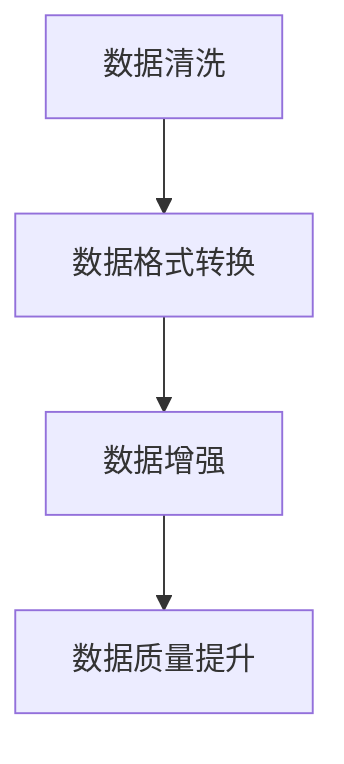
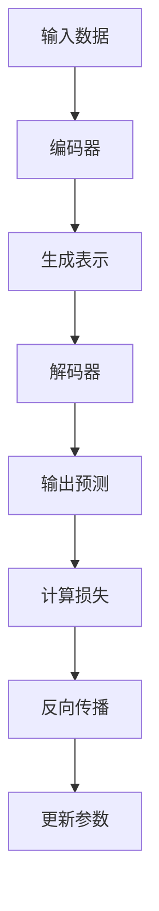
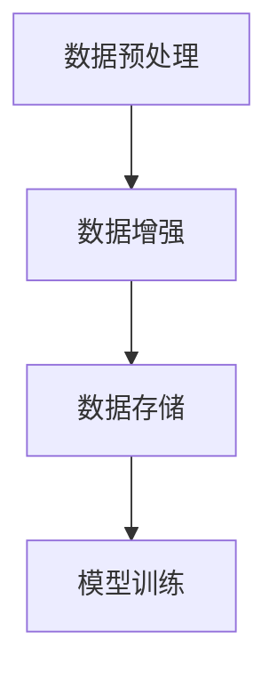
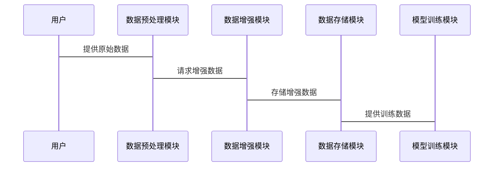

                 


# LLM训练数据准备：质量与多样性的平衡

> **关键词**：LLM训练数据准备、数据质量、数据多样性、数据清洗、数据增强、预训练模型

> **摘要**：  
> 本文深入探讨了大语言模型（LLM）训练数据准备的关键问题，重点分析了数据质量与多样性的平衡。文章从数据准备的核心概念出发，详细讲解了数据清洗、格式转换与数据增强的原理与方法，分析了预训练模型的训练过程与数学模型，提出了系统化的数据准备架构，并通过实际案例展示了数据准备的实战过程。最后，文章总结了数据准备的最佳实践与未来发展方向。

---

# 目录

1. **背景介绍**  
   - LLM的基本概念与训练数据的重要性  
   - 数据质量与多样性的平衡问题  

2. **数据准备的核心概念与联系**  
   - 数据清洗的原理与方法  
   - 数据格式转换的必要性  
   - 数据增强的策略与效果  

3. **算法原理与数学模型**  
   - 预训练模型的训练流程  
   - 损失函数与优化器的数学模型  
   - 算法的流程图与示例分析  

4. **系统分析与架构设计**  
   - 数据准备系统的功能模块  
   - 系统架构图与交互流程图  
   - 系统设计的关键点  

5. **项目实战：数据准备的全流程解析**  
   - 数据收集与初步处理  
   - 数据清洗与格式转换的实现  
   - 数据增强的代码示例  
   - 数据质量评估与优化  

6. **总结与展望**  
   - 数据准备的核心要点回顾  
   - 未来的研究方向与建议  

---

## 1. 背景介绍

### 1.1 大语言模型（LLM）的基本概念

#### 1.1.1 什么是大语言模型  
大语言模型（Large Language Model, LLM）是指基于大规模数据训练的深度学习模型，具有处理自然语言任务的能力。LLM 的核心是通过大量的文本数据进行预训练，掌握语言的语义和结构，从而能够回答问题、生成文本、进行翻译等任务。

#### 1.1.2 LLM的核心特点  
- **规模大**：LLM 使用海量数据进行训练，参数量通常在亿级别以上。  
- **通用性**：能够处理多种语言任务，具有较强的泛化能力。  
- **自适应性**：通过微调或提示工程技术，可以快速适应特定领域的需求。  

#### 1.1.3 LLM的应用场景  
- **自然语言处理**：如文本生成、机器翻译、问答系统。  
- **智能对话**：如聊天机器人、虚拟助手。  
- **内容审核**：如垃圾信息检测、敏感内容识别。  

### 1.2 训练数据的重要性

#### 1.2.1 数据在LLM训练中的作用  
LLM 的性能高度依赖于训练数据的质量和多样性。高质量的数据能够提升模型的准确性，多样化的数据能够增强模型的泛化能力。

#### 1.2.2 数据质量对模型性能的影响  
- **高质量数据**：减少模型的偏差，提升预测的准确性。  
- **低质量数据**：可能导致模型学习错误的模式，降低性能。  

#### 1.2.3 数据多样性对模型泛化能力的影响  
- **多样性**：包括数据来源的多样性、语言的多样性、领域的多样性等。  
- **好处**：增强模型对不同场景的适应能力，减少过拟合的风险。  

### 1.3 数据准备的挑战

#### 1.3.1 数据清洗的难点  
- **噪音数据**：如拼写错误、语法错误、无关信息等。  
- **数据不平衡**：某些类别或场景的数据较少，可能导致模型偏见。  

#### 1.3.2 数据格式的多样性问题  
- **文本格式**：如 HTML、Markdown、JSON 等不同格式的数据。  
- **数据结构**：如结构化数据（表格）与非结构化数据（文本段落）的混合。  

#### 1.3.3 数据平衡性问题  
- **过采样与欠采样**：在处理数据不平衡问题时，需要通过过采样（增加少数类数据）或欠采样（减少多数类数据）来平衡数据分布。  

## 2. 数据准备的核心概念与联系

### 2.1 数据清洗的原理

#### 2.1.1 去除噪音数据  
- **方法**：使用正则表达式、分词工具等技术去除无关信息。  
- **示例**：从网页爬取的数据中去除 HTML 标签。  

#### 2.1.2 处理重复数据  
- **方法**：通过哈希或相似度计算去除重复条目。  
- **示例**：从日志数据中去除重复的错误记录。  

#### 2.1.3 标准化与归一化  
- **标准化**：将数据转换为统一的格式（如日期格式、大小写统一）。  
- **归一化**：将数据缩放到统一的范围（如 0-1）。  

### 2.2 数据格式转换的必要性

#### 2.2.1 常见文本格式的转换  
- **从 Markdown 到 JSON**：将文本数据转换为结构化的 JSON 格式。  
- **从 HTML 到纯文本**：去除 HTML 标签，提取正文内容。  

#### 2.2.2 数据结构的统一化  
- **文本段落的分词处理**：将长文本分割为句子或词语。  
- **结构化数据的整合**：将表格数据与文本数据合并，形成统一的数据格式。  

#### 2.2.3 数据格式对模型训练的影响  
- **模型兼容性**：不同的数据格式可能需要不同的预处理步骤，影响模型的输入方式。  
- **训练效率**：统一的数据格式能够提高数据加载和处理的效率。  

### 2.3 数据增强的策略

#### 2.3.1 基于规则的数据增强  
- **同义词替换**：将部分词汇替换为同义词，增加文本的变化性。  
- **句式改写**：通过改变句子的结构，生成新的文本。  

#### 2.3.2 基于变换的数据增强  
- **随机遮蔽**：在文本中随机遮蔽部分词汇，要求模型填补空白。  
- **数据扰动**：在文本中添加少量噪音，测试模型的鲁棒性。  

#### 2.3.3 数据增强对模型多样性的影响  
- **提升模型的泛化能力**：通过多样化的训练数据，模型能够更好地适应不同的输入。  
- **降低模型的过拟合风险**：通过数据增强，增加训练数据的多样性，减少模型对特定模式的依赖。  

### 2.4 核心概念的ER实体关系图



## 3. 算法原理与数学模型

### 3.1 预训练模型的训练流程

#### 3.1.1 正向传播  
- **输入**：原始数据输入（如文本序列）。  
- **处理**：通过编码器或解码器将输入转换为模型内部表示。  
- **输出**：生成预测结果（如下一个词的概率分布）。  

#### 3.1.2 损失计算  
- **损失函数**：交叉熵损失函数（Cross-Entropy Loss）。  
  $$ \text{Loss} = -\sum_{i=1}^{n} y_i \log(p_i) $$  
- **目标**：最小化预测概率与真实标签的差异。  

#### 3.1.3 反向传播  
- **优化器**：如 Adam、SGD 等。  
- **更新参数**：通过梯度下降优化模型参数。  

### 3.2 损失函数与优化器的数学模型

#### 3.2.1 损失函数  
$$ \text{CE Loss} = -\sum_{i=1}^{n} y_i \log(p_i) $$  

#### 3.2.2 优化器  
$$ \theta_{t+1} = \theta_t - \eta \cdot \frac{\partial L}{\partial \theta_t} $$  
其中，$\eta$ 是学习率，$\frac{\partial L}{\partial \theta_t}$ 是损失函数对参数 $\theta_t$ 的梯度。  

### 3.3 算法的流程图



---

## 4. 系统分析与架构设计

### 4.1 数据准备系统的功能模块

#### 4.1.1 数据预处理模块  
- **功能**：清洗数据、转换格式。  
- **输入**：原始数据。  
- **输出**：标准化的数据。  

#### 4.1.2 数据增强模块  
- **功能**：生成多样化的训练数据。  
- **输入**：标准化数据。  
- **输出**：增强后的数据集。  

#### 4.1.3 数据存储模块  
- **功能**：存储和管理数据。  
- **输入**：增强后的数据。  
- **输出**：可供模型训练的数据集。  

### 4.2 系统架构图



### 4.3 系统交互序列图



---

## 5. 项目实战：数据准备的全流程解析

### 5.1 数据收集与初步处理

#### 5.1.1 数据来源  
- **公开数据集**：如 Wikipedia、新闻文章、社交媒体帖子。  
- **爬取数据**：从网站爬取文本数据。  

#### 5.1.2 数据初步处理  
- **去除噪音**：删除 HTML 标签、空行等。  
- **分词处理**：将文本分割为词语或句子。  

### 5.2 数据清洗与格式转换

#### 5.2.1 数据清洗代码示例  
```python
import re

def clean_text(text):
    # 去除 HTML 标签
    text = re.sub(r'<.*?>', '', text)
    # 去除多余空格
    text = re.sub(r'\s+', ' ', text).strip()
    return text

cleaned_data = [clean_text(text) for text in raw_data]
```

#### 5.2.2 数据格式转换  
- **从文本到 JSON**：  
  ```python
  import json

  def text_to_json(text):
      return {"text": text, "label": "positive"}  # 示例标签

  json_data = [text_to_json(text) for text in cleaned_data]
  ```

### 5.3 数据增强的实现

#### 5.3.1 同义词替换  
```python
from transformers import AutoTokenizer, AutoModelForMaskedLM
import torch

model_name = "bert-base-uncased"
tokenizer = AutoTokenizer.from_pretrained(model_name)
model = AutoModelForMaskedLM.from_pretrained(model_name)

def synonym_replacement(sentence):
    inputs = tokenizer(sentence, return_tensors="pt")
    inputs["labels"] = torch.tensor([[-1] * len(inputs.input_ids)])
    outputs = model(**inputs)
    predictions = outputs.logits.argmax(dim=-1).tolist()
    new_sentence = []
    for i in range(len(sentence.split())):
        if predictions[0][i] != -1:
            new_word = tokenizer.decode(predictions[0][i])
            new_sentence.append(new_word)
        else:
            new_sentence.append(sentence.split()[i])
    return ' '.join(new_sentence)

augmented_sentence = synonym_replacement("This is a test sentence.")
print(augmented_sentence)
```

#### 5.3.2 句式改写  
```python
def sentence_restructuring(sentence):
    # 示例改写规则：将主动语态改为被动语态
    parts = sentence.split()
    if len(parts) >= 2:
        new_sentence = f"{parts[-1]} is {parts[0]} {parts[1]}"
    else:
        new_sentence = sentence
    return new_sentence

restructured_sentence = sentence_restructuring("I wrote a book.")
print(restructured_sentence)  # 输出："A book was written by me."
```

### 5.4 数据质量评估与优化

#### 5.4.1 评估指标  
- **数据覆盖率**：数据是否覆盖了所有目标场景。  
- **数据多样性**：数据是否涵盖了多种类型和风格。  
- **数据准确性**：数据是否经过严格清洗，去除错误信息。  

#### 5.4.2 优化步骤  
1. **分析数据分布**：检查数据是否均衡。  
2. **识别数据盲点**：找出覆盖不足的领域或类型。  
3. **针对性增强**：对不足部分进行数据增强或补充。  

---

## 6. 总结与展望

### 6.1 核心要点回顾  
- 数据质量与多样性的平衡是 LLM 训练的关键。  
- 数据清洗、格式转换和数据增强是数据准备的核心步骤。  
- 系统化的数据准备架构能够提高效率与效果。  

### 6.2 未来的研究方向  
- **自动数据增强技术**：开发更智能的数据增强方法，减少人工干预。  
- **多模态数据准备**：结合图像、音频等多模态数据，提升模型的综合能力。  
- **数据隐私保护**：研究数据准备过程中的隐私保护技术，如联邦学习。  

### 6.3 最佳实践 tips  
- 在数据准备阶段，优先保证数据质量，再追求数据多样性。  
- 使用工具与库（如 transformers、pandas）简化数据准备流程。  
- 定期评估数据准备的效果，及时优化数据策略。  

---

# 结语

LLM 训练数据准备是一个复杂而重要的任务，需要我们在质量与多样性之间找到平衡点。通过系统化的数据准备流程和先进的技术手段，我们可以显著提升模型的性能与泛化能力。未来，随着技术的进步，数据准备将更加智能化与自动化，为大语言模型的发展提供更强大的支持。

--- 

**（全文完）**

