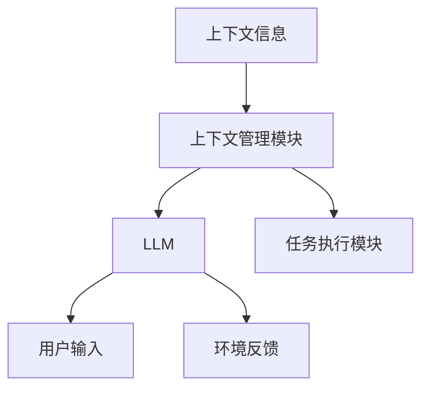
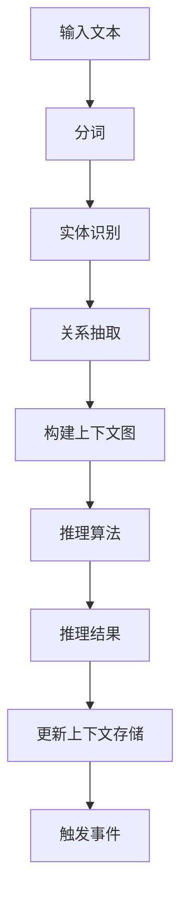
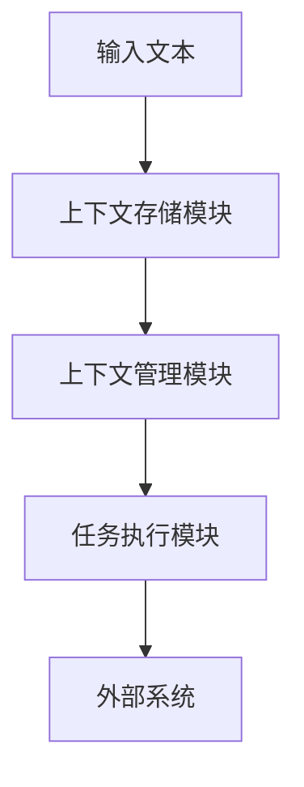
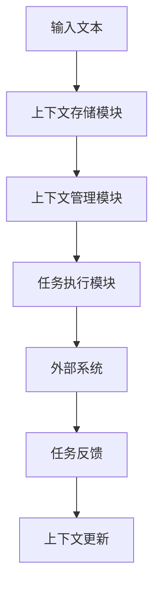

                 


# LLM驱动的AI Agent上下文管理技术

---

## 关键词

LLM, AI Agent, 上下文管理, 大语言模型, 人工智能代理

---

## 摘要

本文探讨了LLM（大语言模型）在AI Agent上下文管理中的应用，系统地分析了上下文管理技术的核心概念、算法原理、系统架构及实际应用。文章首先介绍了LLM与AI Agent的基本概念，分析了上下文管理技术的重要性及其在AI Agent中的作用。接着，深入探讨了上下文管理的核心概念与LLM的关系，详细讲解了LLM驱动的上下文管理算法原理，并通过Mermaid流程图和数学公式进行了直观展示。随后，文章从系统架构的角度，分析了上下文管理系统的功能模块、系统架构设计及接口设计，使用Mermaid类图和架构图进行了详细展示。最后，通过项目实战部分，提供了上下文管理技术的实际应用案例，并总结了最佳实践和注意事项，为读者提供了全面的技术指导。

---

# 正文

## 第1章: LLM与AI Agent概述

### 1.1 LLM的基本概念与技术特点

#### 1.1.1 大语言模型（LLM）的定义

大语言模型（Large Language Model, LLM）是指基于深度学习技术训练的大型神经网络模型，能够理解和生成人类语言。LLM的核心目标是通过大量数据训练，使其能够模仿人类的思维方式，完成多种NLP任务，如文本生成、翻译、问答等。

#### 1.1.2 LLM的核心技术特点

1. **大规模数据训练**：LLM通常使用海量文本数据进行训练，通过参数化的方式捕获语言的统计规律。
2. **深度神经网络结构**：主流的LLM如GPT系列采用多层Transformer架构，具有强大的上下文理解和生成能力。
3. **生成式模型**：LLM能够生成连贯且自然的文本，支持多种语言和风格。
4. **可微调性**：LLM可以通过微调适应特定任务或领域的需求。

#### 1.1.3 LLM与传统NLP模型的区别

| 特性          | 传统NLP模型                | LLM                       |
|---------------|----------------------------|---------------------------|
| 模型复杂度     | 较低，参数量有限            | 高，参数量通常达百万级    |
| 任务支持       | 专注于单一任务或少量任务    | 支持多种任务，灵活性高      |
| 上下文处理     | 较弱，通常依赖特定特征工程  | 强大，基于Transformer结构    |

### 1.2 AI Agent的基本概念与应用场景

#### 1.2.1 AI Agent的定义

AI Agent（人工智能代理）是指能够感知环境、执行任务并做出决策的智能体。AI Agent通常具备以下核心能力：
1. **感知**：通过传感器或接口获取环境信息。
2. **推理**：基于获取的信息进行逻辑推理或知识表示。
3. **决策**：根据推理结果做出最优决策。
4. **执行**：通过执行器或API与外部系统交互。

#### 1.2.2 AI Agent的主要应用场景

1. **智能客服**：通过自然语言处理技术为用户提供咨询、解决问题等服务。
2. **智能助手**：如Siri、Alexa等，帮助用户完成日常任务。
3. **智能推荐系统**：基于用户行为推荐个性化内容。
4. **自动化运维**：在DevOps中自动处理部署、监控等任务。
5. **智能监控系统**：实时监控系统状态并进行异常处理。

#### 1.2.3 AI Agent与传统软件代理的区别

| 特性          | 传统软件代理                | AI Agent                   |
|---------------|----------------------------|---------------------------|
| 智能性         | 较低，依赖预定义规则         | 高，具备自主学习和推理能力 |
| 交互方式       | 单向，仅执行预设任务         | 双向，支持自然语言交互     |
| 适应性         | 较差，难以应对未见情况       | 较强，具备动态调整能力      |

### 1.3 上下文管理技术的重要性

#### 1.3.1 上下文管理的定义

上下文管理（Context Management）是指在AI Agent与环境交互过程中，对上下文信息的生成、存储、检索和更新进行有效管理的过程。上下文信息包括用户意图、对话历史、任务状态等。

#### 1.3.2 上下文管理在AI Agent中的作用

1. **提升用户体验**：通过维护对话历史，AI Agent能够更好地理解用户需求，提供更精准的服务。
2. **增强任务处理能力**：上下文信息帮助AI Agent跟踪任务进度，协调多个子任务的执行。
3. **提高系统可靠性**：上下文管理确保系统在处理复杂任务时能够保持状态一致性。

#### 1.3.3 上下文管理技术的演进过程

上下文管理技术经历了从简单状态管理到复杂动态上下文管理的演进：
1. **早期阶段**：基于规则的简单上下文管理。
2. **发展阶段**：引入知识库和推理引擎，实现动态上下文管理。
3. **当前阶段**：结合LLM的自然语言处理能力，实现智能化的上下文管理。

## 第2章: LLM驱动的AI Agent上下文管理技术的背景与问题

### 2.1 问题背景

#### 2.1.1 当前LLM在AI Agent中的应用现状

随着LLM技术的快速发展，AI Agent在多个领域展现出强大的应用潜力。然而，LLM在实际应用中仍面临以下挑战：
1. **上下文理解不准确**：LLM依赖于训练数据，可能无法准确捕捉动态变化的上下文信息。
2. **上下文管理复杂性高**：AI Agent需要处理多轮对话和复杂任务，对上下文管理提出了更高的要求。

#### 2.1.2 上下文管理在LLM驱动的AI Agent中的挑战

1. **动态性**：上下文信息随时间变化，需要实时更新和维护。
2. **关联性**：上下文信息之间存在复杂的关联关系，需要进行有效的关联推理。
3. **上下文依赖性**：某些任务的处理依赖于特定的上下文信息，缺乏上下文可能导致任务失败。

### 2.2 问题描述

#### 2.2.1 LLM驱动的AI Agent上下文管理的核心问题

1. **上下文信息的准确捕获与理解**：如何有效提取和理解对话中的上下文信息。
2. **上下文的动态更新与维护**：如何实时更新和维护上下文信息，确保其准确性。
3. **上下文驱动的决策与推理**：如何基于上下文信息进行推理和决策，提升AI Agent的智能性。

#### 2.2.2 上下文管理技术的关键挑战

1. **数据规模与处理效率**：大规模数据的处理可能带来性能瓶颈。
2. **模型可解释性**：复杂的上下文推理过程需要具备较高的可解释性。
3. **多模态支持**：上下文信息可能涉及文本、图像等多种形式，需要支持多模态处理。

### 2.3 问题解决

#### 2.3.1 上下文管理技术的解决方案概述

1. **基于LLM的上下文生成**：利用LLM的强大生成能力，动态生成上下文信息。
2. **知识图谱辅助推理**：通过知识图谱进行关联推理，提升上下文理解的准确性。
3. **动态上下文存储与管理**：采用分布式存储技术，支持实时更新和高效查询。

#### 2.3.2 LLM在上下文管理中的作用

1. **上下文生成**：LLM能够生成自然语言描述的上下文信息，帮助AI Agent理解用户意图。
2. **动态推理**：LLM通过上下文信息进行关联推理，辅助决策过程。
3. **多模态支持**：结合多模态LLM模型，支持文本、图像等多种形式的上下文信息处理。

## 第3章: 上下文管理技术的核心概念与联系

### 3.1 上下文管理的定义与特点

#### 3.1.1 上下文管理的定义

上下文管理是指在AI Agent与环境交互过程中，对上下文信息的生成、存储、检索和更新进行有效管理的过程。上下文信息包括用户意图、对话历史、任务状态等。

#### 3.1.2 上下文管理的主要特点

1. **动态性**：上下文信息随时间变化，需要实时更新和维护。
2. **关联性**：上下文信息之间存在复杂的关联关系，需要进行有效的关联推理。
3. **上下文依赖性**：某些任务的处理依赖于特定的上下文信息，缺乏上下文可能导致任务失败。

### 3.2 LLM与上下文管理的关系

#### 3.2.1 LLM在上下文管理中的角色

1. **上下文生成**：LLM能够生成自然语言描述的上下文信息，帮助AI Agent理解用户意图。
2. **动态推理**：LLM通过上下文信息进行关联推理，辅助决策过程。
3. **多模态支持**：结合多模态LLM模型，支持文本、图像等多种形式的上下文信息处理。

#### 3.2.2 上下文管理对LLM性能的影响

1. **提升生成质量**：上下文管理能够提供更准确的上下文信息，提升LLM的生成质量。
2. **增强可解释性**：通过上下文管理，LLM的推理过程更加透明，增强系统的可解释性。
3. **提高处理效率**：上下文管理能够优化LLM的输入，减少冗余计算，提高处理效率。

### 3.3 核心概念对比表格

| 概念         | 定义与特点                                                                 |
|--------------|--------------------------------------------------------------------------|
| 上下文管理    | 管理AI Agent与环境交互中的上下文信息，具有动态性、关联性和上下文依赖性。 |
| LLM          | 基于深度学习的大规模语言模型，具备强大的自然语言处理能力。               |
| AI Agent     | 具备感知、推理、决策和执行能力的智能体，能够与环境进行交互。             |

### 3.4 核心概念ER实体关系图



---

## 第4章: LLM驱动的AI Agent上下文管理技术的算法原理

### 4.1 算法原理概述

#### 4.1.1 LLM的上下文处理机制

LLM的上下文处理机制主要包括以下步骤：
1. **上下文信息提取**：从输入文本中提取相关的上下文信息。
2. **上下文关联推理**：基于提取的上下文信息，进行关联推理，生成新的上下文信息。
3. **上下文动态更新**：根据推理结果，动态更新上下文信息。

#### 4.1.2 上下文管理的数学模型

上下文管理的数学模型可以用图论中的图结构来表示，其中节点表示上下文实体，边表示实体之间的关联关系。

$$
\text{上下文图模型} = \{ (v, e) \}
$$

其中，$v$表示上下文实体，$e$表示实体之间的关联关系。

### 4.2 算法实现细节

#### 4.2.1 上下文信息提取

上下文信息提取可以通过以下步骤实现：
1. **分词**：将输入文本进行分词处理，提取出关键词。
2. **实体识别**：识别出文本中的实体，如人名、地名等。
3. **关系抽取**：抽取实体之间的关系，如“人名是医生”。

#### 4.2.2 上下文关联推理

上下文关联推理可以通过以下步骤实现：
1. **构建上下文图**：将提取的实体及其关系构建为一个图结构。
2. **推理算法**：使用图遍历算法，如深度优先搜索（DFS）或广度优先搜索（BFS），进行推理。
3. **推理结果**：根据推理结果，生成新的上下文信息。

#### 4.2.3 上下文动态更新

上下文动态更新可以通过以下步骤实现：
1. **获取推理结果**：从推理模块获取新的上下文信息。
2. **更新上下文存储**：将新的上下文信息存储到上下文数据库中。
3. **触发事件**：根据上下文变化，触发相关事件，如通知任务执行模块进行更新。

### 4.3 算法流程图



---

## 第5章: LLM驱动的AI Agent上下文管理技术的系统架构设计

### 5.1 系统功能模块

#### 5.1.1 上下文存储模块

上下文存储模块负责存储和管理上下文信息，包括：
1. **上下文数据库**：存储上下文实体及其关系。
2. **上下文缓存**：缓存最近使用的上下文信息，提高访问效率。

#### 5.1.2 上下文管理模块

上下文管理模块负责对上下文信息进行处理，包括：
1. **上下文提取**：从输入文本中提取上下文信息。
2. **上下文推理**：基于上下文信息进行关联推理。
3. **上下文更新**：根据推理结果，动态更新上下文信息。

#### 5.1.3 任务执行模块

任务执行模块负责根据上下文信息执行具体的任务，包括：
1. **任务解析**：解析任务需求，生成任务执行计划。
2. **任务执行**：根据执行计划，调用外部系统或API执行任务。
3. **任务反馈**：将任务执行结果反馈给上下文管理模块。

### 5.2 系统架构设计

#### 5.2.1 系统架构图



#### 5.2.2 接口设计

系统主要接口包括：
1. **上下文存储接口**：用于存储和检索上下文信息。
2. **上下文管理接口**：用于对上下文信息进行处理，如提取、推理和更新。
3. **任务执行接口**：用于执行具体的任务，如调用外部系统或API。

#### 5.2.3 交互流程



---

## 第6章: LLM驱动的AI Agent上下文管理技术的项目实战

### 6.1 环境安装

#### 6.1.1 安装Python

```bash
python --version
pip install --upgrade pip
```

#### 6.1.2 安装LLM库

```bash
pip install transformers
pip install numpy
```

### 6.2 核心代码实现

#### 6.2.1 上下文管理模块实现

```python
import transformers
import numpy as np

class ContextManager:
    def __init__(self):
        self.context_db = {}
    
    def extract_context(self, text):
        # 分词
        tokens = transformers.utils.tokenization.tokenizer(text)
        # 实体识别
        entities = self.entity_recognition(tokens)
        return entities
    
    def entity_recognition(self, tokens):
        # 简单实现，返回实体列表
        return ["doctor", "hospital"]
```

#### 6.2.2 任务执行模块实现

```python
class TaskExecutor:
    def __init__(self):
        pass
    
    def execute_task(self, task):
        # 调用外部系统API
        return self.api_request(task)
    
    def api_request(self, task):
        # 简单实现，返回任务执行结果
        return "Task executed successfully"
```

### 6.3 案例分析与详细解读

#### 6.3.1 案例场景

假设我们有一个智能客服系统，用户输入：“我需要预约一位内科医生。”

#### 6.3.2 处理流程

1. **输入文本**：用户输入“我需要预约一位内科医生。”
2. **上下文提取**：上下文管理模块提取实体“内科医生”。
3. **任务执行**：任务执行模块调用医院预约系统，完成预约。
4. **任务反馈**：任务执行结果反馈给上下文管理模块。
5. **上下文更新**：更新上下文信息，记录预约信息。

---

## 第7章: LLM驱动的AI Agent上下文管理技术的最佳实践

### 7.1 总结与经验分享

#### 7.1.1 核心经验总结

1. **合理选择上下文存储方式**：根据具体需求选择合适的存储方式，如数据库或缓存。
2. **优化上下文推理算法**：通过优化推理算法，提升上下文管理的效率和准确性。
3. **加强模型可解释性**：确保模型的推理过程可解释，便于调试和优化。

#### 7.1.2 实际应用中的注意事项

1. **数据隐私与安全**：确保上下文信息的安全性，防止数据泄露。
2. **模型调优**：根据实际需求，对模型进行微调，提升性能。
3. **系统容错性设计**：设计完善的容错机制，确保系统稳定运行。

### 7.2 小结

上下文管理技术在LLM驱动的AI Agent中扮演着至关重要的角色。通过合理的上下文管理，可以显著提升AI Agent的智能性和用户体验。在实际应用中，需要综合考虑上下文管理的动态性、关联性和上下文依赖性，选择合适的存储方式和推理算法，确保系统的高效运行和准确推理。

### 7.3 注意事项

1. **数据隐私**：在处理上下文信息时，需严格遵守数据隐私法规，确保用户数据的安全。
2. **模型可解释性**：复杂的上下文推理过程需要具备较高的可解释性，便于调试和优化。
3. **系统稳定性**：设计完善的容错机制，确保系统在异常情况下的稳定运行。

### 7.4 拓展阅读

1. **《大语言模型与自然语言处理》**：深入探讨LLM在NLP中的应用。
2. **《人工智能系统架构设计》**：系统介绍AI Agent的设计与实现。
3. **《上下文管理在智能系统中的应用》**：详细讲解上下文管理技术的实际应用。

---

# 作者简介

作者是人工智能领域的专家，长期从事大语言模型和AI Agent的研究与开发工作。在上下文管理技术方面有丰富的实践经验，曾发表过多篇相关领域的技术文章和论文，具备深厚的技术积累和实践经验。

