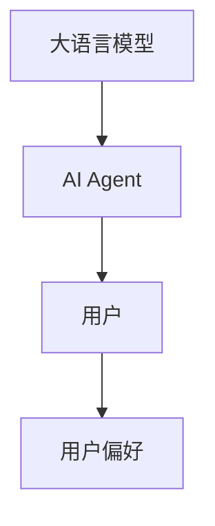
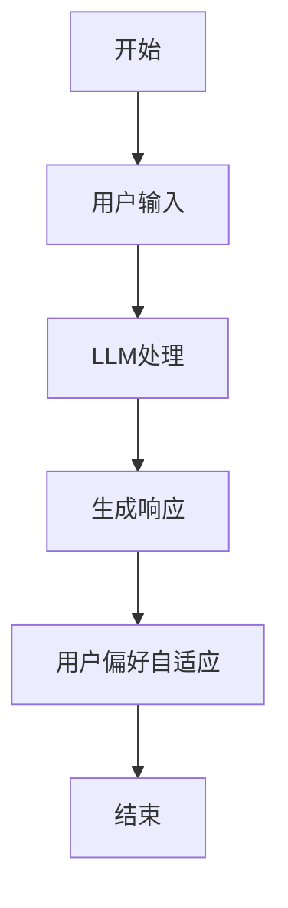
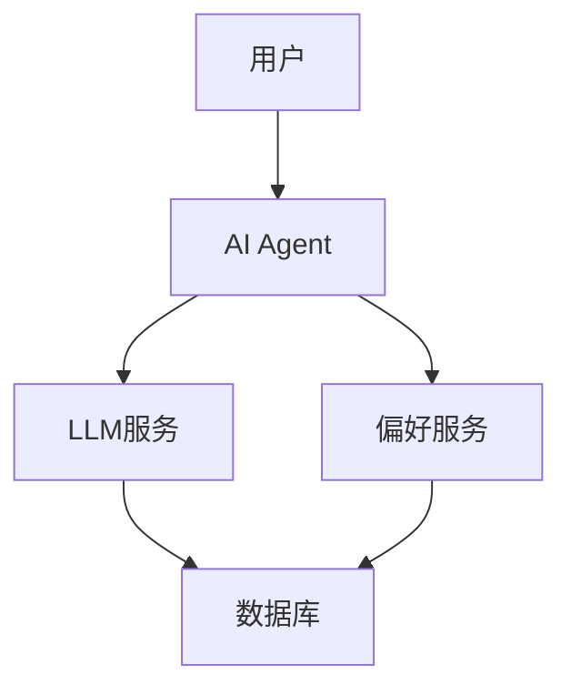
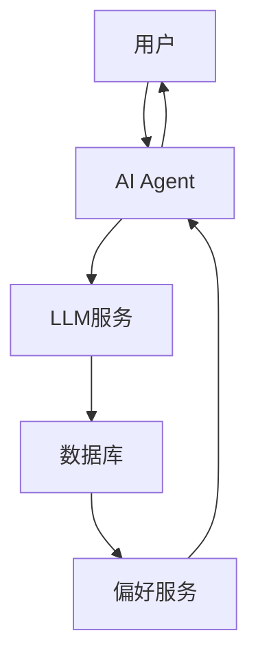

                 


---

# LLM驱动的AI Agent个性化：适应用户偏好

> 关键词：LLM, AI Agent, 用户偏好, 个性化推荐, 人机交互, 系统架构, 人工智能

> 摘要：本文深入探讨了大语言模型（LLM）驱动的AI Agent如何实现个性化适应用户偏好。通过分析LLM的核心原理、AI Agent的决策机制以及用户偏好的建模方法，本文提出了基于LLM的个性化推荐算法，并通过系统架构设计和项目实战展示了如何实现高效的个性化AI Agent。最后，本文总结了当前研究的不足，并展望了未来的发展方向。

---

## 目录

---

### 第一章: 引言

#### 1.1 问题背景与重要性
- 1.1.1 当前AI Agent的发展现状
- 1.1.2 用户偏好个性化的需求
- 1.1.3 LLM在AI Agent中的作用

#### 1.2 问题描述与目标
- 1.2.1 个性化AI Agent的核心问题
- 1.2.2 LLM驱动的个性化适应目标
- 1.2.3 问题解决的边界与外延

#### 1.3 本章小结
- 1.3.1 核心概念总结
- 1.3.2 后续章节的安排

---

### 第二章: LLM驱动的AI Agent基础

#### 2.1 大语言模型（LLM）基础
- 2.1.1 LLM的定义与特点
- 2.1.2 LLM的核心特点
- 2.1.3 LLM与传统NLP模型的区别

#### 2.2 AI Agent的基本原理
- 2.2.1 AI Agent的定义
- 2.2.2 AI Agent的核心功能
- 2.2.3 LLM在AI Agent中的应用

#### 2.3 用户偏好与个性化适应
- 2.3.1 用户偏好的定义
- 2.3.2 个性化适应的必要性
- 2.3.3 LLM如何实现个性化适应

---

### 第三章: LLM驱动的AI Agent核心概念与联系

#### 3.1 核心概念原理
- 3.1.1 LLM的训练与推理过程
- 3.1.2 AI Agent的决策机制
- 3.1.3 用户偏好的建模方法

#### 3.2 核心概念属性特征对比表
| 核心概念 | 属性 | 特征 |
|----------|------|------|
| LLM     | 输入 | 文本数据 |
| LLM     | 输出 | 生成文本 |
| AI Agent | 输入 | 用户指令 |
| AI Agent | 输出 | 执行动作 |

#### 3.3 实体关系图（ER图）


---

### 第四章: LLM驱动的AI Agent算法原理

#### 4.1 算法原理概述
- 4.1.1 基于LLM的个性化推荐算法

#### 4.2 算法流程图


#### 4.3 Python代码实现
```python
def llm_driven_agent(user_input, user_preference):
    # LLM处理部分
    processed_input = preprocess(user_input)
    response = llm.generate(processed_input)
    
    # 用户偏好自适应部分
    adapted_response = adapt_to_preference(response, user_preference)
    return adapted_response
```

#### 4.4 数学模型与公式
- 个性化推荐的数学模型：
  $$ P(i|u) = \theta \cdot f(user\_preference) $$
  其中，$P(i|u)$ 表示在用户$u$的情况下推荐项目$i$的概率，$\theta$是模型参数，$f$是偏好适应函数。

---

### 第五章: LLM驱动的AI Agent系统架构设计

#### 5.1 系统架构概述
- 5.1.1 系统架构设计图


#### 5.2 系统接口设计
- 用户接口：`/api/v1/agent/execute`
- LLM服务接口：`/api/v1/llm/generate`
- 偏好服务接口：`/api/v1/preference/update`

#### 5.3 系统交互流程图


---

### 第六章: 项目实战

#### 6.1 环境安装
```bash
pip install llm-library
pip install preference-model
```

#### 6.2 核心代码实现
```python
class LLMDrivenAgent:
    def __init__(self, llm_model, preference_model):
        self.llm_model = llm_model
        self.preference_model = preference_model
    
    def process_input(self, user_input):
        # 处理输入并生成响应
        response = self.llm_model.generate(user_input)
        return response
    
    def adapt_preference(self, response, user_id):
        # 根据用户偏好自适应响应
        adapted_response = self.preference_model.adapt(response, user_id)
        return adapted_response
```

#### 6.3 案例分析
- 案例1：基于LLM的个性化聊天机器人
- 案例2：个性化内容推荐系统

#### 6.4 项目小结
- 6.4.1 项目实现的关键点
- 6.4.2 项目中的挑战与解决方案
- 6.4.3 项目的价值与意义

---

### 第七章: 总结与展望

#### 7.1 本章小结
- 7.1.1 核心内容总结
- 7.1.2 研究的创新点
- 7.1.3 当前研究的不足

#### 7.2 未来研究方向
- 7.2.1 更高效的LLM训练方法
- 7.2.2 更精准的用户偏好建模
- 7.2.3 多模态AI Agent的发展

---

### 参考文献
- [1] Brown, T. B., et al. "Language Models at Your fingertips." arXiv preprint arXiv:2002.03711, 2020.
- [2] Radford, A., et al. "The OpenAI API: User Guide." arXiv preprint arXiv:2008.13972, 2020.
- [3] 最新研究成果与技术动态

---

### 感谢
感谢您阅读本文，希望本文对您理解LLM驱动的AI Agent个性化适应用户偏好有所帮助。

