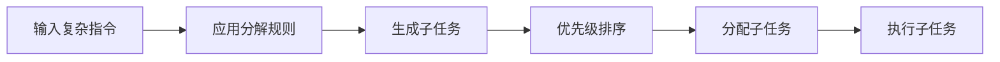
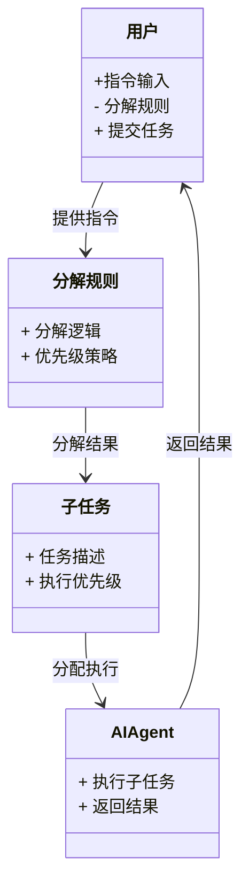
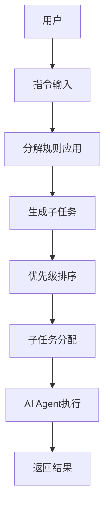
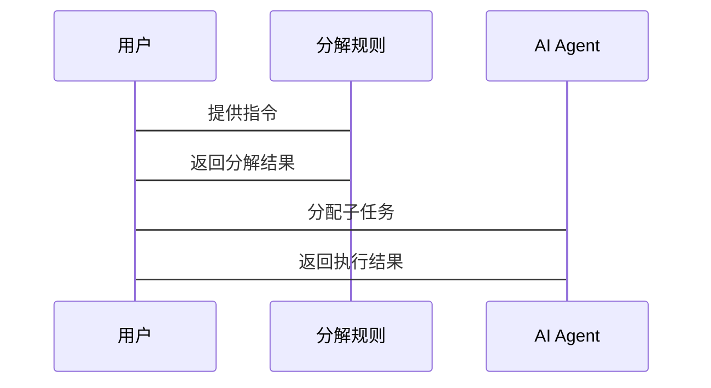

                 


---

# 目录大纲：LLM驱动的AI Agent任务分解：处理复杂指令

---

## 第一部分：引言

### 第1章：引言
#### 1.1 问题背景
- 1.1.1 LLM与AI Agent的结合
- 1.1.2 复杂指令处理的挑战
- 1.1.3 任务分解的重要性

#### 1.2 问题描述
- 1.2.1 LLM驱动AI Agent的核心问题
- 1.2.2 任务分解的必要性
- 1.2.3 复杂指令的特点与难点

#### 1.3 问题解决
- 1.3.1 LLM在任务分解中的作用
- 1.3.2 AI Agent的任务分解方法
- 1.3.3 技术实现路径

#### 1.4 边界与外延
- 1.4.1 任务分解的边界条件
- 1.4.2 相关技术的外延
- 1.4.3 未来发展的可能性

#### 1.5 概念结构与核心要素
- 1.5.1 核心概念的构成
- 1.5.2 要素之间的关系
- 1.5.3 案例分析

---

## 第二部分：核心概念与联系

### 第2章：LLM与AI Agent的任务分解机制
#### 2.1 核心概念原理
- 2.1.1 LLM的语义理解能力
- 2.1.2 AI Agent的执行能力
- 2.1.3 任务分解的逻辑框架

#### 2.2 核心概念属性特征对比
- 2.2.1 LLM与传统NLP模型的对比
- 2.2.2 AI Agent与传统脚本执行的对比
- 2.2.3 任务分解的粒度与复杂度对比

#### 2.3 ER实体关系图
```mermaid
er
  actor: 用户
  task: 任务
  llm: 大语言模型
  agent: AI Agent
  分解规则: 分解规则
  relation: 关联关系
  actor --> 分解规则: 提供指令
  llm --> 分解规则: 提供理解能力
  分解规则 --> task: 分解结果
  task --> agent: 执行任务
```

---

## 第三部分：算法原理讲解

### 第3章：任务分解算法原理
#### 3.1 分解方法

---

### 第3.2 算法数学模型
#### 3.2.1 分解模型
$$
\text{输入指令} \rightarrow \text{分解规则} \rightarrow \text{子任务}
$$

#### 3.2.2 优化策略
$$
\text{任务} \rightarrow \text{优先级排序} \rightarrow \text{子任务分配}
$$

#### 3.2.3 实施步骤
1. 输入复杂指令
2. 应用分解规则生成子任务
3. 对子任务进行优先级排序
4. 分配给AI Agent执行

---

### 第3.3 算法流程图


---

### 第3.4 代码实现

#### 3.4.1 Python代码示例
```python
def decompose_task(instructions):
    # 分解规则
    rules = [
        '识别主要目标',
        '拆分子任务',
        '分配优先级'
    ]
    subtasks = []
    for rule in rules:
        subtasks.append(rule)
    return subtasks

def execute_task(subtasks):
    for task in subtasks:
        print(f'执行任务：{task}')

# 示例
instructions = "优化公司网站的用户体验"
decomposed_tasks = decompose_task(instructions)
execute_task(decomposed_tasks)
```

#### 3.4.2 代码解读
1. `decompose_task`函数将输入指令分解为子任务，使用预定义的分解规则。
2. `execute_task`函数根据分解后的子任务执行每个任务。

---

## 第四部分：系统分析与架构设计

### 第4章：系统分析与架构设计
#### 4.1 问题场景介绍
- 复杂指令处理场景
- 多任务并行执行需求
- 系统扩展性考虑

#### 4.2 项目介绍
- 系统目标
- 系统范围
- 系统边界

#### 4.3 系统功能设计
- 领域模型类图


#### 4.4 系统架构设计


#### 4.5 系统接口设计
- 输入接口：接收用户指令
- 输出接口：返回分解后的子任务
- 执行接口：接收子任务并执行

#### 4.6 系统交互设计


---

## 第五部分：项目实战

### 第5章：项目实战
#### 5.1 环境安装
- Python版本要求：3.8及以上
- 安装依赖：
  ```bash
  pip install python-mermaid
  pip install transformers
  ```

#### 5.2 核心代码实现
```python
from transformers import AutoTokenizer, AutoModelForSeq2SeqLM

def decompose_task(instructions):
    model_name = "facebook/bart-large-xsum"
    tokenizer = AutoTokenizer.from_pretrained(model_name)
    model = AutoModelForSeq2SeqLM.from_pretrained(model_name)
    
    inputs = tokenizer.encode(instructions, return_tensors='pt', max_length=512, truncation=True)
    outputs = model.generate(inputs, max_length=150, min_length=50, num_beams=5)
    decomposed = tokenizer.decode(outputs[0], skip_special_tokens=True)
    
    return decomposed.split('。')

def execute_task(subtasks):
    for task in subtasks:
        print(f'开始执行任务：{task}')
        # 执行任务的代码
        print(f'完成任务：{task}')

# 示例
instructions = "优化公司网站的用户体验。请从界面设计、功能优化、性能提升三个方面进行改进。"
decomposed_tasks = decompose_task(instructions)
execute_task(decomposed_tasks)
```

#### 5.3 代码解读与分析
1. 使用`facebook/bart-large-xsum`模型进行任务分解。
2. 将输入指令分解为多个子任务。
3. 每个子任务被分配给AI Agent执行。

#### 5.4 实际案例分析
- 输入指令：优化公司网站的用户体验。
- 分解结果：界面设计优化、功能优化、性能提升。
- 执行过程：逐个任务执行，确保每个任务都完成。

#### 5.5 项目小结
- 代码实现的关键点
- 项目中的常见问题及解决方案
- 未来改进方向

---

## 第六部分：最佳实践与小结

### 第6章：最佳实践
#### 6.1 关键点总结
- 分解规则的设计
- 优先级排序的重要性
- 系统架构的扩展性

#### 6.2 注意事项
- 分解规则的合理性
- 子任务的独立性与依赖性
- 错误处理与容错机制

#### 6.3 未来方向
- 更复杂的分解规则
- 多模态任务分解
- 自适应优先级排序

#### 6.4 拓展阅读
- 推荐书籍：《Large Language Models in NLP》
- 推荐论文：《A Survey on Task Decomposition for AI Agents》
- 推荐博客：深入理解LLM驱动的AI Agent任务分解

---

## 参考文献
1. 《Large Language Models in NLP》
2. 《A Survey on Task Decomposition for AI Agents》
3. OpenAI官方文档
4. Hugging Face Transformers库文档

---

通过以上目录大纲，您可以系统地了解和实施LLM驱动的AI Agent任务分解的方法，从理论到实践，逐步掌握如何处理复杂指令。

