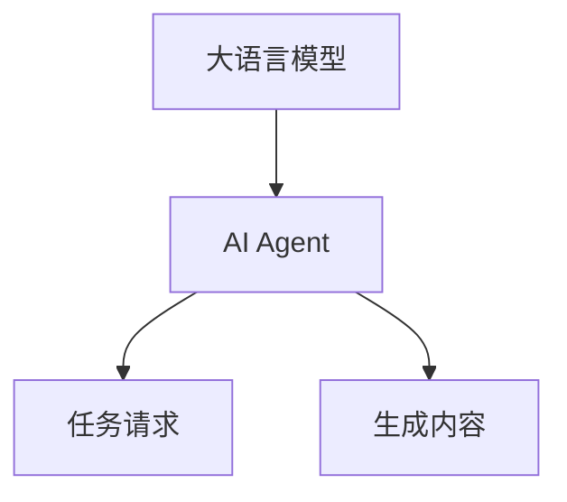
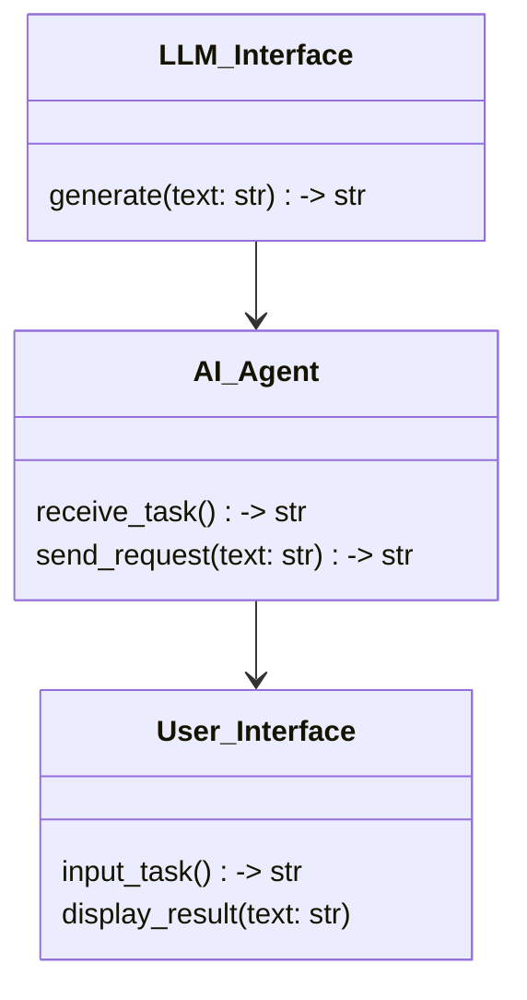
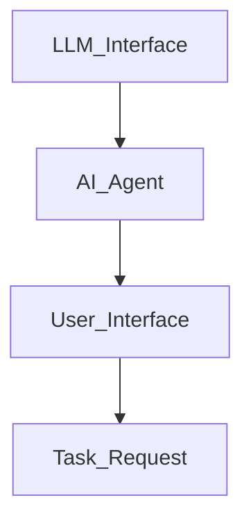
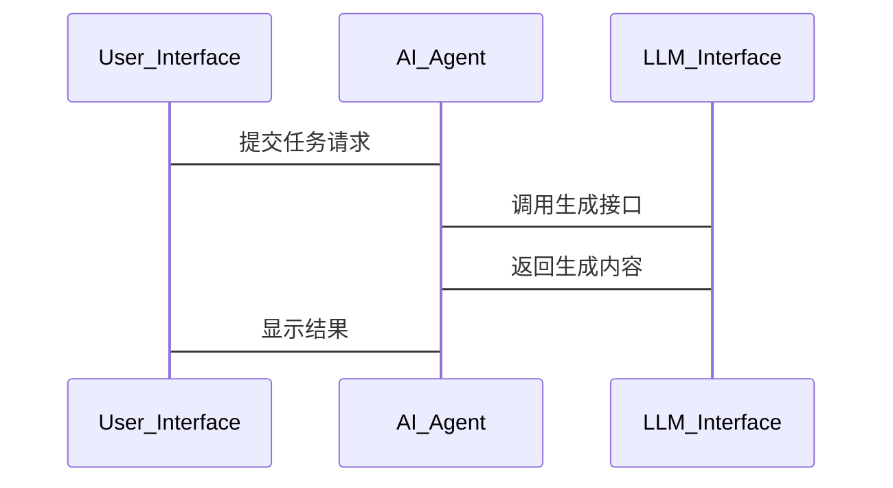

                 


# LLM驱动的AI Agent创意生成：突破思维局限

## 关键词：
LLM，AI Agent，创意生成，人机协作，智能系统设计

## 摘要：
本文探讨了如何利用大语言模型（LLM）驱动AI Agent进行创意生成，突破传统思维局限。通过分析LLM与AI Agent的核心原理、算法流程、系统架构及实际应用，本文为读者提供了从理论到实践的全面指导，展示了如何在实际场景中实现创新的创意生成系统。

---

## 第1章：背景介绍

### 1.1 问题背景
随着AI技术的发展，创意生成已成为多个领域的关键需求。然而，传统的创意生成方法受限于数据依赖性和规则的固定性，难以灵活应对多样化的创意需求。大语言模型（LLM）的出现，为AI Agent提供了强大的语言理解和生成能力，使其能够更自然地进行创意生成。

### 1.2 核心概念
- **大语言模型（LLM）**：基于深度学习的模型，能够理解和生成人类语言，如GPT系列。
- **AI Agent**：智能体，能够在特定环境中感知、推理和行动，以完成任务。

### 1.3 问题描述
传统创意生成方法依赖预定义规则，缺乏灵活性和创新性。LLM虽具备强大的生成能力，但在实际应用中，如何与AI Agent结合，实现高效的创意生成仍是一个挑战。

### 1.4 解决方案
通过LLM驱动AI Agent，结合自然语言处理技术，构建能够自适应学习和生成创意的系统，突破传统思维的局限性。

### 1.5 边界与外延
- LLM驱动的AI Agent适用于需要语言理解和生成的场景，如写作、设计辅助。
- 其局限性包括对上下文的依赖和生成内容的质量控制。

---

## 第2章：核心概念与联系

### 2.1 LLM与AI Agent的核心原理
- **LLM**：通过大量数据训练，学习语言的模式和结构，生成与上下文相关的内容。
- **AI Agent**：通过感知环境和任务需求，执行动作以达到目标。

### 2.2 LLM与AI Agent的协作机制
通过表格对比分析，展示LLM与AI Agent在准确性、实时性、上下文依赖等方面的差异与互补。

| 特性          | LLM                         | AI Agent                     |
|---------------|------------------------------|------------------------------|
| 准确性         | 基于训练数据，生成高质量内容 | 依赖任务定义和环境感知       |
| 实时性         | 高，依赖模型推理速度         | 中，依赖任务复杂度           |
| 上下文依赖     | 高，生成内容依赖上下文       | 中，依赖任务需求和环境       |

### 2.3 实体关系图
使用Mermaid绘制实体关系图，展示LLM与AI Agent的协作关系：



---

## 第3章：算法原理讲解

### 3.1 LLM的算法流程
- **训练阶段**：通过监督学习和强化学习优化模型参数。
- **推理阶段**：根据输入生成相关输出，常用贪心算法或随机采样。

### 3.2 AI Agent的生成流程
- **输入处理**：解析任务请求，提取关键信息。
- **模型调用**：调用LLM生成创意内容。
- **反馈优化**：根据反馈调整生成策略。

### 3.3 数学模型
- **交叉熵损失函数**：
  $$ \mathcal{L} = -\sum_{i=1}^{n} \sum_{j=1}^{m} y_{ij} \log p(y_{ij}) $$
- **生成模型**：
  $$ P(y|x) = \text{softmax}(f(x)) $$

---

## 第4章：系统分析与架构设计方案

### 4.1 项目介绍
介绍一个基于LLM的创意生成系统，用于辅助用户生成营销文案。

### 4.2 功能模块设计
使用Mermaid类图展示系统功能模块：



### 4.3 系统架构设计
采用分层架构，展示各模块交互关系：



### 4.4 接口设计与交互流程
使用序列图展示用户请求生成文案的流程：



---

## 第5章：项目实战

### 5.1 环境安装
- 安装Python和必要的库（如transformers、pytorch）。

### 5.2 核心代码实现
```python
from transformers import GPT2LMHeadModel, GPT2Tokenizer

class LLM_Interface:
    def __init__(self):
        self.tokenizer = GPT2Tokenizer.from_pretrained('gpt2')
        self.model = GPT2LMHeadModel.from_pretrained('gpt2')

    def generate(self, text):
        inputs = self.tokenizer(text, return_tensors='pt')
        outputs = self.model.generate(inputs.input_ids, max_length=100)
        return self.tokenizer.decode(outputs[0], skip_special_tokens=True)

class AI_Agent:
    def __init__(self):
        self.llm = LLM_Interface()

    def receive_task(self, task):
        return self.llm.generate(task)

    def send_request(self, text):
        return self.llm.generate(text)
```

### 5.3 代码解读
- `LLM_Interface`类负责与大语言模型的交互。
- `AI_Agent`类接收任务请求并调用LLM生成内容。

### 5.4 实际案例分析
通过一个广告文案生成的案例，展示AI Agent的生成过程和结果。

### 5.5 小结
总结项目实现的关键点和收获。

---

## 第6章：高级应用与创新

### 6.1 创意生成的高级应用
- **跨模态协作**：结合图像和文本生成创意内容。
- **动态调整**：根据实时反馈优化生成策略。

### 6.2 创新点
- 实现LLM与AI Agent的无缝协作，提升创意生成的灵活性和多样性。

### 6.3 案例分析
展示一个跨模态协作的创意生成案例，如结合图像描述生成广告文案。

---

## 第7章：最佳实践、小结与注意事项

### 7.1 最佳实践
- 数据多样性：确保训练数据涵盖多种场景和风格。
- 模型调优：根据具体任务优化模型参数。

### 7.2 小结
总结全文，强调LLM驱动AI Agent在创意生成中的潜力和应用前景。

### 7.3 注意事项
- 数据隐私：确保用户数据的安全。
- 模型局限性：注意生成内容的质量和准确性。

### 7.4 拓展阅读
建议进一步学习的内容，如阅读最新的研究论文和技术报告。

---

## 附录：相关资源与工具
列出常用的LLM模型和工具，如Hugging Face的Transformers库。

---

通过以上结构，文章详细讲解了LLM驱动AI Agent创意生成的各个方面，从理论到实践，为读者提供了全面的知识和指导。

