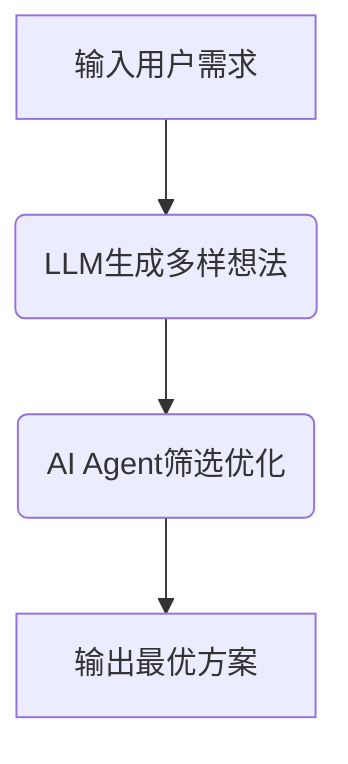
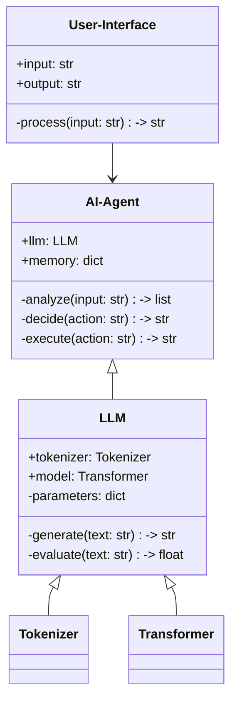
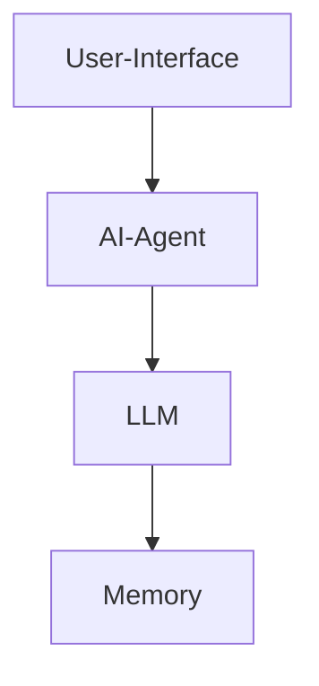
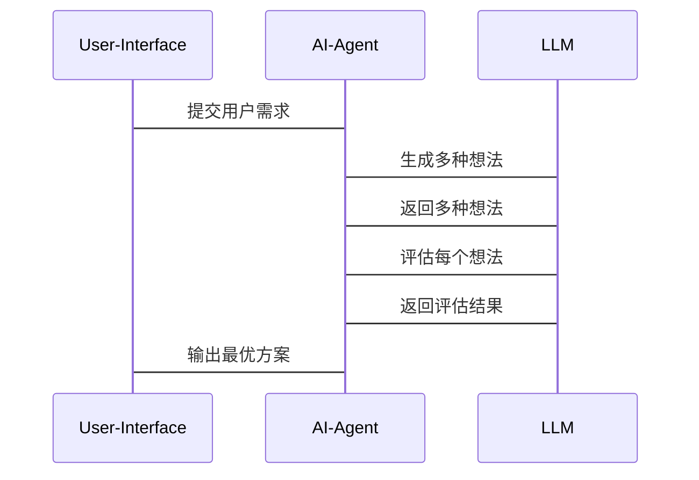

                 


# LLM驱动的AI Agent创新思维激发器

> 关键词：LLM, AI Agent, 创新思维, 自然语言处理, 人工智能

> 摘要：本文深入探讨了如何利用大语言模型（LLM）驱动AI代理（AI Agent）来激发创新思维。通过分析LLM与AI Agent的核心原理、算法流程、系统架构以及实际应用案例，本文为读者提供了从理论到实践的全面指导，帮助他们理解并应用这一技术。

---

## 第一部分: LLM驱动的AI Agent背景介绍

### 第1章: LLM驱动的AI Agent背景介绍

#### 1.1 问题背景与描述

随着人工智能技术的飞速发展，大语言模型（LLM）和AI代理（AI Agent）逐渐成为技术领域的焦点。LLM以其强大的自然语言处理能力，能够理解和生成人类语言，而AI Agent则通过自主决策和交互，帮助用户完成复杂任务。然而，如何将两者结合，激发创新思维，成为一个亟待解决的问题。

**1.1.1 当前AI技术的发展现状**

- 人工智能技术的普及和应用范围不断扩大。
- 大语言模型（如GPT系列）在自然语言处理领域取得了突破性进展。
- AI Agent在智能助手、自动化决策系统中的应用日益广泛。

**1.1.2 LLM与AI Agent的结合需求**

- LLM的强大生成能力可以为AI Agent提供丰富的语言交互能力。
- AI Agent的自主决策能力可以为LLM提供动态输入，优化生成结果。
- 两者的结合能够显著提升系统在复杂场景中的表现。

**1.1.3 创新思维激发的必要性**

- 创新思维是推动技术进步的核心动力。
- LLM和AI Agent的结合能够为用户提供更智能、更个性化的服务。
- 通过激发创新思维，可以进一步提升系统的实用性和用户体验。

#### 1.2 问题解决与边界

**1.2.1 LLM在AI Agent中的作用**

- LLM作为AI Agent的核心驱动力，负责处理语言交互和生成内容。
- 通过LLM，AI Agent能够理解和生成人类语言，实现更自然的对话。

**1.2.2 创新思维激发的核心问题**

- 如何利用LLM生成多样化、创新性的想法。
- 如何通过AI Agent的自主决策能力，优化生成内容的质量。

**1.2.3 LLM驱动的边界与外延**

- LLM驱动的边界：专注于语言生成和理解，不涉及其他AI技术（如计算机视觉）。
- 外延：通过与其他技术的结合，进一步扩展AI Agent的功能。

#### 1.3 核心概念与结构

**1.3.1 LLM与AI Agent的关系**

- LLM是AI Agent的核心模块之一，负责处理语言相关任务。
- AI Agent通过调用LLM，实现更复杂的交互和决策。

**1.3.2 创新思维的核心要素**

- 多样性：生成多种不同的想法。
- 创新性：想法的独特性和新颖性。
- 可行性：想法的实施难度和可行性。

**1.3.3 系统结构与功能模块**

- 输入处理模块：接收用户输入，解析需求。
- LLM生成模块：基于用户需求生成多种想法。
- AI Agent决策模块：优化生成内容，选择最优方案。
- 输出模块：将结果反馈给用户。

#### 1.4 本章小结

本章从背景出发，介绍了LLM和AI Agent的基本概念，分析了它们结合的必要性，并提出了创新思维激发的核心问题和系统结构。接下来的章节将深入探讨相关原理和实现细节。

---

## 第二部分: 核心概念与原理

### 第2章: LLM与AI Agent的核心概念

#### 2.1 LLM的原理与特点

**2.1.1 大语言模型的基本原理**

- 基于Transformer架构，通过自注意力机制处理序列数据。
- 通过大量训练数据，学习语言的语法和语义。

**2.1.2 LLM的核心特点与优势**

- 强大的生成能力：能够生成连贯且符合语境的文本。
- 多任务能力：通过微调，可以应用于多种NLP任务。
- 自适应能力：能够根据上下文调整生成内容。

**2.1.3 LLM的局限性与改进方向**

- 计算资源需求高。
- 生成内容可能缺乏逻辑性。
- 需要大量训练数据。

#### 2.2 AI Agent的基本原理

**2.2.1 AI Agent的定义与分类**

- AI Agent：一种能够感知环境并自主决策的智能体。
- 分为简单反射型、基于模型的反应型、目标驱动型和实用驱动型。

**2.2.2 AI Agent的核心功能模块**

- 感知模块：通过传感器感知环境。
- 决策模块：基于感知信息做出决策。
- 执行模块：执行决策并输出结果。

**2.2.3 AI Agent的决策机制**

- 基于规则的决策：根据预设规则做出决策。
- 基于模型的决策：通过学习模型预测最优决策。
- 基于强化学习的决策：通过奖励机制优化决策。

#### 2.3 LLM与AI Agent的结合原理

**2.3.1 LLM作为AI Agent的核心驱动力**

- LLM为AI Agent提供强大的语言生成和理解能力。
- AI Agent通过调用LLM，实现更复杂的交互。

**2.3.2 创新思维激发的实现路径**

- 通过LLM生成多种想法，AI Agent筛选并优化。
- 利用AI Agent的自主决策能力，进一步优化生成内容。

**2.3.3 系统架构与交互流程**

- 输入：用户需求或问题。
- 处理：LLM生成多种解决方案。
- 决策：AI Agent选择最优方案。
- 输出：反馈给用户。

#### 2.4 核心概念对比分析

**2.4.1 LLM与传统NLP模型的对比**

| 特性       | LLM                     | 传统NLP模型       |
|------------|-------------------------|-------------------|
| 处理能力   | 强大生成能力             | 专注于特定任务     |
| 训练数据   | 需要大量数据             | 数据量较小         |
| 灵活性     | 高度灵活                 | 较低               |

**2.4.2 AI Agent与传统AI系统的对比**

| 特性       | AI Agent                | 传统AI系统         |
|------------|-------------------------|-------------------|
| 自主性     | 高自主性                 | 较低               |
| 交互性     | 强交互能力               | 交互能力有限       |
| 应用场景   | 复杂动态环境             | 稳定可控环境       |

**2.4.3 创新思维激发与传统思维引导的对比**

| 特性       | 创新思维激发             | 传统思维引导       |
|------------|-------------------------|-------------------|
| 目标       | 生成新颖想法             | 指导现有思维模式     |
| 方法       | 利用AI生成多样想法       | 通过规则引导思维   |
| 适用场景   | 需要创新的场景           | 需要规范的场景      |

#### 2.5 本章小结

本章详细介绍了LLM和AI Agent的核心概念，分析了它们的特点和优势，并通过对比分析，明确了两者结合的意义和实现路径。接下来的章节将从算法和系统架构的角度，深入探讨其实现细节。

---

## 第三部分: 算法原理与数学模型

### 第3章: LLM驱动的AI Agent算法原理

#### 3.1 算法原理概述

**3.1.1 基于LLM的自然语言处理流程**

- 输入预处理：对输入文本进行分词、编码等处理。
- 模型推理：通过LLM生成多样化的想法。
- 结果后处理：对生成内容进行优化和筛选。

**3.1.2 AI Agent的决策算法框架**

- 输入分析：解析用户需求。
- 多种方案生成：LLM生成多个候选方案。
- 方案评估：AI Agent对候选方案进行评估，选择最优方案。

**3.1.3 创新思维激发的算法实现**

- 利用LLM生成多样化想法。
- 通过AI Agent的决策算法，优化生成内容的质量。

#### 3.2 算法流程图

**LLM驱动的AI Agent算法流程图**



#### 3.3 核心算法实现

**3.3.1 基于LLM的文本生成算法**

- 使用GPT系列模型，通过调整温度和重复惩罚参数，生成多样化想法。
- 代码示例：

```python
def generate_thoughts(llm_model, user_input, num_thoughts=5):
    thoughts = []
    for _ in range(num_thoughts):
        response = llm_model.generate(user_input)
        thoughts.append(response)
    return thoughts
```

**3.3.2 AI Agent的多轮对话算法**

- 基于记忆机制，记录上下文信息。
- 使用强化学习优化对话策略。
- 代码示例：

```python
def decide_action(state, actions, llm_model):
    # 状态包括当前对话历史和用户需求
    # 通过LLM评估每个动作的可行性
    best_action = None
    max_score = -float('inf')
    for action in actions:
        score = llm_model.evaluate(state + action)
        if score > max_score:
            max_score = score
            best_action = action
    return best_action
```

**3.3.3 创新思维激发的策略优化算法**

- 通过A/B测试优化生成策略。
- 使用元学习方法，提升生成内容的创新性。

#### 3.4 数学模型与公式

**创新性评估公式**

$$
\text{创新性} = \sum_{i=1}^{n} \frac{1}{1 + e^{-d_i}}
$$

其中，\(d_i\) 是第\(i\)个想法与已有想法的差异度。

**评估标准公式**

$$
\text{评估分数} = \alpha \cdot \text{创新性} + (1 - \alpha) \cdot \text{可行性}
$$

其中，\(\alpha\) 是创新性权重，\(0 < \alpha < 1\)。

#### 3.5 本章小结

本章从算法角度，详细探讨了LLM驱动的AI Agent实现原理，包括文本生成算法、决策算法以及创新性评估公式。这些算法为系统的设计和实现提供了理论基础。

---

## 第四部分: 系统分析与架构设计

### 第4章: LLM驱动的AI Agent系统分析与架构设计

#### 4.1 项目场景介绍

- 系统目标：利用LLM驱动AI Agent，帮助用户生成创新想法。
- 使用场景：创意写作、产品设计、问题解决等领域。

#### 4.2 系统功能设计

**领域模型（类图）**



#### 4.3 系统架构设计

**系统架构图**



**系统交互流程图**



#### 4.4 系统接口设计

- 输入接口：接收用户需求或问题。
- 输出接口：反馈生成的最优方案。
- 内部接口：LLM与AI Agent之间的数据交互。

#### 4.5 系统实现细节

- 采用微服务架构，便于模块化开发和部署。
- 使用容器化技术（如Docker），提升系统的可扩展性和稳定性。

#### 4.6 本章小结

本章从系统架构的角度，详细设计了LLM驱动的AI Agent系统，包括功能模块、架构图和交互流程图。这些设计为后续的实现提供了清晰的指导。

---

## 第五部分: 项目实战

### 第5章: LLM驱动的AI Agent项目实战

#### 5.1 环境安装与配置

- 安装Python环境：Python 3.8及以上版本。
- 安装依赖库：如TensorFlow、PyTorch、Hugging Face库。

```bash
pip install tensorflow transformers
```

#### 5.2 核心代码实现

**LLM模型实现**

```python
from transformers import GPT2LMHeadModel, GPT2Tokenizer

class LLM:
    def __init__(self, model_name="gpt2"):
        self.tokenizer = GPT2Tokenizer.from_pretrained(model_name)
        self.model = GPT2LMHeadModel.from_pretrained(model_name)

    def generate(self, input_text, max_length=50):
        inputs = self.tokenizer.encode(input_text, return_tensors="pt")
        outputs = self.model.generate(inputs, max_length=max_length, do_sample=True)
        return self.tokenizer.decode(outputs[0], skip_special_tokens=True)
```

**AI Agent实现**

```python
class AI-Agent:
    def __init__(self, llm):
        self.llm = llm
        self.memory = {}

    def analyze(self, input_str):
        # 分析输入并生成多个想法
        thoughts = self.llm.generate(input_str, max_length=200)
        return thoughts

    def decide(self, thoughts):
        # 评估每个想法并选择最优方案
        scores = [self.llm.evaluate(t) for t in thoughts]
        best_index = scores.index(max(scores))
        return thoughts[best_index]
```

#### 5.3 实际案例分析

**案例1：创意写作**

- 用户输入：写一篇科幻小说的开头。
- 系统输出：生成多个开头，并选择最优方案。

**案例2：产品设计**

- 用户输入：设计一款智能手表的功能。
- 系统输出：生成多个创新性功能，并选择最优方案。

#### 5.4 项目总结与优化

- 项目总结：通过实际案例，验证了系统的有效性和创新性。
- 优化方向：进一步优化生成算法，提升系统的决策能力。

#### 5.5 本章小结

本章通过实际案例，详细展示了如何利用LLM驱动的AI Agent激发创新思维。读者可以通过代码实现，进一步理解和应用相关技术。

---

## 第六部分: 最佳实践与总结

### 第6章: 最佳实践与总结

#### 6.1 最佳实践

- 合理选择LLM模型：根据具体需求选择合适的模型。
- 定期优化系统：通过反馈优化生成策略。
- 结合其他技术：与计算机视觉等技术结合，提升系统能力。

#### 6.2 小结

本文从理论到实践，详细探讨了LLM驱动的AI Agent实现创新思维激发的全过程。通过系统的分析和实际案例的展示，为读者提供了全面的指导。

#### 6.3 注意事项

- 确保数据安全：避免用户数据泄露。
- 遵守伦理规范：确保生成内容符合法律法规。
- 提供用户反馈机制：根据用户反馈优化系统。

#### 6.4 拓展阅读

- 深入学习大语言模型的内部机制。
- 研究AI Agent的最新研究成果。
- 探索创新思维激发的更多技术手段。

---

## 附录

### 附录A: 术语解释

- 大语言模型（LLM）：基于Transformer架构的大规模预训练模型。
- AI Agent：能够感知环境并自主决策的智能体。

### 附录B: 工具安装与配置

- 安装Python环境：确保安装了Python 3.8及以上版本。
- 安装依赖库：使用pip安装必要的库。

---

# 结语

通过本文的详细讲解，读者可以全面理解LLM驱动的AI Agent实现创新思维激发的技术细节，并通过实际案例掌握其应用方法。希望本文能够为相关领域的研究和实践提供有价值的参考。

