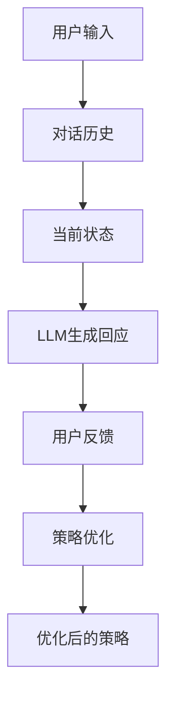
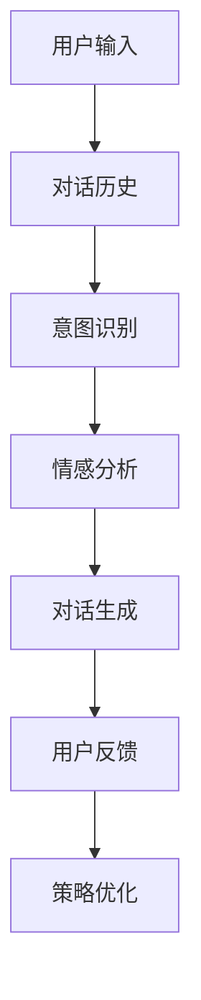
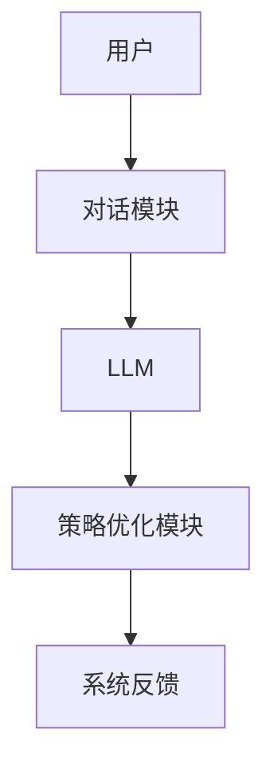

                 


---

# LLM驱动的AI Agent对话策略学习

> **关键词**：LLM, AI Agent, 对话策略学习, 人工智能, 大语言模型

> **摘要**：  
本文深入探讨了利用大语言模型（LLM）驱动的AI Agent对话策略学习的原理、算法、系统架构及实际应用。文章从背景介绍出发，分析了LLM与AI Agent的核心概念，详细讲解了对话策略学习的基本原理和算法实现，结合数学模型和系统架构设计，通过实际案例展示了如何构建和优化LLM驱动的AI Agent对话系统。最后，本文总结了当前研究的成果与未来的发展方向。

---

## 第一部分: LLM驱动的AI Agent对话策略学习背景与基础

### 第1章: LLM与AI Agent概述

#### 1.1 LLM的基本概念与特点

- **定义与特点**：  
  大语言模型（LLM）是一种基于深度学习的自然语言处理模型，具有以下特点：  
  1. 大规模：通常由数十亿参数构成，能够捕捉语言的复杂模式。  
  2. 智能性：能够理解上下文、推理、回答问题、生成文本。  
  3. 普适性：适用于多种任务，如文本生成、机器翻译、问答系统等。  

- **与传统NLP模型的区别**：  
  LLM通过端到端的训练方式，能够在单一模型中处理多种任务，而传统NLP模型通常需要针对每个任务进行特定优化。

- **应用场景与优势**：  
  - **应用场景**：客服对话、智能助手、内容生成、教育辅助等。  
  - **优势**：能够理解上下文、生成自然语言、支持多轮对话。

#### 1.2 AI Agent的基本概念与特点

- **定义与特点**：  
  AI Agent（人工智能代理）是指能够感知环境、自主决策并执行任务的智能体。其特点包括：  
  1. 感知性：通过传感器感知环境信息。  
  2. 计划性：基于感知信息制定行动计划。  
  3. 执行性：执行计划以完成任务。  

- **与传统程序的区别**：  
  AI Agent具有自主性和智能性，能够根据环境动态调整行为，而传统程序通常基于固定的规则执行任务。

- **应用场景与优势**：  
  - **应用场景**：智能助手、自动驾驶、智能家居、机器人控制等。  
  - **优势**：能够自主决策、适应环境变化、处理复杂任务。

#### 1.3 LLM驱动的AI Agent对话策略学习的背景与问题描述

- **问题背景**：  
  随着LLM的快速发展，AI Agent在对话系统中的应用越来越广泛。然而，如何利用LLM优化AI Agent的对话策略，使其在复杂场景下表现更佳，仍是一个挑战。

- **问题描述**：  
  AI Agent需要根据对话历史、上下文信息生成合适的回应，同时需要考虑用户意图、情感倾向等多方面因素。传统的基于规则的对话策略难以应对复杂场景，而LLM驱动的对话策略学习能够通过数据驱动的方式优化对话效果。

- **目标与意义**：  
  通过LLM驱动的对话策略学习，优化AI Agent的对话能力，使其能够更自然、更智能地与用户交互。

- **当前研究与应用的现状与挑战**：  
  - **现状**：LLM驱动的对话策略学习已取得显著进展，但仍有提升空间。  
  - **挑战**：对话策略的多样性和复杂性、数据质量与多样性、模型的可解释性等。

#### 1.4 LLM驱动的AI Agent对话策略学习的边界与外延

- **问题的边界与限制**：  
  - 对话策略学习的范围：仅限于对话场景，不涉及AI Agent的其他功能（如任务规划、环境感知）。  
  - 数据范围：基于训练数据，无法处理超出训练范围的新问题。  

- **相关概念的对比**：  
  - 对话策略与对话生成：对话策略是生成对话内容的指导，而对话生成是具体生成文本的过程。  
  - LLM驱动与规则驱动：LLM驱动的对话策略学习能够处理复杂场景，而规则驱动的方法则相对 rigid。  

- **核心概念与要素组成**：  
  - LLM：提供对话生成能力。  
  - 对话策略：指导对话的方向和内容。  
  - 用户反馈：用于优化对话策略。  

---

## 第二部分: LLM驱动的AI Agent对话策略学习的核心概念与联系

### 第2章: LLM驱动的AI Agent对话策略学习的核心概念与联系

#### 2.1 LLM驱动的AI Agent对话策略学习的原理与流程

- **基本原理**：  
  LLM通过大量对话数据的训练，能够理解对话的上下文和意图。AI Agent利用LLM生成对话内容，并通过策略优化算法提升对话效果。

- **流程**：  
  1. **输入处理**：AI Agent接收用户输入。  
  2. **策略生成**：基于LLM生成对话回应。  
  3. **反馈优化**：根据用户反馈优化对话策略。

#### 2.2 对话策略学习的核心概念与属性特征对比

- **对话策略的核心概念与属性特征**：  
  - **策略空间**：所有可能的对话策略集合。  
  - **策略选择**：根据当前状态选择最佳策略。  
  - **策略优化**：通过反馈不断改进策略。  

- **不同对话策略的对比分析**：  

| 对话策略 | 基于规则 | 基于模板 | 基于生成模型 |
|----------|----------|----------|--------------|
| 原理     | 预定义规则匹配 | 预定义模板填充 | 数据驱动生成 |
| 优缺点   | 简单易实现，但灵活性差 | 灵活性较高，但依赖模板设计 | 灵活性高，但训练成本高 |
| 适用场景 | 简单场景 | 中等复杂场景 | 复杂场景 |

- **LLM驱动的对话策略学习的优缺点与适用场景**：  
  - **优点**：灵活性高，能够处理复杂场景。  
  - **缺点**：训练成本高，需要大量数据。  
  - **适用场景**：复杂对话场景，如客服咨询、教育辅助等。

#### 2.3 实体关系图与流程图

- **对话策略学习的ER实体关系图**：

```mermaid
erDiagram
    actor 用户
    actor 系统
    actor 训练数据
    actor 反馈
    系统 --> 对话策略学习模块
    对话策略学习模块 --> LLM
    对话策略学习模块 --> 策略优化算法
    训练数据 --> LLM
    用户 --> 对话历史
    对话历史 --> 对话策略
    反馈 --> 对话策略优化
```

- **对话策略学习的流程图**：



---

## 第三部分: LLM驱动的AI Agent对话策略学习的算法原理

### 第3章: LLM驱动的对话策略学习算法原理

#### 3.1 对话策略学习的基本原理

- **对话策略学习的基本概念与原理**：  
  对话策略学习的目标是优化AI Agent的对话能力，使其在与用户的交互中表现更佳。  
  - **输入**：对话历史、用户意图、情感倾向等。  
  - **输出**：优化的对话策略。

- **LLM在对话策略学习中的作用**：  
  LLM通过生成对话内容，为对话策略学习提供基础。通过监督学习和强化学习，优化对话策略。

- **对话策略学习的数学模型与公式**：  
  对话策略学习通常采用强化学习框架，目标是最大化奖励函数。  
  - **奖励函数**：$ R(s, a) $，其中$s$是状态，$a$是动作。  
  - **价值函数**：$ V(s) $，表示状态$s$的期望奖励。  
  - **策略函数**：$\pi(a|s)$，表示在状态$s$下选择动作$a$的概率。

#### 3.2 LLM驱动的对话策略学习算法的流程与步骤

- **算法流程**：  
  1. **数据准备**：收集对话数据，包括对话历史、用户意图、情感倾向等。  
  2. **模型训练**：使用监督学习训练LLM，使其能够生成符合策略的对话回应。  
  3. **策略优化**：通过强化学习优化对话策略，最大化奖励函数。  
  4. **模型部署**：将优化后的模型部署到AI Agent中，进行实际对话。

- **算法实现步骤**：  
  - **监督学习**：训练LLM生成对话回应。  
  - **强化学习**：通过用户反馈优化策略。  
  - **策略评估**：评估策略的性能，进行调整和优化。

- **数学模型与公式**：  
  - **损失函数**：  
    $$ \mathcal{L}(\theta) = \mathbb{E}_{s,a} \left[ \log \pi_\theta(a|s) \cdot (R(s,a) - V_\theta(s)) \right] $$  
  - **梯度下降**：  
    $$ \theta \leftarrow \theta - \eta \frac{\partial \mathcal{L}}{\partial \theta} $$  

#### 3.3 对话策略学习的数学模型与公式

- **数学模型**：  
  对话策略学习可以看作是一个马尔可夫决策过程（MDP），包含状态、动作、奖励和转移四个部分。  
  - **状态**：$ s \in S $，表示当前对话的状态。  
  - **动作**：$ a \in A $，表示AI Agent的回应。  
  - **奖励**：$ R(s,a) $，表示动作$a$在状态$s$下的奖励。  
  - **转移**：$ P(s'|s,a) $，表示从状态$s$执行动作$a$后转移到状态$s'$的概率。

- **数学公式**：  
  - **价值函数**：  
    $$ V_\theta(s) = \mathbb{E}_{a \sim \pi_\theta} \left[ R(s,a) + \gamma V_\theta(s') \right] $$  
  - **策略函数**：  
    $$ \pi_\theta(a|s) = \arg \max_a Q_\theta(s,a) $$  
    其中，$ Q_\theta(s,a) $是动作值函数，表示在状态$s$下执行动作$a$的期望奖励。

---

## 第四部分: LLM驱动的AI Agent对话策略学习的系统架构设计

### 第4章: LLM驱动的AI Agent对话策略学习系统架构设计

#### 4.1 系统功能设计

- **系统功能模块**：  
  1. **对话历史记录**：记录对话的全过程。  
  2. **意图识别**：识别用户的意图。  
  3. **情感分析**：分析用户的情感倾向。  
  4. **对话生成**：基于LLM生成对话回应。  
  5. **策略优化**：根据反馈优化对话策略。

- **系统功能流程图**：



#### 4.2 系统架构设计

- **系统架构设计图**：



- **系统架构说明**：  
  - **用户**：与AI Agent进行交互。  
  - **对话模块**：处理用户的输入，生成对话内容。  
  - **LLM**：提供对话生成能力。  
  - **策略优化模块**：根据用户反馈优化对话策略。

---

## 第五部分: LLM驱动的AI Agent对话策略学习的项目实战

### 第5章: 项目实战

#### 5.1 环境安装与配置

- **Python环境**：Python 3.8+  
- **依赖库安装**：  
  - `transformers`：用于加载预训练模型。  
  - `numpy`：用于数值计算。  
  - `scikit-learn`：用于机器学习算法。  

#### 5.2 系统核心实现源代码

- **对话策略学习代码示例**：

```python
import torch
import torch.nn as nn
import torch.optim as optim

class DialogStrategy Learner:
    def __init__(self, model, optimizer, criterion):
        self.model = model
        self.optimizer = optimizer
        self.criterion = criterion
    
    def train(self, inputs, labels):
        outputs = self.model(inputs)
        loss = self.criterion(outputs, labels)
        loss.backward()
        self.optimizer.step()
        return loss.item()

# 示例对话策略优化
def optimize_strategy(model, optimizer, criterion, inputs, labels):
    learner = DialogStrategyLearner(model, optimizer, criterion)
    loss = learner.train(inputs, labels)
    return loss

# 示例策略评估
def evaluate_strategy(model, inputs, labels):
    with torch.no_grad():
        outputs = model(inputs)
        accuracy = (outputs.argmax(dim=1) == labels).float().mean()
        return accuracy
```

- **代码应用解读与分析**：  
  1. **模型训练**：使用监督学习训练LLM，优化对话策略。  
  2. **策略优化**：通过强化学习优化策略，最大化奖励函数。  
  3. **策略评估**：评估策略的性能，进行调整和优化。

#### 5.3 实际案例分析与详细讲解

- **案例分析**：以电商客服场景为例，展示如何利用LLM驱动的对话策略学习优化客服对话。  
- **详细讲解**：  
  1. **问题描述**：电商客服需要快速响应用户咨询，提升用户体验。  
  2. **解决方案**：利用LLM生成对话内容，通过策略优化提升对话效果。  
  3. **实施步骤**：  
     a. 数据收集：收集电商客服的对话数据。  
     b. 模型训练：训练LLM生成对话回应。  
     c. 策略优化：根据用户反馈优化对话策略。  

#### 5.4 项目小结

- **经验总结**：  
  - 数据质量对策略优化至关重要。  
  - 强化学习能够显著提升对话策略的效果。  
  - 系统架构设计需要考虑扩展性和可维护性。  

---

## 第六部分: 总结与展望

### 第6章: 总结与展望

#### 6.1 核心内容总结

- **核心内容回顾**：  
  本文详细探讨了LLM驱动的AI Agent对话策略学习的背景、原理、算法、系统架构及实际应用。通过理论分析和实践案例，展示了如何优化对话策略，提升AI Agent的对话能力。

#### 6.2 对未来研究与应用的展望

- **未来研究方向**：  
  1. **模型优化**：进一步优化LLM的性能，降低训练成本。  
  2. **多模态对话**：结合视觉、听觉等多模态信息，提升对话体验。  
  3. **可解释性研究**：提升AI Agent对话的可解释性，增强用户信任。  

- **应用前景**：  
  随着LLM技术的不断进步，AI Agent在对话系统中的应用将更加广泛，涵盖更多领域和场景。

---

### 注意事项

- **模型训练成本**：LLM的训练需要大量计算资源，需合理配置。  
- **数据隐私**：对话数据涉及用户隐私，需注意数据安全与合规性。  
- **系统稳定性**：对话系统需要保证高可用性和稳定性。  

### 拓展阅读

- **推荐书籍**：  
  - 《Deep Learning》 - Ian Goodfellow  
  - 《自然语言处理入门》 - 李航  
- **推荐论文**：  
  - “Attention Is All You Need” - Vaswani et al.  
  - “GPT-3: Pretrained Text-to-Text Models for General-Purpose AI” - Brown et al.

---

通过本文的详细讲解，读者可以全面了解LLM驱动的AI Agent对话策略学习的核心内容和实际应用。希望本文能够为相关领域的研究和实践提供有价值的参考。

