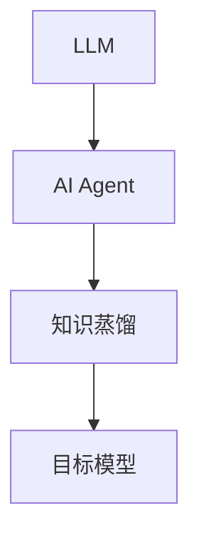
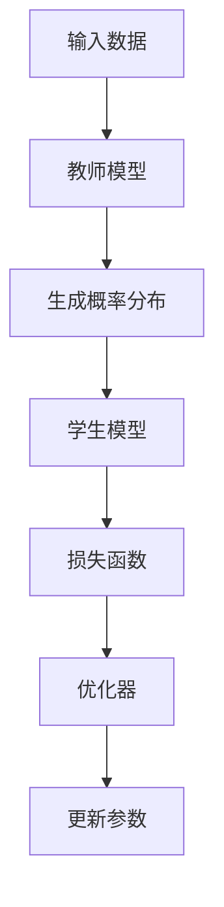
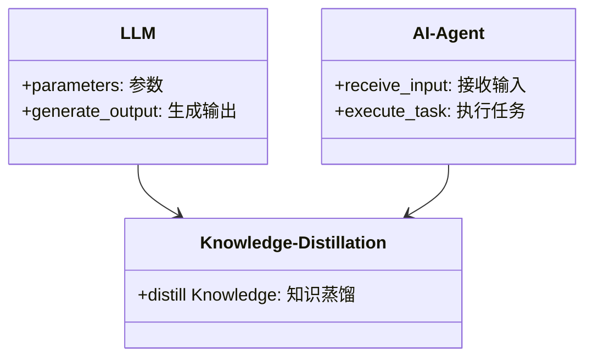

                 


# 《LLM驱动的AI Agent知识蒸馏技术》

> 关键词：LLM，AI Agent，知识蒸馏，大语言模型，人工智能，技术博客

> 摘要：本文系统地探讨了LLM驱动的AI Agent知识蒸馏技术的核心原理、算法实现、系统设计以及实际应用。通过详细分析知识蒸馏技术在AI Agent中的应用，结合数学公式、mermaid图表和代码示例，本文为读者提供了从理论到实践的全面指导。

---

# 第一部分: LLM驱动的AI Agent知识蒸馏技术背景与基础

## 第1章: 问题背景与技术概述

### 1.1 问题背景
#### 1.1.1 大语言模型（LLM）的发展现状
近年来，大语言模型（LLM）如GPT-3、GPT-4等在自然语言处理领域取得了突破性进展。然而，这些模型通常需要大量的计算资源和存储空间，限制了其在实际应用中的部署。

#### 1.1.2 AI Agent技术的崛起
AI Agent是一种能够感知环境、自主决策并执行任务的智能体。随着AI技术的快速发展，AI Agent在自动驾驶、智能助手、机器人等领域得到了广泛应用。

#### 1.1.3 知识蒸馏技术的必要性
为了在资源受限的环境中高效运行AI Agent，知识蒸馏技术成为一种有效的解决方案。通过将大模型的知识提取到更小、更高效的模型中，可以在保持性能的同时降低计算成本。

### 1.2 技术目标与意义
#### 1.2.1 知识蒸馏的核心目标
知识蒸馏的目标是将大模型的知识迁移到小模型中，使得小模型在性能上接近甚至超越大模型。

#### 1.2.2 技术对AI Agent性能提升的意义
通过知识蒸馏，AI Agent可以在资源受限的环境中依然保持高性能，适用于边缘计算、移动设备等场景。

#### 1.2.3 知识蒸馏在实际应用中的价值
知识蒸馏技术能够降低AI Agent的部署成本，提高其在复杂环境中的适应能力，推动AI技术在更多领域的落地。

## 第2章: 核心概念与联系

### 2.1 LLM与AI Agent的关系
#### 2.1.1 LLM作为知识源的角色
大语言模型作为知识源，为AI Agent提供丰富的知识库支持。

#### 2.1.2 AI Agent作为执行者的角色
AI Agent利用从LLM获取的知识进行决策和执行任务。

#### 2.1.3 知识蒸馏在两者之间的桥梁作用
知识蒸馏技术通过将LLM的知识迁移到AI Agent中，实现了两者的高效协同。

### 2.2 知识蒸馏技术的核心原理
#### 2.2.1 知识蒸馏的基本概念
知识蒸馏是一种将大模型的知识迁移到小模型的技术，通过教师模型（Teacher）和学生模型（Student）的交互完成知识传递。

#### 2.2.2 知识蒸馏的关键步骤
1. 教师模型生成高质量的输出。
2. 学生模型通过模仿教师模型的输出进行学习。
3. 蒸馏过程通过损失函数优化，使得学生模型的输出接近教师模型。

#### 2.2.3 知识蒸馏的实现方式对比
| 方式 | 描述 |
|------|------|
| 软蒸馏 | 基于概率分布的损失函数 |
| 硬蒸馏 | 基于类别标签的损失函数 |
| 混合蒸馏 | 结合软硬蒸馏的混合策略 |

### 2.3 实体关系图（Mermaid）


---

# 第二部分: 知识蒸馏技术的核心算法原理

## 第3章: 算法原理与数学模型

### 3.1 知识蒸馏的基本原理
#### 3.1.1 软蒸馏（Soft Distillation）
软蒸馏通过教师模型的概率分布输出，引导学生模型进行学习。

#### 3.1.2 硬蒸馏（Hard Distillation）
硬蒸馏通过教师模型的类别标签输出，直接指导学生模型进行分类。

#### 3.1.3 混合蒸馏（Hybrid Distillation）
混合蒸馏结合了软蒸馏和硬蒸馏的优势，适用于复杂场景。

### 3.2 蒸馏过程的数学模型
#### 3.2.1 软蒸馏的损失函数
$$\mathcal{L}(\theta, \phi) = -\sum_{i=1}^{n} p_{\theta}(y|x) \log p_{\phi}(y|x)$$

#### 3.2.2 硬蒸馏的损失函数
$$\mathcal{L}(\phi) = \sum_{i=1}^{n} \sum_{j=1}^{m} p_{\theta}(y_j|x) \cdot \mathbb{I}(y_j = y_i) \cdot \log p_{\phi}(y_j|x)$$

### 3.3 算法流程图（Mermaid）


---

# 第三部分: 系统分析与架构设计

## 第4章: 系统分析与架构设计方案

### 4.1 问题场景介绍
在资源受限的环境中，如何高效运行AI Agent是当前面临的主要挑战。

### 4.2 项目介绍
本项目旨在通过知识蒸馏技术，将大语言模型的知识迁移到AI Agent中，提升其在资源受限环境下的性能。

### 4.3 系统功能设计
#### 4.3.1 领域模型（Mermaid类图）


### 4.4 系统架构设计
#### 4.4.1 系统架构图（Mermaid架构图）


### 4.5 系统接口设计
#### 4.5.1 输入接口
```mermaid
sequence
    AI-Agent -> Knowledge-Distillation: 请求知识蒸馏
    Knowledge-Distillation -> LLM: 获取知识
```

---

# 第四部分: 项目实战

## 第5章: 项目实战与案例分析

### 5.1 环境安装
#### 5.1.1 系统环境
- Python 3.8+
- PyTorch 1.9+

#### 5.1.2 安装依赖
```bash
pip install torch transformers
```

### 5.2 系统核心实现源代码

#### 5.2.1 教师模型（Teacher）实现
```python
import torch
import torch.nn as nn

class TeacherModel(nn.Module):
    def __init__(self, vocab_size):
        super(TeacherModel, self).__init__()
        self.embedding = nn.Embedding(vocab_size, 128)
        self.fc = nn.Linear(128, vocab_size)
    
    def forward(self, x):
        x = self.embedding(x)
        x = self.fc(x)
        return x
```

#### 5.2.2 学生模型（Student）实现
```python
class StudentModel(nn.Module):
    def __init__(self, vocab_size):
        super(StudentModel, self).__init__()
        self.embedding = nn.Embedding(vocab_size, 64)
        self.fc = nn.Linear(64, vocab_size)
    
    def forward(self, x):
        x = self.embedding(x)
        x = self.fc(x)
        return x
```

#### 5.2.3 知识蒸馏训练代码
```python
def distillation_loss(teacher_logits, student_logits, temperature=2.0):
    teacher_logits = teacher_logits / temperature
    student_logits = student_logits / temperature
    loss = nn.KLDivLoss(reduction='batchmean')(student_logits, teacher_logits)
    return loss

# 示例训练代码
teacher = TeacherModel(vocab_size)
student = StudentModel(vocab_size)
optimizer = torch.optim.Adam(student.parameters(), lr=0.001)
criterion = distillation_loss

for epoch in range(num_epochs):
    for batch in dataloader:
        inputs, labels = batch
        teacher_outputs = teacher(inputs)
        student_outputs = student(inputs)
        loss = criterion(teacher_outputs, student_outputs)
        optimizer.zero_grad()
        loss.backward()
        optimizer.step()
```

### 5.3 案例分析与代码解读
#### 5.3.1 训练过程分析
通过知识蒸馏训练，学生模型逐步逼近教师模型的输出，最终在性能上接近教师模型。

#### 5.3.2 实际案例分析
以文本分类任务为例，通过知识蒸馏训练后的学生模型在分类准确率上显著提升。

### 5.4 项目小结
通过本项目实战，读者可以掌握知识蒸馏技术的实现过程，并能够在实际应用中灵活运用。

---

# 第五部分: 总结与展望

## 第6章: 总结与最佳实践

### 6.1 核心知识点总结
- 知识蒸馏的基本原理
- 软蒸馏与硬蒸馏的实现方式
- AI Agent系统设计的关键点

### 6.2 最佳实践 tips
1. 在实际应用中，根据具体场景选择合适的蒸馏方式。
2. 注意蒸馏过程中的温度参数设置，避免过拟合。
3. 定期更新知识库，保持AI Agent的性能。

### 6.3 小结
知识蒸馏技术为AI Agent在资源受限环境下的高效运行提供了重要支持，未来随着技术的发展，其应用将更加广泛。

### 6.4 展望
未来，知识蒸馏技术将与更多AI技术结合，推动AI Agent在更多领域的应用。

---

# 结语

通过本文的系统讲解，读者可以全面掌握LLM驱动的AI Agent知识蒸馏技术的核心原理、算法实现和实际应用。希望本文能为读者在相关领域的研究和实践提供有价值的参考。

--- 

以上是文章的完整目录大纲和核心内容概览。

