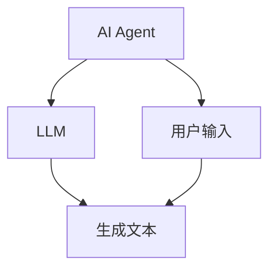
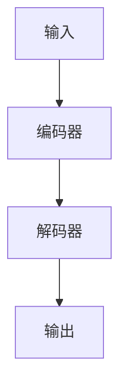
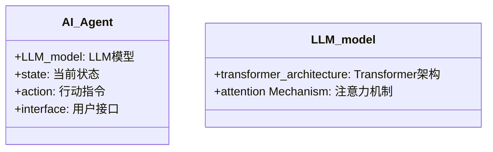

                 


# LLM驱动的AI Agent自然语言生成优化

## 关键词：
LLM（Large Language Model），AI Agent，自然语言生成，优化，Transformer，强化学习

## 摘要：
本文详细探讨了LLM驱动的AI Agent在自然语言生成中的优化方法。首先，介绍了LLM和AI Agent的基本概念，分析了它们在自然语言生成中的应用。接着，深入讲解了LLM的核心原理和AI Agent的系统架构，详细阐述了生成式模型的算法流程和优化策略。最后，通过实际案例分析，展示了如何优化LLM驱动的AI Agent的自然语言生成能力，提出了最佳实践和未来研究方向。

---

# 第一部分：LLM驱动的AI Agent背景与基础

## 第1章：LLM驱动的AI Agent概述

### 1.1 问题背景与问题描述
自然语言生成（Natural Language Generation, NLG）是人工智能领域的重要任务，旨在将结构化的数据转化为自然流畅的文本。然而，传统的NLG方法在生成多样化、高质量文本方面存在局限性。随着大语言模型（LLM）的发展，如GPT-3、GPT-4等，基于LLM的自然语言生成技术逐渐成为主流。然而，如何进一步优化LLM驱动的AI Agent的自然语言生成能力，以提升生成文本的质量、效率和安全性，仍然是当前研究和应用中的重要挑战。

#### 1.1.1 自然语言生成的挑战
- **多样性**：生成文本的多样性不足，缺乏对上下文的深度理解。
- **准确性**：生成文本的准确性受模型训练数据和上下文窗口的限制。
- **效率**：生成过程中的计算成本较高，影响实时应用。

#### 1.1.2 LLM在自然语言生成中的作用
- LLM通过预训练大规模文本数据，具备强大的上下文理解和生成能力。
- LLM能够生成多样化的文本，适用于多种自然语言生成任务。

#### 1.1.3 AI Agent的定义与特点
- AI Agent是一个智能体，能够感知环境、理解需求并执行任务。
- AI Agent具备自主性、反应性、目标导向性和社会性等特点。

### 1.2 LLM驱动的AI Agent的核心概念
- **LLM与AI Agent的关系**：LLM作为AI Agent的核心驱动力，提供自然语言理解和生成的能力。
- **核心要素**：包括模型架构、训练数据、生成策略等。

---

## 第2章：LLM驱动的AI Agent的主流模型与应用

### 2.1 主流LLM模型介绍
- **GPT系列模型**：基于Transformer架构，具备强大的生成能力。
- **BERT及其变体**：擅长文本理解任务，但在生成方面相对逊色。
- **其他LLM模型**：如PaLM、T5等，各有特点。

### 2.2 LLM驱动的AI Agent的应用场景
- **自然语言生成**：用于文本摘要、对话生成等任务。
- **对话系统**：提升AI Agent与用户的交互能力。
- **任务自动化**：通过自然语言指令执行复杂任务。

---

# 第二部分：LLM驱动的AI Agent核心概念与联系

## 第4章：LLM与AI Agent的核心概念原理

### 4.1 LLM的核心原理
- **Transformer架构**：由编码器和解码器组成，具备自注意力机制。
- **注意力机制**：捕捉文本中的长距离依赖关系。
- **生成策略**：如贪心搜索、采样等。

### 4.2 AI Agent的核心原理
- **状态感知**：通过传感器或API获取环境信息。
- **行动决策**：基于生成模型选择最优动作。
- **人机交互**：通过自然语言与用户进行实时对话。

---

## 第5章：核心概念属性对比与ER实体关系图

### 5.1 LLM与AI Agent的属性对比
| 特性         | LLM                     | AI Agent                  |
|--------------|-------------------------|---------------------------|
| 功能         | 文本生成、理解           | 感知、决策、交互           |
| 输入         | 文本、结构化数据         | 环境状态、用户输入         |
| 输出         | 文本、摘要              | 行动指令、自然语言反馈    |

### 5.2 ER实体关系图


---

# 第三部分：算法原理

## 第6章：LLM驱动的AI Agent的算法原理

### 6.1 生成式模型的算法流程


### 6.2 基于强化学习的优化策略
- **策略梯度法**：通过强化学习优化生成策略。
- **数学模型**：定义损失函数，使用梯度下降优化。

---

# 第四部分：系统分析与架构设计

## 第7章：LLM驱动的AI Agent系统分析

### 7.1 系统架构设计


### 7.2 系统功能设计
- **功能模块**：包括感知模块、决策模块、生成模块。
- **交互流程**：用户输入 -> 状态感知 -> 生成文本 -> 返回结果。

---

# 第五部分：项目实战

## 第8章：LLM驱动的AI Agent项目实战

### 8.1 环境安装
- **Python**：安装3.x及以上版本。
- **深度学习框架**：如TensorFlow、PyTorch。
- **LLM模型**：下载预训练模型或使用API。

### 8.2 核心代码实现
```python
def generate_text(prompt, model):
    inputs = tokenizer(prompt, return_tensors="np")
    outputs = model.generate(inputs.input_ids, max_length=50)
    return tokenizer.decode(outputs[0], skip_special_tokens=True)
```

### 8.3 案例分析
- **实际场景**：智能客服系统的对话生成。
- **优化策略**：结合用户反馈优化生成模型。

---

# 结论

## 第9章：总结与展望

### 9.1 最佳实践
- 定期更新模型参数。
- 结合领域知识优化生成策略。
- 重视模型的可解释性和安全性。

### 9.2 小结
本文系统地探讨了LLM驱动的AI Agent自然语言生成优化的方法，通过理论分析和实际案例，展示了优化策略的有效性。

### 9.3 注意事项
- 避免生成虚假信息。
- 保护用户隐私和数据安全。
- 定期监控模型性能。

### 9.4 拓展阅读
推荐阅读相关领域的最新研究论文和书籍，以获取更深入的知识。

---

# 结语

通过本文的详细讲解，读者可以全面理解LLM驱动的AI Agent自然语言生成优化的核心内容和实际应用。希望本文能够为相关领域的研究和实践提供有价值的参考。

