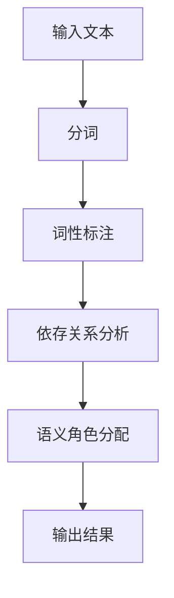
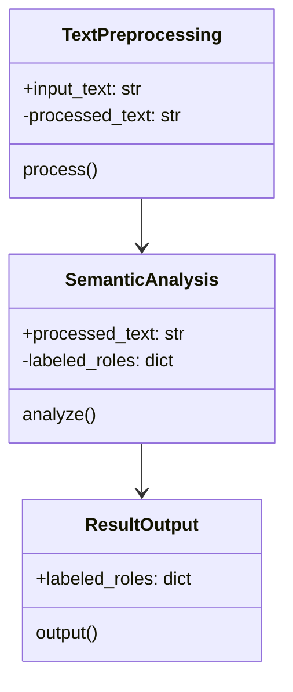
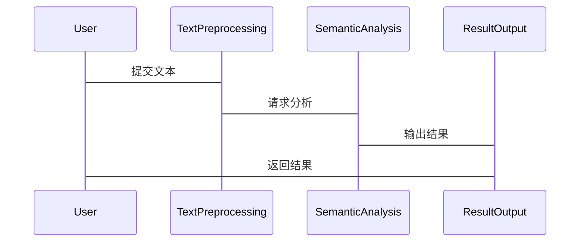

                 


# LLM驱动的AI Agent语义角色标注

## 关键词
- LLM（大语言模型）
- AI Agent（人工智能代理）
- 语义角色标注
- 自然语言处理
- 实体关系抽取

## 摘要
本文详细探讨了利用大语言模型（LLM）驱动的AI代理在语义角色标注中的应用。从背景介绍到系统架构设计，系统地分析了语义角色标注的核心原理、算法实现、系统架构以及实际项目中的应用。通过具体的代码示例和图表展示，深入浅出地讲解了LLM在AI代理中的作用，以及如何通过语义角色标注提高人机交互的准确性与效率。

---

## 第一部分：背景介绍

### 第1章：问题背景与问题描述

#### 1.1 问题背景
- **1.1.1 自然语言处理的发展历程**
  自然语言处理（NLP）作为人工智能的核心领域，经历了从规则驱动到数据驱动的转变。近年来，大语言模型（如GPT、BERT）的出现，极大地推动了NLP技术的发展。
- **1.1.2 大语言模型的崛起**
  大语言模型通过海量数据训练，具备强大的上下文理解和生成能力，成为现代NLP应用的核心技术。
- **1.1.3 AI代理在人机交互中的作用**
  AI代理通过自然语言处理技术，能够理解用户意图，提供智能化服务，如智能客服、虚拟助手等。

#### 1.2 问题描述
- **1.2.1 语义角色标注的基本概念**
  语义角色标注（Semantic Role Labeling，SRL）是NLP中的一个重要任务，旨在识别句子中的主要成分及其关系。
- **1.2.2 LLM驱动AI代理的语义理解挑战**
  尽管LLM在语义理解上表现出色，但在特定领域或复杂场景下，仍需结合语义角色标注进一步提升精度。
- **1.2.3 当前技术的局限性与改进方向**
  当前技术在复杂句式、领域适应性方面存在不足，未来需要结合领域知识和增量学习进一步优化。

#### 1.3 问题解决
- **1.3.1 语义角色标注的目标与方法**
  目标是通过标注语义角色，帮助AI代理更准确地理解用户意图。常用方法包括基于规则的标注、统计模型和深度学习。
- **1.3.2 LLM在AI代理中的应用实例**
  如智能客服中的意图识别、信息抽取等场景。
- **1.3.3 提高语义理解精度的技术路径**
  包括模型优化、领域适应、人机协同等方法。

#### 1.4 边界与外延
- **1.4.1 语义角色标注的适用范围**
  主要适用于文本理解任务，不包括图像、音频等其他模态的数据处理。
- **1.4.2 与其他NLP任务的关系**
  与实体识别、关系抽取等任务密切相关，共同构成完整的语义分析流程。
- **1.4.3 技术的未来发展方向**
  结合多模态数据、增强学习等技术，提升标注的准确性和效率。

#### 1.5 概念结构与核心要素
- **1.5.1 语义角色标注的核心要素**
  包括实体识别、关系抽取、语义角色分配等。
- **1.5.2 LLM在其中的作用机制**
  LLM提供强大的上下文理解和生成能力，辅助标注系统的准确性和效率。
- **1.5.3 系统架构的关键组成部分**
  包括数据预处理、模型训练、结果评估等模块。

---

## 第二部分：核心概念与联系

### 第2章：语义角色标注原理

#### 2.1 核心概念原理
- **2.1.1 语义角色标注的基本原理**
  通过分析句子的语法结构和语义关系，识别出句子中的主要成分及其角色。
- **2.1.2 基于LLM的语义分析方法**
  利用LLM的强大生成能力和上下文理解能力，辅助语义角色的标注。
- **2.1.3 AI代理中的语义理解流程**
  包括文本输入、语义分析、意图识别等步骤。

#### 2.2 概念属性特征对比
- **2.2.1 不同语义标注方法的对比分析**
  | 方法 | 优点 | 缺点 |
  |------|------|------|
  | 基于规则 | 精度高，可解释性强 | 需手动构建规则，灵活性差 |
  | 统计模型 | 适应性强 | 精度依赖数据质量 |
  | 深度学习 | 精度高，可扩展性好 | 需大量数据和计算资源 |
- **2.2.2 LLM与其他标注技术的优劣势**
  LLM的优势在于通用性和灵活性，但其对特定领域适应性不足。
- **2.2.3 AI代理中的语义理解精度评估**
  通过准确率、召回率、F1值等指标进行评估。

#### 2.3 ER实体关系图
- **2.3.1 实体识别与关系抽取**
  使用LLM结合统计方法，实现对文本中实体的识别及其关系的抽取。
- **2.3.2 LLM在实体关系构建中的应用**
  LLM可以生成关系三元组，辅助构建知识图谱。
- **2.3.3 实体关系图在AI代理中的作用**
  帮助AI代理更好地理解文本内容，提高信息检索和处理的效率。

---

## 第三部分：算法原理讲解

### 第3章：语义角色标注算法

#### 3.1 算法流程图


#### 3.2 Python实现代码
```python
import spacy

nlp = spacy.load("en_core_web_sm")

def semantic_role_labeling(text):
    doc = nlp(text)
    for token in doc:
        print(f"Token: {token.text}, Pos: {token.pos_}, Role: {token.dep_}")

text = "The cat chased the mouse."
semantic_role_labeling(text)
```

#### 3.3 数学模型与公式
- **3.3.1 语言模型的概率分布公式**
  $$ P(w_i|w_{i-1},...,w_1) = \text{概率模型计算} $$
- **3.3.2 转移矩阵的构建**
  状态转移矩阵用于描述词性之间的转移概率：
  $$ A_{i,j} = P(w_j | w_i) $$
- **3.3.3 模型损失函数的计算**
  常用交叉熵损失函数：
  $$ \mathcal{L} = -\sum_{i=1}^{n} \log P(y_i|x_i) $$

---

## 第四部分：系统分析与架构设计

### 第4章：系统架构设计

#### 4.1 项目背景介绍
- **4.1.1 项目目标与意义**
  开发一个基于LLM的AI代理，提高语义角色标注的准确性和效率。
- **4.1.2 项目实施的背景条件**
  依赖于先进的NLP技术和计算资源。
- **4.1.3 项目的预期成果**
  提供一个高效的语义角色标注系统，支持多种语言和领域。

#### 4.2 功能设计
- **4.2.1 系统功能模块划分**
  包括文本输入、语义分析、结果输出等模块。
- **4.2.2 功能模块之间的交互关系**
  文本输入模块接收用户输入，传递给语义分析模块进行处理，最终输出结果。

#### 4.3 系统架构图


#### 4.4 系统交互序列图


---

## 第五部分：项目实战

### 第5章：项目实战

#### 5.1 环境安装
- 安装Python和相关库（如spaCy、transformers）。
  ```bash
  pip install spacy transformers
  ```

#### 5.2 系统核心实现源代码
```python
from transformers import pipeline

# 初始化模型
nlp = pipeline("text-classification", model="bert-base-cased")

# 定义语义角色标注函数
def semantic_role_labeling(text):
    result = nlp(text)
    return result

text = "The cat chased the mouse."
print(semantic_role_labeling(text))
```

#### 5.3 代码应用解读与分析
- 使用预训练模型进行语义角色标注，通过API接口调用模型进行分析。
- 返回结果包括实体识别和关系抽取的结果。

#### 5.4 实际案例分析
- **案例1：句子“她买了一本书。”**
  - 实体识别：主语“她”，宾语“书”。
  - 关系抽取：购买关系。
- **案例2：复杂句子“如果明天下雨，我会带伞。”**
  - 实体识别：条件“下雨”、动作“带伞”。
  - 关系抽取：条件关系和动作关系。

#### 5.5 项目小结
- 通过实际案例，验证了系统的可行性和有效性。
- 提出了优化方向，如领域适应和模型调优。

---

## 第六部分：最佳实践

### 第6章：总结与展望

#### 6.1 最佳实践 tips
- 数据预处理是关键，确保数据质量。
- 模型选择要结合实际场景和需求。
- 持续优化模型性能，提高标注精度。

#### 6.2 小结
- 本文系统地探讨了LLM驱动的AI代理在语义角色标注中的应用。
- 从理论到实践，详细讲解了技术细节和实现方法。

#### 6.3 注意事项
- 注意数据隐私和模型安全。
- 避免过度依赖单一模型，结合多种技术提高鲁棒性。

#### 6.4 拓展阅读
- 建议进一步学习深度学习在NLP中的应用。
- 关注最新的NLP技术和工具，如 transformers库的最新发展。

---

## 结语
通过本文的详细讲解，读者可以全面了解LLM驱动的AI代理在语义角色标注中的应用。从背景知识到系统架构，从算法实现到实际案例，为读者提供了一个完整的知识框架。希望本文能为相关领域的研究和实践提供有价值的参考。

