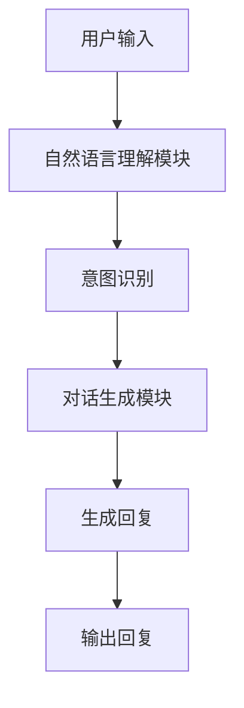
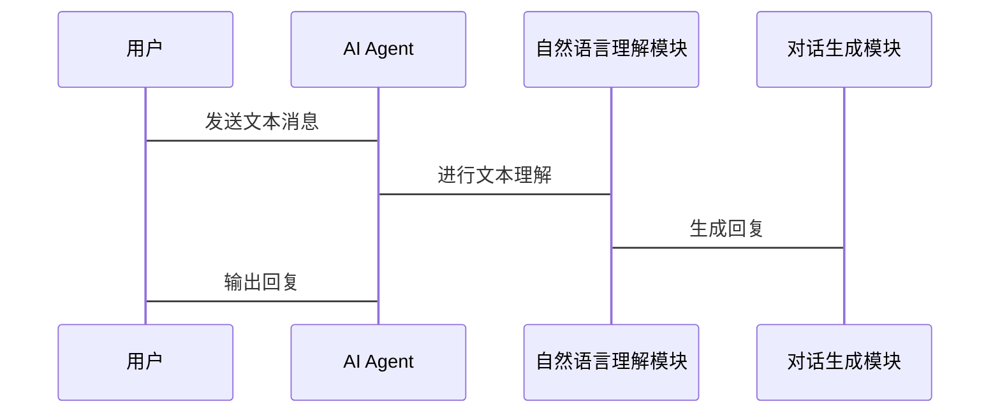

                 


# 《NLP技术在AI Agent中的应用与实践》

## 关键词：NLP技术、AI Agent、自然语言处理、深度学习、对话系统、文本理解

## 摘要：
本文深入探讨了自然语言处理（NLP）技术在人工智能代理（AI Agent）中的应用与实践。通过分析NLP的核心技术、AI Agent的工作原理，以及它们的结合方式，本文详细介绍了NLP在AI Agent中的实际应用场景，包括意图识别、对话生成、情感分析等。同时，本文还通过具体的算法实现和系统设计，展示了如何将NLP技术应用于实际的AI Agent系统中。文章最后总结了NLP在AI Agent中的未来发展方向和最佳实践。

---

## 第1章: NLP技术与AI Agent的背景与基础

### 1.1 NLP技术的基本概念

#### 1.1.1 自然语言处理的定义与核心任务
自然语言处理（NLP）是人工智能（AI）领域中的一个分支，旨在让计算机能够理解和处理人类语言。NLP的核心任务包括：
1. **文本预处理**：分词、词性标注、句法分析等。
2. **文本理解**：文本分类、情感分析、实体识别等。
3. **文本生成**：机器翻译、对话生成、文本摘要等。

#### 1.1.2 AI Agent的基本概念与特点
人工智能代理（AI Agent）是一种能够感知环境并采取行动以实现目标的智能体。AI Agent的核心特点包括：
1. **自主性**：能够自主决策和行动。
2. **反应性**：能够实时感知环境并做出反应。
3. **目标导向**：所有行动都是为了实现特定目标。
4. **社交能力**：能够与人类或其他智能体进行交互。

#### 1.1.3 NLP与AI Agent的结合意义
NLP技术为AI Agent提供了自然语言理解和生成的能力，使其能够与人类进行更自然的交互。通过NLP技术，AI Agent可以理解用户的意图、生成自然的回复，并在复杂场景中进行多轮对话。

### 1.2 NLP技术的演进历程

#### 1.2.1 从规则驱动到数据驱动的转变
早期的NLP技术依赖于大量的手动编写规则，这种方式在处理复杂语言现象时显得力不从心。随着深度学习的兴起，NLP技术逐渐从规则驱动转向数据驱动，模型能够通过大量数据自动学习语言规律。

#### 1.2.2 深度学习在NLP中的应用
深度学习的引入使得NLP技术取得了突破性进展。基于神经网络的模型（如LSTM、Transformer）能够更好地捕捉语言的上下文信息，从而实现更准确的文本理解和生成。

#### 1.2.3 当前NLP技术的主要挑战
尽管NLP技术取得了显著进展，但仍面临一些挑战：
1. **语言的歧义性**：如何处理一词多义、句子的多义性等问题。
2. **数据的稀缺性**：在某些领域，高质量标注数据的获取较为困难。
3. **模型的可解释性**：复杂的模型往往难以解释其决策过程。

### 1.3 AI Agent的典型应用场景

#### 1.3.1 智能客服与对话系统
AI Agent在智能客服中的应用主要体现在对话生成和意图识别上。通过NLP技术，AI Agent可以理解用户的问题，并生成合适的回复。

#### 1.3.2 自然语言理解与生成
NLP技术使得AI Agent能够理解用户的输入文本，并生成符合上下文的回复。这种能力在智能音箱、聊天机器人等场景中得到了广泛应用。

#### 1.3.3 多轮对话中的NLP应用
在多轮对话中，NLP技术帮助AI Agent保持对话的连贯性，并根据对话历史理解用户的意图。这种能力在客服、教育等领域具有重要应用。

### 1.4 本章小结
本章介绍了NLP技术的基本概念、演进历程以及在AI Agent中的典型应用场景。通过理解NLP的核心任务和AI Agent的特点，我们可以更好地理解它们结合的意义和价值。

---

## 第2章: NLP核心技术解析

### 2.1 分词技术

#### 2.1.1 分词的基本原理
分词是将连续的文本分割成有意义的词语的过程。常用的分词方法包括基于规则的方法和基于统计的方法。

#### 2.1.2 常见分词算法（如jieba）
jieba是一种常用的中文分词工具，支持精准分词、全模式分词和搜索引擎分词三种模式。其核心原理是通过预训练的词典和动态规划算法实现分词。

#### 2.1.3 中文分词的挑战与优化
中文分词的挑战主要体现在处理停用词、歧义词以及语境的影响。优化方法包括引入上下文信息和使用深度学习模型。

### 2.2 词性标注与句法分析

#### 2.2.1 词性标注的原理与应用
词性标注是为每个词语标注其词性（如名词、动词、形容词等）。常用算法包括基于规则的方法和基于隐马尔可夫模型（HMM）的方法。

#### 2.2.2 句法分析的基本方法
句法分析旨在确定词语之间的语法关系。常用方法包括基于短语结构的句法分析和基于依存句法的句法分析。

#### 2.2.3 常见句法分析工具（如spaCy）
spaCy是一种高效的句法分析工具，支持多种语言的句法分析。其核心算法基于转移-缩减（shift-reduce）框架。

### 2.3 实体识别与关系抽取

#### 2.3.1 实体识别的定义与实现
实体识别（NER）旨在从文本中识别出命名实体（如人名、地名、组织名等）。常用算法包括基于规则的方法、基于统计的方法和基于深度学习的方法。

#### 2.3.2 关系抽取的原理与应用
关系抽取旨在识别文本中实体之间的关系（如“是”、“属于”、“包含”等）。常用方法包括基于模式匹配的方法和基于深度学习的方法。

#### 2.3.3 常见实体识别工具（如spaCy）
spaCy支持高效的实体识别，其核心算法基于预训练的词向量和条件随机场（CRF）模型。

---

## 第3章: NLP算法原理与实现

### 3.1 BERT模型的原理与实现

#### 3.1.1 BERT模型的基本结构
BERT（Bidirectional Encoder Representations from Transformers）是一种基于Transformer的预训练模型，通过掩码自注意力机制实现双向编码。

#### 3.1.2 BERT模型的输入与输出
BERT的输入包括文本序列和掩码位置标记，输出包括每个位置的隐藏状态和词向量。

#### 3.1.3 BERT模型的数学公式
BERT的自注意力机制可以表示为：
$$
\text{Attention}(Q, K, V) = \text{softmax}\left(\frac{QK^T}{\sqrt{d_k}}\right)V
$$

### 3.2 基于BERT的意图识别实现

#### 3.2.1 意图识别的定义与任务
意图识别旨在确定用户输入文本的意图（如“查询天气”、“预订酒店”等）。

#### 3.2.2 基于BERT的意图识别流程
1. **文本预处理**：对输入文本进行分词和词性标注。
2. **特征提取**：将文本输入BERT模型，提取其隐藏状态。
3. **意图分类**：使用分类器（如全连接层）对隐藏状态进行分类。

#### 3.2.3 实现代码示例
```python
import torch
from transformers import BertTokenizer, BertModel

tokenizer = BertTokenizer.from_pretrained('bert-base-chinese')
model = BertModel.from_pretrained('bert-base-chinese')

def encode_sentence(sentence):
    inputs = tokenizer(sentence, return_tensors='pt')
    outputs = model(**inputs)
    return outputs.last_hidden_state.squeeze()

def intent_classification(sentence):
    features = encode_sentence(sentence)
    # 使用全连接层进行分类
    classifier = torch.nn.Linear(768, num_classes)
    logits = classifier(features)
    return logits.argmax().item()
```

---

## 第4章: AI Agent的系统架构与设计

### 4.1 系统架构设计

#### 4.1.1 系统功能模块划分
AI Agent的系统架构通常包括以下几个模块：
1. **自然语言理解模块**：负责文本的理解和意图识别。
2. **对话生成模块**：负责生成自然的回复。
3. **知识库模块**：存储和管理相关知识。
4. **推理与决策模块**：根据输入生成相应的行动。

#### 4.1.2 系统架构设计图


### 4.2 系统交互流程设计

#### 4.2.1 用户输入与系统响应
1. **用户输入**：用户向AI Agent发送一条文本消息。
2. **文本预处理**：对输入文本进行分词和词性标注。
3. **意图识别**：识别用户的意图。
4. **对话生成**：根据意图生成回复。
5. **输出回复**：将回复返回给用户。

#### 4.2.2 系统交互流程图


---

## 第5章: 项目实战与案例分析

### 5.1 智能客服系统的实现

#### 5.1.1 项目需求分析
智能客服系统需要能够理解用户的问题，并生成相应的回复。系统需要支持多轮对话，并能够处理多种意图。

#### 5.1.2 系统核心代码实现
```python
class AI_Agent:
    def __init__(self):
        self.nlu = NaturalLanguageUnderstanding()
        self.nlg = NaturalLanguageGeneration()

    def process_query(self, query):
        intent = self.nlu.intent_detection(query)
        response = self.nlg.generate_response(intent)
        return response
```

#### 5.1.3 项目实现细节
1. **自然语言理解模块**：使用预训练的BERT模型进行意图识别。
2. **自然语言生成模块**：基于模板生成回复。

### 5.2 案例分析与优化

#### 5.2.1 案例分析
以智能客服系统为例，分析系统的优缺点，并提出优化建议。

#### 5.2.2 系统优化
1. **优化意图识别的准确率**：引入更多的训练数据。
2. **优化对话生成的流畅性**：引入对话历史信息。

---

## 第6章: 总结与展望

### 6.1 本章总结
本文深入探讨了NLP技术在AI Agent中的应用，从核心技术到系统设计，再到项目实战，全面介绍了NLP技术在AI Agent中的应用与实践。

### 6.2 未来展望
随着NLP技术的不断发展，AI Agent将在更多领域得到应用。未来的研究方向包括：
1. **模型的可解释性**：提高模型的可解释性，使其更易于理解和信任。
2. **多模态交互**：结合视觉、听觉等多模态信息，提升交互的自然性。
3. **个性化服务**：根据用户的个性化需求，提供定制化的服务。

### 6.3 最佳实践 Tips
1. 在实际应用中，建议结合具体场景选择合适的NLP技术。
2. 在系统设计中，建议引入知识图谱和推理引擎，提升系统的智能性。
3. 在模型训练中，建议使用高质量的标注数据，并进行充分的验证和测试。

---

## 附录: 参考文献与拓展阅读

1. **参考文献**
   - 王厚勇. 《自然语言处理入门》. 北京: 清华大学出版社, 2020.
   - 王立勋. 《人工智能与自然语言处理》. 北京: 人民邮电出版社, 2021.

2. **拓展阅读**
   - [BERT论文](https://arxiv.org/abs/1810.04692)
   - [spaCy官方文档](https://spacy.io/)

---

通过本文的详细介绍，读者可以全面了解NLP技术在AI Agent中的应用与实践。希望本文能为相关领域的研究和实践提供有价值的参考。

