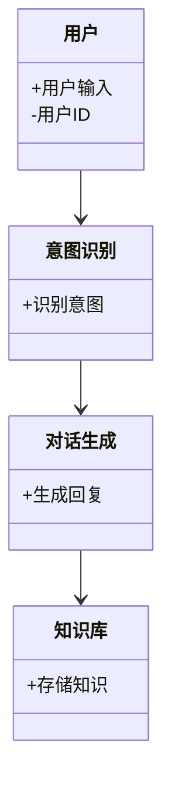
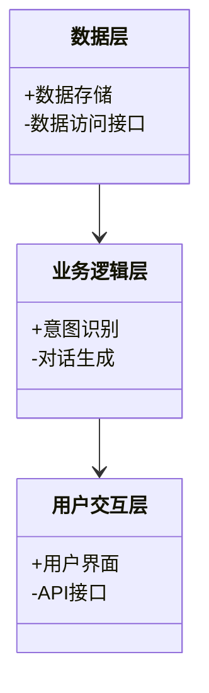
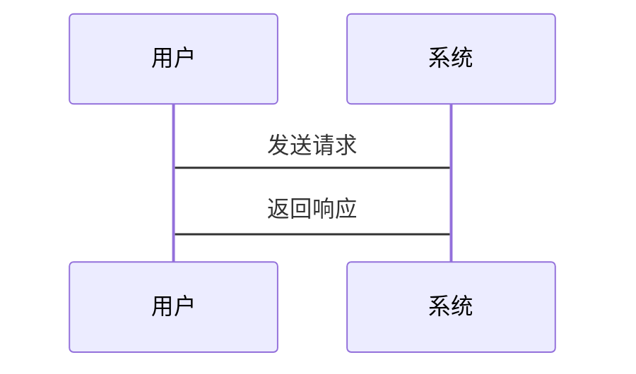

                 


# NLP技术在企业AI Agent中的应用与实现

> 关键词：自然语言处理、企业AI Agent、NLP算法、系统架构、AI应用

> 摘要：随着自然语言处理（NLP）技术的快速发展，企业AI Agent在各个领域的应用日益广泛。本文详细探讨了NLP技术在企业AI Agent中的核心算法、系统架构设计以及实际应用场景。通过分析NLP算法的原理和实现，结合具体的项目案例，展示了如何将NLP技术应用于企业智能助手、客户服务等场景，为读者提供全面的理论与实践指导。

---

# 第一部分: NLP技术与企业AI Agent的背景介绍

# 第1章: NLP技术与企业AI Agent概述

## 1.1 NLP技术的基本概念

### 1.1.1 自然语言处理的定义与核心任务

自然语言处理（NLP）是人工智能领域的重要分支，旨在让计算机能够理解、处理和生成人类语言。其核心任务包括：

- **文本处理**：如分词、句法分析、命名实体识别。
- **文本理解**：如情感分析、意图识别。
- **文本生成**：如机器翻译、对话生成。

### 1.1.2 企业AI Agent的定义与特点

企业AI Agent是一种智能化的代理系统，能够通过自然语言与用户交互，完成特定任务。其特点包括：

- **智能性**：能够理解和处理自然语言。
- **实时性**：快速响应用户需求。
- **可扩展性**：支持多种应用场景。

### 1.1.3 NLP在企业AI Agent中的作用

NLP技术是企业AI Agent实现智能交互的核心，主要用于：

- **意图识别**：理解用户的意图。
- **对话生成**：生成自然的回复。
- **信息提取**：从文本中提取关键信息。

## 1.2 NLP与企业AI Agent的应用场景

### 1.2.1 客户服务与支持

企业AI Agent可以作为智能客服，通过NLP技术处理用户的咨询和问题，提供快速响应。

### 1.2.2 企业内部流程自动化

通过NLP技术，企业AI Agent可以自动化处理内部流程，如文档审核、任务分配。

### 1.2.3 数据分析与决策支持

企业AI Agent可以利用NLP技术从大量文本数据中提取信息，辅助决策。

## 1.3 企业AI Agent的发展趋势

### 1.3.1 NLP技术的演进

从简单的关键词匹配到深度学习模型，NLP技术不断进步，为企业AI Agent提供了更强大的能力。

### 1.3.2 企业AI Agent的市场现状

随着AI技术的发展，企业AI Agent在各行业的应用逐渐普及，市场需求旺盛。

### 1.3.3 未来发展方向与挑战

未来，企业AI Agent将更加智能化，但需要克服数据隐私、模型泛化能力等挑战。

## 1.4 本章小结

本章介绍了NLP技术的基本概念和企业AI Agent的定义及其应用场景，分析了NLP在企业AI Agent中的重要性及发展趋势。

---

# 第二部分: NLP技术的核心概念与算法原理

# 第2章: NLP核心算法与原理

## 2.1 词嵌入技术

### 2.1.1 词嵌入的定义与作用

词嵌入是一种将词语表示为低维向量的方法，常用于NLP任务中。

### 2.1.2 常见词嵌入算法（如Word2Vec、GloVe）

#### Word2Vec

Word2Vec是一种常用的词嵌入算法，通过神经网络模型训练词向量。

- **CBOW模型**：根据上下文预测当前词。
- **Skip-Gram模型**：根据当前词预测上下文。

#### GloVe

GloVe是基于全局词距的词嵌入方法，通过矩阵分解生成词向量。

### 2.1.3 词嵌入在企业AI Agent中的应用

词嵌入可以用于意图识别、文本相似度计算等任务。

## 2.2 语言模型与序列模型

### 2.2.1 语言模型的基本原理

语言模型通过概率分布预测下一个词，常用于文本生成任务。

### 2.2.2 基于序列的NLP模型（如RNN、LSTM、Transformer）

#### RNN

循环神经网络（RNN）适用于处理序列数据，但在长序列中表现不佳。

#### LSTM

长短时记忆网络（LSTM）通过门控机制解决了RNN的长序列问题。

#### Transformer

Transformer模型通过自注意力机制，提升了处理长序列的能力。

### 2.2.3 语言模型在对话系统中的应用

语言模型可以用于生成对话回复，提升用户体验。

## 2.3 注意力机制与编码器-解码器架构

### 2.3.1 注意力机制的原理

注意力机制通过计算词与词之间的相关性，确定每个词的重要性。

### 2.3.2 编码器-解码器架构的应用

编码器将输入序列编码为向量，解码器根据编码向量生成输出序列。

### 2.3.3 在企业AI Agent中的具体实现

注意力机制可以应用于意图识别和对话生成。

## 2.4 模型训练与优化

### 2.4.1 数据预处理与特征工程

数据预处理包括分词、去除停用词等步骤。

### 2.4.2 模型训练的优化策略

优化策略包括学习率调整、批量训练等。

### 2.4.3 模型评估与调优

模型评估指标包括准确率、召回率、F1值等。

## 2.5 本章小结

本章详细讲解了NLP技术的核心算法，包括词嵌入、语言模型和注意力机制，并分析了它们在企业AI Agent中的应用。

---

# 第三部分: 企业AI Agent的系统分析与架构设计

# 第3章: 企业AI Agent的系统架构

## 3.1 系统功能需求分析

### 3.1.1 功能模块划分

企业AI Agent的主要功能模块包括：

- **意图识别**：识别用户的意图。
- **对话生成**：生成自然的对话回复。
- **知识库管理**：管理相关知识和信息。

### 3.1.2 领域模型设计

使用Mermaid绘制领域模型图，展示各功能模块之间的关系。



## 3.2 系统架构设计

### 3.2.1 分层架构设计

企业AI Agent的系统架构分为数据层、业务逻辑层和用户交互层。

### 3.2.2 系统架构图

使用Mermaid绘制系统架构图，展示各层的职责和交互流程。



## 3.3 系统接口设计

### 3.3.1 API接口设计

企业AI Agent需要提供RESTful API接口，供其他系统调用。

### 3.3.2 系统交互设计

使用Mermaid绘制系统交互图，展示用户与系统之间的交互流程。



## 3.4 本章小结

本章分析了企业AI Agent的系统功能需求，设计了系统的分层架构，并展示了系统接口和交互流程。

---

# 第四部分: 项目实战

# 第4章: 项目实战与案例分析

## 4.1 环境安装与配置

### 4.1.1 安装Python库

安装必要的Python库，如TensorFlow、Keras、Numpy。

```bash
pip install tensorflow numpy keras
```

## 4.2 核心代码实现

### 4.2.1 意图识别模型

使用Keras搭建一个简单的意图识别模型。

```python
import numpy as np
from tensorflow.keras.models import Sequential
from tensorflow.keras.layers import Dense, Dropout

# 数据预处理
X = ...  # 输入特征
y = ...  # 标签

model = Sequential()
model.add(Dense(64, activation='relu', input_dim=X.shape[1]))
model.add(Dropout(0.5))
model.add(Dense(1, activation='sigmoid'))
model.compile(optimizer='adam', loss='binary_crossentropy', metrics=['accuracy'])
model.fit(X, y, epochs=10, batch_size=32)
```

### 4.2.2 对话生成模型

使用预训练的GPT模型生成对话回复。

```python
import numpy as np
from tensorflow.keras.models import Model
from tensorflow.keras.layers import Input, LSTM, Dense

# 定义编码器和解码器
encoder_inputs = Input(shape=(None, input_dim))
encoder_lstm = LSTM(hidden_units, return_sequences=True, return_state=True)
encoder_outputs, state_h, state_c = encoder_lstm(encoder_inputs)
decoder_inputs = Input(shape=(None, output_dim))
decoder_lstm = LSTM(hidden_units, return_sequences=True, return_state=True)
decoder_outputs, _, _ = decoder_lstm(decoder_inputs, initial_state=[state_h, state_c])
dense_layer = Dense(output_dim, activation='softmax')
decoder_dense = dense_layer(decoder_outputs)

model = Model(inputs=[encoder_inputs, decoder_inputs], outputs=decoder_dense)
model.compile(...)
```

## 4.3 案例分析

### 4.3.1 实际案例：智能客服系统

以智能客服系统为例，详细描述如何利用NLP技术实现对话管理。

### 4.3.2 代码实现

展示如何训练和部署模型，确保系统能够实时响应用户需求。

## 4.4 本章小结

本章通过实际项目案例，展示了NLP技术在企业AI Agent中的具体应用，详细讲解了系统的实现过程。

---

# 第五部分: 总结与展望

# 第5章: 总结与展望

## 5.1 本章小结

本文详细探讨了NLP技术在企业AI Agent中的应用，从核心算法到系统架构设计，再到实际项目案例，为读者提供了全面的理论与实践指导。

## 5.2 注意事项与最佳实践

在实际项目中，需要注意数据质量、模型调优等问题，同时注重用户体验和系统的可扩展性。

## 5.3 拓展阅读

推荐相关书籍和论文，供读者深入学习NLP技术和企业AI Agent的应用。

---

# 结语

NLP技术在企业AI Agent中的应用前景广阔，随着技术的不断进步，企业AI Agent将更加智能化，为企业的数字化转型提供强大支持。希望本文能够为读者提供有价值的参考和启发。

