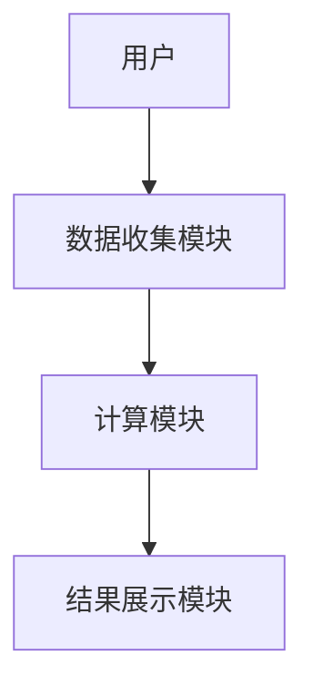
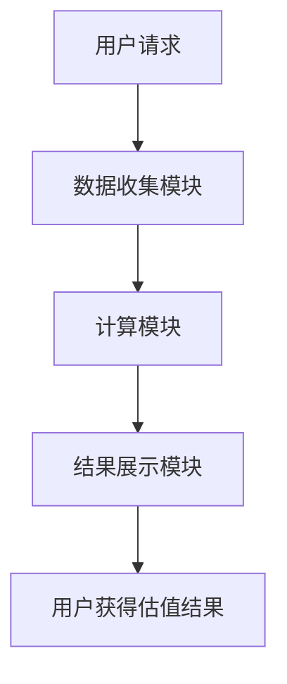

                 


# PEG比率：结合增长预期的动态估值方法

## 关键词
- PEG比率
- 动态估值
- 增长预期
- 股票估值
- 估值方法

## 摘要
PEG比率（Price/Earnings to Growth）是一种结合公司增长预期的动态股票估值方法，它通过将市盈率与公司预期增长率相结合，提供了一种更全面的估值工具。本文将从PEG比率的背景、核心概念、算法原理、系统架构设计、项目实战等方面进行详细阐述，帮助读者全面理解PEG比率的理论基础和实际应用。

---

# 第1章: 估值方法的演进与问题背景

## 1.1 传统估值方法的局限性

### 1.1.1 市盈率（P/E）的定义与局限
市盈率（P/E）是股票价格与每股收益的比率，常用于衡量股票的估值。然而，P/E仅考虑了当前的盈利能力，忽略了公司的增长潜力。

### 1.1.2 市净率（P/B）的定义与局限
市净率（P/B）是股票价格与每股净资产的比率，适用于评估资产密集型行业。其局限性在于忽略了收益能力和增长潜力。

### 1.1.3 现金流折现法的复杂性与计算难度
现金流折现法通过将未来现金流折现到当前价值来评估公司价值，但其计算复杂且依赖于对未来现金流的准确预测。

## 1.2 增长预期在估值中的重要性

### 1.2.1 增长预期的定义与影响
增长预期是指市场对公司在未来一定时间内收入或利润增长的预期，是影响股票估值的重要因素。

### 1.2.2 增长预期在传统估值方法中的体现
传统估值方法如P/E和P/B在一定程度上考虑了增长因素，但缺乏动态调整和量化方法。

### 1.2.3 增长预期未被充分考虑的问题
当公司增长潜力未被充分反映时，传统估值方法可能导致估值偏差。

## 1.3 PEG比率的提出与目标

### 1.3.1 PEG比率的定义与目标
PEG比率通过结合市盈率和预期增长率，提供一种动态的估值方法。

### 1.3.2 PEG比率的核心问题：动态调整
PEG比率的核心在于将市盈率与预期增长率结合起来，实现动态估值。

### 1.3.3 PEG比率的适用场景与边界
PEG比率适用于成长型企业，尤其适合那些预期增长率较高的公司。

---

# 第2章: PEG比率的核心概念与原理

## 2.1 PEG比率的定义与公式

### 2.1.1 PEG比率的数学定义
PEG比率通过将市盈率（P/E）与预期增长率（g）相结合，公式为：
$$PEG = \frac{P/E}{g}$$

### 2.1.2 PEG比率的计算公式
$$PEG = \frac{P}{E \times g}$$

## 2.2 PEG比率的核心要素

### 2.2.1 股价（P）的定义与影响
股价是市场对公司价值的反映，受多种因素影响。

### 2.2.2 每股收益（E）的定义与计算
每股收益是公司净利润除以总股本，反映公司盈利能力。

### 2.2.3 预期增长率（g）的定义与来源
预期增长率基于市场预测，通常来自分析师报告或公司财报。

## 2.3 PEG比率的理论基础与假设

### 2.3.1 股票估值的内在逻辑
股票价值应反映公司未来现金流的现值。

### 2.3.2 增长预期的合理性假设
预期增长率应基于合理的市场预测和公司基本面。

### 2.3.3 PEG比率的动态调整机制
PEG比率通过动态调整市盈率，反映公司增长潜力的变化。

---

# 第3章: PEG比率与传统估值方法的对比

## 3.1 PEG比率与市盈率（P/E）的对比

### 3.1.1 P/E的定义与计算
市盈率（P/E）= 股价 / 每股收益。

### 3.1.2 PEG比率对P/E的改进
PEG通过引入预期增长率，克服了P/E仅考虑当前盈利的局限。

### 3.1.3 两者的优缺点对比
- P/E优点：简单易懂；缺点：忽略增长潜力。
- PEG优点：结合增长预期；缺点：依赖于增长率预测。

## 3.2 PEG比率与市净率（P/B）的对比

### 3.2.1 P/B的定义与计算
市净率（P/B）= 股价 / 每股净资产。

### 3.2.2 PEG比率与P/B的适用场景
PEG适用于成长型企业，P/B适用于资产密集型行业。

### 3.2.3 两者的优缺点对比
- P/B优点：适合评估资产密集型企业；缺点：忽略收益能力。
- PEG优点：结合增长预期；缺点：依赖于增长率预测。

## 3.3 PEG比率与现金流折现法的对比

### 3.3.1 现金流折现法的定义与计算
现金流折现法通过折现未来现金流评估公司价值。

### 3.3.2 PEG比率对现金流折现法的简化
PEG通过简化模型，提供了更易于使用的估值方法。

### 3.3.3 两者的优缺点对比
- 现金流折现法优点：准确反映未来现金流；缺点：计算复杂。
- PEG优点：简单易用；缺点：依赖于增长率预测。

---

# 第4章: PEG比率的算法原理

## 4.1 PEG比率的计算步骤

### 4.1.1 获取股价（P）
通过股票市场数据获取公司股价。

### 4.1.2 获取每股收益（E）
从公司财报中获取每股收益数据。

### 4.1.3 获取预期增长率（g）
参考市场预测或公司财报中的增长率数据。

### 4.1.4 计算市盈率（P/E）
计算公式：$$P/E = \frac{P}{E}$$

### 4.1.5 计算PEG比率
$$PEG = \frac{P/E}{g}$$

---

# 第5章: PEG比率的系统架构设计

## 5.1 系统功能设计

### 5.1.1 数据收集模块
从市场数据源获取股价、每股收益和预期增长率。

### 5.1.2 计算模块
实现PEG比率的计算逻辑。

### 5.1.3 结果展示模块
以可视化方式展示PEG比率及其与传统估值方法的对比。

## 5.2 系统架构设计

### 5.2.1 顶层架构图


### 5.2.2 数据流图


---

# 第6章: 项目实战

## 6.1 环境安装

### 6.1.1 安装Python
使用命令 `pip install python` 安装Python。

### 6.1.2 安装相关库
安装 `pandas`, `numpy`, `matplotlib` 等库。

## 6.2 核心代码实现

### 6.2.1 数据获取
```python
import pandas as pd
import numpy as np

# 获取股价数据
prices = pd.read_csv('stock_prices.csv')

# 获取每股收益数据
eps = pd.read_csv('eps.csv')

# 获取预期增长率数据
growth = pd.read_csv('growth.csv')
```

### 6.2.2 计算PEG比率
```python
# 计算市盈率
pe = prices['price'] / eps['eps']

# 计算PEG比率
peg = pe / growth['growth_rate']
```

---

# 第7章: 案例分析与经验总结

## 7.1 案例分析

### 7.1.1 案例背景
以某成长型公司为例，分析其PEG比率。

### 7.1.2 数据分析
计算PEG比率，对比传统估值方法。

## 7.2 经验总结

### 7.2.1 成功经验
正确预测增长率是关键。

### 7.2.2 失败教训
增长率预测的不确定性可能影响结果。

---

# 第8章: 最佳实践与未来发展

## 8.1 最佳实践

### 8.1.1 小结
PEG比率是一种有效的动态估值工具。

### 8.1.2 注意事项
- 数据质量至关重要。
- 结合其他估值方法使用。

### 8.1.3 拓展阅读
推荐阅读相关文献，深入了解PEG比率的应用。

---

通过以上结构，文章系统地介绍了PEG比率的背景、理论基础、算法原理、系统设计和实际应用，帮助读者全面掌握PEG比率的动态估值方法。

