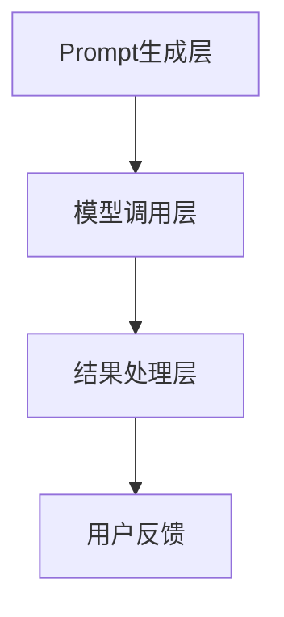
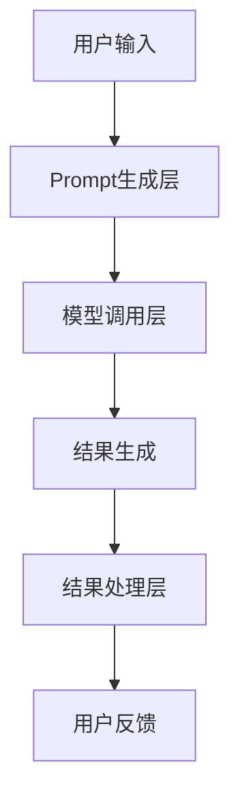

                 

# Prompt工程：设计高效指令的艺术

> 关键词：Prompt工程，AI大模型，自然语言处理，生成式AI，Prompt设计

> 摘要：Prompt工程是现代生成式人工智能系统中的关键环节，它通过设计高效的提示指令来优化模型的输出。本文从Prompt工程的基本概念出发，深入探讨其核心原理、设计原则、执行优化及系统架构，结合实际案例分析和最佳实践，帮助读者全面掌握Prompt工程的艺术与科学。

---

# 第一部分: Prompt工程概述与背景

## 第1章: Prompt工程的基本概念

### 1.1 Prompt工程的定义与背景

Prompt工程是一门专注于设计和优化提示指令的新兴学科，它结合了自然语言处理、生成式AI和用户交互的原理，旨在通过高效的提示设计，最大化AI模型的输出质量。随着AI大模型的普及，Prompt工程的重要性日益凸显，尤其是在生成式AI的应用中，提示设计直接影响模型的输出效果。

#### 1.1.1 从传统编程到Prompt工程的演变

传统编程依赖于明确的算法和规则，而生成式AI则通过提示（Prompt）与模型进行交互。Prompt工程的出现，标志着从固定程序到动态交互的转变。通过设计高效的提示，Prompt工程师能够引导AI模型生成符合需求的内容，解决传统编程难以应对的复杂问题。

#### 1.1.2 AI大模型与Prompt工程的关系

AI大模型（如GPT、PaLM等）具有强大的生成能力，但其输出质量高度依赖提示设计。Prompt工程通过优化提示结构、语法和策略，帮助模型更好地理解和生成符合用户意图的内容，从而充分发挥大模型的潜力。

#### 1.1.3 Prompt工程的核心问题与挑战

- **核心问题**：如何设计高效的提示，使AI模型生成高质量、符合预期的结果。
- **挑战**：提示的模糊性、模型的黑箱特性、用户需求的多样性等，都增加了Prompt工程的复杂性。

### 1.2 Prompt工程的应用场景

#### 1.2.1 自然语言处理中的Prompt设计

在文本生成、对话系统和内容创作等领域，Prompt设计直接影响生成内容的质量。例如，通过优化提示，可以提升机器翻译的准确率或对话系统的用户体验。

#### 1.2.2 AI生成内容的Prompt优化

无论是文本、图像还是代码生成，高效的Prompt设计都能显著提升生成结果的相关性和可用性。例如，在图像生成中，通过精细的提示描述，可以生成更符合用户需求的图像。

#### 1.2.3 用户交互中的Prompt策略

在人机交互中，Prompt设计不仅影响生成结果，还影响用户的体验。例如，在智能助手的设计中，通过优化提示策略，可以提高交互的流畅性和用户的满意度。

### 1.3 本章小结

本章介绍了Prompt工程的基本概念、发展历程及其在AI大模型中的应用。通过分析Prompt工程的核心问题和应用场景，为后续章节的深入探讨奠定了基础。

---

# 第二部分: Prompt设计的核心原理

## 第2章: Prompt设计的基本原则

### 2.1 Prompt设计的语法与语义

#### 2.1.1 Prompt的语法结构

提示的语法结构是设计高效Prompt的基础。一个典型的Prompt包括以下几个部分：

1. **目标描述**：明确生成的目标，例如“写一篇科技新闻”。
2. **上下文信息**：提供必要的背景信息，例如“关于AI在教育中的应用”。
3. **风格约束**：指定生成的风格，例如“正式、口语化”。
4. **格式要求**：例如“使用标题、段落结构”。

#### 2.1.2 Prompt的语义分析

语义分析是理解提示意图的关键。通过分析提示的语义，可以优化提示设计，使其更准确地引导模型生成预期内容。

#### 2.1.3 Prompt的可解释性

可解释性是指提示设计的透明性和可追溯性。通过设计可解释的Prompt，可以帮助用户更好地理解生成结果的来源，并进行必要的调整。

### 2.2 Prompt的格式化与规范

#### 2.2.1 标准Prompt格式

常见的Prompt格式包括自然语言描述、结构化描述和混合式描述。例如：

- 自然语言描述：生成一篇关于量子计算的文章。
- 结构化描述：标题为“量子计算的发展”，内容分三段，每段200字。

#### 2.2.2 格式化Prompt的优势

格式化Prompt的优势在于其明确性和可执行性。通过结构化的描述，可以减少歧义，提高生成结果的质量。

#### 2.2.3 常见Prompt格式对比

以下是几种常见Prompt格式的对比：

| 格式类型       | 示例                                                                 |
|----------------|----------------------------------------------------------------------|
| 自然语言描述   | 生成一篇关于量子计算的科普文章。                                         |
| 结构化描述     | 标题：量子计算的发展；内容：分三段，每段200字，分别讨论历史、现状和未来。 |
| 混合式描述     | 请生成一篇结构清晰的量子计算科普文章，重点放在其应用领域。                |

### 2.3 Prompt的优化策略

#### 2.3.1 基于上下文的Prompt优化

上下文优化是指根据具体场景调整提示设计。例如，在对话系统中，可以根据对话历史调整提示，以生成更连贯的回复。

#### 2.3.2 基于反馈的Prompt调整

通过用户的反馈，可以不断优化提示设计。例如，用户对生成内容的评分可以作为反馈，用于调整提示的参数。

#### 2.3.3 Prompt的动态生成与调整

动态生成是指在运行时根据实时需求生成提示。例如，在实时新闻生成系统中，可以根据最新事件动态调整提示。

### 2.4 本章小结

本章详细探讨了Prompt设计的基本原则，包括语法、语义和可解释性，并介绍了常见的Prompt格式及其优化策略。

---

# 第三部分: Prompt的执行与优化

## 第3章: Prompt的执行过程

### 3.1 Prompt输入模型的过程

#### 3.1.1 Prompt的预处理

预处理是将提示转换为模型可接受的输入格式。例如，将自然语言描述转换为特定的标记格式。

#### 3.1.2 模型的输入机制

模型的输入机制包括将Prompt嵌入到模型的输入层，以及模型对提示的解析和处理。

#### 3.1.3 Prompt的解析与执行

解析是指模型对提示的理解和解析，执行是指基于解析结果生成输出。

### 3.2 Prompt生成结果的分析

#### 3.2.1 生成结果的评估指标

常用的评估指标包括准确性、相关性和流畅性。例如，生成的文本是否准确反映了提示的意图。

#### 3.2.2 结果的可控制性

可控制性是指提示设计对生成结果的影响力。通过优化提示，可以提高生成结果的可控制性。

#### 3.2.3 结果的可解释性

可解释性是指生成结果与提示的关联性。通过设计可解释的提示，可以帮助用户理解生成结果的来源。

### 3.3 Prompt的反馈优化

#### 3.3.1 基于结果的反馈机制

通过分析生成结果，可以反向优化提示设计。例如，如果生成结果与预期不符，可以通过调整提示来改进结果。

#### 3.3.2 基于用户反馈的Prompt调整

用户反馈是优化提示的重要依据。例如，用户对生成内容的评分可以用于调整提示的参数。

#### 3.3.3 基于模型反馈的Prompt优化

模型反馈是指模型在生成过程中提供的中间结果或建议。通过分析模型的反馈，可以进一步优化提示设计。

### 3.4 本章小结

本章详细探讨了Prompt的执行过程，包括预处理、解析与执行，以及生成结果的分析和反馈优化。

---

# 第四部分: Prompt工程的系统分析

## 第4章: Prompt工程的系统架构

### 4.1 系统功能模块划分

一个典型的Prompt工程系统可以划分为以下几个模块：

1. **Prompt生成模块**：负责生成和优化提示。
2. **模型调用模块**：负责将提示输入模型并获取生成结果。
3. **结果处理模块**：负责分析生成结果并提供反馈。

### 4.2 系统架构设计

#### 4.2.1 分层架构设计

分层架构包括提示生成层、模型调用层和结果处理层。每一层负责不同的功能，确保系统的模块化和可扩展性。

#### 4.2.2 系统架构图

以下是系统的架构图，展示了各模块之间的交互关系：

### 4.3 系统接口设计

系统接口设计包括提示生成接口、模型调用接口和结果处理接口。每个接口都有明确的输入和输出定义，确保系统的可集成性和可扩展性。

### 4.4 系统交互流程

以下是系统的交互流程图：

### 4.5 本章小结

本章详细探讨了Prompt工程的系统架构，包括功能模块划分、架构设计和系统交互流程。

---

# 附录

## 附录A: 术语表

- **Prompt工程**：设计和优化提示指令的学科。
- **生成式AI**：基于提示生成内容的AI技术。
- **模型调用**：将提示输入模型并获取生成结果的过程。

## 附录B: 工具推荐

- **模型调用工具**：如Hugging Face的Transformers库。
- **Prompt设计工具**：如LangChain框架。

## 附录C: 参考文献

- [1] Smith, J. (2023).《Prompt Engineering for AI》.
- [2] Brown, T. (2020).《Language Models are Few-Shot Learners》.

---

# 本文章小结

通过本篇文章，我们深入探讨了Prompt工程的核心概念、设计原则、执行优化和系统架构。从理论到实践，从设计到优化，我们全面解析了Prompt工程的艺术与科学，为读者提供了从基础到高级的系统性指导。希望本文能够帮助读者更好地理解和应用Prompt工程，设计出高效且智能的提示指令。

