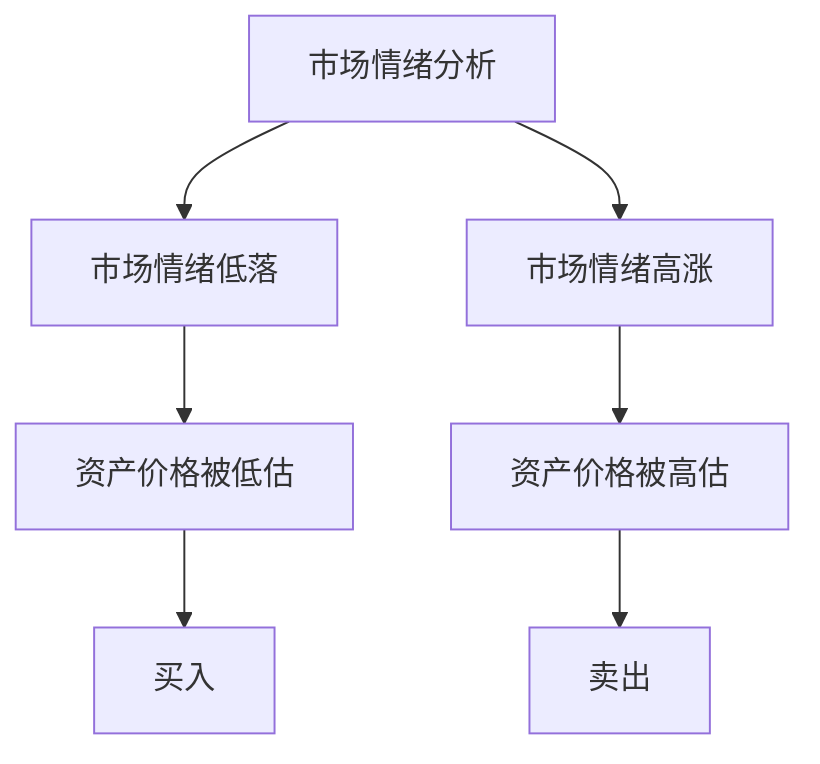
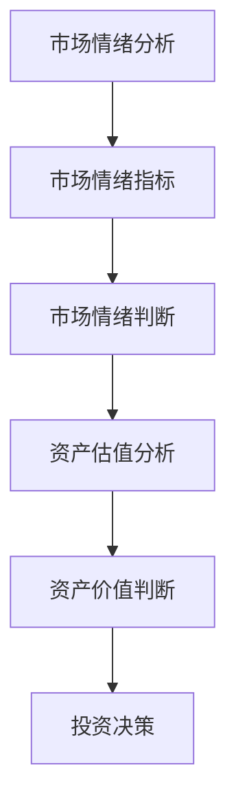
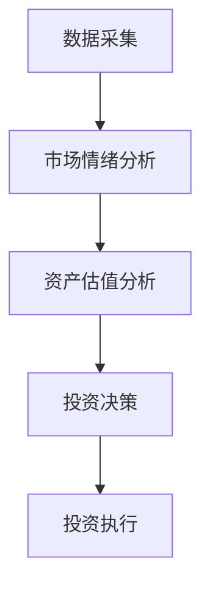

                 


# Contrarian投资：逆向思维创造超额收益

## 关键词：
Contrarian投资，逆向思维，超额收益，投资策略，市场分析

## 摘要：
本文深入探讨了Contrarian投资的核心概念、策略与方法，以及逆向思维在投资中的应用。通过分析Contrarian投资的哲学基础、逆向思维模型和实际案例，本文为投资者提供了一套系统化的投资框架，帮助他们在市场波动中发现机会，创造超额收益。

---

# 第1章: Contrarian投资的核心概念

## 1.1 什么是Contrarian投资

Contrarian投资是一种逆向投资策略，其核心思想是在市场情绪低落时买入，而在市场情绪高涨时卖出。与大多数投资者跟随市场趋势不同，Contrarian投资者选择在市场底部买入，在市场顶部卖出，从而在市场波动中实现超额收益。

### 1.1.1 Contrarian投资的定义

Contrarian投资是一种反向投资策略，强调在市场情绪与实际价值出现偏离时进行投资。当市场情绪过度悲观时，资产价格被低估，此时买入；当市场情绪过度乐观时，资产价格被高估，此时卖出。

### 1.1.2 Contrarian投资的核心特征

- **逆向思维**：在市场情绪与资产价值背离时采取行动。
- **价值导向**：注重资产的内在价值，而非市场情绪。
- **长期视角**：逆市买入，长期持有，等待价值回归。

### 1.1.3 Contrarian投资与传统投资的区别

| 特性 | Contrarian投资 | 传统投资 |
|------|----------------|-----------|
| 投资理念 | 逆向思维，关注价值 | 顺势而为，关注趋势 |
| 投资时机 | 市场底部买入，顶部卖出 | 市场上涨时买入，下跌时卖出 |
| 风险管理 | 逆向操作，分散风险 | 随市波动，集中风险 |

---

## 1.2 Contrarian投资的历史与发展

### 1.2.1 Contrarian投资的起源

Contrarian投资理念可以追溯到19世纪末的美国铁路投资泡沫。当时，许多投资者盲目追随市场趋势，导致市场估值过高，最终泡沫破裂。一些投资者开始意识到市场非理性，转而采取逆向策略。

### 1.2.2 Contrarian投资在现代金融中的发展

20世纪中期，Ben Graham和David Dodd等价值投资者开始系统化Contrarian投资理念。他们强调资产的内在价值，倡导在市场低估时买入。20世纪末，行为金融学的发展进一步支持了Contrarian投资的理论基础。

### 1.2.3 Contrarian投资的现状与趋势

随着金融市场的发展，Contrarian投资逐渐从个体投资者的策略发展为一种系统化的投资方法。现代投资者利用大数据、算法交易和行为分析等工具，进一步优化Contrarian投资策略。

---

## 1.3 Contrarian投资的哲学基础

### 1.3.1 逆向思维的哲学解读

逆向思维是一种反向思考的方式，强调在大多数人认为正确时考虑错误，在大多数人认为错误时考虑正确。Contrarian投资将这种思维应用于市场分析和投资决策中。

### 1.3.2 市场非理性与Contrarian投资的关系

市场参与者的情绪波动导致市场非理性。当市场情绪过于乐观时，资产价格被高估；当市场情绪过于悲观时，资产价格被低估。Contrarian投资者利用这种非理性赚取超额收益。

### 1.3.3 Contrarian投资与行为金融学的联系

行为金融学研究表明，投资者的行为往往受到心理偏差的影响，如从众心理、过度自信等。Contrarian投资通过分析这些偏差，寻找市场非理性，从而做出反向投资决策。

---

## 1.4 本章小结

Contrarian投资是一种基于逆向思维的投资策略，强调在市场低估时买入，在市场高估时卖出。其核心理念是通过分析市场情绪和资产价值的偏离，寻找投资机会。Contrarian投资的成功依赖于对市场非理性的深刻理解，以及对资产内在价值的准确判断。

---

# 第2章: Contrarian投资的策略与方法

## 2.1 Contrarian投资的基本策略

### 2.1.1 逆向买入策略

在市场情绪低落、资产价格被低估时，Contrarian投资者选择买入。这种策略依赖于市场情绪分析和估值分析。

### 2.1.2 顺势卖出策略

在市场情绪高涨、资产价格被高估时，Contrarian投资者选择卖出。这种策略同样依赖于市场情绪分析和估值分析。

### 2.1.3 估值与市场的矛盾点

Contrarian投资的核心是寻找估值与市场情绪的矛盾点。当市场情绪与资产估值出现显著偏离时，投资者可以通过逆向操作获得超额收益。

---

## 2.2 Contrarian投资的决策框架

### 2.2.1 市场情绪分析

市场情绪分析是Contrarian投资的核心步骤之一。通过分析市场情绪指标，投资者可以判断市场是否处于非理性状态。

### 2.2.2 估值分析

估值分析是Contrarian投资的另一核心步骤。通过比较资产的市场价值与内在价值，投资者可以判断资产是否被低估或高估。

### 2.2.3 基本面分析

基本面分析是Contrarian投资的第三步。通过分析资产的盈利能力、财务状况和行业前景，投资者可以进一步确认资产的内在价值。

---

## 2.3 Contrarian投资的实施步骤

### 2.3.1 确定投资目标

明确投资目标是Contrarian投资的第一步。投资者需要确定自己的投资目标、风险承受能力和投资期限。

### 2.3.2 市场分析与情绪判断

通过分析市场情绪指标，投资者可以判断市场是否处于非理性状态。常用的市场情绪指标包括波动率、投资者情绪指数等。

### 2.3.3 估值与风险评估

通过比较资产的市场价值与内在价值，投资者可以判断资产是否被低估或高估。常用的估值指标包括市盈率、市净率等。

### 2.3.4 投资组合构建

根据市场分析和估值分析的结果，投资者可以构建投资组合。在市场低估时，增加高估资产的仓位；在市场高估时，减少低估资产的仓位。

---

## 2.4 本章小结

Contrarian投资的策略与方法包括逆向买入策略、顺势卖出策略、市场情绪分析、估值分析和基本面分析。投资者需要通过系统化的分析和判断，找到市场与价值的矛盾点，从而制定有效的投资策略。

---

# 第3章: Contrarian投资的逆向思维模型

## 3.1 逆向思维的核心原理

### 3.1.1 逆向思维的定义

逆向思维是一种反向思考的方式，强调在大多数人认为正确时考虑错误，在大多数人认为错误时考虑正确。

### 3.1.2 逆向思维的逻辑结构

逆向思维的逻辑结构包括以下几个步骤：识别市场情绪、判断市场与价值的偏离、制定逆向投资策略。

### 3.1.3 逆向思维与Contrarian投资的关系

逆向思维是Contrarian投资的核心思想，通过分析市场情绪和资产价值的偏离，投资者可以制定逆向投资策略。

---

## 3.2 逆向思维的数学模型

### 3.2.1 市场情绪的量化模型

市场情绪可以通过波动率、投资者情绪指数等指标量化。通过分析这些指标，投资者可以判断市场情绪的状态。

### 3.2.2 逆向思维的决策树

以下是一个简单的逆向思维决策树：



### 3.2.3 逆向思维的收益-风险分析

以下是一个收益-风险分析的简单模型：

```latex
\text{收益} = \text{资产价值} \times \text{价格波动率}
```

```latex
\text{风险} = \text{市场波动} \times \text{资产仓位}
```

---

## 3.3 逆向思维的实际应用

### 3.3.1 市场顶部与底部的识别

通过分析市场情绪和资产估值，投资者可以识别市场的顶部和底部。例如，在市场情绪高涨且资产估值高企时，投资者可以判断市场可能处于顶部，进而制定卖出策略。

### 3.3.2 逆向买入的时机选择

在市场情绪低落且资产价格被低估时，投资者可以选择逆向买入。例如，当市场波动率显著下降且投资者情绪指数处于低位时，投资者可以考虑增加仓位。

### 3.3.3 逆向思维在投资组合中的应用

通过逆向思维，投资者可以在投资组合中动态调整资产配置。例如，在市场低估时增加高估资产的权重，在市场高估时减少低估资产的权重。

---

## 3.4 本章小结

逆向思维是Contrarian投资的核心思想，通过分析市场情绪和资产价值的偏离，投资者可以制定逆向投资策略。逆向思维的数学模型和决策树为投资者提供了一套系统化的分析工具，帮助他们在市场波动中发现机会，创造超额收益。

---

# 第4章: Contrarian投资的系统架构与实战案例

## 4.1 系统分析与架构设计

### 4.1.1 系统功能设计

以下是一个Contrarian投资系统的功能模块图：



### 4.1.2 系统架构设计

以下是一个Contrarian投资系统的架构图：



### 4.1.3 系统接口设计

Contrarian投资系统的接口设计包括数据接口和用户接口。数据接口用于获取市场数据，用户接口用于显示分析结果和投资建议。

---

## 4.2 项目实战

### 4.2.1 环境安装

投资者需要安装数据分析工具（如Python）和数据接口（如Yahoo Finance API）。

### 4.2.2 核心实现源代码

以下是一个简单的Contrarian投资策略的Python代码示例：

```python
import pandas as pd
import numpy as np
import yfinance as yf

# 下载数据
msft = yf.download('MSFT', start='2020-01-01', end='2023-12-31')

# 计算市场情绪指标（示例）
def market_sentiment(price_data):
    return np.mean(price_data['Close'])

# 应用逆向思维策略
def contrarian_strategy(price_data, threshold=0.1):
    mean_price = market_sentiment(price_data)
    current_price = price_data.iloc[-1]['Close']
    if current_price < mean_price * (1 - threshold):
        return '买入'
    elif current_price > mean_price * (1 + threshold):
        return '卖出'
    else:
        return '观望'

# 示例应用
print(contrarian_strategy(msft))
```

### 4.2.3 代码应用解读与分析

上述代码通过计算市场情绪指标（均值）来判断当前资产价格是否偏离合理区间。如果当前价格显著低于均值，策略建议买入；如果显著高于均值，策略建议卖出。

### 4.2.4 实际案例分析

以微软（MSFT）为例，假设当前股价为100美元，历史均值为120美元。根据代码计算，当前股价低于均值的10%，策略建议买入。这表明市场情绪低落，资产价格被低估，投资者可以考虑买入。

---

## 4.3 本章小结

Contrarian投资的系统架构和实战案例展示了如何将逆向思维应用于实际投资中。通过系统化的分析和策略实施，投资者可以在市场波动中发现机会，实现超额收益。

---

# 第5章: Contrarian投资的风险管理与心理因素

## 5.1 风险管理

### 5.1.1 风险控制策略

投资者可以通过分散投资、设定止损点和动态调整投资组合来降低投资风险。

### 5.1.2 风险收益比分析

通过分析风险收益比，投资者可以评估投资决策的可行性。例如，如果预期收益远大于潜在风险，投资者可以考虑增加仓位。

---

## 5.2 心理因素

### 5.2.1 人性的弱点

投资者在市场波动中容易受到情绪影响，如过度恐慌和过度乐观。

### 5.2.2 心理账户与决策偏差

投资者的心理账户和决策偏差（如从众心理、过度自信）会影响其投资决策。

---

## 5.3 本章小结

Contrarian投资需要投资者具备强大的心理素质和风险控制能力。通过识别人性的弱点和心理账户，投资者可以更好地控制情绪，制定理性的投资决策。

---

# 第6章: Contrarian投资的综合应用与总结

## 6.1 综合应用

### 6.1.1 多策略结合

Contrarian投资可以与其他投资策略结合，如价值投资和趋势投资，形成多元化投资组合。

### 6.1.2 长期与短期结合

Contrarian投资注重长期价值，但也需要关注短期市场波动。

---

## 6.2 总结

Contrarian投资是一种基于逆向思维的投资策略，通过分析市场情绪和资产价值的偏离，寻找投资机会。投资者需要具备系统化的分析能力和强大的心理素质，才能在市场波动中实现超额收益。

---

# 参考文献

1. Graham, B., & Dodd, D. (1934). *Security Analysis*. McGraw-Hill.
2. Behavioral Finance: *Investor Psychology and Market Behavior*. Cambridge University Press.
3. Fama, E. F. (1970). *Efficient Capital Markets: A Review of Theory and Practice*. Journal of Finance.

---

通过本文的系统分析，读者可以深入了解Contrarian投资的核心概念、策略与方法，以及逆向思维在投资中的应用。无论是理论分析还是实际操作，Contrarian投资都为投资者提供了一种独特的机会，帮助他们在市场波动中创造超额收益。

