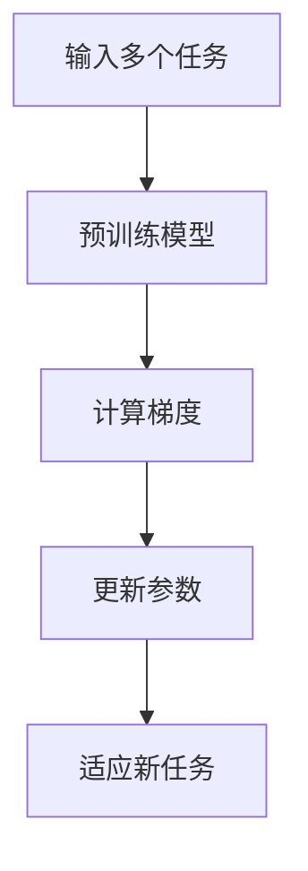
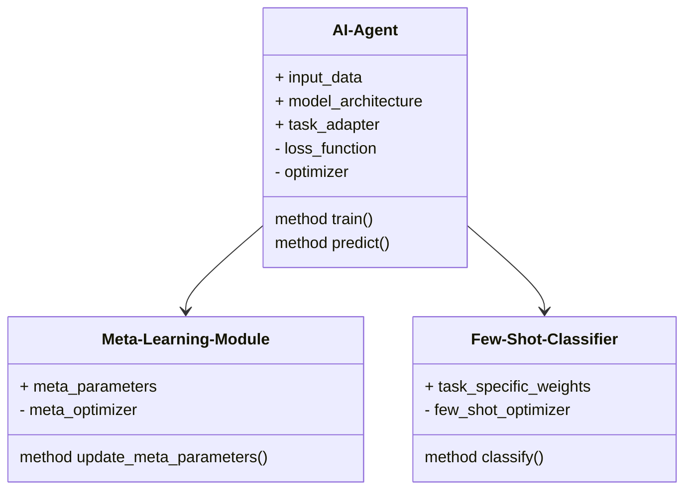
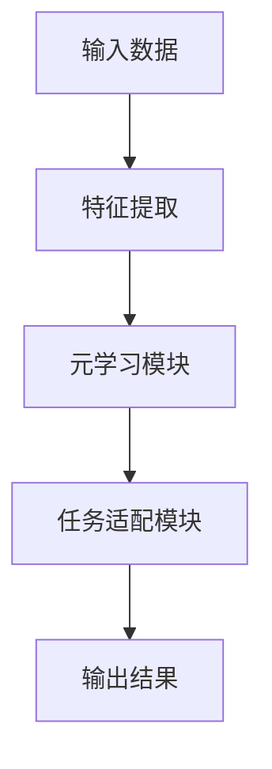
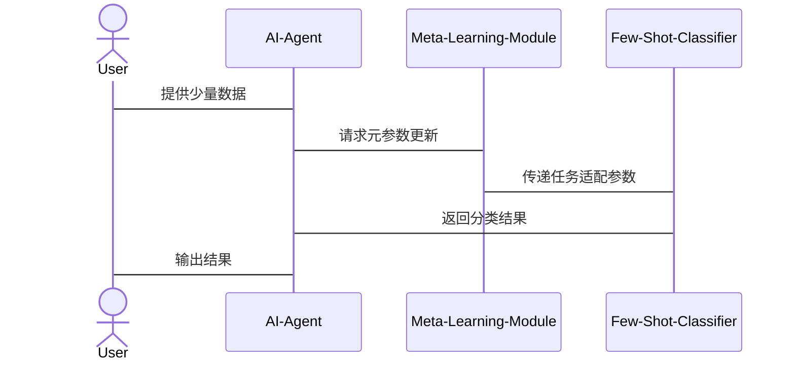

                 


# few-shot学习：减少AI Agent的训练数据需求

> 关键词：few-shot学习，AI Agent，数据需求，Meta-Learning，机器学习，数据效率

> 摘要：  
本文深入探讨了few-shot学习这一前沿技术，旨在解决AI Agent在数据不足场景下的训练难题。通过分析few-shot学习的核心概念、算法原理、数学模型以及系统架构，本文为读者提供了全面的技术解读。文章从背景介绍、核心概念、算法实现、系统设计到项目实战，层层递进，帮助读者理解并掌握如何减少AI Agent的训练数据需求。

---

## 第一部分：背景与核心概念

### 第1章：few-shot学习的背景与问题描述

#### 1.1 问题背景
- **数据驱动AI的挑战**：现代机器学习依赖大量标注数据，但在许多实际场景中，获取大量高质量数据往往成本高昂或不可行。
- **数据不足的场景与问题**：医疗影像分析、小语种NLP任务、实时推荐系统等场景中，数据量有限，传统机器学习方法难以有效训练。
- **减少数据需求的必要性**：在数据资源受限的情况下，开发高效的数据利用方法是实现实用AI的关键。

#### 1.2 问题描述
- **传统机器学习的数据依赖性**：传统深度学习模型通常需要数千甚至数百万的标注数据，这在许多实际场景中难以实现。
- **少量数据场景下的AI应用**：在某些领域，可能只有少量甚至单样本数据可用于训练，传统方法难以泛化。
- **few-shot学习的目标与意义**：通过利用迁移学习、元学习等技术，使AI模型能够在少量数据下实现高效学习和泛化。

#### 1.3 问题解决思路
- **利用迁移学习减少数据需求**：将已学到的知识迁移到新任务，减少新任务的数据需求。
- **借助元学习（Meta-Learning）提升泛化能力**：通过学习如何快速适应新任务，提升模型在少量数据下的表现。
- **利用记忆机制增强数据效率**：通过记忆模块存储关键特征，减少对大量数据的依赖。

#### 1.4 边界与外延
- **few-shot学习的适用场景**：适用于数据量有限但需要高精度的任务，如医学诊断、小语种处理等。
- **few-shot学习的局限性**：在数据量极低或任务差异性极大的情况下，效果可能不如传统方法。
- **few-shot学习与其他学习范式的对比**：与迁移学习、自监督学习等方法在目标和实现上的异同点。

#### 1.5 核心概念结构与要素
- **few-shot学习的核心要素**：元学习、记忆机制、任务间关联性。
- **few-shot学习的系统架构**：包括数据输入、特征提取、元学习模块、任务适应模块等。
- **few-shot学习的实现流程**：数据输入 → 特征提取 → 元学习 → 任务适应 → 输出结果。

---

## 第2章：few-shot学习的核心概念与联系

### 2.1 核心概念原理
- **元学习（Meta-Learning）的定义与作用**：元学习是一种学习方法，旨在通过训练模型快速适应新任务，通常涉及对模型参数的二次优化。
- **少量数据学习的实现机制**：通过在多个任务上预训练模型，使其能够在新任务中仅用少量数据快速调整参数。
- **few-shot学习的数学模型**：结合元学习和任务适应的数学框架，构建高效的参数更新策略。

### 2.2 核心概念对比表
- 表2.1：few-shot学习与传统学习的对比  
| 对比维度 | few-shot学习 | 传统机器学习 |
|----------|--------------|---------------|
| 数据需求 | 少量数据即可 | 需要大量数据 |
| 适应性   | 高泛化能力   | 低泛化能力   |
| 应用场景 | 数据稀缺场景 | 数据充足场景 |

- 表2.2：不同few-shot学习算法的优缺点  
| 算法名称       | 优点                   | 缺点                     |
|----------------|------------------------|--------------------------|
| Meta-SGD       | 高效的参数更新策略     | 对任务间相关性要求较高   |
| Few-shot SVM    | 简单易实现             | 仅适用于分类任务         |
| Neural networks | 高表达能力             | 需要预训练和微调         |

### 2.3 实体关系图（ER图）
- 图2.1：few-shot学习系统的核心实体关系  
```mermaid
er
actor(AI Agent) -|> meta_learning_algorithm: 使用元学习算法
meta_learning_algorithm -|> few_shot_classifier: 集成少量数据分类器
few_shot_classifier -|> task_specific_data: 适应特定任务数据
task_specific_data -|> output_result: 输出结果
```

---

## 第三部分：算法原理与数学模型

### 第3章：few-shot学习的算法原理

#### 3.1 Meta-Learning算法
- **Meta-Learning的基本原理**：通过在多个任务上预训练模型，使得模型能够快速适应新任务。
- **Meta-Learning的典型算法（如Meta-SGD）**：Meta-SGD通过在训练过程中优化参数更新规则，使模型能够快速调整以适应新任务。
- **Meta-Learning的流程图（Mermaid）**  


#### 3.2 Few-shot分类算法
- **Few-shot分类的实现思路**：通过在少量样本上进行分类，利用预训练模型提取特征，再结合少量数据进行微调。
- **基于支持向量机（SVM）的few-shot分类**：利用SVM在小样本数据上的优势，构建分类器。
- **基于神经网络的few-shot分类**：使用预训练的神经网络提取特征，再结合少量数据进行微调。

#### 3.3 算法实现代码示例
- 代码3.1：Meta-Learning算法的Python实现（基于PyTorch）
```python
import torch

class MetaSGD(torch.optim.Optimizer):
    def __init__(self, params, lr=0.001, **kwargs):
        super().__init__(params, **kwargs)
        self.lr = lr

    def step(self, closure=None):
        loss = None
        if closure is not None:
            loss = closure()
        with torch.no_grad():
            for group in self.param_groups:
                for p in group['params']:
                    if p.grad is not None:
                        p.data += self.lr * p.grad
                        p.grad.zero_()
        return loss
```

#### 3.4 数学模型
- 元学习的数学模型  
$$ L = \sum_{i=1}^N \sum_{j=1}^M L_i(y_j, f_\theta(x_j)) $$
其中，$N$是任务数量，$M$是每个任务的样本数量，$f_\theta$是参数为$\theta$的模型，$L_i$是任务$i$的损失函数。

- Few-shot分类的损失函数  
$$ L = \sum_{i=1}^N \sum_{j=1}^K \sum_{t=1}^T L(y_t, f_\phi(x_t; \omega)) $$
其中，$K$是每个任务的样本数量，$T$是任务的数量，$\omega$是微调参数。

---

## 第四部分：系统分析与架构设计

### 第4章：系统分析与架构设计

#### 4.1 问题场景介绍
- **AI Agent的场景**：例如医疗诊断系统，仅需少量患者数据即可快速诊断疾病。
- **系统需求**：设计一个能够在少量数据下高效学习和推理的AI Agent。

#### 4.2 系统功能设计
- **领域模型类图**：展示系统的模块划分和交互关系。


#### 4.3 系统架构设计
- **系统架构图**：展示系统的整体架构。


#### 4.4 接口设计与交互流程
- **接口设计**：定义输入、输出接口，例如API接口。
- **交互流程图**：展示系统交互的流程。


---

## 第五部分：项目实战

### 第5章：项目实战

#### 5.1 环境安装
- 安装必要的库，如PyTorch、FastAI等。

#### 5.2 核心代码实现
- **模型定义**  
```python
class FewShotModel(torch.nn.Module):
    def __init__(self, input_size, output_size):
        super().__init__()
        self.fc = torch.nn.Linear(input_size, output_size)
    def forward(self, x):
        return self.fc(x)
```

- **训练函数**  
```python
def train(model, optimizer, criterion, data_loader, epochs):
    for epoch in range(epochs):
        for inputs, labels in data_loader:
            outputs = model(inputs)
            loss = criterion(outputs, labels)
            loss.backward()
            optimizer.step()
            optimizer.zero_grad()
```

#### 5.3 案例分析
- **案例：医疗影像分类**：使用少量患者数据训练模型，快速诊断疾病。
- **详细解读**：从数据预处理到模型训练，再到结果分析，详细讲解每一步骤。

#### 5.4 项目小结
- 项目实现的关键点：数据预处理、模型选择、训练策略优化。

---

## 第六部分：最佳实践

### 第6章：最佳实践

#### 6.1 小结
- few-shot学习的核心思想是通过元学习和记忆机制，减少数据需求，提升模型的泛化能力。

#### 6.2 注意事项
- 数据质量比数量更重要。
- 任务间的相关性影响模型效果。
- 需要结合具体场景选择合适的方法。

#### 6.3 拓展阅读
- 推荐相关论文和书籍，如《元学习入门》、《深度学习中的小样本问题》。

---

## 第七部分：总结与展望

### 7.1 总结
- 本文全面介绍了few-shot学习的核心概念、算法原理和系统设计，为减少AI Agent的训练数据需求提供了理论支持和实践指导。

### 7.2 展望
- 随着研究的深入，few-shot学习在更多领域将发挥重要作用，未来可能在实时推荐、小语种NLP等场景中得到更广泛应用。

---

通过本文的详细讲解，读者可以全面理解few-shot学习的技术原理，并能够在实际项目中应用这些方法，减少AI Agent的训练数据需求，提升模型的实用性和效率。

