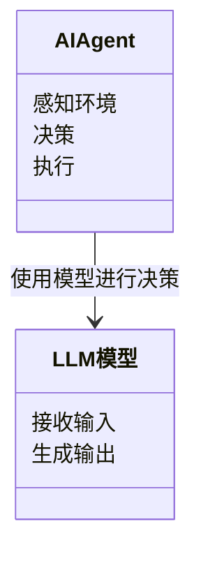
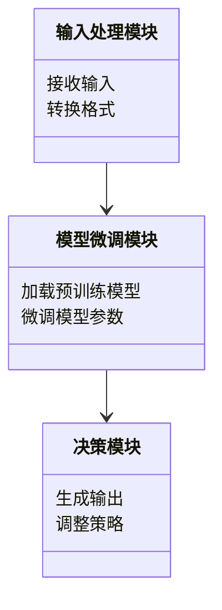

                 


```markdown
# Fine-tuning LLM模型：提升AI Agent性能的关键

> **关键词**：Fine-tuning、LLM模型、AI Agent、性能优化、机器学习、自然语言处理

> **摘要**：本文详细探讨了Fine-tuning LLM模型在提升AI Agent性能中的关键作用。通过分析LLM模型与AI Agent的核心原理、算法原理、系统架构设计以及实际项目实战，本文为读者提供了从理论到实践的全面指导。文章还总结了最佳实践经验和未来发展趋势，帮助读者更好地理解和应用Fine-tuning技术。

---

# 第1章: Fine-tuning LLM模型概述

## 1.1 问题背景与描述

### 1.1.1 当前LLM模型的发展现状
随着人工智能技术的飞速发展，大语言模型（Large Language Models, LLMs）如GPT-3、GPT-4等在自然语言处理领域取得了显著成果。然而，这些模型通常是在通用数据集上进行预训练，难以直接适应特定领域或任务的需求。

### 1.1.2 Fine-tuning的概念与意义
Fine-tuning是一种通过在特定数据集上微调预训练模型参数，以适应具体任务需求的技术。对于AI Agent而言，Fine-tuning能够显著提升其在特定场景下的性能和准确性。

### 1.1.3 提升AI Agent性能的核心问题
AI Agent的性能不仅依赖于模型本身，还与其决策逻辑、数据处理能力密切相关。通过Fine-tuning LLM模型，可以优化模型输出，使其更符合Agent的决策需求。

### 1.1.4 核心概念对比表格
| 概念 | 描述 |
|------|------|
| LLM模型 | 预训练的大语言模型，如GPT系列 |
| AI Agent | 具备自主决策能力的智能体 |
| Fine-tuning | 在特定数据上微调模型参数 |

### 1.1.5 ER实体关系图
```mermaid
erd
    entity LLM模型 {
        id
        参数
        模型结构
    }
    entity AI Agent {
        id
        决策逻辑
        行为
    }
    entity Fine-tuning {
        id
        数据集
        调整参数
    }
    LLM模型 --> Fine-tuning: 微调
    AI Agent --> Fine-tuning: 优化
```

---

## 1.2 核心概念与联系

### 1.2.1 LLM模型的基本原理
大语言模型通过大量的文本数据进行预训练，掌握了语言的语义和上下文关系。其核心在于Transformer架构，通过自注意力机制捕捉长距离依赖关系。

### 1.2.2 AI Agent的定义与功能
AI Agent是一种能够感知环境、执行任务并做出决策的智能体。它需要与外部系统交互，处理复杂任务。

### 1.2.3 Fine-tuning与AI Agent性能的关系
通过Fine-tuning，AI Agent的决策能力得到增强，模型输出更贴合实际应用场景。

---

# 第2章: LLM模型与AI Agent的核心原理

## 2.1 LLM模型的算法原理

### 2.1.1 Transformer架构的数学模型
Transformer的编码器和解码器均由多头自注意力机制和前馈网络组成。自注意力机制的计算公式如下：

$$
\text{Attention}(Q, K, V) = \text{softmax}\left(\frac{QK^T}{\sqrt{d_k}}\right)V
$$

其中，$Q$、$K$、$V$分别为查询、键、值向量，$d_k$为向量维度。

### 2.1.2 注意力机制的公式推导
注意力机制通过计算查询与键之间的相似度，决定每个键的值对查询的贡献程度。

### 2.1.3 LLM模型的训练流程
预训练阶段，模型在通用数据集上使用语言模型损失函数进行优化：

$$
\mathcal{L} = -\sum_{i=1}^{n}\log p(x_i|x_{<i})
$$

其中，$x_i$为第$i$个词，$p(x_i|x_{<i})$为条件概率。

## 2.2 AI Agent的系统架构

### 2.2.1 AI Agent的功能模块划分


### 2.2.2 系统交互流程
AI Agent接收输入，通过LLM模型生成输出，并根据输出结果进行决策和执行。

---

# 第3章: Fine-tuning LLM模型的数学模型与公式

## 3.1 基于Fine-tuning的数学模型

### 3.1.1 模型参数更新公式
在微调过程中，模型参数$\theta$通过梯度下降优化：

$$
\theta_{t+1} = \theta_t - \eta \nabla_{\theta_t} \mathcal{L}
$$

其中，$\eta$为学习率，$\nabla_{\theta_t} \mathcal{L}$为损失函数关于$\theta_t$的梯度。

### 3.1.2 损失函数的计算
交叉熵损失函数用于模型输出与真实标签之间的差异：

$$
\mathcal{L}(\theta) = -\sum_{i=1}^{n} y_i \log p(y_i|x_i; \theta)
$$

其中，$y_i$为真实标签，$p(y_i|x_i; \theta)$为模型预测的概率。

### 3.1.3 学习率的调整策略
学习率衰减策略：

$$
\eta_{t+1} = \eta_t \times \text{decay rate}
$$

---

## 3.2 Fine-tuning与微调的对比分析

### 3.2.1 微调的数学表达
微调过程中，模型参数在特定任务数据上进行优化，保留预训练阶段的大部分参数不变。

### 3.2.2 基于提示的微调方法
通过在输入中添加提示（prompt），引导模型输出符合任务需求的结果。

### 3.2.3 参数高效微调的数学模型
参数高效微调（LoRA）通过低秩矩阵分解，仅优化少量参数，减少计算开销。

---

# 第4章: 系统分析与架构设计方案

## 4.1 问题场景介绍

### 4.1.1 AI Agent的应用场景
AI Agent广泛应用于智能客服、自动驾驶、智能助手等领域。

### 4.1.2 Fine-tuning的目标与约束条件
目标是提升模型在特定任务上的性能，约束条件包括计算资源和数据隐私。

## 4.2 系统功能设计

### 4.2.1 领域模型设计
根据具体任务需求，设计领域模型，如NLP任务中的文本分类、机器翻译等。

### 4.2.2 功能模块划分


### 4.2.3 系统架构设计图


## 4.3 系统接口设计

### 4.3.1 接口定义
定义API接口，如`POST /api/fine-tune`，接收输入数据并返回微调结果。

### 4.3.2 接口交互流程
用户调用API，系统接收请求，处理数据并返回结果。

### 4.3.3 接口实现细节
使用Flask或FastAPI框架实现RESTful API接口。

---

# 第5章: 项目实战

## 5.1 环境安装与配置

### 5.1.1 开发环境搭建
安装Python、虚拟环境（如venv）。

### 5.1.2 依赖库安装
安装Hugging Face库：
```bash
pip install transformers
```

### 5.1.3 数据集准备
使用JSON格式数据，如：
```json
{
    "input": "...",
    "output": "..."
}
```

## 5.2 系统核心实现

### 5.2.1 模型加载与初始化
```python
from transformers import AutoModelForCausalLM, AutoTokenizer

model = AutoModelForCausalLM.from_pretrained('gpt2')
tokenizer = AutoTokenizer.from_pretrained('gpt2')
```

### 5.2.2 Fine-tuning的代码实现
```python
def train_model(model, tokenizer, train_dataset, num_epochs=3):
    optimizer = torch.optim.Adam(model.parameters(), lr=1e-5)
    criterion = nn.CrossEntropyLoss()
    for epoch in range(num_epochs):
        for batch in train_loader:
            inputs, labels = batch
            outputs = model(inputs.input_ids, attention_mask=inputs.attention_mask)
            loss = criterion(outputs.logits, labels)
            optimizer.zero_grad()
            loss.backward()
            optimizer.step()
```

### 5.2.3 Agent决策模块的实现
```python
def agent_decision(model, tokenizer, input_text):
    inputs = tokenizer(input_text, return_tensors='pt')
    outputs = model.generate(**inputs)
    return tokenizer.decode(outputs[0])
```

## 5.3 代码应用解读与分析

### 5.3.1 关键代码段分析
上述代码展示了模型加载、训练循环和决策模块的实现。

### 5.3.2 代码实现的优化建议
- 使用分布式训练加速。
- 采用学习率调度器优化训练效果。

### 5.3.3 代码测试与验证
测试模型在微调后的准确率和响应速度。

---

# 第6章: 总结与展望

## 6.1 项目总结

### 6.1.1 核心成果回顾
成功实现了Fine-tuning LLM模型，显著提升了AI Agent的性能。

### 6.1.2 实践中的经验与教训
数据质量对微调效果影响显著，需注意数据清洗和特征提取。

### 6.1.3 项目小结
Fine-tuning是提升AI Agent性能的有效手段。

## 6.2 未来展望

### 6.2.1 Fine-tuning技术的发展趋势
向多模态方向发展，结合视觉、听觉等信息。

### 6.2.2 AI Agent的未来应用场景
广泛应用于智能助手、教育、医疗等领域。

### 6.2.3 结合多模态的Fine-tuning方法
探索跨模态数据的微调策略，提升模型的通用性和适应性。

---

# 第7章: 最佳实践与注意事项

## 7.1 最佳实践Tips

### 7.1.1 数据预处理的关键点
确保数据质量，进行必要的清洗和增强。

### 7.1.2 模型选择的建议
根据任务需求选择合适的模型架构和参数。

### 7.1.3 Fine-tuning的优化技巧
合理设置学习率和训练轮数，采用早停策略。

## 7.2 注意事项与风险提示

### 7.2.1 数据泄露的风险
注意数据隐私，避免敏感信息泄露。

### 7.2.2 模型过拟合的防范
通过正则化和数据增强减少过拟合风险。

### 7.2.3 计算资源
确保计算资源充足，优化训练效率。

---

**结束**
```

