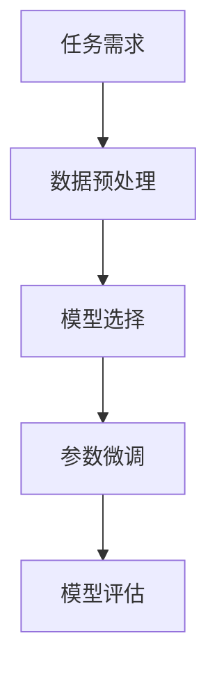
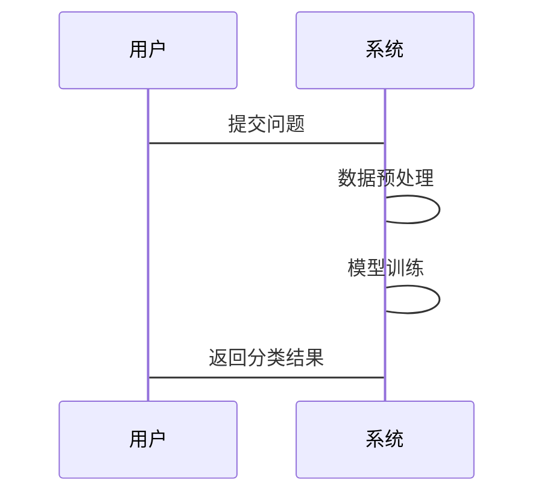

                 


# Fine-tuning技巧：如何让LLM更适应特定任务

> 关键词：Fine-tuning, LLM, 参数微调, 任务适配, 迁移学习

> 摘要：本文将详细探讨如何通过Fine-tuning技术让大型语言模型（LLM）更好地适应特定任务。从背景介绍到核心概念，再到算法原理、系统分析、项目实战和最佳实践，全面解析Fine-tuning的实现方法和应用场景，帮助读者掌握让LLM更适应特定任务的技巧。

## 第一部分: Fine-tuning技巧概述

### 第1章: Fine-tuning技巧的背景与概念

#### 1.1 Fine-tuning的定义与背景
- 什么是Fine-tuning？
  - Fine-tuning是一种微调技术，旨在通过调整模型参数，使模型更好地适应特定任务。
- Fine-tuning在LLM中的重要性
  - 帮助模型在特定领域或任务上表现更优。
  - 减少对大规模数据的依赖，提升效率。
- Fine-tuning与其他微调方法的区别
  - 与全参数微调相比，Fine-tuning通常只调整部分参数，保持模型大部分结构不变。

#### 1.2 LLM的适应性问题
- LLM的通用性与局限性
  - 通用性强，但在特定任务上可能不够精准。
- 为什么需要Fine-tuning
  - 解决模型在特定任务上的适应性不足问题。
- Fine-tuning的目标与应用场景
  - 提高模型在特定任务上的性能，如客服系统的意图识别。

#### 1.3 Fine-tuning的核心概念
- 参数微调与任务适配
  - 参数微调：调整模型的部分参数，使其适应特定任务。
  - 任务适配：通过调整模型结构或参数，使模型更适合特定任务。
- Fine-tuning的边界与外延
  - 明确Fine-tuning的适用范围和极限。
- Fine-tuning的实现要素
  - 数据、模型结构、微调策略等。

### 第2章: Fine-tuning的核心概念与联系

#### 2.1 Fine-tuning的原理
- 参数微调的基本原理
  - 通过反向传播调整模型参数，优化特定任务的损失函数。
- 任务适配的关键步骤
  - 数据预处理、模型选择、参数微调、模型评估。
- Fine-tuning与迁移学习的关系
  - Fine-tuning是迁移学习的一种具体应用，通过微调预训练模型来适应新任务。

#### 2.2 Fine-tuning的核心要素对比
- 参数微调与全参数微调的对比
  - 参数微调：只调整部分参数，保持模型大部分结构不变。
  - 全参数微调：调整所有参数，可能改变模型结构。
- Fine-tuning与Adapter方法的对比
  - Fine-tuning：通过微调参数直接优化模型。
  - Adapter方法：通过添加适配器层，间接调整模型行为。
- Fine-tuning与其他微调方法的对比
  - 与Freeze方法相比，Fine-tuning更灵活，适应性更强。

#### 2.3 Fine-tuning的ER实体关系图


### 第3章: Fine-tuning的算法原理

#### 3.1 Fine-tuning算法流程
- 数据预处理
  - 清洗数据，确保数据质量。
  - 根据任务需求调整数据格式。
- 模型选择
  - 选择适合任务的模型结构。
  - 确定微调的参数范围。
- 参数微调
  - 使用特定任务的数据，通过反向传播调整模型参数。
  - 优化目标函数，使模型在特定任务上表现更优。
- 模型评估
  - 使用验证集评估模型性能。
  - 调整超参数，优化模型表现。

#### 3.2 Fine-tuning的数学模型
- 损失函数
  - 使用交叉熵损失函数，定义为：
  $$\mathcal{L}(y, y_{\text{pred}}) = -\sum_{i=1}^{n} y_i \log(y_{\text{pred}}_i)$$
- 优化目标
  - 最小化损失函数，同时保持模型在其他任务上的性能。
  - 使用Adam优化器，学习率为$$\alpha$$，动量为$$\beta_1$$，学习率为$$\beta_2$$。

#### 3.3 Fine-tuning的实现步骤
- 环境安装
  - 安装必要的库，如TensorFlow或PyTorch。
  - 确保GPU支持，加速训练过程。
- 核心代码实现
  ```python
  import torch
  from torch import nn
  from torch.optim import Adam

  class FineTuneModel(nn.Module):
      def __init__(self, base_model, num_classes):
          super().__init__()
          self.base_model = base_model
          self.classifier = nn.Linear(base_model.output_dim, num_classes)

      def forward(self, x):
          features = self.base_model(x)
          output = self.classifier(features)
          return output

  # 初始化模型
  base_model = BertModel.from_pretrained('bert-base-uncased')
  model = FineTuneModel(base_model, num_classes=3)
  optimizer = Adam(model.parameters(), lr=2e-5)
  ```

- 案例分析
  - 在客服系统中优化LLM进行问题分类。
  - 数据预处理：清洗客服记录，提取关键词。
  - 模型选择：选择适合文本分类的模型结构。
  - 参数微调：调整模型的分类层参数，优化分类准确率。
  - 模型评估：使用验证集评估分类性能，调整超参数，优化结果。

### 第4章: Fine-tuning的系统分析

#### 4.1 系统分析与架构设计方案
- 问题场景介绍
  - 客服系统中，需要对用户的问题进行分类，以便快速响应。
- 系统功能设计
  - 数据预处理模块：清洗和转换原始数据。
  - 模型训练模块：加载预训练模型，进行参数微调。
  - 模型评估模块：评估模型在特定任务上的性能。
  - 模型部署模块：将优化后的模型部署到实际系统中。
- 系统架构设计
  ```mermaid
  graph TD
      A[数据预处理] --> B[模型训练]
      B --> C[模型评估]
      C --> D[模型部署]
  ```

#### 4.2 系统接口设计
- 输入接口
  - 数据预处理接口：接收原始数据，返回预处理后的数据。
  - 模型训练接口：接收预处理数据，返回训练好的模型。
- 输出接口
  - 模型评估接口：接收评估数据，返回模型性能指标。
  - 模型部署接口：接收输入数据，返回分类结果。

#### 4.3 系统交互设计


### 第5章: Fine-tuning的项目实战

#### 5.1 环境安装与配置
- 安装必要的库和工具
  - 使用pip安装所需依赖，如TensorFlow、PyTorch、Transformers等。
- 确保GPU支持
  - 检查GPU是否可用，配置环境变量或代码参数。

#### 5.2 核心代码实现
- 数据预处理代码
  ```python
  def preprocess_data(data):
      # 数据清洗和转换代码
      return processed_data
  ```
- 模型训练代码
  ```python
  def train_model(model, train_loader, optimizer, criterion, num_epochs=3):
      for epoch in range(num_epochs):
          for inputs, labels in train_loader:
              outputs = model(inputs)
              loss = criterion(outputs, labels)
              loss.backward()
              optimizer.step()
              optimizer.zero_grad()
      return model
  ```
- 模型评估代码
  ```python
  def evaluate_model(model, val_loader):
      model.eval()
      total_loss = 0
      correct = 0
      with torch.no_grad():
          for inputs, labels in val_loader:
              outputs = model(inputs)
              loss = criterion(outputs, labels)
              total_loss += loss.item()
              _, predicted = torch.max(outputs.data, 1)
              correct += (predicted == labels).sum().item()
      accuracy = correct / len(val_loader.dataset)
      return accuracy, total_loss / len(val_loader)
  ```

#### 5.3 案例分析与结果讨论
- 案例分析
  - 在客服系统中，使用Fine-tuning优化LLM进行问题分类。
  - 比较微调前后的模型性能，评估优化效果。
- 结果讨论
  - 微调后的模型在特定任务上的准确率显著提高。
  - 分析影响性能的因素，如数据量、学习率等。

#### 5.4 项目小结
- 项目总结
  - 成功通过Fine-tuning优化LLM在特定任务上的性能。
  - 验证了Fine-tuning方法的有效性和可行性。

### 第6章: Fine-tuning的最佳实践

#### 6.1 最佳实践
- 确保数据质量
  - 清洗数据，去除噪声，提高模型训练效果。
- 合理选择微调参数
  - 根据任务需求调整学习率、批量大小等超参数。
- 定期评估模型性能
  - 使用验证集监控模型训练过程，防止过拟合。
- 保持模型的通用性
  - 在微调过程中，注意保留模型的通用能力，避免过度优化特定任务。

#### 6.2 小结
- Fine-tuning是一种有效的技术，能够显著提升LLM在特定任务上的性能。
- 在实际应用中，需要综合考虑数据质量、模型选择和参数调整等因素。

#### 6.3 注意事项
- 避免过度微调，防止模型性能下降。
- 注意数据泄漏，确保训练数据和测试数据的独立性。
- 定期监控模型性能，及时调整训练策略。

#### 6.4 拓展阅读
- 推荐阅读关于迁移学习和深度学习的书籍，深入了解Fine-tuning的理论基础和最新研究。

## 第二部分: 结语

通过本文的详细讲解，读者可以全面了解Fine-tuning技术的核心概念、算法原理、系统设计和实际应用。掌握这些技巧后，可以有效提升LLM在特定任务上的适应性和性能，为实际项目提供有力支持。希望本文对读者有所帮助，祝您在应用Fine-tuning技术时取得成功！

